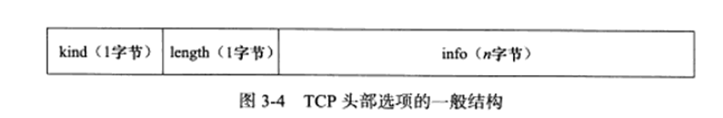
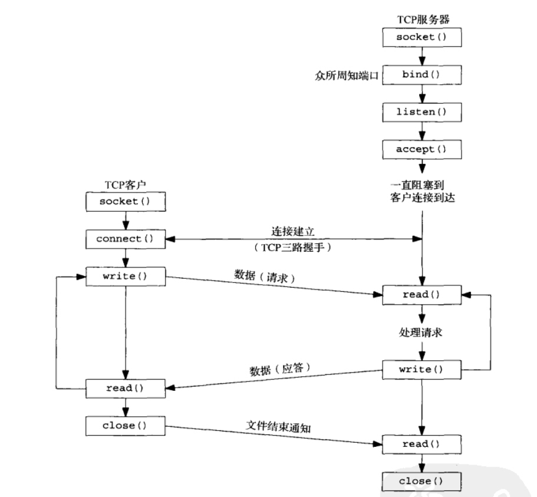
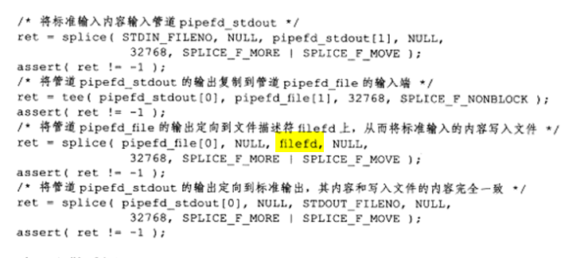

- [协议](#协议)
  - [IP层](#ip层)
    - [IP分片](#ip分片)
    - [IP路由](#ip路由)
  - [传输层](#传输层)
    - [TCP](#tcp)
    - [TCP超时重传](#tcp超时重传)
    - [拥塞控制](#拥塞控制)
- [3.套接字编程简介](#3套接字编程简介)
  - [套接字地址结构](#套接字地址结构)
    - [sockaddr_in：IPv4](#sockaddr_inipv4)
    - [sockaddr_in6：IPv6](#sockaddr_in6ipv6)
    - [sockaddr：旧通用套接字地址结构](#sockaddr旧通用套接字地址结构)
    - [sockaddr_storage：新的通用套接字地址结构](#sockaddr_storage新的通用套接字地址结构)
    - [总结](#总结)
    - [思考](#思考)
  - [值-结果参数](#值-结果参数)
  - [大小端](#大小端)
    - [大小端字节序](#大小端字节序)
    - [测试大小端的代码](#测试大小端的代码)
    - [转换函数](#转换函数)
  - [关于字节操作的函数](#关于字节操作的函数)
  - [地址表示与数值的转换](#地址表示与数值的转换)
    - [协议无关的转换](#协议无关的转换)
- [4.基本的TCP套接字编程](#4基本的tcp套接字编程)
  - [socket函数](#socket函数)
  - [connect函数](#connect函数)
  - [bind函数](#bind函数)
  - [listen函数](#listen函数)
    - [backlog](#backlog)
  - [accept函数](#accept函数)
  - [fork 和 exec](#fork-和-exec)
    - [fork](#fork)
    - [exec](#exec)
  - [demo：（重点在close）并发服务器](#demo重点在close并发服务器)
  - [close函数](#close函数)
  - [getsockname，getpeername函数](#getsocknamegetpeername函数)
  - [问题总结](#问题总结)
    - [一个端口可以多个连接](#一个端口可以多个连接)
    - [accept细节](#accept细节)
- [5.TCP客户/服务端程序示例](#5tcp客户服务端程序示例)
  - [慢系统调用（slow system call）](#慢系统调用slow-system-call)
  - [wait和waitpid](#wait和waitpid)
  - [一些意外情况](#一些意外情况)
    - [accept返回前连接终止（收到RST）](#accept返回前连接终止收到rst)
    - [服务器进程终止](#服务器进程终止)
      - [SIGPIPE信号](#sigpipe信号)
    - [服务端主机崩溃（不能发出任何东西）](#服务端主机崩溃不能发出任何东西)
    - [服务器主机崩溃后重启](#服务器主机崩溃后重启)
    - [服务器主机关机](#服务器主机关机)
  - [数据格式](#数据格式)
  - [总结](#总结-1)
- [6.I/O复用：select和poll](#6io复用select和poll)
  - [IO复用](#io复用)
  - [IO模型](#io模型)
  - [select函数](#select函数)
    - [解析](#解析)
    - [描述符就绪条件](#描述符就绪条件)
    - [shutdown函数](#shutdown函数)
    - [细节：用户缓存，带来的复杂性](#细节用户缓存带来的复杂性)
    - [demo：客户端使用select](#demo客户端使用select)
    - [demo：服务端使用select](#demo服务端使用select)
    - [POSIX：pselect函数](#posixpselect函数)
  - [poll函数](#poll函数)
- [7.套接字选项](#7套接字选项)
  - [getsockopt() 和 setsockopt() 函数](#getsockopt-和-setsockopt-函数)
  - [一些常用选项](#一些常用选项)
  - [fcntl](#fcntl)
    - [信号与文件描述符关联](#信号与文件描述符关联)
- [11.名字与地址转换](#11名字与地址转换)
  - [gethostbyname和gethostbyaddr](#gethostbyname和gethostbyaddr)
  - [getservbyname和getservbyport](#getservbyname和getservbyport)
  - [getaddrinfo和getnameinfo](#getaddrinfo和getnameinfo)
- [14.高级IO函数](#14高级io函数)
- [linux服务器程序规范](#linux服务器程序规范)
  - [日志系统](#日志系统)
  - [进程用户信息](#进程用户信息)
  - [进程间关系](#进程间关系)
  - [系统资源限制](#系统资源限制)
  - [改变工作目录和根目录](#改变工作目录和根目录)
  - [服务器后台化](#服务器后台化)
- [高性能服务器程序框架](#高性能服务器程序框架)
  - [服务器模型](#服务器模型)
    - [C/S模型](#cs模型)
    - [P2P模型](#p2p模型)
  - [服务器编程框架](#服务器编程框架)

# 协议
- ref:《Linux高性能服务器编程》
> 测试网络
<div style="zoom: 70%" align="center"> </div>


> 封装
<div style="zoom: 70%" align="center"> </div>

> 分用
<div style="zoom: 70%" align="center"> </div>

> 层次和相关概念
- 传输层：
  - TCP段（TCP报文段）
    - MSS（最大报文长度）:经常设置为MTU-40，对于以太网来说为1460
  - UDP数据报
- 网络层
  - IP数据报
  - **整个**IP数据报最大长度（包括头）：65535
- 数据链路层
  - 帧（以太网帧，令牌环帧，...）
  - 以太网帧：
    - MTU（最大传输单元）：1500B（46-1500）。
      - 可以通过`ifconfig`或`netstat`查看
    - 过长的IP数据报需要**分片（fragment）**

## IP层
- 无状态、无连接、不可靠服务
  - 无状态：IP通信双方不同步传输数据的状态信息。没窗口、序号这些；**两个IP数据报之间在网络层看来没有半毛线关系**。
    - 最大缺点：**不能处理乱序和重复**
    - 优点：简单、高效
  - 无连接：双方都不长久地维持对方的任何信息。
    - 每次调用都需要指定IP，而TCP socket就维护了一个socket地址了。
  - 不可靠：尽力，但不保证送达
    - 不会重传
- **接收数据特点**：接受到了直接交给上层协议模块（如TCP，TCP可以自己处理乱序和重复）
- **ipv4头**:一般20字节
  - 服务类型中有有4位TOS（其他几位不管），分别是**最小时延，最大吞吐量，最高可靠性，最小费用**。根据实际需求设置。
    - ssh、telnet一般需要最小时延
    - ftp一般需要最大吞吐量
  - 16位标识：唯一标识主机发送的每一个数据报。（更新++）
    - **用来分片重组的**，而不是用来指示接收顺序的。
  - 3位标志：保留|DF|MF
    - DF：禁止分片。，超过MTU返回ICMP差错报文，并丢弃。
    - MF：表示后面有更多分片。除了数据报最后一个，其他都为1.
  - 选项
    - 记录路径
    - 记录转发时间戳
    - 路由选择
      - 宽松：必须包含所指定所有路由器
      - 严格：必须且只能通过所有指定路由器
  - 其他见：p19(2)
<div style="zoom: 70%" align="center"> </div>

### IP分片
- 分片可能发生在发送端，也可能发生再中转路由。**重组只可能发生在接收端**
- 分片相关：16位标识、标志、片偏移
- 例子：1501字节的IP数据报（上层ICMP）
<div style="zoom: 70%" align="center"> </div>
<div style="zoom: 70%" align="center"> </div>

### IP路由
<div style="zoom: 70%" align="center"> </div>

> IP模块工作流程
1. 处理IP头部
   1. CRC校验
   2. 是否设置了源站路由选项（松散源路由选择和严格源路由选择）。如果是，调用 **数据报转发子模块** 处理数据报
   3. 是否是本机的某个IP或者广播地址。如果是，根据上层是哪个协议交给 **上层协议模块**
   4. 如果不是本机的。调用 **数据报转发子模块**。
2. 数据报转发子模块
   1. 首先检查是否允许转发，不允许则丢弃
   2. 如果允许转发，进行一系列操作（**路由过程**），交给 **IP数据报输出子模块**
> 路由表
- **IP路由过程**：应该发送给哪个下一跳路由（或目标机器），哪个网卡（接口）来发送
- 修改路由表
  - route（静态）
  - 协议（RIP OSPF BGP） 动态
  - ICPM也可以修改路由表

  - `/proc/sys/net/ipv4/ip_forward`
<div style="zoom: 70%" align="center"> </div>
<div style="zoom: 70%" align="center"> </div>

> 路由过程
- 有没有直接匹配IP的
- 有没有匹配网络号的
- 走默认路由项
> 转发
- 路由器都能执行转发，但是主机一般只发送和接受。
- 转发细节
<div style="zoom: 70%" align="center"> </div>


## 传输层
> 广播和多播
  - TCP是一对一的，所以基于广播和多播的应用不能使用TCP。
  - UDP更适合

> TCP send的时候
1. 调用send函数向一个TCP连接写入数据
2. 内核中的TCP模块将这些数据拷贝到连接对应的 **TCP内核发送缓冲区** 中。
3. 在某一个时刻TCP模块调用**IP模块**提供的服务，将 **TCP头部信息和TCP发送缓冲区中的数据** 作为参数传递。

> UDP send的时候
- 和TCP的类似
- 不同点：**用完不在内核缓冲区保存副本，而是直接丢掉**

> 字节流服务和数据报服务
- 字节流服务和数据报服务，区别之一
  - 双方是否必须执行相同次数的读写操作。
- 字节流服务：发送和接受没有边界限制
- 数据报服务：每执行一次写，就封装成一个UDP。如果用户没有足够多的缓冲区读取UDP数据报，将被截断。
- **TCP和SCTP有接收和发送缓冲区，而UDP只有一个接收缓冲区**。
<div style="zoom: 70%" align="center"> </div>

### TCP 
> 头部（20-60）
<div style="zoom: 70%" align="center"> </div>
<div style="zoom: 70%" align="center"> </div>

- 16位窗口大小：指的是接收通告窗口（RWND），告诉对方本端的TCP缓冲区能容纳多少数据。(最大65535)
- 检验和：头+数据
- 16位紧急指针：紧急偏移。一个正的偏移量，和序号相加表示最后一个紧急数据的下一字节序号。
- 选项：(p34)
  - kind = 0：表结束
  - kind = 1：空操作，填充
  - kind = 2：协商MSS，通常为MTU-40
  - kind = 3：窗口扩大因子M。接收窗口N太小，启用窗口扩大因子后，时机接收窗口为`N << M`。（只能出现再SYN）
  - kind = 4：SACK（选择性确认）。避免一个没收到，后面都重传。（SYN时协商）
  - kind = 8：计算RTT
      - RTT与超时重传时间有关
<div style="zoom: 70%" align="center"> </div>
<div style="zoom: 70%" align="center"> </div>

> 连接超时（和超时重传区分）
- 超时重传是已经建立连接了，然而里面一些报文段超时了。
- 超时时间：1，2，4，8，16，32..
- 重传了：5次
  - 重传次数设置：`/proc/sys/net/ipv4/tcp_syn_retries `
<div style="zoom: 70%" align="center"> </div>

> 状态变化
- 注意
  - 从FIN_WAIT_1直接到TIME_WAIT的情况：收到带确认信息的结束报文段（ACK,FIN）
  - **孤儿连接**：客户端连接停留再FIN_WAIT_2的状态，这个时候**强行退出**。客户端的连接由内核接管，形成**孤儿连接**。
    - 避免孤儿连接：
      - 能接管的孤儿连接数：`/proc/sys/net/ipv4/tcp_max_orphans`
      - 孤儿连接再内核的生存时间：`/proc/sys/net/ipv4/tcp_fin_timeout`
<div style="zoom: 70%" align="center"> </div>
<div style="zoom: 70%" align="center"> </div>


> TIME_WAIT
- TIME_WAIT状态一般要维持2MSL（报文段最大生存时间）
- 为什么有：
  - 可靠的终止TCP。
    - 针对上图。服务端没收到ACK时，服务端会重新发FIN，这时客户端可以重新发送ACK
  - 保证迟来的TCP报文段有足够时间被识别和丢弃。

> 复位报文段（RST）
- 为什么有：
  - 通知对方关闭连接或重新建立连接
- 出现情况：
  - 访问不存在的端口（主机已存在）
  - 异常终止连接（连接已建立）
  - 处理**半打开连接**（一方已经关闭强制中断，另一方没收到，还以为正在连接。当另一方继续write，将收到RST）。

> 交互数据和成块数据
- 划分方法：按TCP报文段数据长度划分
  - **交互数据**：适合实时性要求高的，ssh、telnet。eg：p46(2)
  - **成块数据**：传输效率高的，ftp。eg:p48(2)

> Nagle算法
- 广域网上，交互数据流可能受到很大延迟（这样超时再重传，会给网络带来很大的压力）
- 目的：避免拥塞
- 简单概括就是上一个段被确认前，不能发送下一个段，只能积累待发送数据。
- 优点：自适应。网络越好，发的越快，越多。
<div style="zoom: 70%" align="center"> </div>


### TCP超时重传
- 超时重传策略：关于重传的超时时间选择和重传次数选择。
- 超时重传相关的内核参数
  - `/proc/sys/net/ipv4/tcp_retries1`：最少重传次数
  - `/proc/sys/net/ipv4/tcp_retries2`：最多重传次数
- 快速重传(**快重传**)：超时会导致TCP报文段重传，但是**TCP报文段的重传可以发生在超时之前，即快速重传**
> 例子
<div style="zoom: 70%" align="center"> </div>
<div style="zoom: 70%" align="center"> </div>

### 拥塞控制
- 参考：
  - https://blog.csdn.net/lishanmin11/article/details/77165077
  - 万字好文：https://zhuanlan.zhihu.com/p/144273871
- 与发送窗口相关
- 目的：
  - 提高网络利用率
  - 降低丢包率
  - 保证网络资源对每条数据流的公平性
- 内容：
  - 慢启动
  - 拥塞避免
  - 快重传
  - 快恢复
- 实现算法：reno算法、vegas算法、cubic算法
  - 部分或全部实现了上面的4个内容
  - 查看所用算法：`/proc/sys/net/ipv4/tcp_congestion_control`
- 太复杂了
- 先抓几个要点就好了
  - 快重传使得数据报可以快速被重传，不用等到RTT时间
  - 发送窗口是由接收窗口和拥塞窗口一起决定的。
# 3.套接字编程简介
## 套接字地址结构
### sockaddr_in：IPv4
- <netinet/in.h>
```cpp
// ipv4 套接字地址结构
// 使用单独的结构体存储 IP 地址有历史原因，早期in_addr是一个联合体，但是现在是无类地址编码，所以也就不需要该联合了。
struct in_addr{
	in_addr_t s_addr;  // 32 位的 IP 地址（uint32_t）
};

struct sockaddr_in{
	uint8_t        sin_len;      // 套接字地址的长度，并不是所有厂家都支持，而且POSIX规范不要求，在我自己的unbuntu上没看到有，所有的地址结构都不包括
	sa_family_t    sin_family;   // AF_INET（unsigned short）
	in_port_t      sin_port;     // 16 位的 ipv4 或 ipv6 端口号（uint16_t）
	struct in_addr sin_addr;     // 32 位 ipv4 地址
	char           sin_zero[8];
}；
```
- 无须设置和检查 sin_len 字段，除非涉及路由套接字
- POSIX只关注三个字段即可：**`sin_family, sin_addr, sin_port`**
  - `sin_addr`和`sin_port`总是以外露哦字节序来存储
  - sin_family再IPv4中为AF_INET
- `sin_zero`未曾使用，不过一般我们都初始化为0


### sockaddr_in6：IPv6
- <netinet/in.h>
- 关注三个字段即可：**`sin_family, sin_addr, sin_port`**
- IPv6 的地址族是 AF_INET6，IPv4 的地址族是 AF_INET.
- sin6_flowinfo 字段分为两个字段：
  - 低序 20 位是流标；
  - 高序 12 位保留；
```cpp
struct in6_addr{
	unit8_t s6_addr[16];  // 128bit IPV6 地址
};
#define SIN6_LEN
struct sockaddr_in6{
	uint8_t         sin6_len;       // 一般没有，不用管
	sa_family       sin6_family;
	in_port_t       sin6_port;
	uint32_t        sin6_flowinfo;
	struct in6_addr sin6_addr;
	uint32_t        sin6_scope_id;
};
```

### sockaddr：旧通用套接字地址结构
- <sys/socket.h>
- 目的：可以使套接字函数支持**任何协议族**的套接字地址结构
  - **IPv6也可以支持，比如在`connect bind getaddrinfo`中**，即使类型的字节数比他多。`(struct sockaddr_storage *)(void *)(addr)`，其中addr为`sockadd`r类型
- 从应用程序员看，这个结构的唯一作用就是用来强制类型转换的而已。
```cpp
struct sockaddr{
	uint8_t      sa_len;
	sa_family_t  sa_family;
	char         sa_data[14];
};
```


### sockaddr_storage：新的通用套接字地址结构
- <netinet/in.h>
- 针对IPv6相对sockaddr过长的限制
- 和旧的通用套接字地址相比差异
  - 如果系统支持任何套接字地址结构有对其需要，sockaddr_storage可以满足最苛刻的对其要求
  - sockaddr_storage足够大，可以满足系统支持的所有套接字地址结构
```cpp
struct sockaddr_storage{
	uint8_t     ss_len;     // length
	sa_family_t ss_family;  // AF_XXX
	// 其余的字段对用户来说是透明的，转换为特定地址结构进行使用
};
```

### 总结
<div style="zoom: 60%" align="center"> </div>

### 思考
- 关于IPv6的`sockaddr_in6*`与`sockaddr*`之间的类型转换是可以的，也就是说参数类型为`sockaddr*`的话，可以传入`sockaddr_in6*`，因为一般函数在传入之后还会再传入一个结构长度。

## 值-结果参数
- 在传递结构的长度的时候（如地址的结构），可能是传值，也可能是传引用，**传递方式取决于该结构的传递方向**
    - 进程到内核，如`bind(), connect(), sendto()`
    ```cpp
    struct sockaddr_in serv;  
    connect(sockfd, (SA*) &serv, sizeof(serv)); //其中大小参数的类型是socklen_t(uint32_t) 
    ```
  - 内核到进程(传引用，为了让内核修改后作为结果返回。)，如`accept(), recvfrom(), getsockname(), getpeername()`

## 大小端
### 大小端字节序
- 网络字节序是大端的
<div style="zoom: 60%" align="center"> </div>

### 测试大小端的代码
```cpp
int main(int argc, char** argv){
	union{
		short s;
		char c[sizeof(short)];
	} un;
	un.s = 0x0102;
	if (sizeof(short) == 2){
		if(un.c[0] == 1 && un.c[1] == 2){
            // 高位在低字节
			printf("big endian\n");
		}
		else if(un.c[0] == 2 && un.c[1] == 1){
			printf("little endian\n");
		}
		else{
            // 高位在高字节
			printf("unknow");
		}
	}
	exit(0);
}
```

### 转换函数
```cpp
#include<netinet/in.h>
uint16_t htons(uint16_t );
uint32_t hton1(uint32_t );   //均返回，网络字节序的值
uint16_t ntohs(uint16_t );
uint32_t ntoh1(uint32_t );   //均返回，主机字节序的值
```
- h -> host, n -> network, s -> short(16), l -> long(32)
- 在系统是大端的操作系统中，这四个函数一般为空

## 关于字节操作的函数
- 作者推荐使用`bzero`，不容易出错
```cpp
#include<strings.h> 
void bzero(void* dest, size_t nytes) .
void bcopy(const void* src, void* dest, size_t nbytes)
int bcmp(const void* ptrl, const void* ptr2, size_t nbytes)

void *memset(void* desk, int e, size_t len); 
void *memcpy(void* desk, const void* src, size_t nbytes); 
int memcpy(const void* ptrl, const void* ptr2, size_t nbytes); 
```

## 地址表示与数值的转换
- a:"address"; n:"numberic"
```cpp
#include<arpa/inet.h>
int inet_aton(const char* strptr, struct in_addr* addr_ptr);   //若字符串有效则为1，否则为0
in_addr_t inet_addr(const char* strptr);     //若字符串有效，则返回32位二进制IPv4地址，否则为INADDR_NONE（通常为32位均为1的值）有bug，已经废弃
char* inet_ntoa(struct in_addr inaddr);      //返回一个指向点分十进制的字符串指针
```

> 推荐使用
- 这两个函数拓展了对IPv6的支持，现在基本都使用这两个
- p:"persentation"; n:"numeric"

```cpp
#include<arpa/inet.h>
// family 代表转换地址的类型
int inet_pton(int family, const char* strptr, void* addrptr);   //成功返回1，失败返回0，出错返回-1
const char* inet_ntop(int family, const void* addrptr, char* strptr, size_t len);     //成功返回指向字符串的指针，失败返回NULL
```
### 协议无关的转换
- 使用 `inet_pton` 和 `inet_ntop`的时候需要传入family，造成代码与协议相关不好移植。
```cpp
char* sock_ntop(const struct sockaddr* sa, socklen_t salen){
	char portstr[8];
	static char str[128];
	switch(sa->sa_family){
		case AF_INET: {
			struct sockaddr_in* sin = (struct sokaddr_in *) sa;

			if(inet_ntop(AF_INET, &sin->sin_addr, str, sizeof(str)) == NULL)
				return (NULL);
			if(ntohs(sin->sin_port) != 0){
				snprintf(portstr, sizeof(portstr), ":%d", ntohs(sin->sin_port));
				strcat(str, portstr);
			}
			return(str);
		}
        case AF_INET6:{
            ...
        }
	}
}
```

# 4.基本的TCP套接字编程
<div style="zoom: 60%" align="center"> </div>

## socket函数
```cpp
#include <sys/socket.h>
int socket(int family, int type, int protocol);
```
- 参数
  - famiy：代表协议族
  - type：指明套接字类型
  - protocol：设置为某个协议类型常值，或为0，用来选择所给定family和type组合的系统默认值

> family和type

- 并不是所有的组合都是有效的

<div style="zoom: 60%" align="center"> </div>

> AF_xxx 和PF_xxx
- 历史因素，现在没有差别
- 一个是表示地址族，一个是协议族。为了满足协议族支持多个地址族的情况，但是现在还没有这种协议

## connect函数
```cpp
#include <sys/socket.h>
int connect(int sockfd, const struct sockaddr* servaddr, socklen_t addrlen);
//返回：成功返回0，出错返回-1
```

> 出错时的几种情况
- **超时**。没有收到响应SYN的分节，会重发SYN，如果一段时间还是没收到，返回 `ETIMEDOUT` 错误。
- **主机端口上没有服务**。对客户的响应是RST，这是硬错误，所以会立刻返回 `ECONNREFUSED` 错误
- **主机不可达**。软错误，会重发，如果一段时间后还是一样，返回 `EHOSTUNREACH` 或 `ENETUNREACH` 错误


- 注：若失败，该套接字不可以使用，不可以再调用 `connect` ，**必须先 close 当前的套接字描述符并重新调用 `socket`**
> 状态转移

- 客户端：CLOSE ---> SYN_SENT ---->ESTABLISHED
- 服务端：LISTEN ---> SYN_RCVD--->ETABLISHED

## bind函数
```cpp
#include <sys/socket.h>
int bind(int sockfd, const struct *myaddr, socklen_t addrlen);
```
- 如果没有`bind`，在 listen 或 connect 的时候内核会自动分配。
- 服务器可以通过 bind 来绑定一个众所周知的端口，否则系统自动为其分配，但是这种情况十分少见，比如远程过程调用（通过RPC端口映射器，进行注册）
> 可以只绑定端口和地址其中一个
- 通配地址
  - v4: `INADDR_ANY`，一般是0
  - v6: `in6addr_any`
<div style="zoom: 60%" align="center"> </div>


## listen函数
```cpp
#include <sys/socket.h>
int listen(int sockfd, int backlog);
```

- 当 `socket` 创建一个套接字时，他被假设为一个**主动套接字**，它是一个将调用 `connect` 发起连接的客户套接字。 `listen` 把一个未连接的套接字变为一个**被动的套接字**，指示内核应接收指向该套接字的连接请求。调用 `listen` 将套接字由 `CLOSE` 态转换为 `LISTEN` 状态。

### backlog
- 不要设置为 0 ，不同系统解释不同，不想使用可以关闭套接字
- 如果收到一个 SYN 但是未完成队列已满，忽略它，并且不返回 RST，等待客户端重新发送
> 内核监听套接字维护的两个队列

- 未完成连接队列，由某客户端发送SYN到服务器，但还未完成三次握手过程，套接字处于STN_RCVD状态
- 已完成连接队列：已完成三次握手，套接字处于ESTABLISHED状态，但是还没有被accept拿到
<div style="zoom: 60%" align="center"> </div>

> 关于该值的定义
- 没有明确，但就是和上面两个队列相关，也有可能只和 `已完成连接队列相关`
  - 内核2.2后的linux，表示已完成连接的队列上限（来自linux高性能服务器）


> 通过环境变量获取backlog
- 支持不用重新编译，就可以动态改这个值
<div style="zoom: 60%" align="center"> </div>编程

## accept函数
```cpp
#include < sys/socket.h>
int accept(int sockfd, struct sockaddr* cliaddr, socklen_t *addrlen);
```
- accept函数由TCP服务进行调用，用于从**已完成队列**中返回下一个已完成连接，如果已完成队列为空，则投入睡眠
- 该函数只是简单的从队列中拿到一个连接，而不关系连接的状态（是ESTABLISHED还是CLOSE_WAIT）
- 参数
  - `sockfd` ：监听的套接字
  - `cliaddr，addrlen` ：用来返回已完成连接的客户端的协议地址，addr_len 是**值-结果参数**


## fork 和 exec
### fork
```cpp
#include<unistd.h>
pid_t fork(void); // 子进程中返回 0，父进程返回子进程 ID，出错为 -1
```
- 用法：
  - 创建自身副本
  - 执行另一个程序（借助exec）


### exec
- 一共六个函数。区别在于以下
  - 执行的是文件名还是路径名
  - 新程序参数是一一列出还是一个指针数组来引用
  - 继承环境还是指定新环境

- 接口见p91


## demo：（重点在close）并发服务器
```cpp
pid_t pid;
int listenfd,connfd;
// 服务器开始监听
listenfd = Socket();
Bind(listenfd, ...);
Listen(listenfd, LISTENQ);

for(;;){
    confd = Accept(listenfd, ...);
    if((pid = Fork()) == 0){
        // 子进程进行处理操作
        Close(listenfd); // *****注意 1-close
        doit(connfd);
        Close(connfd); // *****注意 2-close
        exit(0)
    }
    // 关闭套接字描述符
    Close(connfd); // *****注意 3-close
}
```

- 第二个 `close` 可以不用，因为后面调用 `exit` 函数会关闭所有套接字描述符.
- **重点**：子进程关闭监听套接字（1--close），父进程则继续等待并关闭已连接套接字（3-close）。
  - 关键：引用计数，为0才清除套接字描述符的资源

## close函数
```cpp
#include <unistd.h>
int close(int sockfd);
```
- close一个TCP套接字**默认行为**（可以通过SO_LINGER更改这种默认行文）是将其标记成以关闭，然后立即返回到调用进程，即该套接字不能再作为read，write操作的参数，而且会尝试发送 TCP正在排队等待发送到对端的数据， 发送完就正常的TCP连接关闭过程。

- 如果我们确实想关闭一个套接字（在其引用计数不为0的情况下）这里使用`shutdown()`函数即可实现

## getsockname，getpeername函数
- getsockname：本地地址
- getpeername：外地地址
```cpp
#include <sys/socket.h>
int getsockname(int sockfd, struct sockaddr *localaddr, socklen_t *addrlen);
int getpeername(int sockfd, struct sockaddr *peeraddr, socklen *addrlen);
//二者成功均返回0，失败均返回-1
```

## 问题总结
### 一个端口可以多个连接
> https://blog.csdn.net/u011580175/article/details/80306414
- 一个连接的唯一标识是`[server ip, server port, client ip, client port， protocol]`——一个套接字与之对应

### accept细节
> https://github.com/jason--liu/Blog/issues/4

- 如果在 `accept` 收到第三次握手的ACK之前收到了客户发来的数据怎么办？
  - TCP有序，超前的数据表不会被应用接收，所以先暂存在内核缓存


# 5.TCP客户/服务端程序示例
> 网络编程中可能遇到的三种情况
  - 当fork子进程时必须捕获SIGCHLD信号
  - 当捕获信号时，必须处理被中断的系统调用（如accept中被中断，errno被设置为EINTR的时候）
  - SIGCHLD的信号处理函数必须正确编写，应使用waitpid函数，以免留下僵死进程

## 慢系统调用（slow system call）
- 慢系统调用：如那些可能永远阻塞的系统调用，比如 `accept`。
- 当阻塞于某个慢系统调用的一个进程捕获某个信号 且相应信号处理函数返回时，系统调用可能返回一个EINTR错误。虽然可以在信号处置上进行`SA_RESTART`设置，来让系统调用可以**自动重启**，但是很可能出现移植性问题，因为各个系统不一样，并且有些系统调用也不支持这个设置。所以最好不要依赖这个设置，而是自己处理。

- 正确处理方式
  - 对于 `accept`、`read`、`select`和 `write`来说是适用的
  - 对于 `connect`来说是不合适的，其被一个信号中断而不自动重启时，必须调用`select`来等待连接完成
```cpp
for( ; ; ){
    client = sizeof(cliaddr);
    if( (connfd = accept(listenfd, (SA*) &cliaddr, &clilen)) < 0) {
        if(errno == EINTR)
            continue;
        else
            err_sys("accept error");
    }
}
```

## wait和waitpid
- `wait和waitpid` 默认都是如果 没有已终止进程，并且有一个或者多个子进程正在执行，就会阻塞。
- `waitpid` 就等待哪个进程以及是否阻塞给了我们更多控制。
  - `WNOHANG` 告知内核 在没有已终止子进程时 不要阻塞。

> 例子
- 一个客户进程与服务器进程同时建立多个连接（服务端每个连接建立fork一个子进程），当客户进程退出时，服务端同时收到5个子进程的`SIGCHLD`。由于标准信号不能队列化，所以处理不好，很可能产生僵尸进程

<div style="zoom: 60%" align="center"> </div>


- 错误版本。
```cpp
void
sig_chld(int signo)
{
	pid_t	pid;
	int		stat;

	pid = wait(&stat);
	printf("child %d terminated\n", pid);
	return;
}

```

- 正确版本。同时多个子进程退出时，不会忽略了某一个进程的处理
  - 为什么正确：
    - 因为`waitpid`支持不阻塞，这样可以再一个信号处理函数中处理多个子进程的退出
    - 还有一个更重要的原因是信号处理函数调用前会先阻塞该信号，等到调用完后恢复

```cpp
void
sig_chld(int signo)
{
	pid_t	pid;
	int		stat;

	while ( (pid = waitpid(-1, &stat, WNOHANG)) > 0)
		printf("child %d terminated\n", pid);
	return;
}

```

> 服务端正确处理示例
- p111 图5-12，要点：
  - 阻塞被信号中断时的处理
  - 对`SIGCHLD`的处理（使用waitpid）


## 一些意外情况
### accept返回前连接终止（收到RST）
- 导致accept返回非致命的错误
  1. 信号处理函数 打断
  2. 如下所述
- 当三次握手完毕，服务器准备调用 `accept` 之前，客户端发送了 `RST`导致连接终止
  - 这种情况下，不同系统返回的errno不同，在POSIX下返回ECONNABORTED.
  - 这种情况不是致命的错误，只用重新运行一次accept就行李

<div style="zoom: 60%" align="center"> </div>

### 服务器进程终止
- 总结：不能单纯阻塞在这两**个源中某个特定源的输入上**。**而是应该阻塞在其中任何一个源的输入上**。这正是poll和select的目的之一，后面的处理方式是：一旦杀死服务器子程序，客户会立即被告知已收到FIN

#### SIGPIPE信号
- 当一个进程向 **某个已收到RST的套接字** 执行写操作时，内核向该进程发送一个SIGPIPE信号，默认行为是终止进程。
- 出现时怎么处理 P114

### 服务端主机崩溃（不能发出任何东西）
- 这个时候服务器发不出任何东西。
- 客户端给服务器发完后就阻塞在read上，之后因为内核在一定时间内不断重传无果后返回错误，之后退出程序。如果是服务器崩溃不可达，返回ETIMEOUT，如果是中间路由器表示不可达则响应一个“destination unreachable"的ICMP消息，这时返回的错误为EHOSTUNREACH或ENETUNREACH。详见p115
- 可以给read设置超时，避免过久阻塞


### 服务器主机崩溃后重启
- 详见p115 过程描述
- 服务器意外终止，客户端并没有被告知。
- 如果客户需要实时监测服务器是否崩溃，则要采用一些技术（SO_KEEPALIVE套接字选项或/某些客户/服务器心博函数）

### 服务器主机关机
- init进程会给所有进程发送 `SIGTERM` 信号（可被捕获），并等待一段时间，然后给所有仍在运行的进程发送 `SIGKILL` 信号（不可捕获）。这么做是为了将一小段时间给进程做清除和终止。当服务器子进程终止，它所有打开的描述符都需要关闭释放，我们必须在客户中使用select或poll函数，使得服务器一终止，客户端可以检查到（否则会阻塞在某一与之无关的描述符上）。

## 数据格式
- 两种格式
  - 文本串
  - 二进制串

- 二进制串形式在不同系统有着大小端、系统位数、结构打包方式等方面的不同
  - 解决方法
    - 把数值数据作为文本串来传递，确保机器上的字符集相同即可
    - 显示定义所支持数据类型的二进制格式（位数，大小端字节序）RPC 通常使用这种方式

## 总结
- 服务端fork后，僵尸进程的问题
  - 涉及wait和waitpid的差别

- 意外情况发生时，客户进程和服务进程、以及他们的内核怎么处理
- 意外：
  - 系统调用被中断
  - accept返回前收到RST
  - 客户端未被告知的情况：服务子进程被kill（客户端内核感知【内核收到了FIN并返回对方ACK了】，但客户程序还未感知【被终端输入阻塞了】），服务端主机崩溃、服务端主机关机、服务端主机崩溃后重启
- 数据格式：
  - 考虑：系统之间的差异


# 6.I/O复用：select和poll
## IO复用

- 定义：
  - 内核一旦发现进程指定的一个或多个I/O条件就绪，就通知进程，这样的能力称为**I/O复用**。

- 使用场景：
  - 客户端：需要处理多个描述符的时候（如终端交互输入和网络套接字）
    - 好处：如果网络套接字收到FIN，不会因为阻塞在终端而没法立刻感知到.
  - 服务端：
    - 既要处理**监听套接字**，又要处理多个**已连接套接字**
    - 既要处理TCP，又要处理UDP
    - 综上：就是要处理多个服务或多个协议

## IO模型
- 一个输入操作通常包括两个不同的阶段：
  - 等待数据准备好
  - 从内核向进程复制数据

- Unix下可用的I/O模型有五种
  - 阻塞式 I/O
  - 非阻塞式 I/O
    - 持续轮训内核，查看是否就绪，会耗费大量CPU时间
  - I/O 复用（select 和 poll）
    - select和poll模型与多线程中使用阻塞式I/O很类似
  - 信号驱动式 I/O（SIGIO）
  - 异步 I/O（POSIX 的 aio_ 系列函数）

<div style="zoom: 60%" align="center"> </div>
<div style="zoom: 60%" align="center"> </div>
<div style="zoom: 60%" align="center"> </div>
<div style="zoom: 60%" align="center"> </div>
<div style="zoom: 60%" align="center"> </div>
<div style="zoom: 60%" align="center"> </div>

## select函数
### 解析
```cpp
#include <sys/select.h>
#include <sys/time.h>

int select(int maxfdpl, fd_set* readset, fd_set* writeset, fd_set* exceptset, const struct timeval* timeout);
//返回:若有就绪描述符则返回其数目，若超时则为0，若出错则为-1
```
- `timeout`：阻塞时间
  - 永远阻塞：null
  - 一段时间
  - 不阻塞：0
    ```cpp
    struct timeval{
        long tv_sec;    //秒数
        long tv_usec;   //微秒数
    }
    ```
- `readset`, `writeset`, `exceptset`：要让内核测试读，写，异常条件的描述符集。
  - 目前的异常条件只有两个：
    - 某个套接字的带外数据的到达
    - 某个已置位分组模式的伪终端存在可从其主端读取的控制状态信息
  - 都是**值-结果**模式
- `maxfdpl`：最大的文件描述符号。避免轮训太大影响效率。内核测试到`maxfdpl-1`，通常为1024，可以修改头文件重新编译内核修改，但是太大很影响效率。


### 描述符就绪条件
- WHAT：触发select返回的
- 详见p130，从读、写、异常，有着许多细节。汇总后如下所示。

<div style="zoom: 60%" align="center"> </div>

### shutdown函数
- 为什么有：close函数的两个限制
  - close把描述符的引用计数减一，仅在该计数变为0时关闭套接字。
  - close终止读和写两个方向的数据传送。（而TCP是半双工，可能有一个方向还没好）

```cpp
#include <sys/socket.h>
int shutdown(int sockfd, int howto);
```
- 操作
  - SHUT_RD(0)
  - SHUT_WR(1)
  - SHUE_RDWR(2)    

### 细节：用户缓存，带来的复杂性
- 为了提升IO性能，引入缓冲机制。但是同时增加了网络应用程序的复杂性
- 对select的影响
  - select不知道stdio使用了缓冲区，它是**从read系统调用的角度**指出是否有数据可读，而**不是从fgets之类的调用**角度考虑
### demo：客户端使用select
- 要点：
  - select使得文件描述符复用。解决收到服务端时FIN时，客户端正在被终端输入阻塞的问题。
  - 使用shutdown，半连接关闭。
  - 使用read和write+buf，而不是基于文本的那些stdio中的函数。解决了缓冲区带来复杂性的问题
<div style="zoom: 60%" align="center"> </div>

<div style="zoom: 80%" align="center"> </div>

### demo：服务端使用select

- p178


### POSIX：pselect函数
```cpp
#include<sys/select.h>
#include<signal.h>
#include<time.h>

int pselect(int macfdp1, fd_set *readset, fd_set *writeset, fd_set* exceptset,
            const struct timespec * timeout, const sigset_t* sigmask)
// 返回：若有已经就绪的描述符，返回数目，超时返回 0，出错返回 -1
```
- 相比 select 的变化：
  - pselect 使用 timespec 结构，而不是 timeval 结构。仅仅是第二个时间值从微秒转换为纳秒。
  - 可以临时设置掩码，pselect返回后复原原来的信号掩码

## poll函数
- 没有select使用的多
- poll 函数提供的功能与 select 类似。但在处理流设备时，能够提供额外的信息
- 不限附件描述符数

```cpp
#include<poll.h>
int poll(struct pollfd* fdarray, unsigned long nfds, int timeout)
// 返回：若有已经就绪的描述符，返回数目，超时返回 0，出错返回 -1

struct pollfd{
    int fd;
    short events;   // 输入
    short revents;  // 返回
}
```
- fdarray 时指向 pollfd 结构体数组的指针，用来保存一系列的描述符，返回后判断相应 pollfd 结构体中的 revents 来确定是否有何种类型的输出即可。
- 详见p144

# 7.套接字选项
- 注：结合了《Linux高性能服务器编程》5.11内容
- 获取和设置影响套接字的选项
  - getsockopt() 和 setsockopt() 函数
  - fcntl() 函数
  - ioctl() 函数
## getsockopt() 和 setsockopt() 函数
- 
```cpp
#include<sys/socket.h>

int getsockopt(int sockfd, int level, int optname, void* optval, socklen_t* optlen);
int setsockopt(int sockfd, int level, int optname, const void* optval, socklen_t optlen);
// 均返回：成功为 0，出错为 -1
```
- 参数：
  - sockfd：目标套接字
  - level：选项级别（如通用级别,IP,TCP..）
  - optname：选项名（宏）
  - optval：变量指针
  - optlen：变量指针字节长度

- 套接字选项大致分为两类：
  - 二元选项（标志选项）：启动（非0）或禁止（0）
  - 值选项：特定值

- 所有选项和选项类型见：p151

- **有些选项需要在TCP同步的时候就被设置了**，但是accept返回了的却是三次握手结束后的，怎么办：
  - **设置 `监听的套接字` ， `连接的套接字` 的选项从 `监听套接字`中继承**

## 一些常用选项
> SO_REUSEADDR
- **SO_REUSEADDR**：强制使用被处于`TIME_WAIT`状态的连接占用的socket地址。

> SO_RCVBUF和SO_SNDBUF
- TCP内核模块中，接收缓冲区和发送缓冲区的大小
  - 注意：不等于窗口大小。因为一部分要用来存连接信息。
- 对应的内核参数：`/proc/sys/net/ipv4/tcp_rmem`和`/proc/sys/net/ipv4/tcp_wmem`
- 详见：p89(2)

> SO_RCVLOWAT和SO_SNDLOWAT
- 接收缓冲区和发送缓冲区的低水位
  - SO_RCVLOWAT：可读数据大于低水位，IO复用系统调用将通知应用程序可从对应socket读。
  - SO_SNDLOWAT：空闲空间大于低水位，IO复用系统调用将通知应用程序可从对应socket写入。

> SO_LINGER选项
- 控制close系统调用再关闭TCP时的行为。
<div style="zoom: 80%" align="center"> </div>

## fcntl
- ioctl比fcntl能执行更多控制。**但是对于控制文件描述符常用的属性和行为，fcntl是POSIX指定首选方法**
- 参数：
  - cmd指定执行何种类型操作
<div style="zoom: 80%" align="center"> </div>
<div style="zoom: 80%" align="center"> </div>

```CPP
#include <unistd.h>
#include <fcntl.h>

int fcntl(int fd, int cmd, ... /* arg */ );
```
### 信号与文件描述符关联

<div style="zoom: 80%" align="center"> </div>

# 11.名字与地址转换

## gethostbyname和gethostbyaddr
- gethostbyaddr
  - 根据IP获取主机完整信息
  - type：为地址族
- gethostbyname
  - 先查`/etc/host`,找不到再dns，找IP
```cpp
#include <netdb.h>
struct hostent *gethostbyname(const char *name);
struct hostent *gethostbyaddr(const void *addr, socklen_t len, int type);
// 失败返回null
```
> hostent结构
<div style="zoom: 80%" align="center"> </div>

## getservbyname和getservbyport
- 根据名称或端口号获取服务完整信息。
- proto：表示服务类型，tcp或udp

```cpp
#include <netdb.h>
struct servent *getservbyname(const char *name, const char *proto);

struct servent *getservbyport(int port, const char *proto);

```

> servent
<div style="zoom: 80%" align="center"> </div>

## getaddrinfo和getnameinfo
- getaddrinfo：可以通过主机名获得IP地址，也可以通过服务名获得端口号
  - 详见p97（2）
- getnameinfo：通过socket地址获得主机名和服务名
  - - 详见p98（2）
```cpp
int getaddrinfo(const char *node, const char *service,const struct addrinfo *hints, struct addrinfo **res);

```

# 14.高级IO函数
> 管道（pipe函数）
- 详见p100
- 进程间的通信
- 单工的。如果有双工，得定义两个管道

- 默认读写都是阻塞的。
- 内部传输的是字节流，与TCP概念相同
  - 但管道有固定容量，可调节（fcntl），默认为65536
- 创建
  - pipe
  - socketpair：更方便，使用AF_UNIX

> dup和dup2
- 两个差不多
- 复制文件描述符
<div style="zoom: 80%" align="center"> </div>

> readv和writev
- 分散读写
- 原子性的输入和输出到多个缓冲区

> sendfile
- 两个文件描述符之间**直接传递数据**。
  - 避免了内核缓冲区和用户缓冲区之间的数据拷贝。（零拷贝）
- 但是有条件：
  - 输入fd（in_fd）必须支持类似mmap函数。即必须指向真实的文件（合理）
  - 输出fd（out_fd）必须是一个socket
  - 综上，为传输文件而设计

> mmap函数和munmap函数
- p107(2)
- 作用：分配/释放进程之间的共享内存
- 可以将打开的文件（真文件）映射过来

> splice函数
- 类似sendfile
- splice函数两个文件描述符之间**移动**数据，也是零拷贝操作 
  - 必须至少有一个是管道描述符
- eg:回射服务器
<div style="zoom: 80%" align="center"> </div>

> tee函数
- 两个管道文件描述符之间**复制**（非移动）数据（零拷贝操作）
<div style="zoom: 80%" align="center"> </div>

# linux服务器程序规范
## 日志系统
- syslogd：处理系统日志的守护进程
  - 现rsyslogd是其升级版
  - 配置文件：`/etc/rsyslog.conf`
    - 可以配置是否开启UDP服务（端口514）
<div style="zoom: 80%" align="center"> </div>

- `syslog`函数
  - 用来和`rsyslogd`通信。打日志用的
- `setlogmask`函数：大于该级别的将被忽略。
- `closelog`函数：关闭日志

## 进程用户信息
- 真实用户ID（UID）、有效用户ID（EUID）、真实组ID（GID）、有效组ID（EGID）
<div style="zoom: 80%" align="center"> </div>

> UID && GID
- 稳定
- 从父进程继承而来
- 或者登录时从`/etc/passwd`获取

> EUID && EGID
- 作用：进程访问权限会看这个。
- 一般情况等于UID和GID
- 特殊情况：文件有`set-user-id`(属主和属组独立)标志，`EUID/EGID`将设置为程序的属主/属组。
  - eg：`passwd`可执行文件，可以修改`/etc/passwd`，但该文件只能是root更改。不过该passwd可执行文件设置了`set-user-id`

## 进程间关系
- 进程 <1---N> 进程组 <1---N> 会话 <1---1>终端（可有可无）
- 详见：https://github.com/l1nkkk/Knowledge/blob/master/OS/tlpi/note2.md
<div style="zoom: 80%" align="center"> </div>

## 系统资源限制
- Linux系统资源限制的读取和设置。
  - 比如CPU数量、内存数量、CPU时间等等
- p119(2)
  - `getrlimit`
  - `setrlimit`

## 改变工作目录和根目录
- 工作目录
  - 获取：`getcwd`
  - 改变：`chdir`
- 改变根目录
  - `chroot`
  - 注：`chroot`改的是`/指的是哪里`。`chroot`后仍然需要调用`chdir`才会改工作目录

## 服务器后台化
<div style="zoom: 80%" align="center"> </div>
<div style="zoom: 80%" align="center"> </div>

- Linux提供同样功能的库函数
  - `daemon`

# 高性能服务器程序框架
- 服务端处理单元
  - IO处理单元
  - 逻辑单元
  - 存储单元
## 服务器模型
### C/S模型
- **TCP/IP协议在设计和实现上并没有客户端和服务端的概念**，都是`对等的`。
  - 但因为资源集中垄断等原因。
<div style="zoom: 80%" align="center"> </div>

### P2P模型
- 云计算集群可以看成一个P2P典范
- 难点：主机之间的相互发现。（服务发现问题）


<div style="zoom: 80%" align="center"> </div>


## 服务器编程框架