- [6.I/O复用：select、poll和epoll](#6io复用selectpoll和epoll)
  - [IO复用](#io复用)
  - [IO模型](#io模型)
  - [select函数](#select函数)
    - [解析](#解析)
    - [描述符就绪条件](#描述符就绪条件)
    - [shutdown函数](#shutdown函数)
    - [细节：用户缓存，带来的复杂性](#细节用户缓存带来的复杂性)
    - [demo：客户端使用select](#demo客户端使用select)
    - [demo：服务端使用select](#demo服务端使用select)
    - [POSIX：pselect函数](#posixpselect函数)
  - [poll函数](#poll函数)
  - [epoll](#epoll)
    - [api](#api)
    - [LT和ET模式](#lt和et模式)
    - [EPOLLONESHOT事件](#epolloneshot事件)
    - [注意事项和总结](#注意事项和总结)
  - [比较](#比较)
  - [应用](#应用)
- [信号处理与定时器](#信号处理与定时器)
  - [信号](#信号)
  - [定时器](#定时器)
    - [SO_RCVTIMEO 和 SO_SNDTIMEO](#so_rcvtimeo-和-so_sndtimeo)
    - [SIGALRM信号](#sigalrm信号)
- [7.套接字选项](#7套接字选项)
  - [getsockopt() 和 setsockopt() 函数](#getsockopt-和-setsockopt-函数)
  - [一些常用选项](#一些常用选项)
  - [fcntl](#fcntl)
    - [信号与文件描述符关联](#信号与文件描述符关联)
- [11.名字与地址转换](#11名字与地址转换)
  - [gethostbyname和gethostbyaddr](#gethostbyname和gethostbyaddr)
  - [getservbyname和getservbyport](#getservbyname和getservbyport)
  - [getaddrinfo和getnameinfo](#getaddrinfo和getnameinfo)
- [14.高级IO函数](#14高级io函数)
- [linux服务器程序规范](#linux服务器程序规范)
  - [日志系统](#日志系统)
  - [进程用户信息](#进程用户信息)
  - [进程间关系](#进程间关系)
  - [系统资源限制](#系统资源限制)
  - [改变工作目录和根目录](#改变工作目录和根目录)
  - [服务器后台化](#服务器后台化)
- [高性能服务器程序框架](#高性能服务器程序框架)
  - [服务器模型](#服务器模型)
    - [C/S模型](#cs模型)
    - [P2P模型](#p2p模型)
  - [服务器编程框架](#服务器编程框架)
  - [IO模型](#io模型-1)
  - [两种高效的事件处理模式](#两种高效的事件处理模式)
    - [Reactor](#reactor)
    - [Proactor](#proactor)
    - [模拟Proactor模式](#模拟proactor模式)
  - [两种高效的并发模式](#两种高效的并发模式)
    - [半同步/半异步模式](#半同步半异步模式)
    - [领导者/追随者模式](#领导者追随者模式)
  - [有限状态机](#有限状态机)
  - [提高服务器性能的其他建议](#提高服务器性能的其他建议)
    - [池](#池)
    - [数据复制](#数据复制)
    - [上下文切换和锁](#上下文切换和锁)
# 6.I/O复用：select、poll和epoll
- 同时参考《Linux高性能服务器编程》
## IO复用

- 定义：
  - 内核一旦发现进程指定的一个或多个I/O条件就绪，就通知进程，这样的能力称为**I/O复用**。

- 使用场景：
  - 客户端：需要处理多个描述符的时候（如终端交互输入和网络套接字）
    - 好处：如果网络套接字收到FIN，不会因为阻塞在终端而没法立刻感知到.
  - 服务端：
    - 既要处理**监听套接字**，又要处理多个**已连接套接字**
    - 既要处理TCP，又要处理UDP
    - 综上：就是要处理多个服务或多个协议

## IO模型
- 一个输入操作通常包括两个不同的阶段：
  - 等待数据准备好
  - 从内核向进程复制数据

- Unix下可用的I/O模型有五种
  - 阻塞式 I/O
  - 非阻塞式 I/O
    - 持续轮训内核，查看是否就绪，会耗费大量CPU时间
  - I/O 复用（select 和 poll）
    - select和poll模型与多线程中使用阻塞式I/O很类似
  - 信号驱动式 I/O（SIGIO）
  - 异步 I/O（POSIX 的 aio_ 系列函数）

<div style="zoom: 60%" align="center"> 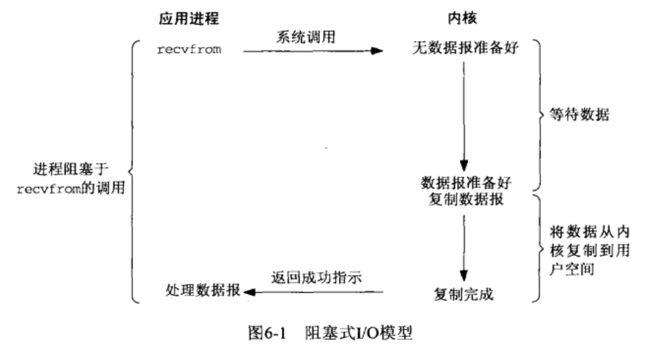</div>
<div style="zoom: 60%" align="center"> </div>
<div style="zoom: 60%" align="center"> </div>
<div style="zoom: 60%" align="center"> 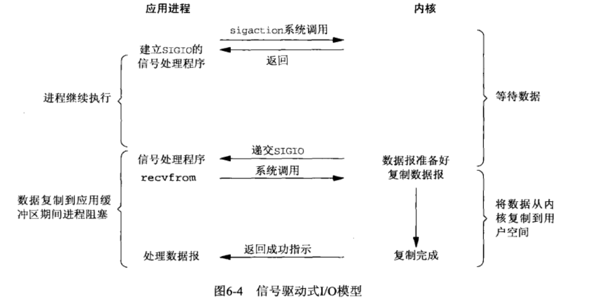</div>
<div style="zoom: 60%" align="center"> 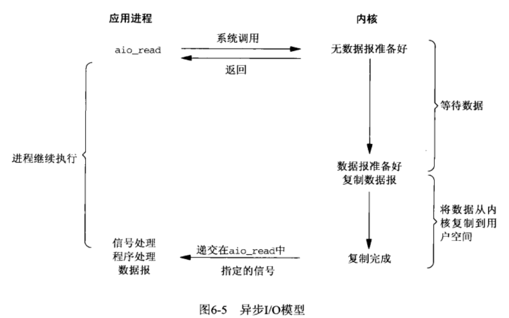</div>
<div style="zoom: 60%" align="center"> 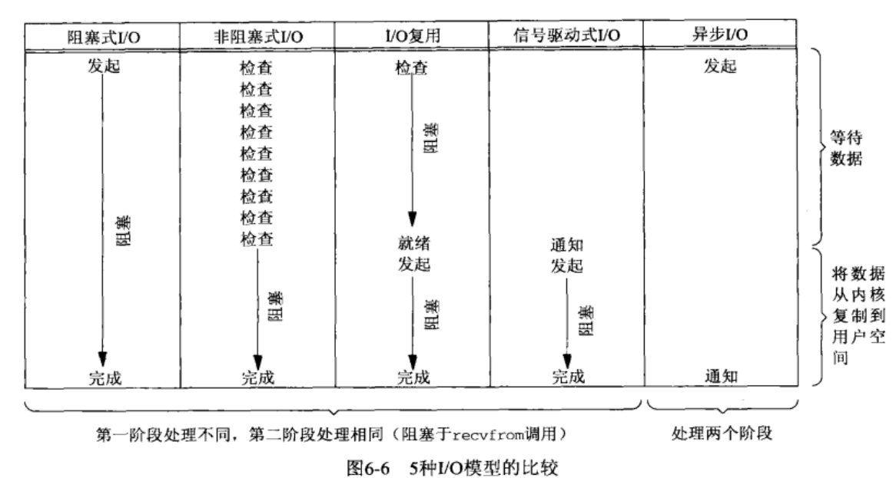</div>

## select函数
### 解析
```cpp
#include <sys/select.h>
#include <sys/time.h>

int select(int maxfdpl, fd_set* readset, fd_set* writeset, fd_set* exceptset, const struct timeval* timeout);
//返回:若有就绪描述符则返回其数目，若超时则为0，若出错则为-1。中断检查EINTR
```
- `timeout`：阻塞时间
  - 永远阻塞：null
  - 一段时间
  - 不阻塞：0
    ```cpp
    struct timeval{
        long tv_sec;    //秒数
        long tv_usec;   //微秒数
    }
    ```
- `readset`, `writeset`, `exceptset`：要让内核测试读，写，异常条件的描述符集。
  - 目前的异常条件只有两个：
    - 某个套接字的带外数据的到达
    - 某个已置位分组模式的伪终端存在可从其主端读取的控制状态信息
  - 都是**值-结果**模式
- `maxfdpl`：最大的文件描述符号。避免轮训太大影响效率。内核测试到`maxfdpl-1`，通常为1024，可以修改头文件重新编译内核修改，但是太大很影响效率。


### 描述符就绪条件
- WHAT：触发select返回的
- 详见p130，从读、写、异常，有着许多细节。汇总后如下所示。

<div style="zoom: 60%" align="center"> 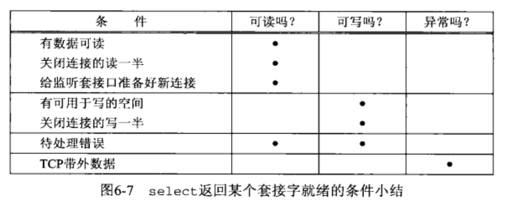</div>

<div style="zoom: 80%" align="center"> </div>

### shutdown函数
- 为什么有：close函数的两个限制
  - close把描述符的引用计数减一，仅在该计数变为0时关闭套接字。
  - close终止读和写两个方向的数据传送。（而TCP是半双工，可能有一个方向还没好）

```cpp
#include <sys/socket.h>
int shutdown(int sockfd, int howto);
```
- 操作
  - SHUT_RD(0)
  - SHUT_WR(1)
  - SHUE_RDWR(2)    

### 细节：用户缓存，带来的复杂性
- p171
- 为了提升IO性能，引入缓冲机制。但是同时增加了网络应用程序的复杂性
- 对select的影响
  - select不知道stdio使用了缓冲区，它是**从read系统调用的角度**指出是否有数据可读，而**不是从fgets之类的调用**角度考虑
- **混合使用stdio和select是非常容易犯错误的行为**
### demo：客户端使用select
- 要点：
  - select使得文件描述符复用。解决收到服务端时FIN时，客户端正在被终端输入阻塞的问题。
  - 使用shutdown，半连接关闭。
  - 使用read和write+buf，而不是基于文本的那些stdio中的函数。解决了缓冲区带来复杂性的问题
<div style="zoom: 60%" align="center"> </div>

<div style="zoom: 80%" align="center"> </div>

### demo：服务端使用select

- p178


### POSIX：pselect函数
```cpp
#include<sys/select.h>
#include<signal.h>
#include<time.h>

int pselect(int macfdp1, fd_set *readset, fd_set *writeset, fd_set* exceptset,
            const struct timespec * timeout, const sigset_t* sigmask)
// 返回：若有已经就绪的描述符，返回数目，超时返回 0，出错返回 -1
```
- 相比 select 的变化：
  - pselect 使用 timespec 结构，而不是 timeval 结构。仅仅是第二个时间值从微秒转换为纳秒。
  - 可以临时设置掩码，pselect返回后复原原来的信号掩码

## poll函数
- 和select类似，在指定时间内轮询一定数量的文件描述符。
- 没有select使用的多
- poll 函数提供的功能与 select 类似。但在处理流设备时，能够提供额外的信息
  - 不仅仅是可读、可写、异常这三种。Poll事件表见p144
- 不限附件描述符数

```cpp
#include<poll.h>
int poll(struct pollfd* fdarray, unsigned long nfds, int timeout)
// 返回：若有已经就绪的描述符，返回数目，超时返回 0，出错返回 -1

struct pollfd{
    int fd;
    short events;   // 输入
    short revents;  // 返回
}
```
- fdarray 时指向 pollfd 结构体数组的指针，用来保存一系列的描述符，返回后判断相应 pollfd 结构体中的 revents 来确定是否有何种类型的输出即可。
- 详见p144

## epoll
- linux特有的IO复用函数
- 和poll、select的差异
  - 通过**一组函数**来完成任务，而不是单个（比如`select`,`poll`函数）
  - 事件表：epoll将关心的fd放到内核的一个事件表中，从而不需要像`poll和select`一样每次要重复传输。
    - 事件表需要一个**额外的fd**，来标识内核中的事件表。

### api
> epoll_create
```cpp
int epoll_create(int size);
// 返回事件表fd，错误-1
```
- size现在并不起作用，只是给内核一个提示，告诉事件表需要多大。

> epoll_ctl
```cpp
int epoll_ctl(int epfd, int op, int fd, struct epoll_event *event);
// 成功0，失败-1
```
- 参数
  - `op`
    - `EPOLL_CTL_ADD`：增 fd 的事件
    - `EPOLL_CTL_MOD`：改 fd 的事件
    - `EPOLL_CTL_DEL`：删 fd 的事件

> 事件结构
```cpp
struct epoll_event {
    uint32_t     events;      /* Epoll events */
    epoll_data_t data;        /* User data variable */
};

// 联合体
typedef union epoll_data {
    void        *ptr;
    int          fd;
    uint32_t     u32;
    uint64_t     u64;
} epoll_data_t;

```
- `events`：描述事件的类型，和poll基本相同（宏前带`E`）
  - 额外的两个事件`EPOLLET`和`EPOLLONESHOT`：epoll高效运作的关键
- `data`：联合体
  - 使用最多的是fd，表示目标文件描述符
  - `*ptr`可以是用户关联的数据，使用时数据要包含fd才能正常运作。

> epoll_wait
```cpp
int epoll_wait(int epfd, struct epoll_event *events, int maxevents, int timeout);
// 成功返回就绪个数，失败返回-1
```
- 参数：
  - `events`:只用于输出监听到的**就绪事件**。（不用于输入）
    - 注意是就绪事件，而不是注册时的直，只是子集。


### LT和ET模式
- LT模式
  - 默认的工作方式。
  - 相当于效率比较高poll，**应用程序可以不立即处理（或不立即处理完**，比如只读了内核缓冲区中的部分数据）事件，这样的话下次调用`epoll_wait`的时候，还是会通告此事件
- ET模式
  - 选择方式：内核事件表中注册一个文件描述符时，带有`EPOLLET`事件
  - 应用程序**必须立即处理完本次通知事件**，因为后序将不会再向应用程序通知该事件

### EPOLLONESHOT事件
- 为什么有：**即使使用了ET模式，一个socket上的某个事件仍可能在同一时刻，有多个线程在处理**。
  - 比如触发了事件，唤醒一个线程来处理；线程处理的时候，该socket又有新数据来了，又触发了事件，唤醒另一个线程来处理；**这显然不是我们期望的**
- 作用：保证某个fd上的事件只被触发一次。除非使用`epoll_ctl`重置了fd上注册的`EPOLLONESHOT`事件
  - 保证了一个线程在处理，另一个线程不能处理桶个socket
  - 线程处理完需要重置下次才能被监听到。
### 注意事项和总结
- https://zhuanlan.zhihu.com/p/149265232


## 比较
- 实现原理
  - select，poll采用**轮询**
  - epoll：采用回调的方式。内核检测到就绪===>触发回调函数===>将就绪事件插入到**内核就绪事件队列**====>将内核就绪时间队列的内容拷贝到**用户空间**
<div style="zoom: 80%" align="center"> </div>

## 应用
- 《linux高性能编程》第9章
- 非阻塞connect
  - 情况：对一个非阻塞的socket进行connect，可能返回`EINPROGRESS`错误，该错误说明对非阻塞socket调用connect，但是连接还没有建立。
  - 处理：通过IO复用(select poll epoll)监听socket上的**可写事件**，可写事件触发后利用getsockopt来读取错误码，**如果错误码为0，表示连接建立**。


# 信号处理与定时器
- 《linux高性能编程》第10-11章
## 信号
- 信号产生条件
  - 前台进程，输入特殊符号（ctrl+c）
  - 系统异常（非法内存访问）
  - 系统状态变化（定时器）
  - 其他程序（kill）

- 发送信号：
  - kill
- 信号处理
  - 方式：忽略，cb，结束，结束并产生核心转储，继续进程，暂停进程
  - 修改方式：
    - signal
    - sigaction
- 信号集：信号集合（一位代表一信号）`sigset`
- 信号掩码：一个信号集，表示被系统屏蔽的信号集合
  - sigpromask：完成信号掩码的增、删、改
  - 某个信号在被其信号处理函数处理时，这段时间会被加到信号掩码中，也就是该信号被屏蔽。
- 排队信号（被挂起的信号）：一个信号集。被信号掩码屏蔽，但是他来了，就放到排队信号。
  - 注：同信号多次到来，也算1次，即不计数量
- **信号处理函数的要求**
  - 可冲入的
  - 需要尽快的完成执行
- **核心思想——统一事件源**：
  - 信号处理函数 把信号值传递给主循环（比如通过管道+IO多路复用），主循环根据信号值，执行相应的操作。如此一来，信号就能和其他IO事件

- 网络编程相关的信号
  - `SIGHUP`：
    - 挂起进程控制终端时被触发。
    - 网络后台程序一般没有控制终端，所以**通常利用SIGHUB信号来强制服务器重读配置文件**
  - `SIGPIPE`：
    - 往一个读端关闭的管道或socket连接中写入数据将引发`SIGPIPE`信号
  - `SIGURG`：
    - 内核通知应用程序有带外数据。
    - 另一种通知方式是通过select等系统调用，在接收到带外数据时返回。

## 定时器
- 对于网络IO，Linux提供的三种定时方法：
  - socket中的选项SO_RCVTIMEO 和 SO_SNDTIMEO
  - SIGALRM信号
  - IO复用系统调用的超时参数
    - 在等待事件的函数（如epoll_wait）中传入超时时间
### SO_RCVTIMEO 和 SO_SNDTIMEO
- 仅针对部分和socket相关的系统调用
<div style="zoom: 80%" align="center"> </div>

### SIGALRM信号
- 设置
  - alarm
  - setitime
  - 设置完超时将触发SIGALRM
- 方式
  - 基于升序链表的定时器
    - 双向链表，升序
  - 时间轮
  - 时间堆
> 基于升序链表的定时器
- demo9
```cpp
class TimerListMgr{
public:
    TimerListMgr():_head(nullptr), _tail(nullptr){};
    // 添加定时器,保证升序
    void add(std::shared_ptr<TimerNode> sptn);
    // 对已有某个定时器的更新
    void update(std::shared_ptr<TimerNode> sptn);
    // 删除某个定时器
    void del(std::shared_ptr<TimerNode> sptn);
    // 心跳,定期执行。与alarm配合使用
    void tick();
private:
    void _add(std::shared_ptr<TimerNode> head, const std::shared_ptr<TimerNode>& sptn);
    std::shared_ptr<TimerNode> _head;
    std::shared_ptr<TimerNode> _tail;
    int size = 0;
};
```

> 时间轮
<div style="zoom: 80%" align="center"> </div>

# 7.套接字选项
- 注：结合了《Linux高性能服务器编程》5.11内容
- 获取和设置影响套接字的选项
  - getsockopt() 和 setsockopt() 函数
  - fcntl() 函数
  - ioctl() 函数
## getsockopt() 和 setsockopt() 函数
- 
```cpp
#include<sys/socket.h>

int getsockopt(int sockfd, int level, int optname, void* optval, socklen_t* optlen);
int setsockopt(int sockfd, int level, int optname, const void* optval, socklen_t optlen);
// 均返回：成功为 0，出错为 -1
```
- 参数：
  - sockfd：目标套接字
  - level：选项级别（如通用级别,IP,TCP..）
  - optname：选项名（宏）
  - optval：变量指针
  - optlen：变量指针字节长度

- 套接字选项大致分为两类：
  - 二元选项（标志选项）：启动（非0）或禁止（0）
  - 值选项：特定值

- 所有选项和选项类型见：p151

- **有些选项需要在TCP同步的时候就被设置了**，但是accept返回了的却是三次握手结束后的，怎么办：
  - **设置 `监听的套接字` ， `连接的套接字` 的选项从 `监听套接字`中继承**

## 一些常用选项
> SO_REUSEADDR
- **SO_REUSEADDR**：强制使用被处于`TIME_WAIT`状态的连接占用的socket地址。

> SO_RCVBUF和SO_SNDBUF
- TCP内核模块中，接收缓冲区和发送缓冲区的大小
  - 注意：不等于窗口大小。因为一部分要用来存连接信息。
- 对应的内核参数：`/proc/sys/net/ipv4/tcp_rmem`和`/proc/sys/net/ipv4/tcp_wmem`
- 详见：p89(2)

> SO_RCVLOWAT和SO_SNDLOWAT
- 接收缓冲区和发送缓冲区的低水位
  - SO_RCVLOWAT：可读数据大于低水位，IO复用系统调用将通知应用程序可从对应socket读。
  - SO_SNDLOWAT：空闲空间大于低水位，IO复用系统调用将通知应用程序可从对应socket写入。

> SO_LINGER选项
- 控制close系统调用再关闭TCP时的行为。
<div style="zoom: 80%" align="center"> </div>

## fcntl
- ioctl比fcntl能执行更多控制。**但是对于控制文件描述符常用的属性和行为，fcntl是POSIX指定首选方法**
- 参数：
  - cmd指定执行何种类型操作
<div style="zoom: 80%" align="center"> 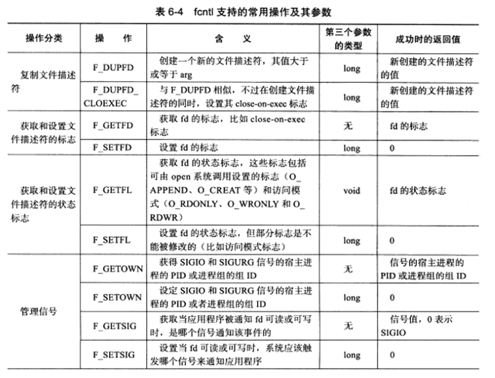</div>
<div style="zoom: 80%" align="center"> 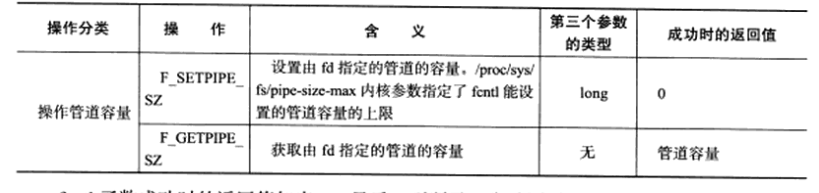</div>


```CPP
#include <unistd.h>
#include <fcntl.h>

int fcntl(int fd, int cmd, ... /* arg */ );
```
### 信号与文件描述符关联
- SIGIO和SIGURG
<div style="zoom: 80%" align="center"> 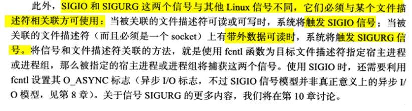</div>

# 11.名字与地址转换

## gethostbyname和gethostbyaddr
- gethostbyaddr
  - 根据IP获取主机完整信息
  - type：为地址族
- gethostbyname
  - 先查`/etc/host`,找不到再dns，找IP
```cpp
#include <netdb.h>
struct hostent *gethostbyname(const char *name);
struct hostent *gethostbyaddr(const void *addr, socklen_t len, int type);
// 失败返回null
```
> hostent结构
<div style="zoom: 80%" align="center"> </div>

## getservbyname和getservbyport
- 根据名称或端口号获取服务完整信息。
- proto：表示服务类型，tcp或udp

```cpp
#include <netdb.h>
struct servent *getservbyname(const char *name, const char *proto);

struct servent *getservbyport(int port, const char *proto);

```

> servent
<div style="zoom: 80%" align="center"> </div>

## getaddrinfo和getnameinfo
- getaddrinfo：可以通过主机名获得IP地址，也可以通过服务名获得端口号
  - 详见p97（2）
- getnameinfo：通过socket地址获得主机名和服务名
  - - 详见p98（2）
```cpp
int getaddrinfo(const char *node, const char *service,const struct addrinfo *hints, struct addrinfo **res);

```

# 14.高级IO函数
> 管道（pipe函数）
- 详见p100
- 进程间的通信
- 单工的。如果有双工，得定义两个管道

- 默认读写都是阻塞的。
- 内部传输的是字节流，与TCP概念相同
  - 但管道有固定容量，可调节（fcntl），默认为65536
- 创建
  - pipe
  - socketpair：更方便，使用AF_UNIX

> dup和dup2
- 两个差不多
- 复制文件描述符
<div style="zoom: 80%" align="center"> </div>

> readv和writev
- 分散读写
- 原子性的输入和输出到多个缓冲区

> sendfile
- 两个文件描述符之间**直接传递数据**。
  - 避免了内核缓冲区和用户缓冲区之间的数据拷贝。（零拷贝）
- 但是有条件：
  - 输入fd（in_fd）必须支持类似mmap函数。即必须指向真实的文件（合理）
  - 输出fd（out_fd）必须是一个socket
  - 综上，为传输文件而设计

> mmap函数和munmap函数
- p107(2)
- 作用：分配/释放进程之间的共享内存
- 可以将打开的文件（真文件）映射过来

> splice函数
- 类似sendfile
- splice函数两个文件描述符之间**移动**数据，也是零拷贝操作 
  - 必须至少有一个是管道描述符
- eg:回射服务器
<div style="zoom: 80%" align="center"> </div>

> tee函数
- 两个管道文件描述符之间**复制**（非移动）数据（零拷贝操作）
<div style="zoom: 80%" align="center"> </div>

# linux服务器程序规范
## 日志系统
- syslogd：处理系统日志的守护进程
  - 现rsyslogd是其升级版
  - 配置文件：`/etc/rsyslog.conf`
    - 可以配置是否开启UDP服务（端口514）
<div style="zoom: 80%" align="center"> </div>

- `syslog`函数
  - 用来和`rsyslogd`通信。打日志用的
- `setlogmask`函数：大于该级别的将被忽略。
- `closelog`函数：关闭日志

## 进程用户信息
- 真实用户ID（UID）、有效用户ID（EUID）、真实组ID（GID）、有效组ID（EGID）
<div style="zoom: 80%" align="center"> 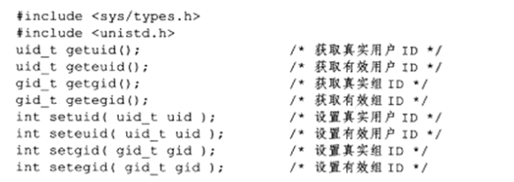</div>

> UID && GID
- 稳定
- 从父进程继承而来
- 或者登录时从`/etc/passwd`获取

> EUID && EGID
- 作用：进程访问权限会看这个。
- 一般情况等于UID和GID
- 特殊情况：文件有`set-user-id`(属主和属组独立)标志，`EUID/EGID`将设置为程序的属主/属组。
  - eg：`passwd`可执行文件，可以修改`/etc/passwd`，但该文件只能是root更改。不过该passwd可执行文件设置了`set-user-id`

## 进程间关系
- 进程 <1---N> 进程组 <1---N> 会话 <1---1>终端（可有可无）
- 详见：https://github.com/l1nkkk/Knowledge/blob/master/OS/tlpi/note2.md
<div style="zoom: 80%" align="center"> 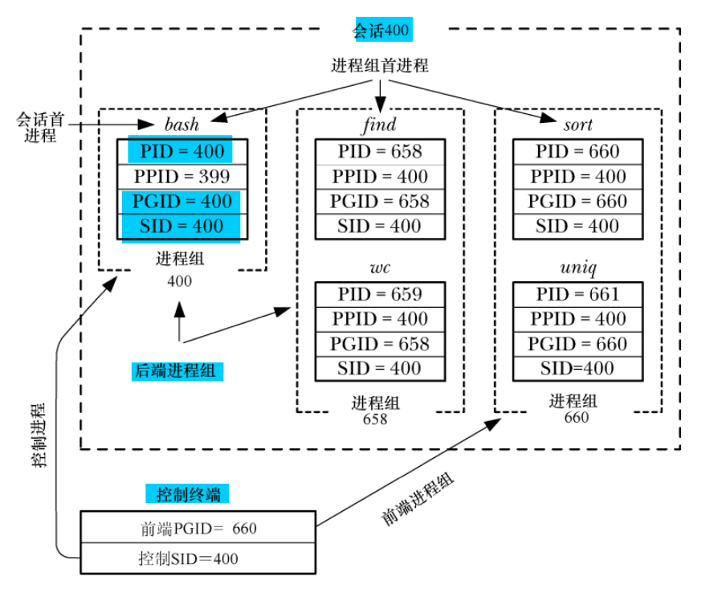</div>

## 系统资源限制
- Linux系统资源限制的读取和设置。
  - 比如CPU数量、内存数量、CPU时间等等
- p119(2)
  - `getrlimit`
  - `setrlimit`

## 改变工作目录和根目录
- 工作目录
  - 获取：`getcwd`
  - 改变：`chdir`
- 改变根目录
  - `chroot`
  - 注：`chroot`改的是`/指的是哪里`。`chroot`后仍然需要调用`chdir`才会改工作目录

## 服务器后台化
<div style="zoom: 80%" align="center"> </div>
<div style="zoom: 80%" align="center"> </div>

- Linux提供同样功能的库函数
  - `daemon`

# 高性能服务器程序框架
- 服务端处理单元
  - IO处理单元
  - 逻辑单元
  - 存储单元
## 服务器模型
### C/S模型
- **TCP/IP协议在设计和实现上并没有客户端和服务端的概念**，都是`对等的`。
  - 但因为资源集中垄断等原因。
<div style="zoom: 80%" align="center"> 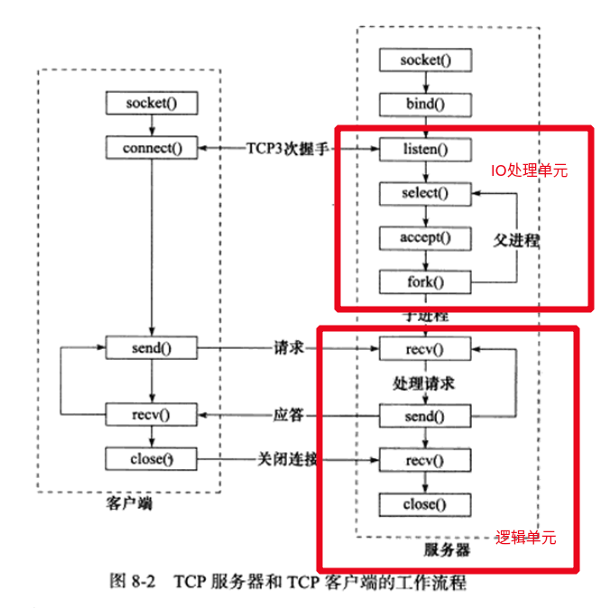</div>

### P2P模型
- 云计算集群可以看成一个P2P典范
- 难点：主机之间的相互发现。（服务发现问题）


<div style="zoom: 80%" align="center"> </div>


## 服务器编程框架
<div style="zoom: 80%" align="center"> </div>

<div style="zoom: 80%" align="center"> </div>
<div style="zoom: 80%" align="center"> </div>

## IO模型
- 这部分详细参考第6章
- 阻塞和非阻塞
  - 非socket独有，文件描述符都有
  - 通过errno来确定是出错还是时间未发生，具体间p127(2)
- 非阻塞IO通常和**其他IO通知机制**一起使用

- IO通知机制
  - 同步IO
    - 阻塞IO
    - IO复用：select、poll、epoll_wait
    - 信号驱动IO：SIGIO
  - 异步IO

- 同步IO模型要求用户代码自行执行IO操作（**将数据从内核缓冲区读入用户缓冲区，或将数据从用户缓冲区写入内核缓冲区**）
  - 通知的是**IO就绪事件**（不包括阻塞IO）
- 异步IO模型则有内核来执行IO操作（数据再内核缓冲区和用户缓冲区之间的移动是由内核再“后台”完成的）
  - 通知的是**IO完成事件**

## 两种高效的事件处理模式
- 网络设计模式：**Reactor和Proactor**
  - 同步IO模型常用Reactor
  - 异步IO模型常用Proactor
    - 也可以使用同步IO方式模拟出Proactor模式

- 注：IO是谁来处理是重要的分水岭
### Reactor
- 特点
  - 主线程：只负责监听文件描述符事件 和 通知工作线程
    - 主线程任务调度
  - 工作线程：负责读写数据、接受新连接、处理客户请求
<div style="zoom: 80%" align="center"> </div>

### Proactor
- 特点：
  - IO操作都交给 **主线程和内核（后台程序）** 来处理
  - 工作线程仅仅负责业务逻辑
  - 与上图**服务器编程框架**更符合
<div style="zoom: 80%" align="center"> 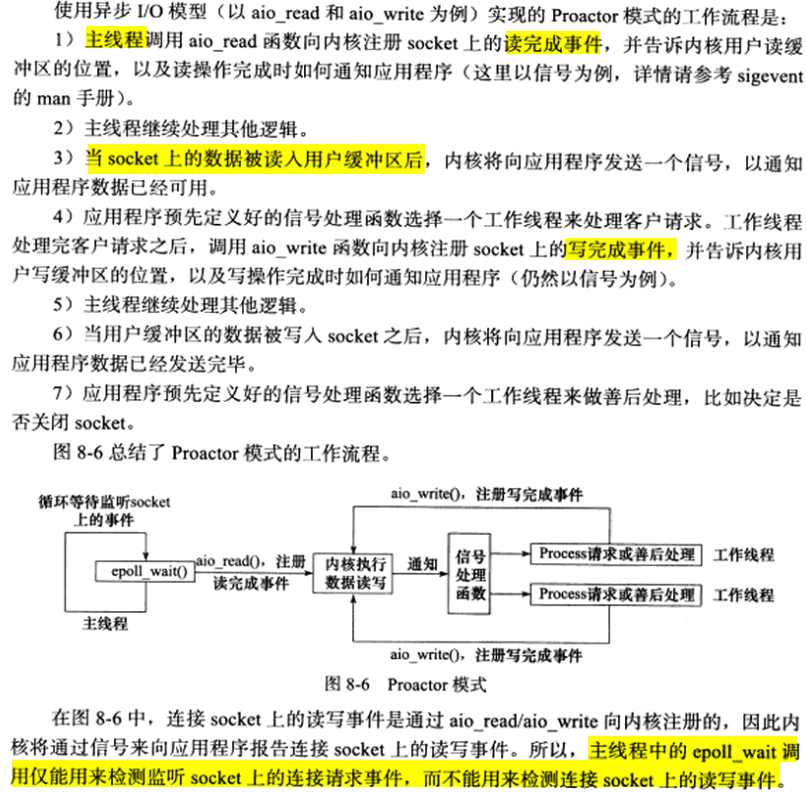</div>

### 模拟Proactor模式
- 特点：
  - IO交给主线程处理，主线程的读写IO是同步的IO（相当于原本内核做的，现在只能主线程自己做）。
  - 还是用了请求队列
<div style="zoom: 80%" align="center"> </div>
<div style="zoom: 80%" align="center"> </div>

## 两种高效的并发模式
- 服务器主要有两种并发编程模式
  - 半同步/半异步模式
  - 领导者/追随者模式
### 半同步/半异步模式
- 这里的同步和异步与IO模型的同步和异步不一样
  - IO模型
    - 区分点是：就绪事件还是完成事件；谁来完成IO读写（应用程序还是内核）
  - 并发模式
    - **同步**：程序按照代码序列顺序执行
    - **异步**：程序的执行需要由系统事件来驱动
<div style="zoom: 80%" align="center"> </div>

- 同步线程和异步线程
  - **同步线程**：按同步的方式运行的线程
    - 效率较低，逻辑简单，适合并发
  - **异步线程**：按异步的方式运行的线程
    - 效率高、编程复杂、不适合大量并发
- 服务器即要求实时性好，有要求同时处理多个客户请求
  - 采用**半同步/半异步模式**
  - 异步用来处理IO事件
  - 同步用来处理客户逻辑

<div style="zoom: 80%" align="center"> </div>

### 领导者/追随者模式
- 特点：轮流监听、让位和处理事件
- 实现并发的过程
  - 一个时间点只有一个**领导者**，其他都是**追随者**
  - 追随者再线程池中睡眠等待称为新的领导者
  - 领导者检测到IO事件，从线程池中推选出新的领导者线程，然后**自己处理该IO事件**
    - 把领导者让给别人，自己处理IO去，从而实现了并发
- 详细见p134


## 有限状态机
- 还没看
  - 感觉有点状态模式的样子


## 提高服务器性能的其他建议
### 池
- “池”的概念：以空间换时间，即“浪费”了服务器的硬件资源，获取运行效率
  - 静态分配，避免动态分配时的时间浪费
- 池相当于服务器管理系统资源的应用层设施，避免了服务器对内核的频繁访问。

- 无法预期需要多少资源，怎么办
  - 法1：定足够多的资源
  - 法2：静态分配一些，不够再动态分配加入池中
- 池分为多种，常见有**内存池，进程池，线程池和连接池**
> 内存池
- 通常用于socket的接收缓存和发送缓存

> 进程池和线程池
- 常用于并发编程，不用动态`fork`或`pthread_create`

> 连接池
- 常用于服务器的内部永久连接。比如和数据库的连接，避免了访问完就释放连接，这样太低效了。更高效的做法是先分配一组连接集合，有逻辑单元要用就取一个，用完就还回来。

### 数据复制
- 应该避免不必要的数据复制
  - 特别是发生在用户代码和内核之间的时候
    - 可以优化的时机：应用程序不用关心数据的内容，不需要对他们做任何分析（ftp）【零拷贝】
- 用户内部的复制也一样
  - 优化时机：存在大量的数据传递时，这时可以考虑共享内存。

### 上下文切换和锁
- 考虑上下文切换的开销
  - 不应该使用过多的工作线程，否则切换占用太多的CPU时间
- 考虑锁的开销