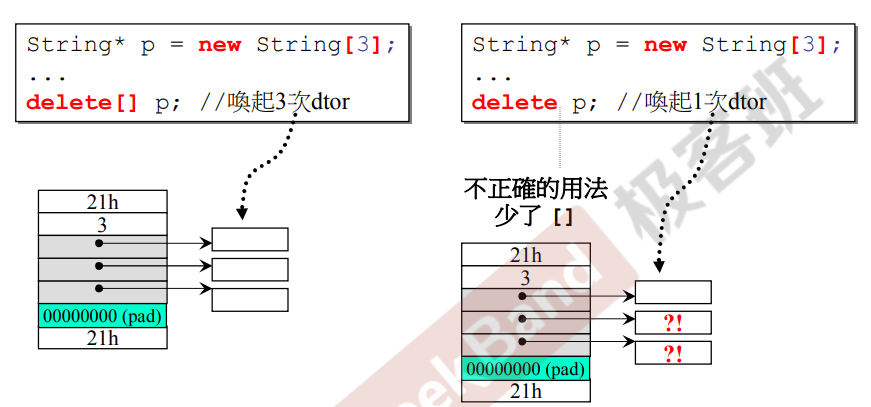
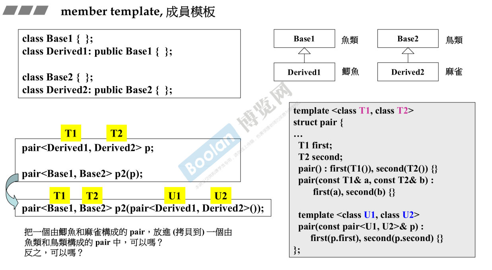

> https://www.bilibili.com/video/BV14s411E772?p=14
- [第一部分：面向对象](#%E7%AC%AC%E4%B8%80%E9%83%A8%E5%88%86%E9%9D%A2%E5%90%91%E5%AF%B9%E8%B1%A1)
- [书籍推荐](#%E4%B9%A6%E7%B1%8D%E6%8E%A8%E8%8D%90)
- [理清概念](#%E7%90%86%E6%B8%85%E6%A6%82%E5%BF%B5)
- [使用类时需考虑](#%E4%BD%BF%E7%94%A8%E7%B1%BB%E6%97%B6%E9%9C%80%E8%80%83%E8%99%91)
- [OOP](#OOP)
  - [Composition复合 has a](#Composition%E5%A4%8D%E5%90%88-has-a)
    - [queue的例子（设配器模式）](#queue%E7%9A%84%E4%BE%8B%E5%AD%90%E8%AE%BE%E9%85%8D%E5%99%A8%E6%A8%A1%E5%BC%8F)
    - [构造和析构](#%E6%9E%84%E9%80%A0%E5%92%8C%E6%9E%90%E6%9E%84)
  - [Delegation委托](#Delegation%E5%A7%94%E6%89%98)
  - [Inheritance继承 is a](#Inheritance%E7%BB%A7%E6%89%BF-is-a)
    - [构造和析构](#%E6%9E%84%E9%80%A0%E5%92%8C%E6%9E%90%E6%9E%84-1)
    - [虚函数（Template Method）](#%E8%99%9A%E5%87%BD%E6%95%B0Template-Method)
    - [Inheritance+Composition 关系下的构造和析构](#InheritanceComposition-%E5%85%B3%E7%B3%BB%E4%B8%8B%E7%9A%84%E6%9E%84%E9%80%A0%E5%92%8C%E6%9E%90%E6%9E%84)
    - [委托+继承](#%E5%A7%94%E6%89%98%E7%BB%A7%E6%89%BF)
- [第二部分：兼谈对象模型](#%E7%AC%AC%E4%BA%8C%E9%83%A8%E5%88%86%E5%85%BC%E8%B0%88%E5%AF%B9%E8%B1%A1%E6%A8%A1%E5%9E%8B)
- [类的其他特性](#%E7%B1%BB%E7%9A%84%E5%85%B6%E4%BB%96%E7%89%B9%E6%80%A7)
  - [conversion function 转换函数（类=>基本类型）](#conversion-function-%E8%BD%AC%E6%8D%A2%E5%87%BD%E6%95%B0%E7%B1%BB%E5%9F%BA%E6%9C%AC%E7%B1%BB%E5%9E%8B)
  - [基本类型=>类](#%E5%9F%BA%E6%9C%AC%E7%B1%BB%E5%9E%8B%E7%B1%BB)
  - [关于explicit关键字](#%E5%85%B3%E4%BA%8Eexplicit%E5%85%B3%E9%94%AE%E5%AD%97)
  - [pointer-like class](#pointer-like-class)
    - [智能指针](#%E6%99%BA%E8%83%BD%E6%8C%87%E9%92%88)
    - [迭代器](#%E8%BF%AD%E4%BB%A3%E5%99%A8)
    - [成员模板](#%E6%88%90%E5%91%98%E6%A8%A1%E6%9D%BF)
  - [fuction-like class](#fuction-like-class)
  - [模板特化](#%E6%A8%A1%E6%9D%BF%E7%89%B9%E5%8C%96)
  - [模板偏特化](#%E6%A8%A1%E6%9D%BF%E5%81%8F%E7%89%B9%E5%8C%96)
    - [个数的偏](#%E4%B8%AA%E6%95%B0%E7%9A%84%E5%81%8F)
    - [范围的偏](#%E8%8C%83%E5%9B%B4%E7%9A%84%E5%81%8F)
  - [模板模板参数](#%E6%A8%A1%E6%9D%BF%E6%A8%A1%E6%9D%BF%E5%8F%82%E6%95%B0)
- [关于c++标准库](#%E5%85%B3%E4%BA%8Ec%E6%A0%87%E5%87%86%E5%BA%93)
  - [可变模板参数](#%E5%8F%AF%E5%8F%98%E6%A8%A1%E6%9D%BF%E5%8F%82%E6%95%B0)
- [reference](#reference)

# 第一部分：面向对象
# 书籍推荐
- 语言上
  - C++ Prime
  - The C++ Programing Language
- 专家建议
  - Effiective C++ 55个,Effiective Modern C++
- 标准库
  - The C++ Standard Library
  - STL源码剖析

# 理清概念
> 带指针的类和不带指针的类
- Class without pointer member(s)
  - eg:complex
- Class with pointer member(s) 
  - eg:string
  - 这种`拷贝构造函数`和`拷贝赋值函数`以及`析构函数`要自己写，不能用编译器默认的


> C和C++
- 原本C是由数据和函数组成，数据对所有函数都可见，这样组织起来散乱。
- C++引入了classes，将其函数放在一个类的内部来，专门针对特定的数据。

---

> 基于对象和面向对象
- `Object Based`:面对的是单一class的设计
- `Object Oriented`：面对的是多重classes的设计，要理清classes和classes之间的联系

---

> 友元
- 相同class的各个objects互为friends

<div style="zoom:70%" align="center"></div>

--- 

> Singleton
```cpp
class A {
public:
    static A& getInstance();
    setup() { ... }
    private:
    A();
    A(const A& rhs);
    ...
};
A& A::getInstance()
{
    // 注意这里的static
    static A a;
    return a;
}
```

--- 

> 拷贝构造函数和拷贝赋值函数
- 拷贝赋值要做**检测自我赋值**
  - 不然影响效率和会发生内存错误

**拷贝构造函数**
```cpp
inline
String::String(const String& str)
{
    m_data = new char[ strlen(str.m_data) + 1 ];
    strcpy(m_data, str.m_data);
}
```

**拷贝赋值函数**
```cpp
inline
String& String::operator=(const String& str){
    if (this == &str)
        return *this; // 自我检测
    delete[] m_data;
    m_data = new char[ strlen(str.m_data) + 1 ];
    strcpy(m_data, str.m_data);
    return *this;
}
```

> new和delete

- delete：先调用析构，再释放memory
- new：先分配内存，再调用构造

- `array new` 一定要搭配 `array delete`

<div style="zoom:70%" align="center"></div>

# 使用类时需考虑

- 只要不改变对象里面的成员变量的函数，马上+const
需补充

<div style="zoom:70%" align="center"></div>

> 传参和返回值
- 传参首先考虑引用。传参尽量都传引用，如果传只是为了速度就加上const。
  - 不要用指针：因为传递了之后可能带来指针的不安全
  - 引用可以让传递者无需知道接收者是以reference形式接收
- 返回值也尽量返回引用，在可以的情况下。
  - 什么时候不可以返回引用呢？
    - 返回结果必须要在函数里头创建的，就不能。其他的都能
- 数据一定要在private里头，这样才能带来封装的好处。
- 尽量用列表初始化

--- 

# OOP
> 面向对象的三个武器
- Inheritance继承
- Composition复合
- Delegation委托

## Composition复合 has a
### queue的例子（设配器模式）
-  `Adapter`：原本的东西已经很棒了，可以满足我们需求，所以我们再写一个类，把原有的封装下，根据需求开放一些接口，就可以了。

<div style="zoom:70%" align="center"></div>

### 构造和析构
<div style="zoom:70%" align="center"></div>


## Delegation委托
- 这里是一个指针，也就是说包含的东西比较虚，没有那么实。
- 这个指针来完成这个类所要完成的操作。这样可以做到一个隔离，比较有弹性，指针指向内容可以随便改。
- 编译防火墙，指针指向的内容如果做了修改，只需要将其编译，原本用户的那些代码可以不用重新编译了。

<div style="zoom:70%" align="center"></div>

## Inheritance继承 is a
- 子类里面有父类的东西
- 搭配虚函数，才有强有力的效果
- 成员变量被继承，继承的是内存。而函数继承的是调用权，子类可不可以调用父类的函数。 
<div style="zoom:70%" align="center"></div>

### 构造和析构

<div style="zoom:70%" align="center"></div>

### 虚函数（Template Method）
- 模板模式：在做框架的时候很好用。先把程序的框架固定，可以写的写好，不能确定操作弄成一个虚函数。

<div style="zoom:70%" align="center"></div>

### Inheritance+Composition 关系下的构造和析构


<div style="zoom:70%" align="center"></div>

### 委托+继承

> Observer观察者模型
- 比如同一份数据，可以通过不同的视图显示出来不同效果，而视图是一个基类，被更多视图表现类所继承。
<div style="zoom:70%" align="center"></div>

- 具体实现

<div style="zoom:70%" align="center"></div>

> Composite
- 需求：写一个filesystem，有文件和目录，目录可以放文件，文件放到目录后该目录还可以放进去其他目录。

<div style="zoom:70%" align="center"></div>

> prototype原型模式
- 需求：现在有一个原型，我们想要用这样一个原型，可以创造出其他继承与它的类的对象的时候。由于继承于它的对象可能要后面才出现，所以使用一种手段，让这种需求得以实现。
<div style="zoom:70%" align="center"></div>

- Image（基类）
<div style="zoom:70%" align="center"></div>

- LandSatImage和SpotImage（子类）
<div style="zoom:70%" align="center"></div>

---
<div style="zoom:70%" align="center"></div>


# 第二部分：兼谈对象模型
# 类的其他特性
## conversion function 转换函数（类=>基本类型）
- 这里double转换函数中有错误，应该对里面的分子和分母都做强制类型转换，不然3/4结果是0。
<div style="zoom:70%" align="center"></div>

> 一个实际使用的例子
- 这里是用到了代理的设计模式
- 这个代理是reference，所以自然而然reference需要有一个`=>boll`的`转换函数`。
<div style="zoom:70%" align="center"></div>

## 基本类型=>类
<div style="zoom:70%" align="center"></div>

> 以下代码好好分析其带来的二义性错误
<div style="zoom:70%" align="center"></div>

## 关于explicit关键字
- 让编译器不自动执行构造函数

<div style="zoom:70%" align="center"></div>

## pointer-like class
### 智能指针
- `->`和`*`的重载是固定的，而且一定是以下的写法。
- `->`作用之后，默认再补上`->`。
<div style="zoom:70%" align="center"></div>

### 迭代器
- 主要用来遍历容器，也可以说他是智能指针。专门用来处理++，--，这是与普通智能指针的区别。
- 下面代码中注意`operator->`中的return
- 问题：为什么要让所创造出来的对象像指针或者函数？
<div style="zoom:70%" align="center"></div>

<div style="zoom:70%" align="center"></div>

### 成员模板
- 被大量用在标准库中
> 例子1
<div style="zoom:70%" align="center"></div>

> 例子2
<div style="zoom:70%" align="center"></div>

## fuction-like class
- 调用时：第一个括号是指创建一个临时变量，第二个`()`是赋值
- 问题：为什么仿函数都使用奇特的父类(base class)呢？
<div style="zoom:70%" align="center"></div>
- unary_function：一个操作数
- binary_function：两个操作数
<div style="zoom:70%" align="center"></div>

## 模板特化
- 泛化：即模板，要用的时候再指定
- 特化：当使用模板的时候，可能需要针对某些类型做独特的设计可能使效率更快等等，这个时候使用特化。
<div style="zoom:70%" align="center"></div>

## 模板偏特化
### 个数的偏
- 需求：当用bool值去代表真假有点浪费，因为只需要一个位就够了，所以可以对其进行单独设计一套，而不是泛化的一套。
- 个数体现在类型参数的变少
- 规定：绑定的类型不能跳，如1,3，5。只能按顺序
<div style="zoom:70%" align="center"></div>


### 范围的偏
- eg:范围缩小,让指针单独用一套，非指针用另外一套。
<div style="zoom:70%" align="center"></div>

## 模板模板参数
- 注意，这里实例化的时候，有模拟参数还是一个模板这种特点
- 下面代码中，list直接传会报错，需要用上using才能避免
<div style="zoom:70%" align="center"></div>
<div style="zoom:70%" align="center"></div>

- 下面这种情况不属于模板模板参数
  - list<int>已经不算是模板了，因为其完全绑定了，没有任何模糊
<div style="zoom:70%" align="center"></div>


# 关于c++标准库 
## 可变模板参数
> 例子
- 需要一个无参数的print来引导退出
- `...`就是所谓的一个包。如果要查看里面有几个，可以使用sizeof...(args)
<div style="zoom:70%" align="center"></div>

# reference
- 引用在内存组织中是通过指针实现的。
- 在编译器外，我们把引用看成别名
- reference就是一种漂亮的pointer，多半用在参数的传递上
- 注意下面例子中的`r = x2`，这个不是一个重新绑定，而是给x赋值
- 对引用类型做`&`和`sizeof()`这些操作的时候，等价于作用于所引用的对象。