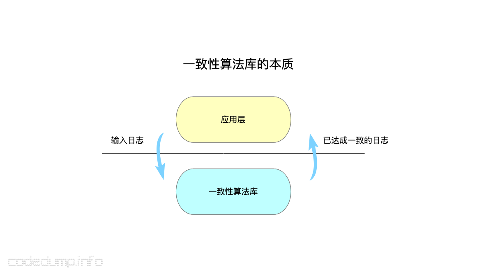
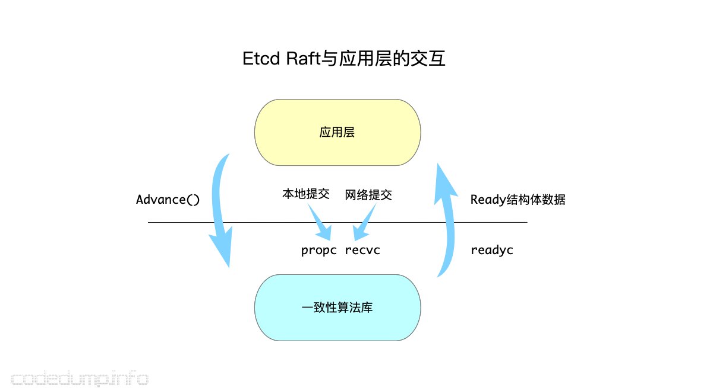
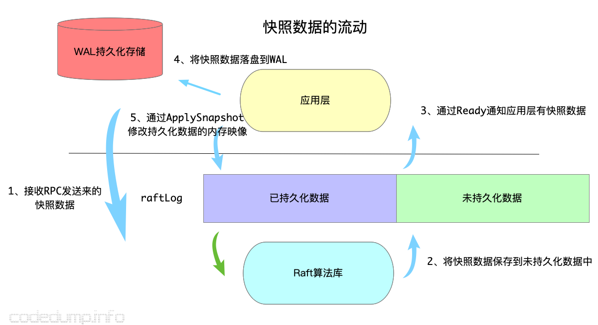
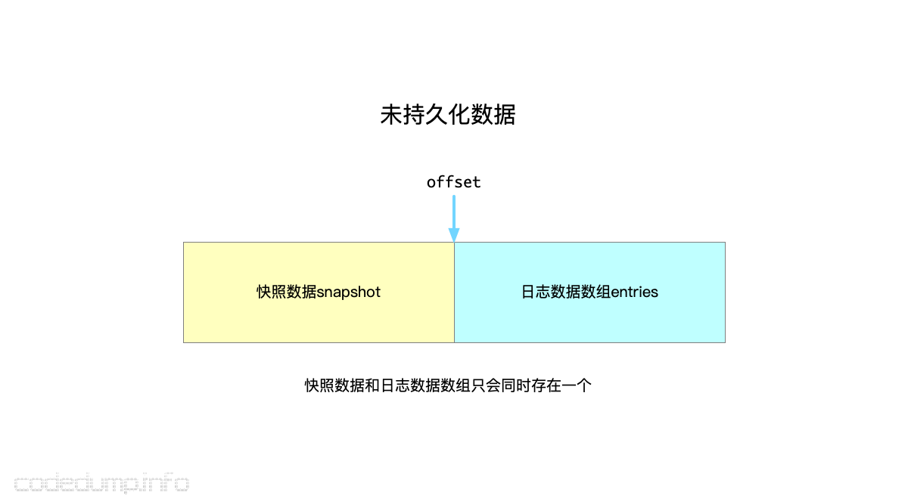
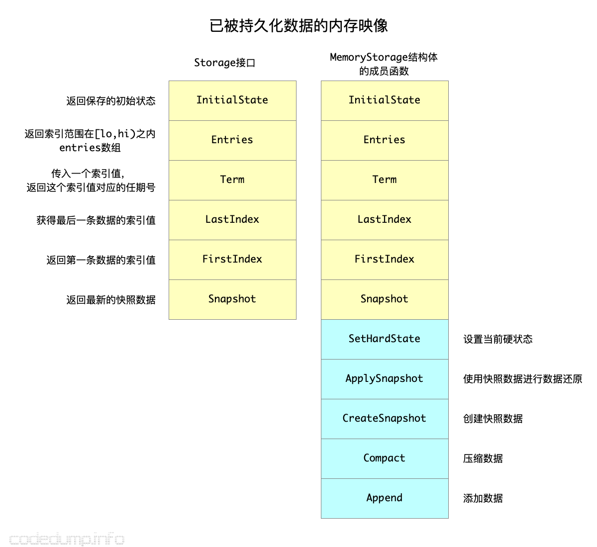
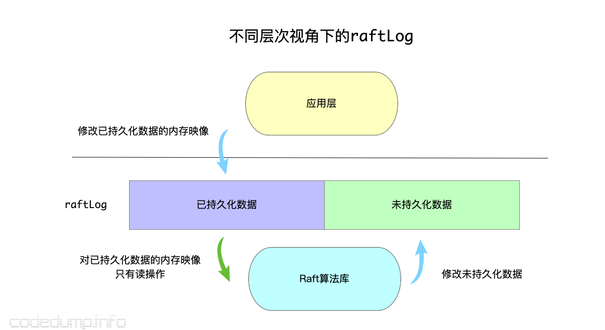
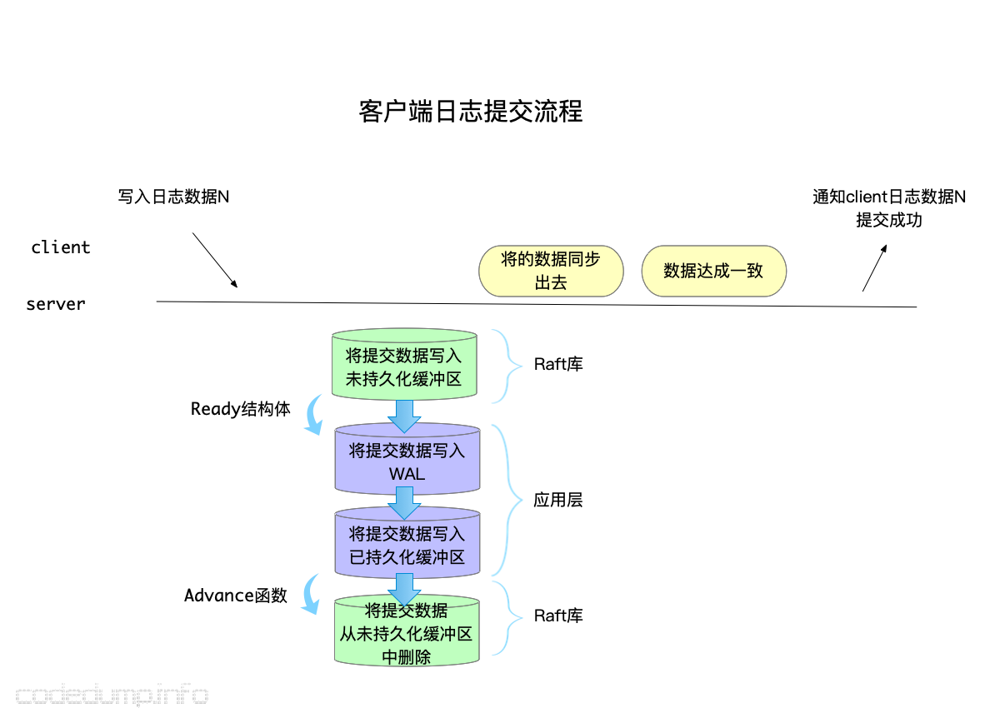

- 参考：https://www.codedump.info/post/20180922-etcd-raft/

- [概述](#概述)
  - [核心数据结构](#核心数据结构)
- [etcd raft 实现](#etcd-raft-实现)
  - [Ready 结构体](#ready-结构体)
  - [node 结构体](#node-结构体)
  - [raft 数据管理](#raft-数据管理)
    - [unstable 结构体: 未持久化的日志数据](#unstable-结构体-未持久化的日志数据)
    - [Storage 接口：处理持久化的日志数据](#storage-接口处理持久化的日志数据)
    - [raftLog结构体](#raftlog结构体)
    - [应用层处理Ready数据 demo](#应用层处理ready数据-demo)
  - [节点管理](#节点管理)

# 概述
- 应用层：相当于状态机，状态机特性：如果日志内容和顺序一致，apply 后的状态也一致。
- Raft库：保证日志内容和顺序的准确。一致性算法库为上层提供达成一致的log entries（一致指的是顺序和内容一致）
- 个人理解：Raft 可以类比 tcp 这些协议，为上层提供一定服务以及一定的保证。
  - tcp 对上层屏蔽了，拥塞控制，流量控制，丢包、重复等处理
  - Raft 对上层屏蔽了，leader选举算法，log管理和维护算法，节点更新算法等内容
  - Raft面向多个节点，TCP面向两个节点

<div align="center" style="zoom:60%"></div>


> 整体流程
1. 用户有操作请求，应用层 propose 数据到 raft
2. raft库 收到后，将该对应的 log entry 持久化
   - 怎么持久化，持久化（存储）谁负责（应用层还是raft库） 
   - 持久化是应用层，那么怎么通知应用层
3. raft 服务端持久化后，对该 log entry 进行同步
   - 同步需要网络，网络通信谁来负责（应用层还是raft库）
   - 通信是应用层，那么怎么通知应用层
4. 同步完成后，raft库 中该log entry 为可提交状态，将该log entry commit， 并且 通知应用层进行处理
   - 如何通知应用层，该日志已经commit了
5. 应用层 得知已经commit，可以将该 log entry 安全 apply 
   - 应用层 从propose log 到 apply log 是异步的，通过通知来触发，而不是阻塞

- 注：
  - etcd 通过channel 来进行通知
  - etcd 中，网络和存储都交给了库的使用者，也就是应用层

## 核心数据结构

# etcd raft 实现
- `Ready` 结构体：通知 应用层的数据
  - 通知 有数据需要进行同步给其他节点
  - 通知 有log entries/ snapshot 需要持久化
  - 通知 有日志数据可以提交，可以进一步 apply 到状态机 
- `node` 结构体：应用层和 Raft 库之间交互的机制（唯一接口），实现 `raft.Node` 接口

## Ready 结构体
- 成员：
  - `SoftState`
  - ``
  - ``
  - ``
  - ``
  - ``
  - ``
```go
type Ready struct {
	
	// 软状态是易变的，不需要持久化也不需要被consume,
    // 包括：当前集群leader、节点当前状态
	*SoftState

    // 硬状态，在将这部分数据发送给其他节点之前，
    // 需要持久化，包括：节点当前Term、Vote、Commit
	pb.HardState

	// ReadStates can be used for node to serve linearizable read requests locally
	// when its applied index is greater than the index in ReadState.
	// Note that the readState will be returned when raft receives msgReadIndex.
	// The returned is only valid for the request that requested to read.
	// 保存ready状态的readindex数据信息
	ReadStates []ReadState

	// Entries specifies entries to be saved to stable storage BEFORE
	// Messages are sent.
	// 需要持久化的 log entries，如果需要将这部分数据同步，需要先进行持久化
	Entries []pb.Entry

	// Snapshot specifies the snapshot to be saved to stable storage.
	// 需要持久化的 snapshot
	Snapshot pb.Snapshot

	// CommittedEntries specifies entries to be committed to a
	// store/state-machine. These have previously been committed to stable
	// store.
	// 已经被提交的 log entries，这些可以被 apply 到状态机
	CommittedEntries []pb.Entry

	// Messages specifies outbound messages to be sent AFTER Entries are
	// committed to stable storage.
	// If it contains a MsgSnap message, the application MUST report back to raft
	// when the snapshot has been received or has failed by calling ReportSnapshot.
	// 在entries被写入持久化存储中以后，需要发送出去的数据
	Messages []pb.Message
}
```

## node 结构体
- raft库通信的几个核心 channel
  - `propc chan pb.Message`：【recv】本地应用层 propose 的日志数据
  - `recv chan pb.Message`：【recv】其他节点（leader）同步时接收的日志数据
  - `readyc chan Ready`：【send】通知应用层的数据
- `Node` 接口的核心方法：
  - `Tick()`：机制的计时单位，保证某一段时间调用一下就ok。用来驱动 选举超时 和 发送心跳包。
  - `Propose(ctx context.Context, data []byte) error`：应用层 将日志数据 propose 到raft库
  - `Step(ctx context.Context, msg pb.Message) error`：应用层 将收到的消息发送给 raft
  - `Ready() <-chan Ready`；应用层实时关注该管道
  - `Advance()`：应用层将 Ready 数据处理后，调用该函数告知 raft（下面用raft代替raft库的语义）
<div align="center" style="zoom:60%"></div>

- 上图中，“本地提交” 和 “网络提交” 分别通过 `Propose` 和 `Step` 实现，最终都是通过 node 的 `step` 方法 将其灌入raft
- raft是一个**独立的线程**，通过管道与应用层交互，应用层通过 node 提供的方法来 配合raft，从而获得raft为其提供的保证。
- `Ready` ---> `Advance`；收到 `Ready` 之后，需要 `Advance` 一下，使得 raft 更新内部的某些状态（比如将未持久化的日志数据从中删除），或者进行某些行为。

## raft 数据管理
> 日志数据提交流程
<div align="center" style="zoom:60%"></div>

> 日志数据持久化流程
<div align="center" style="zoom:60%"></div>


### unstable 结构体: 未持久化的日志数据 
- 为什么有：当raft收到 应用层 灌入的日志数据（这部分可能是应用层 propose 的，也可能是 leader 同步的数据）时，这部分数据还没持久化（数据持久化的请求发自raft，完成于 应用层），所以 raft 将其暂时存在该部分。
- 生命期：在告知应用层（通过 Ready）持久化，应用层 Advance之后，该数据将被清空

<div align="center" style="zoom:60%"></div>

```cpp
type unstable struct {
	// the incoming unstable snapshot, if any.
	// 还没初始化的snapshot
	snapshot *pb.Snapshot
	// all entries that have not yet been written to storage.
	// 还没初始化的 log entries
	entries []pb.Entry
	// 用于保存entries数组中的数据的起始index
	offset  uint64

	logger Logger
}
```

### Storage 接口：处理持久化的日志数据
- 为什么有：需要对 log entries 或 snapshot 进行持久化
- `MemoryStorage` 实现了该接口
  - 为什么 `Storag` 接口只有读操作，但是 `MemoryStorage` 实现了写？主要是因为 raft 不需要进行持久化，其内部只需要能够读取持久化的数据，对 **日志数据（指 log entries 和 snapshot，下不赘述）** 进行持久化

<div align="center" style="zoom:60%"></div>

### raftLog结构体

```golang
type raftLog struct {
	// storage contains all stable entries since the last snapshot.
	// 用于保存已经持久化的日志数据
	storage Storage

	// unstable contains all unstable entries and snapshot.
	// they will be saved into storage.
	// 用于保存还未持久化的日志数据
	unstable unstable

	// committed is the highest log position that is known to be in
	// stable storage on a quorum of nodes.
	// committed数据索引
	committed uint64

	// applied is the highest log position that the application has
	// been instructed to apply to its state machine.
	// Invariant: applied <= committed
	// committed保存是写入持久化存储中的最高index，而applied保存的是传入状态机中的最高index
	// 即一条日志首先要提交成功（即committed），才能被applied到状态机中
	// 因此以下不等式一直成立：applied <= committed
	applied uint64

	logger Logger
}

```

<div align="center" style="zoom:60%"></div>

### 应用层处理Ready数据 demo
- 下面代码是 `raftexample` 中处理Ready的流程，主要是四件事
  - 状态机 wal（这是 应用层 的业务需要，不是raft所必须）
  - 日志数据持久化
  - 日志同步
  - 对提交未apply的log entries，apply 到 状态机（这里是键值数据库）
```go
// 1. 应用层业务（状态机，如数据库的日志追加）进行 wal
rc.wal.Save(rd.HardState, rd.Entries)
if !raft.IsEmptySnap(rd.Snapshot) {
    // 2.持久化快照数据
    rc.saveSnap(rd.Snapshot)
    rc.raftStorage.ApplySnapshot(rd.Snapshot)
    rc.publishSnapshot(rd.Snapshot)
}
// 2.持久化 log entries
rc.raftStorage.Append(rd.Entries)

// 3.日志复制
rc.transport.Send(rd.Messages)

// 4.如果有提交的数据，将其apply到状态机
if ok := rc.publishEntries(rc.entriesToApply(rd.CommittedEntries)); !ok {
    rc.stop()
    return
}
rc.maybeTriggerSnapshot()
rc.node.Advance()
```

<div align="center" style="zoom:60%"></div>

## 节点管理
- leader 节点特有，leader 还需要为 每一个 follower 维护一些状态数据，这些数据存储于 `Progress` 结构体中

- `Progress` 结构体作用：...


