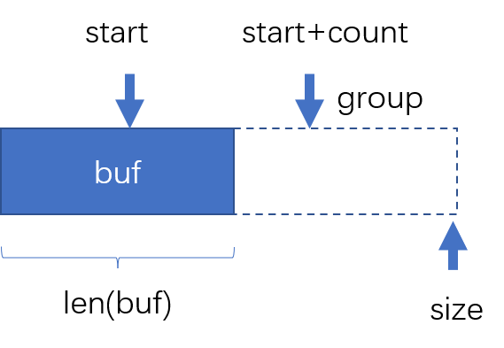

- 参考：https://www.codedump.info/post/20180922-etcd-raft/

- [概述](#概述)
- [etcd raft 关键结构](#etcd-raft-关键结构)
- [raft 数据管理](#raft-数据管理)
  - [unstable 结构体: 未持久化的日志数据](#unstable-结构体-未持久化的日志数据)
  - [Storage 接口：持久化数据的内存映像](#storage-接口持久化数据的内存映像)
  - [raftLog结构体](#raftlog结构体)
- [状态](#状态)
  - [Progress：leader 所记录的其他节点的状态](#progressleader-所记录的其他节点的状态)
    - [日志复制状态：ProgressStateType](#日志复制状态progressstatetype)
    - [滑动窗口：inflights](#滑动窗口inflights)
- [应用层处理Ready数据 demo](#应用层处理ready数据-demo)
- [交互数据](#交互数据)
  - [Message](#message)
  - [Ready 结构体](#ready-结构体)
- [node 结构体](#node-结构体)
- [节点管理](#节点管理)


- match 是怎么更新的
  - Progress.maybeUpdate
- 配置更新，如何处理没生效的 config log？
- readOnly 了解一下
- checkQuorum 作用
- config log entries 没有提交，但是要选举，怎么办

# 概述
- 应用层：相当于状态机，状态机特性：
  - 如果日志内容和顺序一致，apply 后的状态也一致。
- Raft库：保证日志内容和顺序的准确。一致性算法库为上层提供达成一致的log entries（一致指的是顺序和内容一致）
- 个人理解：Raft 可以类比 tcp 这些协议，为上层提供一定服务以及一定的保证。
  - tcp 对上层屏蔽了，拥塞控制，流量控制，丢包、重复等处理
  - Raft 对上层屏蔽了，leader选举算法，log管理和维护算法，节点更新算法等内容
  - Raft面向多个节点，TCP面向两个节点

<div align="center" style="zoom:60%"></div>


> 整体流程
1. 用户有操作请求，应用层 propose 数据到 raft
2. raft库 收到后，将该对应的 log entry 持久化
   - 怎么持久化，持久化（存储）谁负责（应用层还是raft库）
     - etcd是应用层负责
   - 持久化是应用层，那么怎么通知应用层
     - etcd，通过Ready结构体
3. raft 服务端持久化后，对该 log entry 进行同步
   - 同步需要网络，网络通信谁来负责（应用层还是raft库）
   - 通信是应用层，那么怎么通知应用层
4. 同步完成后(收到quorum数成功应答)，raft库 中该log entry 为可提交状态，将该log entry commit， 并且 通知应用层进行处理
   - 如何通知应用层，该日志已经commit了
5. 应用层 得知已经commit，可以将该 log entry 安全 apply 
   - 应用层 从propose log 到 apply log 是异步的，通过通知来触发，而不是阻塞
   - raft内部也维护了一个applyIndex，这个和应用层apply有没有什么联系？

- 注：
  - etcd 通过channel 来进行通知
  - etcd 中，**网络和存储都交给了库的使用者，也就是应用**层


# etcd raft 关键结构
- `Ready` 结构体：通知 应用层的数据
  - 通知 有数据需要进行同步给其他节点
  - 通知 有log entries/ snapshot 需要持久化
  - 通知 有日志数据已经提交，可以进一步 apply 到状态机 
- `node` 结构体：应用层和 Raft 库之间交互的机制（唯一接口），实现 `raft.Node` 接口


# raft 数据管理
> 客户端propose数据流程(log entries)
- 注：下图的提交是 propose 的意思
- 过程
  1. client propose data
  2. raft append log entries to unstable
  3. 由于 unstable 有了新增数据，通过Ready告知应用层持久化
  4. 应用层将日志数据写入wal，之后将这部分更新到持久化映像 `Storage`
  5. 持久化完毕，通知 unstable 缩容
  6. 持久化完毕，通过网络进行 日志复制
  7. 大多数接收之后，提交并告知client 
<div align="center" style="zoom:60%"></div>

> 日志数据持久化流程(snapshot)
<div align="center" style="zoom:60%"></div>


## unstable 结构体: 未持久化的日志数据 
- 为什么有：当raft收到 应用层 灌入的日志数据（这部分可能是应用层 propose 的，也可能是 leader 同步的数据）时，这部分数据还没持久化（数据持久化的请求发自raft，完成于 应用层），所以 raft 将其暂时存在该部分。
- 生命期：在告知应用层（通过 Ready）持久化，应用层 Advance之后，该数据将被清空
  - 猜测：如果是leader同步的数据，持久化后会给leader响应。

> 结构
- `unstable`：未持久化数据
  - `snapshot`：快照数据
  - `offset`：分界线
  - `entries`：log entries
- 注：**snapshot 和 entries 只会同时存在一个**【存疑】
<div align="center" style="zoom:60%"></div>

```cpp
type unstable struct {
	// the incoming unstable snapshot, if any.
	// 还没初始化的snapshot
	snapshot *pb.Snapshot
	// all entries that have not yet been written to storage.
	// 还没初始化的 log entries
	entries []pb.Entry
	// 用于保存entries数组中的数据的起始index
	offset  uint64
}
```
> 方法
- `maybeFirstIndex() (uint64, bool)` : 当 unstable 存储 snapshot 时，返回期待的下一条 log entries 的 index (即lastIndex+1)。否则返回 {0,false}
- `maybeLastIndex() (uint64, bool)` : 返回 unstable 中，最后日志数据的index(先找entries，再找snapshot)
- `maybeTerm(i uint64) (uint64, bool)` : 在 unstable 中，查找 index=i 对应的 term
- `stableTo(i, t uint64)` : 通知 unstable 缩容，告知已经将index=i，及其之前的log entries持久化
- `stableSnapTo(i uint64)` : 通知 unstable 缩容，告知已经将 lastindex=i 的 snapshot 持久化。
- `slice(lo uint64, hi uint64) []pb.Entry` : 返回 index=[lo, hi) 的 log entries
- `mustCheckOutOfBounds(lo, hi uint64)` : `slice` 辅助函数，检查 `u.offset <= lo <= hi <= u.offset+len(u.offset)`
- `restore(s pb.Snapshot)` : 将 snapshot s 灌入unstable
- **`truncateAndAppend(ents []pb.Entry)`** : 将 entries ents 灌入 unstable 。
  - 注意：调用该函数之前已经经过 raftLog 过滤了，可以调用，说明**以灌入的 entries 为主，并且不存在相离情况**。
  - 分为三种情况：
    1. 刚好与unstable's entries相切，直接灌入后面
    2. `ents[0].index < offset`， 灌入的比offset旧，entries直接丢掉，换成灌入部分
    3. 灌入的不比offset旧，灌入的覆盖原有的。


## Storage 接口：持久化数据的内存映像
- 为什么有：虽然持久化交给了应用层，但是Raft内部运作时，还是需要对持久化数据进行读操作。
- `MemoryStorage` 实现了该接口
  - 为什么 `Storag` 接口只有读操作，但是 `MemoryStorage` 实现了写？主要是因为 raft 不需要进行持久化，其内部只需要能够读取持久化的数据，对 **日志数据（指 log entries 和 snapshot，下不赘述）** 进行持久化
- 持久化时机是什么时候？
  - 当应用层propose数据时，raft就通过 `Ready` 结构体的 通知应用层，将这些未持久化数据进行持久化。
  - 也就是说，即使持久化了，也未必是提交的日志。
  - 存疑
- Storage 仅仅只是一个 持久化的内存映像？

> Storage接口和MemoryStorage结构体
<div align="center" style="zoom:60%"></div>


## raftLog结构体
- `RaftLog`：分为两部分 `unstable` 和 `Storage`
  - `unstable`：未持久化数据缓冲区，对Raft可读可写。
    - **未确认的数据**将存放在这里。发送端会维护一个**滑动窗口**，确认之后窗口会变化
  - `Storage`：已持久化数据的**内存映像**，对Raft只读，应用层负责写。

- 注：
  - 当 unstable 中有 snapshot，则说明 storage中没有 log entries，或即将丢弃
  - snapshot 一定是被集群 commit 的了。

<div align="center" style="zoom:50%"></div>

> 刚启动时，数据排列情况
<div align="center" style="zoom:80%"></div>

> 方法
- `maybeAppend(preIndex, preTerm, leaderCommit uint64, ents ...pb.Entry) (lastnewi uint64, ok bool)` : 
  - 通过 preIndex 和 preTerm，进行 RPC 一致性检查
  - 通过 min(leaderCommit,lastnewi) ，更新 raftLog 的 currentCommit
  - 检验通过后，将 ents 灌入 unstable
  - 返回 raftLog 管理的日志数据的lastIndex，以及操作是否成功。
- `restore(s pb.Snapshot)` : 将快照灌入 unstable 中，快照不用过多检查。
- `findConflict(ents []pb.Entry) uint64`：RPC一致性检查。对 ents 中的每条 entry，都与raftLog的比对（比对 index 和 term 是否都相等），返回 第一个冲突 或 第一个raftLog中所不存在的index
- `unstableEntries() []pb.Entry` : 返回unstable存储的log entries
- `nextEnts() (ents []pb.Entry)`: 返回 raftLog 中commit但是还没有apply的log entries
- `hasNextEnts() bool` : 判断 raftLog 中是否有commit但是还没有apply的log entries
- `snapshot() (pb.Snapshot, error)` : 返回 recent snapshot
- `firstIndex() uint64` : RaftLog 中管理的log entries 的firstIndex
- `lastIndex() uint64` : RaftLog 中管理的log entries 的lastIndex
- `commitTo(tocommit uint64)` : RaftLog 状态更新, 更新内部的 commitIndex
- `appliedTo(i uint64)` : RaftLog 状态更新, 更新内部的 applyIndex
- `stableTo(i, t uint64)` : 通知 unstable 缩容
- `stableSnapTo(i uint64)` : 通知 unstable 缩容
- `lastTerm()` : RaftLog 所管理的 log entries 中的lastTerm
- `term(i uint64) (uint64, error)` : 返回index=i的term
- `entries(i, maxsize uint64)` : 获取从i开始的log entries，大小不超过maxsize
- `allEntries()` : 获取所有 entries
- `isUpToDate(lasti, term uint64)` : 用于选举投票的判断，判断是否比当前节点的日志更新
- `matchTerm(i, term uint64) bool` : 判断(i,term) 是否与RaftLog中管理的一致
- `maybeCommit(maxIndex, term uint64) bool` : RaftLog 状态更新，更新内部的 commitIndex，相比 commitTo()多了些判断
- `slice(lo, hi, maxSize uint64) ([]pb.Entry, error)` : 返回[lo,hi)之间的数据，这些数据的大小总和不超过maxSize
- `mustCheckOutOfBounds(lo, hi uint64) error` : 判断传入的lo，hi是否超过log entries的范围，`l.firstIndex <= lo <= hi <= l.firstIndex + len(l.entries)`
- `zeroTermOnErrCompacted` : 如果传入的err是nil，则返回t；如果是ErrCompacted则返回0，其他情况都panic

# 状态
## Progress：leader 所记录的其他节点的状态
> 结构体

|  | 描述 |
| --- | --- |
| `Match, Next uint64` | matchIndex, nextIndex。正常情况：nextIndex = matchIndex +1 |
| `State ProgressStateType` | 当前该节点接收日志数据的状态 |
| `Pause bool` | 标记是否对该节点停止发送同步msg |
| `PendingSnapshot uint64` | 保存正在发送但未确认的snapshot的lastIndex |
| `RecentActive bool` | 表明当前节点是否活跃 |
| `ins *inflights` | 滑动窗口，用来做流量控制 |

- `PendingSnapshot` 不为0时， Pause 需要为 true，需要等该snapshot接收后，再传下一个
- `RecentActive` 只要最近该节点有响应，就为true
- Match 可信， Next 不总是可信

### 日志复制状态：ProgressStateType
- 三种类型
  - `ProgressStateProbe` : 探测状态
  - `ProgressStateReplicate` : 正常log entries 复制状态
  - `ProgressStateSnapshot` : 同步快照状态

### 滑动窗口：inflights
- 作用：限制 发送但还没被确认的 MsgApp 的数量
- `add(inflight uint64)` : 往 buffer 里灌入 inflight，count++。
- `freeTo(to uint64)` : 在 buffer 里从 start 开始释放，直到 `buffer[start] > to`
```go
type inflights struct {
	// the starting index in the buffer
	start int

	// number of inflights in the buffer
	// 当前存储的数据量
    // start+count > len(buf), 扩容
    // start+count > size, 调头
	count int

	// the size of the buffer
	// 注意，这个只是该滑动窗口的一个封顶的容量
	size int

	// buffer contains the index of the last entry
	// inside one message.
    // 存放 MsgApp 中 log entries 的lastIndex
	buffer []uint64
}
```
<div align="center" style="zoom:60%;background:#fff"></div>


# 应用层处理Ready数据 demo
- 下面代码是 `raftexample` 中处理Ready的流程，主要是四件事
  - 状态机 wal（这是 应用层 的业务需要，不是raft所必须）
  - 日志数据持久化
  - 日志同步
  - 对提交未apply的log entries，apply 到 状态机（这里是键值数据库）
```go
// 1. 应用层业务（状态机，如数据库的日志追加）进行 wal
rc.wal.Save(rd.HardState, rd.Entries)
if !raft.IsEmptySnap(rd.Snapshot) {
    // 2.持久化快照数据
    rc.saveSnap(rd.Snapshot)
    rc.raftStorage.ApplySnapshot(rd.Snapshot)
    rc.publishSnapshot(rd.Snapshot)
}
// 2.持久化 log entries
rc.raftStorage.Append(rd.Entries)

// 3.日志复制
rc.transport.Send(rd.Messages)

// 4.如果有提交的数据，将其apply到状态机
if ok := rc.publishEntries(rc.entriesToApply(rd.CommittedEntries)); !ok {
    rc.stop()
    return
}
rc.maybeTriggerSnapshot()
rc.node.Advance()
```

<div align="center" style="zoom:60%"></div>

# 交互数据
## Message
## Ready 结构体
- 成员：
  - `SoftState`
  - ``
  - ``
  - ``
  - ``
  - ``
  - ``
```go
type Ready struct {
	
	// 软状态是易变的，不需要持久化也不需要被consume,
    // 包括：当前集群leader、节点当前状态
	*SoftState

    // 硬状态，在将这部分数据发送给其他节点之前，
    // 需要持久化，包括：节点当前Term、Vote、Commit
	pb.HardState

	// ReadStates can be used for node to serve linearizable read requests locally
	// when its applied index is greater than the index in ReadState.
	// Note that the readState will be returned when raft receives msgReadIndex.
	// The returned is only valid for the request that requested to read.
	// 保存ready状态的readindex数据信息
	ReadStates []ReadState

	// Entries specifies entries to be saved to stable storage BEFORE
	// Messages are sent.
	// 需要持久化的 log entries，如果需要将这部分数据同步，需要先进行持久化
	Entries []pb.Entry

	// Snapshot specifies the snapshot to be saved to stable storage.
	// 需要持久化的 snapshot
	Snapshot pb.Snapshot

	// CommittedEntries specifies entries to be committed to a
	// store/state-machine. These have previously been committed to stable
	// store.
	// 已经被提交的 log entries，这些可以被 apply 到状态机
	CommittedEntries []pb.Entry

	// Messages specifies outbound messages to be sent AFTER Entries are
	// committed to stable storage.
	// If it contains a MsgSnap message, the application MUST report back to raft
	// when the snapshot has been received or has failed by calling ReportSnapshot.
	// 在entries被写入持久化存储中以后，需要发送出去的数据
	Messages []pb.Message
}
```

# node 结构体
- raft库通信的几个核心 channel
  - `propc chan pb.Message`：【recv】本地应用层 propose 的日志数据
  - `recv chan pb.Message`：【recv】其他节点（leader）同步时接收的日志数据
  - `readyc chan Ready`：【send】通知应用层的数据
- `Node` 接口的核心方法：
  - `Tick()`：机制的计时单位，保证某一段时间调用一下就ok。用来驱动 选举超时 和 发送心跳包。
  - `Propose(ctx context.Context, data []byte) error`：应用层 将日志数据 propose 到raft库
  - `Step(ctx context.Context, msg pb.Message) error`：应用层 将收到的消息发送给 raft
  - `Ready() <-chan Ready`；应用层实时关注该管道
  - `Advance()`：应用层将 Ready 数据处理后，调用该函数告知 raft（下面用raft代替raft库的语义）
<div align="center" style="zoom:60%"></div>

- 上图中，“本地提交” 和 “网络提交” 分别通过 `Propose` 和 `Step` 实现，最终都是通过 node 的 `step` 方法 将其灌入raft
- raft是一个**独立的线程**，通过管道与应用层交互，应用层通过 node 提供的方法来 配合raft，从而获得raft为其提供的保证。
- `Ready` ---> `Advance`；收到 `Ready` 之后，需要 `Advance` 一下，使得 raft 更新内部的某些状态（比如将未持久化的日志数据从中删除），或者进行某些行为。


# 节点管理
- leader 节点特有，leader 还需要为 每一个 follower 维护一些状态数据，这些数据存储于 `Progress` 结构体中

- `Progress` 结构体作用：...


