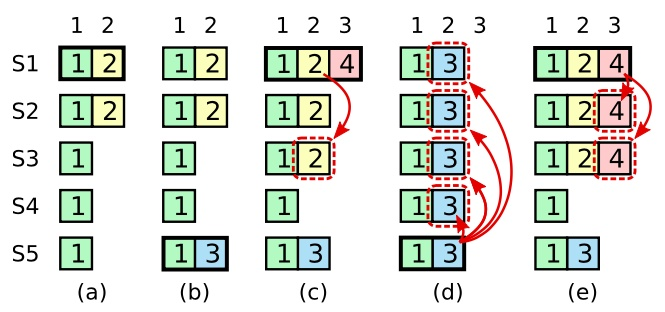
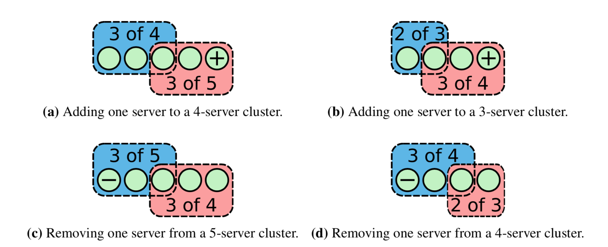
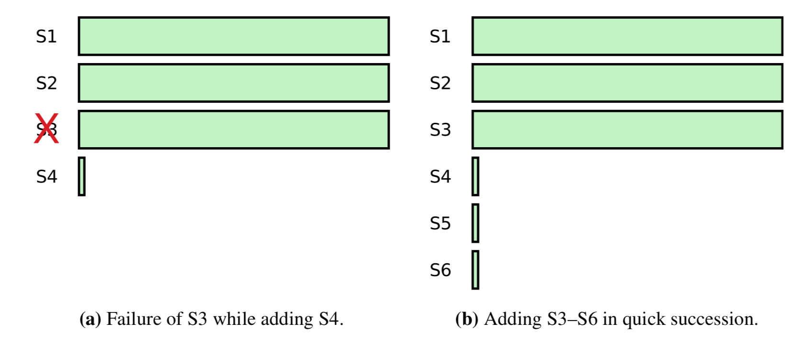
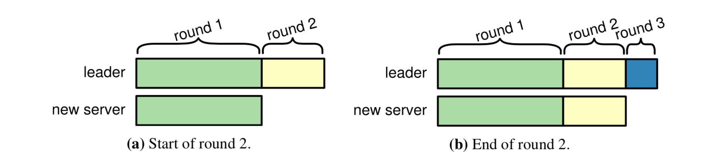
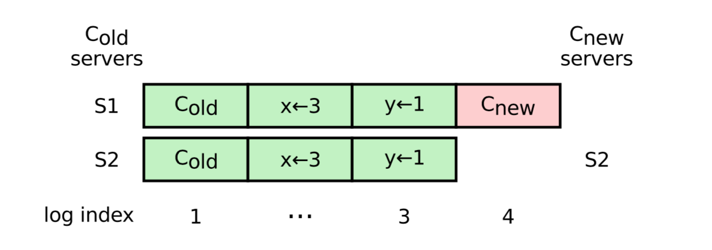

- [参考](#参考)
- [概述](#概述)
  - [一致性算法的背景：复制状态机](#一致性算法的背景复制状态机)
- [算法](#算法)
  - [RPC以及状态](#rpc以及状态)
    - [状态](#状态)
    - [AppendEntries RPC](#appendentries-rpc)
    - [RequestVote RPC](#requestvote-rpc)
    - [规则](#规则)
  - [leader 选举](#leader-选举)
    - [选举算法](#选举算法)
  - [日志复制](#日志复制)
    - [**日志匹配特性**](#日志匹配特性)
    - [leader 崩溃导致的数据不一致](#leader-崩溃导致的数据不一致)
  - [安全性](#安全性)
    - [选举限制](#选举限制)
    - [log复制限制](#log复制限制)
    - [follower 和 candidate 宕机](#follower-和-candidate-宕机)
    - [安全性和可用性的时间依赖](#安全性和可用性的时间依赖)
- [集群成员变化](#集群成员变化)
  - [RPC](#rpc)
    - [AddServer RPC](#addserver-rpc)
    - [RemoveServer RPC](#removeserver-rpc)
  - [后期的Raft做法](#后期的raft做法)
    - [过程](#过程)
    - [可用性：新服务器追赶](#可用性新服务器追赶)
    - [可用性：删除当前的leader](#可用性删除当前的leader)
  - [前期的Raft做法](#前期的raft做法)
    - [过程](#过程-1)
    - [问题](#问题)
  - [系统集成](#系统集成)
- [日志压缩](#日志压缩)
- [领导权的禅让（可选）](#领导权的禅让可选)
- [客户端交互](#客户端交互)

# 参考
- https://github.com/LebronAl/raft-thesis-zh_cn/blob/master/raft-thesis-zh_cn.md
- https://github.com/maemual/raft-zh_cn/blob/master/raft-zh_cn.md#51-raft-%E5%9F%BA%E7%A1%80
- https://zhuanlan.zhihu.com/p/32052223
- etcd: https://www.codedump.info/post/20180922-etcd-raft/
# 1. 概述
- 三个部分
  - **leader选举**
  - **log复制**
  - **安全性**
  - 注:
    - 主要就是 **leader选举** 和 **log复制** 这两个模块
    - **安全性** 是针对一些细节或者特殊情况，外加的一些限制
    - **安全性** 个人认为可以**类比 TCP协议的可靠性**，通过加入一些机制，保证TCP在发生延迟、丢包、重复等特殊情况下，**仍对上层提供可靠服务的保证**。而安全性是Raft对上层的提供一致性保证，保证不会出错（出错指出现不一致现象）。
- 作者在设计该算法时，充分考虑了**可理解性**，主要通过两种方式：
  - 减少状态机的状态
  - 算法模块分解
- **Raft中安全性不依赖时间，可用性必须依赖时间**
  - 如选举超时保证可用性，需要依赖于时间
- Strong Leader：log entries 只能从Leader流向其他节点
- `任期term` 在 Raft 算法中充当**逻辑时钟**的作用
  - 如果一个候选人或者领导者发现自己的任期号过期了，那么他会立即恢复成跟随者状态。
  - 如果一个节点接收到一个包含过期的任期号的请求，那么他会直接拒绝这个请求
- Raft的可用性目标：**不可用的时间要小于选举超时时间，用户需要能够容忍选举超时时间的不可用**。

## 1.1 一致性算法的背景：复制状态机
- 状态机我的理解是可以理解为 存储数据的单位，可以简单看成数据库。
  - **状态机可以是易失性的，也可以是持久性的**。重新启动后，必须通过重新应用日志条目来恢复易失性状态机
- 复制状态机**意义**：**实现高可用**
  - 带来分布式一致性难题。
- 复制状态机 所要**实现的目标**：
  - 就是有一组在不同服务器上的状态机（进行数据存储），他们之间拥有相同的状态（数据）副本，在一些状态机宕机的情况下，也可以继续运行。
  - 简单说就是数据做冗余

- 下面为复制状态机的结构。可以看成状态机中**有两个部分：**
  - **持久化的数据**（状态）
  - **复制日志**。主要用于在多节点中同步数据，达成数据的一致性
  - 注：
    - **持久化的数据 由 复制日志 来决定的。因为在状态机中，相同状态下的每一个操作都会产生相同的结果** 。
    - 即 **可以通过保证复制日志中指令的顺序，来保证状态机状态的一致性**。

- **一致性算法的任务是保证复制日志的一致性**。
  - 即内容和顺序一致
  - 解决复制状态机一致性的问题，使得服务器集群似乎形成了一个单一的、高度可靠的状态机

# 2. 算法
- 可用性：超过总数的半数节点正常就行了。
  - 问题：总数是怎么确定的，在随意增删节点下，怎么弄？配置文件吧

- 安全属性的最终目标：**状态机安全性**（State Machine Safety）

  - **S1. Election Safety**：一个任期最多只能有一个 leader
  - **S2. Leader Append-Only**：一个 leader 绝对不会 覆盖 或 删除 任何 log entries，其只会 append log entries。append log entries 只在leader中进行
  - **S3. Log Matching**：如果两条日志的 index 和 term 相同，则 log entry的内容相同，且其之前的日志也相同
  - **S4. Leader Completeness**：对于给定的 term，如果某个节点一个 log entry 已经 commit，则该 log entry 将被 term更高的 leader 所持久化
    - 任何给定任期的领导者都包含以前任期内提交的所有条目
  - **S5. State Machine Safety**：如果一个服务器 apply 给定index的 log entry，则没有其他的服务器会 apply 相同 index 下不同的 log entry
  
  
## 2.1 RPC以及状态
- 注：以下算法不包括 成员变化和日志压缩
- 最主要为 AppendEntries 和 RequestVote 两个RPC，后面有第三个RPC，用于服务器之间snapshot的传输
- 如果服务器没有及时收到RPC响应，则会重试RPC，并且会并行发出RPC已获得最佳性能
### 2.1.1 状态

> **所有节点**上的持久化状态

| 状态 | 描述 | 初始化 |
| --- | --- | --- |
| currentTerm | 当前节点所遇到的最大term值 | 刚启动的时，初始化为0 |
| voteFor | 在curentTerm中，该节点投票给谁 |  |
| log[] | 当前持久化存储的 log entries，每个log entry为{cmd, term, index} |  |

- currentTerm 和 voteFor 持久化，防止宕机后重启之后重复投票

> **所有节点**上的易失状态

| 状态 | 描述 | 初始化 |
| --- | --- | --- |
| commitIndex | 当前已知的已提交的log entries 中的最大index | 初始化为0 |
| lastApplied | 当前已经apply 到状态机的最大index | 初始化为0 |

> **leader节点**上的易失状态

| 状态 | 描述 | 初始化 |
| --- | --- | --- |
| nextIndex[] | 为每一个follower都维护这样一个状态，下一次发送给follower的log entry 的index | 初始化为 last log index + 1，慢慢试探 |
| matchIndex[] | 为每一个follower都维护这样一个状态，已知复制给follower的log entries 中最大的index | 初始化为0 |

- 正常情况下：`nextIndex = matchIndex + 1`
- 一旦 `nextIndex = matchIndex + 1` ，leader 开始发送实际条目
  - 在领导者发现它与跟随者的日志匹配位置之前，领导者可以发送不带任何条目（例如心跳）的附加日志 RPCs 以节省带宽

### 2.1.2 AppendEntries RPC

- 来自：leader
- 作用：
  - heartbeat
  - replicate log entries
> Request
- term：leader's term
- leaderId：让 follower 可以对client的请求重定向 
- prevLogIndex、prevLogTerm：紧接在新条目上的前一个log entry 的index和term。（RPC的一致性检测）
- entries[]：发送个follower的日志条目，为空表示心跳包，可能有多条（这样效率更高）
- leaderCommit：leader's commitIndex

> Response
- term：follower's currentTerm，for leader to update itself
- success：如果 prevLogIndex、prevLogTerm 匹配，则为true。

> follower 实现
- 如果 term < currentTerm，返回false
- 如果没有和preLogIndex，prevLogTerm匹配的log entry，则返回false
- 如果有冲突的（index相同，term不同），则覆盖
- append any new entries not in the log
- 如果 leaderCommit > commitIndex，则 commitIndex = min(leaderCommit, index of last new entry)

### 2.1.3 RequestVote RPC

- 来自 candidate
> Request
- term：candidate's term
- candidateId：candidate's id
- lastLogIndex、lastLogTerm：candidate最后一条日志的index和term

> Response
- term：currentTerm，for candidate to update itself
- voteGranted：投票成功则为true

> Receiver实现
- 如果 term < currentTerm，返回false
- 否则更新 currentTerm
- 如果 VotedFor 为null或者为 candidateId，并且 candidate 的日志至少和当前节点日志一样新，则把选票给 candidate，更新 voteFor。

### 2.1.4 规则

> 所有节点
- 如果commitIndex > lastApplied，apply log entries
- 如果收到的RPC中，term > currentTerm，更新 currentTerm，convert to follower

> follower
- 响应来自 leader 或 candidate 的RPC
- 选举超时前，没收到 `RequestVote` 或 `AppendEntries`，则convert to candidate

> candidate
- convert to candidate 后，开始选举：
  - currentTerm++
  - vote for self
  - reset election timer
  - Send Request Vote RPCs to all other servers
- 如果收到了大多数的选票：become leader
- 如果收到 new leader 的 `AppendEntries`：convert to follower
- 如果 election timeout elapses：start new eletion

> Leader
- 选举结束后：发送 empty `AppendEntries`，宣告新的leader，同时避免其他节点 election timeout
- 收到来自client的cmd，添加log entry 到 local log[]，在 log entry apply 之后响应。
  - 不是commit?
- 如果 last log entry > `nextIndex` for a follower，发送 `AppendEntries`  RPC with log entries starting at  `nextIndex`
  - 如果成功，更新 `nextIndex` 和 `matchIndex`
  - 如果因为不一致而失败，decrement nextIndex and retry
- 如果存在一个index N，其中 N > commitIndex，大多数 `matchIndex[i] > N`，以及 **`log[N].term == currentTerm`**，则设置 **`commitIndex = N`**
  - **matchIndex 的作用体现出来了，用来判断leader中某条日志是否可以commit**

## 2.2 leader 选举
- 节点三种状态：**leader、follower、candidate**
  - 正常情况下：只有一个leader，其他全是follower
  - **只有 leader 处理客户端请求；**，如果follower收到，会重定向给 leader
  - **follower不发送任何请求，只会响应 candidate 和 leader 的请求**
  - 当节点启动的时候，以 follower 的状态启动

> 状态变化 和 任期
- 问题：
  - leader 到 follower 是什么情况，如果follower 因为心跳延迟而变成candidate，leader收到选举信息会怎么样？
    - A：可能出现了分区，导致leader的心跳发不出去，而其他follower已经投出了新leader，某个时刻收到了 新leader的包，term> currentTerm，故退回 follower
- 注意：leader 不会变为 candidate。
  - 品一下为什么。因为leader如果不宕机，就一直是leader。宕机了，怎么可能还成为candidate。
- 在一个任期内，leader 一直都会是 leader，直到自己宕机了

- 任期：
  - Raft 把时间分割成**任意长度**的 任期(term)
  - **每个任期的开始都是一次 选举**。
  - 可能出现选举不成功（没有任何一方拿到大多数），则开启另一个 任期
  - （**S1. Election Safety**）Raft 确保给定的任期最多只有一个Leader
  - 更新的情况：
    - 选举超时，成为 candidate
    - 收到其他 candidate 的 RequestVote
    - 收到新的 leader 的 AppendEntries

### 2.2.1 选举算法
- leader保活机制：心跳包
- （状态）*election timeout*：选举超时，从一个固定的区间（例如 150-300 毫秒）随机选择
  - 这样的机制可以很大程度减少 选举过程中无人成功的情况。
- 选举触发事件：*election timeout* 时间里没有收到心跳。节点状态变化：`follower ==> candidate`，开始进行选举。
- 选举过程(candidate状态)：
  - `currentTerm++`，重置 *election timeout*，并给自己投上一票先
  - 向其他节点发送 `RequestVote RPC`，来给自己投票
  - 选举结果（持续为 candidate 身份，直到以下三种情况）
    - 成功。从 大多数服务器 获得针对同一个任期号的选票，**向其他节点发送心跳消息**(AppendEntries附加条目的一种)，阻止新的 leader 产生。
    - 其他节点成功。在等待投票的时候，收到其他节点的AppendEntries，如果该消息携带的 `term` >= `currentTerm`，则 **`candidate ==>follower`**
    - 无人成功。选票被瓜分，每一个 candidate 都无法获得大多数选票，从而导致等待时间超过*election timeout*，**选举过程重来**
- 选举超时时间的选择：150-300 ms, Rand

## 2.3 日志复制
- client request ===> a log entry
- 日志复制过程(粗略)：
  - ==> 用户请求（包含一条执行指令）
  - ==> leader 追加 log 
  - ==> （同步，AppendEntries）leader将该log持久化后，leader 向 follower 发起 AppendEntries RPC ，同步该条目，收到请求后 follower 追加 log并持久化，然后响应 
  - ==> （提交并返回）leader 收到大多数 follower 的响应后，提交，后把执行结果返回到客户端 
  - ==> （所有节点最终一致）重复尝试通过RPC，attach log 到所有 follower，直到最终一致。
- Q（针对上面粗略的过程，需要注意的**细节**）
  - Q1： leader 如何知道 follower 还没有该log的，是不是这里应该维护一个状态
    - A1：状态(nextIndex[], matchIndex[]) + 试探
  - Q2：leader 如何让 follower commit 的，是不是是否commit也维护一个状态
    - A2：RPC中告知follower 其 leaderCommit
  - Q3：leader 如何知道我这个集群有多少个节点的？是不是可以动态学习？还是通过配置文件？我记得etcd是通过配置文件
    - A3：还是借助特殊的log entry 来更改配置，两阶段法
  - Q4：leader 刚当选的时候，如何知道我该和某个节点同步哪些log？试探？怎么试探？
    - A4：各个Raft的实现不一样，思想就是一个趋近，慢慢试探的过程。也可以让 follower 在 resp 的时候直接告知 mastet（etcd的实现就是这样）
- **每条log可以看成这样的一个整体：<index, term, operation>**
  - 个人总结：不要想象成以 <index, term> 为坐标的二维模型，应该想象成以 全局index 为坐标的一维模型。term 的作用在该一维模型的作用为表征是否可覆盖。

- **提交**：一个条目当可以安全的被应用到状态机中去的时候，该条目就可以被提交。
- （状态）*leaderCommit*：leader的已知已提交的最高的日志条目的索引。
  - 包含在所有的 `AppendEntries`(包含心跳包) 中，这样 follower 就会知道当前 leader commit的位置，**所以 follower 也会同步 commit**。

### 2.3.1 **日志匹配特性**

- (S3. Log Matching Property)

- （状态） *prevLogIndex* 和 *prevLogTerm* ： 附加在同步log时的 AppendEntries 中， 分别为 同步的log 相邻的的上一条的 index 和 term。用于 `AppendEntries` RPC 的**一致性检查**
- 特性1： 不同的节点的log中，index 和 term 相同 ==> 这两个节点中，该log的 operation 也相同
  - 保障：一个 term 中都只有一个 leader（S1），在该任期中的 index 位置只会有一条log（leader独享 index 的操控）。
- 特性2： 不同的节点的log中，index 和 term 相同 ==> 这两个节点中，之前的所有log都相同
  - 保障：通过 `AppendEntries` RPC 的一致性检查。如果 follower 找不到 *prevLogIndex* 和 *prevLogTerm* 将拒绝接收该 log。当 leader 的 `AppendEntries` 返回成功后，就知道follower中该log条目及其之前的log和 leader已经保持一致
- 一致性检查作为一个归纳步骤：日志的初始空状态满足日志匹配属性，并且一致性检查在日志扩展时保留日志匹配属性

### 2.3.2 leader 崩溃导致的数据不一致
- 这种不一致问题会在领导人和跟随者的一系列崩溃下加剧
- 下图情况的 leaderCommit=9

- 场景，相比 leader 情况
  - a-b：缺少一些log
  - c-d：多出一些未被提交的log
  - e-f：缺少一些log，同时也多出一些未提交log
- 场景f
  - 该场景中，某个节点再 term=2 时，为 leader。attach 了一些 log 之后，宕机了，之后很快重启，又当了 leader，之后又 attach 了一些log，又崩溃了，在接下来的几个 term 中都处于崩溃中，再 term=8 的时候，又恢复了，作为 follower。
- 如何解决这种情况的不一致？
  - **通过强制 follower 直接复制 leader 自己的日志来解决**
  - 这样 leader就不需要特殊操作恢复一致性，简化了Raft算法。
- (前面 问题1)如何知道应该给 follower 哪个log？ **通过为每个 follower 维护一个 nextIndex**。过程如下：
  - leader 刚当选的时候，选它的最后一条log的index作为 nextIndex。
  - 通过 `AppendEntries` RPC，如果被 follower 拒绝，那么减小 nextIndex，继续试探；（这里可以进行优化，减少RPC次数，比如返回冲突条目的任期号和任期号对应的最小index，这样的话，试探的粒度不再是index，而是term。但其实没有太大必要，因为大多数情况下，失败很少发生，而且不太可能出现这么多不一致log）
  - 最终 nextIndex 再某个位置使得 leader 和 follower 达成一致，这时 `AppendEntries` 将成功返回，folloer 开始追赶 log（该过程可能覆盖follower原有同index上的log）
- **通过这种机制，领导者在上台时无需采取任何特殊措施来恢复日志一致性。领导者永远不会覆盖或删除自己日志中的条目（S2. Leader Append-Only）**

## 2.4 安全性
### 2.4.1 选举限制
- 安全性限制：**领导人都必须存储所有已经提交的日志条目**（S4. ）
  - 极端情况：一个什么数据都没有的节点做主节点
  - 怎么做？如果让 leader 当选后，来弥补这些缺失的已提交数据，这个过程存在 follower 向 leader 流数据的操作，而且也带来很多复杂性。
  - **Raft日志条目的传送是单向的，即 leader ==> follower**
- Raft实现该安全限制的做法：**从阻止 candidate 赢的角度入手**。
  - `RequestVote RPC` 中，包含 candidate 的日志信息（**最后一条日志条目的index和item**），**投票人会拒绝那些日志没有自己新的请求**
  - **新旧判断规则**：先比较 item，相等比较 index
    - 待查证（看etcd raft源码）：If the logs end with the same term, then whichever log is longer is more up-to-date. 如果日志以相同的term结束，那么无论哪个日志较长，都是最新的？？？

### 2.4.2 log复制限制
- 一个事实：一个当前任期的 leader，如果前一个任期中的log已经被大多数节点attach，并不能断定可以提交。
  - **Raft 永远不会通过计算副本数目的方式去提交一个之前任期内的日志条目**
- 安全性限制：**旧任期**的log可提交的充分条件，不再是大多数节点已经attach，还要再加一个条件——**当前任期**的log已经attach到大多数节点，已经具有可提交条件。
  - 在当前任期的log commit的时候，间接commit前任期未提交的
  - 保障：日志匹配特性（S3. Log Matching），当前的可提交，之前的一定可间接提交

> 极端情况
- 阶段a：s1 为 leader，leaderCommit=1，term=2；index=2 的log 复制到一半，s1发生宕机
- 阶段b：s5 为 leader，leaderCommit=1，term=3；写入日志，index=2；s5发生宕机
  - s5为 leader 满足选举限制，可以收到s3, s4, s5的选票
- 阶段c：s1 为 leader，leaderCommit=1， term=4；写入日志，index=3；同步index=2,term=2的日志到s3，（**关键**）此时s1两种做法，体现是有误安全性限制的差别：
  - 做法1：提交 index=2,term=2 的 log，因为此时已经有大多数节点有该log了。但是注意，该日志是旧任期遗留的。
  - 做法2：先不提交，等后面自己任期的log有条件提交时，再间接提交。
- 做法1下，阶段d：s1宕机了，s5称为leader，leaderCommit=1，term=5；这个时候s5可以同步其 index=2，term=3的 log到所有的节点，并**覆盖原本已经提交的 index=2，term=2 的日志，造成一致性破坏**。
  - 此时s5可以成为 leader，因为 最后一条日志条目的index和item，可以得到 s2, s3, s4, s5的支持票。满足选举安全性限制
- 做法2下，阶段e：这个时候s1 在同步完自己任期中的log后，并提交时，才把之前任期的给提交了。这个时候s5就当不了leader了。而且就算s1再这个时候宕机，index=2，term=2 也仍然没有提交，log可以被覆盖。
- **Why** ： 因为其是旧任期下的日志（记为e1），任期记为t1。在某个节点中，相同Index下的entry中的term(记为t2，在一些意外上产生这种情况)，如果 `t2 > t1`，则 t2 对应的节点此时仍有称为leader的潜力，所以如果将 e1 提交，那么后面有被leader覆盖的可能。
  - **只有当最新的term中，有可以commit的log entry，才可以安全将旧term的log提交**

- 5.4.3 Safety argument 将安全性分析，略过

### 2.4.3 follower 和 candidate 宕机

- 情况1：收到RPC之前，宕机了。最简单的方式就是leader不断RPC重试
- 情况2：收到RPC之后，处理中途，宕机了。**Raft的RPC是幂等的**，再处理一次，不会影响状态

### 2.4.5 安全性和可用性的时间依赖
- raft要求：
  - 安全性不依赖时间（依赖term）
    - 猜测：依赖于时间会很复杂，因为时钟同步是一个很复杂的问题
  - 可用性需要依赖时间（不可避免，如选举超时等等）

> 广播时间（broadcastTime） << 选举超时时间（electionTimeout） << 平均故障间隔时间（MTBF）
- 广播时间：是从一个服务器并行的发送 RPCs 给集群中的其他服务器并接收响应的平均时间
  - 广播时间应该比选举超时小一个数量级，以便领导者可以可靠地发送心跳消息
- 选举超时时间：前文所述
- 平均故障间隔时间：对于一台服务器而言，两次故障之间的平均时间
- 广播时间和 MTBF 是底层系统的属性，而选举超时是我们必须选择的。 Raft 的 RPC 通常要求接收方将信息持久化到稳定的存储中，因此广播时间可能在 0.5ms 到 20ms 之间，具体取决于存储技术。 因此，选举超时可能在 10 毫秒到 500 毫秒之间

# 3. 集群成员变化

## RPC
### AddServer RPC
> Request
- newServer : address of server to add to configuration
> Response
- status : OK if server was added successfully
- leaderHint : address of recent leader, if known

> 实现
- 如果不是leader，返回 `NOT_LEADER`
- 如果新的节点不可用，或者在最后一轮超过最小的选举超时，则返回 `TIMEOUT`
- 如果先前的配置log entry 未提交，需要等待其提交。
- 添加新的配置log entry，达成大多数后commit
- 返回 `OK`

### RemoveServer RPC
> Request
- oldServer : address of server to remove from configuration

> Response
- status : OK if server was added successfully
- leaderHint : address of recent leader, if known

> 实现

- 如果不是leader，返回 `NOT_LEADER`
- 如果先前的配置log entry 未提交，需要等待其提交。
- 添加新的配置log entry，达成大多数后commit
- 返回 `OK`，如果该节点被移除，则下台
## 后期的Raft做法
- **后期的Raft做法**：限制了集群成员更改的类型，一次只能从集群中添加或删除一个服务器。成员更改中更复杂的更改都是通过一系列单服务器更改实现的。
  - 这样使得raft的实现更加的简单

### 过程
- 集群配置信息使用特殊的 log entry 进行存储和通信。在配置更改的过程中也支持继续为客户端提供服务。
- 过程：
  - 开始：将要更改的配置Cnew生成log entry，添加到leader的日志中
  - 配置的log entry 一旦添加到服务器的日志中，就会在服务器上生效（**此时已经是使用新的配置来判断接收大多数**）。而不用等到该log entry提交。
  - 结束：该log entry 已提交，意味着大多数节点配置已经生效。则此时整个配置更新过程结束
- 配置的log entry 提交意味着什么：
  - 没有收到Cnew的机子不可能称为leader
  - leader 的配置已经生效
  - 如果配置删除了某个节点，该节点可以关闭了
  - **可以启动进一步的配置更新**

- 避免重叠的配置更新过程的方法：知道之前的配置log entry 被提交，才开始新的更新

- **配置的log entry可能被删除**：Raft中，节点一旦发现配置的log entry，马上生效，但是可能因为配置更新过程中出现问题，导致该log entry后面可能被删除，**所以节点必须准备好返回到其日志中的先前配置**

- 在**投票和日志复制**中需要一些机制，来使得配置信息可以达到一致性：
  - vote：**即使candidate不再当前节点配置中，也需要处理该 `RequestVote` 请求（只需确保候选人日志足够新）**。
    - 场景：在一个3节点的集群中，如果添加1个节点d，如果leader值复制日志给了另一个节点b就挂了，此时节点b选举超时成为candidate，那么新添加的节点d会收到 `RequestVote` 但是该节点并不在当前配置中，这个时候新添加的节点d也需要投出选票，不然将永远不能生成新的leader。
  - 日志复制：**即使leader 不在当前节点的配置中，也需要接收其 `AppendEntries`**
    - 否则永远不能将 新节点 添加到集群中（因为添加配置的log entry之前，需要添加该index 之前的一些log entries）

### 可用性：新服务器追赶
> 问题
- 提交需要满足大多数，而大多数如果依赖刚加入的节点，该节点又缺少很多日志，那么**节点在追赶的阶段，整个集群不可用，因为不能提交任何log entries**。下面为这种出现这种情况的两个例子：

> 解决
- 过程
  - 在配置更新之前引入了一个附加的阶段，其中一个新服务器作为**无投票权**成员加入集群，即**该节点不计入所需满足的大多数**。
  - 在该阶段中，进行日志追赶。追赶完成后进入配置更新阶段
- 那么怎么确定已经追赶上了，可以进入配置更新阶段了呢？
  - 将日志复制到新服务器的过程分为**10轮**
  - 每一轮都是将**当前**leader中所有的日志复制过去
  - 最后一轮时
    - 如果**最后一轮的持续时间少于一个选举超时**，则领导者将新服务器添加到集群中
    - 否则，领导者将因错误中止配置更新。调用者可以再进行一次，这个时候追赶的时间肯定更短。

- 细节：新服务器追赶时，leader 的 nextIndex 要慢慢试探，可以让 follower 在 AppendEntries 响应中返回其日志的长度

### 可用性：删除当前的leader
> 问题
- 在后期Raft配置更新（只能单词更新一个节点）和有领导权禅让的集群下，很容易实现：直接将领导权禅让出去就行了。
- 但是在前期的Raft是可以更新任意更新配置的，所以可能在Cnew中没有可以禅让的节点。这个时候只能通过另外一种方法来实现。
- 可用性问题：leader 追加 Cnew log entry 后，配置马上失效，这时候如果在log entry 提交之前下台，可能为了可用性，该节点还得重新成为leader
  - 比如，当集群只有两个节点，这个时候如果在没确定S2拥有Cnew之前就将S1下台，那么S2（还是使用旧配置）永远不可能成为leader。这个时候为了可用性，只能让S1成为leader

> 解决
- 过程
  - 等到leader提交了Cnew 的log entry，再将leader下台。
- 提交意味着：后面选举出来的leader，配置一定是Cnew。
- 这种方法有两个影响：
  - leader 有一段时间，即使不在Cnew的集群配置里，也要负责管理集群
  - **不属于Cnew的节点，也需要能够convert candidate**（可能上面的S1在没有提交Cnew之前宕机后立马重启，这个时候需要它再次成为leader）

## 前期的Raft做法
- 难题：一次性原子地转换所有服务器是不可能的，所以在转换期间整个集群存在划分成两个独立的大多数群体的可能性，如下图所述
  - 针对一次性变化多个节点的情况。

- **前期Raft做法**：本质为两阶段方法。通过日志复制来推动，还是一样的单向流通，leader 说了算
  - 第一阶段，进入一个过渡的配置（联合一致，joint
  consensus）
  - 第二阶段，进入新的配置
- 以上的两阶段方法还支持，在集群进行配置更改时继续为客户机请求提供服务。
### 过程
- 虚线表示 log entry被创建，实现表示该 log entry 被提交
- **这时候没有哪个时间点，Cold和Cnew可以同时单独做出决定**
  - Cold 单独做出决定 ==> Cold,new 联合做出决定 ==> Cnew 做出决定

- 特殊的日志类型：配置日志（configuration entry ）。用于集群配置转换的存储和通信
- **一个服务器将新的 配置日志 添加到日志后，就会立即使用该成员配置**
- 过程
  1. Leader 收到成员变更请求。（从 `Cold==>Cnew`）
  2. Leader 生成一个 log entry，内容为 `Cold ∪ Cnew`，追加到日志，并且作为当前自己的成员配置，并且同步到`Cold ∪ Cnew`所有副本，**提交的条件需要分别得到 Cold 和 Cnew 两个多数派的支持**
  3. Follower 收到 `Cold ∪ Cnew`后，将其设置为自己的成员配置
  4. Leader commit后，生成内容为 Cnew 的log entry，追加到日志，并**同步复制到 `Cold ∪ Cnew` 中的成员**（注：看具体实现，可能只发给Cnew）。
  5. Follower 收到 Cnew log后，那么设置成员配置为 Cnew
  6. Leader 收到 Cnew 中的大多数后，就可以commit了。这个时候，旧配置中不在新配置的节点就可以关闭了。

- leader配置更新过程中，宕机情况
  - 阶段1：`Cold ∪ Cnew` 未提交。这个时候，如果Leader 宕机，不能确定新 Leader 中，成员配置是 Cold 还是 `Cold ∪ Cnew`。
  - 阶段2：`Cold ∪ Cnew` 已提交。新 Leader 必须是`Cold ∪ Cnew`的成员配置
    - 理由：领导人都必须存储所有已经提交的日志条目
- 注：当配置更改已在进行时（当其最新配置未提交或不是简单多数时），领导者将拒绝其他配置更新

### 问题
> 新的服务器可能初始化没有存储任何的日志条目
- 带来的问题：可能造成新节点需要一段时间来追赶，**造成成员配置更新的过程过长**。导致一段时间无法commit
- 解决：在引入新阶段。**配置更新之前**，进行追赶。且这个时候这些新成员没有投票权利。等到追改完，才进入配置更新流程。

> 集群的领导人可能不是新配置的一员
- 解决：领导人就会在 commit C-new 日志之后退位（回到follower状态，不发送心跳），导致 选举超时
  - 理由：这个时候就总能选举出 C-new 的领导人了
- 在收到 Cnew 请求后， Leader 管理集群，但是不管理自己，Cnew中的大多数，总是不包含自己。

> 移除不在 C-new 中的服务器可能会扰乱集群
- 个人觉得：这个问题应该是得针对具体的Raft实现，如果Leader会把 Cnew log 发送给淘汰的节点，那么 Cold应该可以加规则让自己退出的吧
- 带来的问题：旧节点收不到心跳，选举超时后，给 Leader 发来 term更高的 `RequestVote RPC`，这样不加以控制，会导致当前 Leader 退回到 Follower。

- 解决：**当服务器确认当前 Leader 存在时，服务器会忽略`RequestVote RPC`**，如何确认？
  - 当服务器在当前最小选举超时时间内收到一个请求投票 RPC，他不会更新当前的任期号或者投出选票。
    - 理由： `广播时间（broadcastTime） << 选举超时时间（electionTimeout）`
  - 如果 Leader 能够发送正常的心跳，那么就不会被 淘汰节点 干扰。

## 系统集成
- 当节点故障时，自动调用配置更新是可取的。但是也可能是危险的，因为可能删除太多，导致剩余节点数不能形成大多数。
  - 解决：通过指定一些可用的节点，并指定固定的总节点数，通过配置更新进行替换。
- 涉及多个服务器的配置更改，分解为单服务器配置更新可能既有添加又有删除。**应该先处理添加，再处理删除。**
  - 比如3个节点中要替换一个，如果先删除，那么在中间过程不能允许其他节点故障。如果先添加，则可以允许有一个节点故障。

# 日志压缩
- snapshot：快照是最简单的压缩方法，快照点之前的日志全部丢弃，且快照点之前的状态（数据）被稳定持久化。

- 快照内容：
  - 状态机状态（数据）
  - 元数据：为了  AppendEntries 的一致性检查
    - `last included index`：快照取代的最后 entry 的 index 值
    - `last included term`：快照取代的最后 entry 的 term 值

- Leader 发送 snapshot 的时机：leader 已经丢弃了下一条需要发送给 follower 的 log entry
- Follower 收到 snapshot 之后（InstallSnapshot RPC ）两种情况：
  - snapshot 包含没有在 follower 日志中的entry，follower 直接丢弃整个日志，用 snapshot取代。
  - snapshot 包含 follower 日志中的前面部分，被包含的 log entries 将被删除
- 影响效率的两个问题：
  - 服务器什么时候创建快照
  - 写入快照需要一段时间，如何不影响正常业务

# 领导权的禅让（可选）
- 两种使用场景：
  - leader 必须下台。有时候想重启leader或者从集群中删除leader。
  - 某一台或多态服务器可能比其更适合做leader。
- 好处：
  - 选举超时的时间有点长，避免这短暂的不可用。

- 过程：
  - leader 停止接受新的客户请求
  - leader 更新目标节点的日志，使其和自己的日志匹配。
  - leader将 TimeoutNow 请求发送到目标服务器。目标服务器对该请求的处理方式和选举超时一致。开始新的选举
  - 目标节点的下一条消息将包括新的任期号，从而导致前任leader下台。

# 客户端交互    