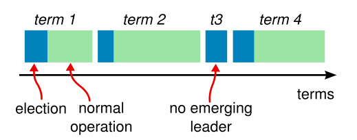

- [参考](#参考)
- [1. 概述](#1-概述)
  - [1.1 一致性算法的背景：复制状态机](#11-一致性算法的背景复制状态机)
- [2. 算法](#2-算法)
  - [2.1 RPC以及状态](#21-rpc以及状态)
    - [2.1.1 状态](#211-状态)
    - [2.1.2 AppendEntries RPC](#212-appendentries-rpc)
    - [2.1.3 RequestVote RPC](#213-requestvote-rpc)
    - [2.1.4 规则](#214-规则)
  - [2.2 leader 选举](#22-leader-选举)
    - [2.2.1 选举算法](#221-选举算法)
  - [2.3 日志复制](#23-日志复制)
    - [2.3.1 **日志匹配特性**](#231-日志匹配特性)
    - [2.3.2 leader 崩溃导致的数据不一致](#232-leader-崩溃导致的数据不一致)
  - [2.4 安全性](#24-安全性)
    - [2.4.1 选举限制](#241-选举限制)
    - [2.4.2 log复制限制](#242-log复制限制)
    - [2.4.3 follower 和 candidate 宕机](#243-follower-和-candidate-宕机)
    - [2.4.4 持久化状态和服务重启](#244-持久化状态和服务重启)
    - [2.4.5 安全性和可用性的时间依赖](#245-安全性和可用性的时间依赖)
- [3. 集群成员变化](#3-集群成员变化)
  - [3.1 RPC](#31-rpc)
    - [3.1.1 AddServer RPC](#311-addserver-rpc)
    - [3.1.2 RemoveServer RPC](#312-removeserver-rpc)
  - [3.2 后期的Raft做法](#32-后期的raft做法)
    - [3.2.1 过程](#321-过程)
    - [3.2.2 可用性：新服务器追赶](#322-可用性新服务器追赶)
    - [3.2.3 可用性：删除当前的leader](#323-可用性删除当前的leader)
  - [3.3 前期的Raft做法](#33-前期的raft做法)
    - [3.3.1 过程](#331-过程)
    - [3.3.2 问题](#332-问题)
  - [3.4 系统集成](#34-系统集成)
- [4. 日志压缩](#4-日志压缩)
  - [4.1 基于内存的状态快照](#41-基于内存的状态快照)
    - [4.1.1 并发生成 snapshot](#411-并发生成-snapshot)
    - [4.1.2 何时生成 snapshot](#412-何时生成-snapshot)
  - [4.2 基于磁盘的状态机快照](#42-基于磁盘的状态机快照)
  - [4.3 增量清理方法](#43-增量清理方法)
    - [4.3.1 Basics of log cleaning](#431-basics-of-log-cleaning)
    - [4.3.2 Basics of log-structured merge trees](#432-basics-of-log-structured-merge-trees)
    - [4.3.3  Log cleaning and log-structured merge trees in Raft](#433--log-cleaning-and-log-structured-merge-trees-in-raft)
  - [4.2 备选方案：基于leader的方法](#42-备选方案基于leader的方法)
- [5. 领导权的禅让（可选）](#5-领导权的禅让可选)
- [6. 客户端交互](#6-客户端交互)
  - [6.1 寻找集群](#61-寻找集群)
  - [6.2 将请求路由到 leader](#62-将请求路由到-leader)
  - [6.3 实现线性化语义](#63-实现线性化语义)
  - [6.4 高效处理 Read-only](#64-高效处理-read-only)
    - [6.4.1 使用时钟减少只读查询的消息](#641-使用时钟减少只读查询的消息)


# 参考
- https://github.com/LebronAl/raft-thesis-zh_cn/blob/master/raft-thesis-zh_cn.md
- https://github.com/maemual/raft-zh_cn/blob/master/raft-zh_cn.md#51-raft-%E5%9F%BA%E7%A1%80
- https://zhuanlan.zhihu.com/p/32052223
- etcd: https://www.codedump.info/post/20180922-etcd-raft/
# 1. 概述
- 三个部分
  - **leader选举**
  - **log复制**
  - **安全性**
  - 注:
    - 主要就是 **leader选举** 和 **log复制** 这两个模块
    - **安全性** 是针对一些细节或者特殊情况，外加的一些限制
    - **安全性** 个人认为可以**类比 TCP协议的可靠性**，通过加入一些机制，保证TCP在发生延迟、丢包、重复等特殊情况下，**仍对上层提供可靠服务的保证**。而安全性是Raft对上层的提供一致性保证，保证不会出错（出错指出现不一致现象）。
- 作者在设计该算法时，充分考虑了**可理解性**，主要通过两种方式：
  - 减少状态机的状态
  - 算法模块分解
- **Raft中安全性不依赖时间，可用性必须依赖时间**
  - 如选举超时保证可用性，需要依赖于时间
- Strong Leader：log entries 只能从Leader流向其他节点
- `任期term` 在 Raft 算法中充当**逻辑时钟**的作用
  - 如果一个候选人或者领导者发现自己的任期号过期了，那么他会立即恢复成跟随者状态。
  - 如果一个节点接收到一个包含过期的任期号的请求，那么他会直接拒绝这个请求
- Raft的可用性目标：**不可用的时间要小于选举超时时间，用户需要能够容忍选举超时时间的不可用**。


## 1.1 一致性算法的背景：复制状态机
- 状态机我的理解是可以理解为 存储数据的单位，可以简单看成数据库。
  - **状态机可以是易失性的，也可以是持久性的**。重新启动后，必须通过重新应用日志条目来恢复易失性状态机
- 复制状态机**意义**：**实现高可用**
  - 带来分布式一致性难题。
- 复制状态机 所要**实现的目标**：
  - 就是有一组在不同服务器上的状态机（进行数据存储），他们之间拥有相同的状态（数据）副本，在一些状态机宕机的情况下，也可以继续运行。
  - 简单说就是数据做冗余

- 下面为复制状态机的结构。可以看成状态机中**有两个部分：**
  - **持久化的数据**（状态）
  - **复制日志**。主要用于在多节点中同步数据，达成数据的一致性
  - 注：
    - **持久化的数据 由 复制日志 来决定的。因为在状态机中，相同状态下的每一个操作都会产生相同的结果** 。
    - 即 **可以通过保证复制日志中指令的顺序，来保证状态机状态的一致性**。
<div align="center" style="zoom:80%"></div>

- **一致性算法的任务是保证复制日志的一致性**。
  - 即内容和顺序一致
  - 解决复制状态机一致性的问题，使得服务器集群似乎形成了一个单一的、高度可靠的状态机


# 2. 算法
- 可用性：超过总数的半数节点正常就行了。
  - 问题：总数是怎么确定的，在随意增删节点下，怎么弄？配置文件吧

- 安全属性的最终目标：**状态机安全性**（State Machine Safety）

  - **S1. Election Safety**：一个任期最多只能有一个 leader
  - **S2. Leader Append-Only**：一个 leader 绝对不会 覆盖 或 删除 任何 log entries，其只会 append log entries。append log entries 只在leader中进行
  - **S3. Log Matching**：如果两条日志的 index 和 term 相同，则 log entry的内容相同，且其之前的日志也相同
  - **S4. Leader Completeness**：对于给定的 term，如果某个节点一个 log entry 已经 commit，则该 log  将被 term更高的 leader 所持久化
    - 任何给定任期的领导者都包含以前任期内提交的所有条目
  - **S5. State Machine Safety**：如果一个服务器 apply 给定index的 log entry，则没有其他的服务器会 apply 相同 index 下不同的 log entry
  
  
## 2.1 RPC以及状态
- 注：以下算法不包括 成员变化和日志压缩
- 最主要为 AppendEntries 和 RequestVote 两个RPC，后面有第三个RPC，用于服务器之间snapshot的传输
- 如果服务器没有及时收到RPC响应，则会重试RPC，并且会并行发出RPC已获得最佳性能
### 2.1.1 状态


> **所有节点**上的持久化状态

| 状态 | 描述 | 初始化 |
| --- | --- | --- |
| currentTerm | 当前节点所遇到的最大term值 | 刚启动的时，初始化为0 |
| voteFor | 在curentTerm中，该节点投票给谁 |  |
| log[] | 当前持久化存储的 log entries，每个log entry为{cmd, term, index} |  |

- 和 voteFor 持久化，防止宕机后重启之后重复投票

> **所有节点**上的易失状态

| 状态 | 描述 | 初始化 |
| --- | --- | --- |
| commitIndex | 当前已知的已提交的log entries 中的最大index | 初始化为0 |
| lastApplied | 当前已经apply 到状态机的最大index | 初始化为0 |

> **leader节点**上的易失状态

| 状态 | 描述 | 初始化 |
| --- | --- | --- |
| nextIndex[] | 为每一个follower都维护这样一个状态，下一次发送给follower的log entry 的index | 初始化为 last log index + 1，慢慢试探 |
| matchIndex[] | 为每一个follower都维护这样一个状态，已知复制给follower的log entries 中最大的index | 初始化为0 |

- 正常情况下：`nextIndex = matchIndex + 1`
- 一旦 `nextIndex = matchIndex + 1` ，leader 开始发送实际条目
  - 在领导者发现它与跟随者的日志匹配位置之前，领导者可以发送不带任何条目（例如心跳）的附加日志 RPCs 以节省带宽

### 2.1.2 AppendEntries RPC


- 来自：leader
- 作用：
  - heartbeat
  - replicate log entries
> Request
- term：leader's term
- leaderId：让 follower 可以对client的请求重定向 
- prevLogIndex、prevLogTerm：紧接在新条目上的前一个log entry 的index和term。（RPC的一致性检测）
- entries[]：发送个follower的日志条目，为空表示心跳包，可能有多条（这样效率更高）
- leaderCommit：leader's commitIndex

> Response
- term：follower's currentTerm，for leader to update itself
- success：如果 prevLogIndex、prevLogTerm 匹配，则为true。

> follower 实现
- 如果 term < currentTerm，返回false
- 如果没有和preLogIndex，prevLogTerm匹配的log entry，则返回false
- 如果有冲突的（index相同，term不同），则覆盖
- append any new entries not in the log
- 如果 leaderCommit > commitIndex，则 commitIndex = min(leaderCommit, index of last new entry

### 2.1.3 RequestVote RPC


- 来自 candidate
> Request
- term：candidate's term
- candidateId：candidate's id
- lastLogIndex、lastLogTerm：candidate最后一条日志的index和term

> Response
- term：currentTerm，for candidate to update itself
- voteGranted：投票成功则为true

> 能为系Receiver实现
- 如果 term < currentTerm，返回false
- 否则更新 currentTerm
- 如果 VotedFor 为null或者为 candidateId，并且 candidate 的日志至少和当前节点日志一样新，则把选票给 candidate，更新 voteFor。

### 2.1.4 规则


> 所有节点
- 如果commitIndex > lastApplied，apply log entries
- 如果收到的RPC中，term > currentTerm，更新 currentTerm，convert to follower

> follower
- 响应来自 leader 或 candidate 的RPC
- 选举超时前，没收到 `RequestVote` 或 `AppendEntries`，则convert to candidate

> candidate
- convert to candidate 后，开始选举：
  - currentTerm++
  - vote for self
  - 能为系能为系reset election timer
  - Send Request Vote RPCs to all other servers
- 如果收到了大多数的选票：become leader
- 如果收到 new leader 的 `AppendEntries`：convert to follower
- 如果 election timeout elapses：start new eletion

> Leader
- 选举结束后：发送 empty `AppendEntries`，宣告新的leader，同时避免其他节点 election timeout
- 收到来自client的cmd，添加log entry 到 local log[]，在 log entry apply 之后响应。
  - 不是commit?
- 如果 last log entry > `nextIndex` for a follower，发送 `AppendEntries`  RPC with log entries starting at  `nextIndex`
  - 如果成功，更新 `nextIndex` 和 `matchIndex`
  - 如果因为不一致而失败，decrement nextIndex and retry
- 如果存在一个index N，其中 N > commitIndex，大多数 `matchIndex[i] > N`，以及 **`log[N].term == currentTerm`**，则设置 **`commitIndex = N`**
  - **matchIndex 的作用体现出来了，用来判断leader中某条日志是否可以commit**

## 2.2 leader 选举
- 节点三种状态：**leader、follower、candidate**
  - 正常情况下：只有一个leader，其他全是follower能为系
  - **只有 leader 处理客户端请求；**，如果follower收到，会重定向给 leader
  - **follower不发送任何请求，只会响应 candidate 和 leader 的请求**
  - 当节点启动的时候，以 follower 的状态启动pic/12.png

> 状态变化 和 任期
- 问题：
  - leader 到 follower 是什么情况，如果follower 因为心跳延迟而变成candidate，leader收到选举信息会怎么样？
    - A：可能出现了分区，导致leader的心跳发不出去，而其他follower已经投出了新leader，某个时刻收到了 新leader的包，term> currentTerm，故退回 follower
- 注意：leader 不会变为 candidate。
  - 品一下为什么。因为leader如果不宕机，就一直是leader。宕机了，怎么可能还成为candidate。
- 在一个任期内，leader 一直都会是 leader，直到自己宕机了
<div align="center" style="zoom:80%"></div>

- 任期：
  - Raft 把时间分割成**任意长度**的 任期(term)
  - **每个任期的开始都是一次 选举**。
  - 可能出现选举不成功（没有任何一方拿到大多数），则开启另一个 任期
  - （**S1. Election Safety**）Raft 确保给定的任期最多只有一个Leader
  - 更新的情况：
    - 选举超时，成为 candidate
    - 收到其他 candidate 的 RequestVote
    - 收到新的 leader 的 AppendEntries
<div align="center" style="zoom:80%"></div>

### 2.2.1 选举算法
- leader保活机制：心跳包
- （状态）*election timeout*：选举超时，从一个固定的区间（例如 150-300 毫秒）随机选择
  - 这样的机制可以很大程度减少 选举过程中无人成功的情况。
- 选举触发事件：*election timeout* 时间里没有收到心跳。节点状态变化：`follower ==> candidate`，开始进行选举。
- 选举过程(candidate状态)：
  - `currentTerm++`，重置 *election timeout*，并给自己投上一票先
  - 向其他节点发送 `RequestVote RPC`，来给自己投票
  - 选举结果（持续为 candidate 身份，直到以下三种情况）
    - 成功。从 大多数服务器 获得针对同一个任期号的选票，**向其他节点发送心跳消息**(AppendEntries附加条目的一种)，阻止新的 leader 产生。
    - 其他节点成功。在等待投票的时候，收到其他节点的AppendEntries，如果该消息携带的 `term` >= `currentTerm`，则 **`candidate ==>follower`**
    - 无人成功。选票被瓜分，每一个 candidate 都无法获得大多数选票，从而导致等待时间超过*election timeout*，**选举过程重来**
- leader的选举超时：如果没有在其大部分集群中成功进行一轮心跳，leader将选举超时，自动下台
- 选举超时时间的选择：150-300 ms, Rand


## 2.3 日志复制
- client request ===> a log entry
- 日志复制过程(粗略)：
  - ==> 用户请求（包含一条执行指令）
  - ==> leader 追加 log 
  - ==> （同步，AppendEntries）leader将该log持久化后，leader 向 follower 发起 AppendEntries RPC ，同步该条目，收到请求后 follower 追加 log并持久化，然后响应 
  - ==> （提交并返回）leader 收到大多数 follower 的响应后，提交，后把执行结果返回到客户端 
  - ==> （所有节点最终一致）重复尝试通过RPC，attach log 到所有 follower，直到最终一致。
- Q（针对上面粗略的过程，需要注意的**细节**）
  - Q1： leader 如何知道 follower 还没有该log的，是不是这里应该维护一个状态
    - A1：状态(nextIndex[], matchIndex[]) + 试探
  - Q2：leader 如何让 follower commit 的，是不是是否commit也维护一个状态
    - A2：RPC中告知follower 其 leaderCommit
  - Q3：leader 如何知道我这个集群有多少个节点的？是不是可以动态学习？还是通过配置文件？我记得etcd是通过配置文件
    - A3：还是借助特殊的log entry 来更改配置，两阶段法
  - Q4：leader 刚当选的时候，如何知道我该和某个节点同步哪些log？试探？怎么试探？
    - A4：各个Raft的实现不一样，思想就是一个趋近，慢慢试探的过程。也可以让 follower 在 resp 的时候直接告知 mastet（etcd的实现就是这样）
- **每条log可以看成这样的一个整体：<index, term, operation>**
  - 个人总结：不要想象成以 <index, term> 为坐标的二维模型，应该想象成以 全局index 为坐标的一维模型。term 的作用在该一维模型的作用为表征是否可覆盖。
  
- **提交**：一个条目当可以安全的被应用到状态机中去的时候，该条目就可以被提交。
- （状态）*leaderCommit*：leader的已知已提交的最高的日志条目的索引。
  - 包含在所有的 `AppendEntries`(包含心跳包) 中，这样 follower 就会知道当前 leader commit的位置，**所以 follower 也会同步 commit**。

> 试探

- (前面 Q1)如何知道应该给 follower 哪个log？ **通过为每个 follower 维护一个 nextIndex**。过程如下：
  - leader 刚当选的时候，选它的最后一条log的index作为 nextIndex。
  - 通过 `AppendEntries` RPC，如果被 follower 拒绝，那么减小 nextIndex，继续试探；（这里可以进行优化，减少RPC次数，比如返回冲突条目的任期号和任期号对应的最小index，这样的话，试探的粒度不再是index，而是term。但其实没有太大必要，因为大多数情况下，失败很少发生，而且不太可能出现这么多不一致log）
  - 最终 nextIndex 再某个位置使得 leader 和 follower 达成一致，这时 `AppendEntries` 将成功返回，folloer 开始追赶 log（该过程可能覆盖follower原有同index上的log）
- **试探阶段（找出需要实际发送的条目）**：领导者可以发送不带任何条目（例如心跳）的附加日志 RPCs 以节省带宽。 然后，**一旦 matchIndex 恰好比 nextIndex 小 1，则领导者应开始发送实际条目**

### 2.3.1 **日志匹配特性**

- (S3. Log Matching Property)

- （状态） *prevLogIndex* 和 *prevLogTerm* ： 附加在同步log时的 AppendEntries 中， 分别为 同步的log 相邻的的上一条的 index 和 term。用于 `AppendEntries` RPC 的**一致性检查**
- 特性1： 不同的节点的log中，index 和 term 相同 ==> 这两个节点中，该log的 operation 也相同
  - 保障：一个 term 中都只有一个 leader（S1），在该任期中的 index 位置只会有一条log（leader独享 index 的操控）。
- 特性2： 不同的节点的log中，index 和 term 相同 ==> 这两个节点中，之前的所有log都相同
  - 保障：通过 `AppendEntries` RPC 的一致性检查。如果 follower 找不到 *prevLogIndex* 和 *prevLogTerm* 将拒绝接收该 log。当 leader 的 `AppendEntries` 返回成功后，就知道follower中该log条目及其之前的log和 leader已经保持一致
- 一致性检查作为一个归纳步骤：日志的初始空状态满足日志匹配属性，并且一致性检查在日志扩展时保留日志匹配属性


### 2.3.2 leader 崩溃导致的数据不一致
- 这种不一致问题会在领导人和跟随者的一系列崩溃下加剧
- 下图情况的 leaderCommit=9
<div align="center" style="zoom:80%"></div>

- 场景，相比 leader 情况
  - a-b：缺少一些log
  - c-d：多出一些未被提交的log
  - e-f：缺少一些log，同时也多出一些未提交log
- 场景f
  - 该场景中，某个节点再 term=2 时，为 leader。attach 了一些 log 之后，宕机了，之后很快重启，又当了 leader，之后又 attach 了一些log，又崩溃了，在接下来的几个 term 中都处于崩溃中，再 term=8 的时候，又恢复了，作为 follower。
- 如何解决这种情况的不一致？
  - **通过强制 follower 直接复制 leader 自己的日志来解决**
  - 这样 leader就不需要特殊操作恢复一致性，简化了Raft算法。
- **通过这种机制，领导者在上台时无需采取任何特殊措施来恢复日志一致性。领导者永远不会覆盖或删除自己日志中的条目（S2. Leader Append-Only）**

## 2.4 安全性
### 2.4.1 选举限制
- 安全性限制：**领导人都必须存储所有已经提交的日志条目**（S4. ）
  - **极端情况**：一个什么数据都没有的节点做主节点
  - **怎么做**：如果候选人的日志至少和大多数的服务器节点一样新，那么他一定持有了所有已经提交的日志条目
- Raft实现该安全限制的做法：**从阻止 candidate 赢的角度入手**。
  - `RequestVote RPC` 中，包含 candidate 的日志信息（**最后一条日志条目的 index 和 item**），**投票人会拒绝那些日志没有自己新的请求**
- **新旧判断规则**：先比较 item，相等比较 index

### 2.4.2 log复制限制
- 一个事实：一个当前任期的 leader，如果前一个任期中的log已经被大多数节点attach，并不能断定可以提交。
  - **Raft 永远不会通过计算副本数目的方式去提交一个之前任期内的日志条目**
- 安全性限制：**旧任期**的log可提交的充分条件，不再是大多数节点已经attach，还要再加一个条件——**当前任期**的log已经attach到大多数节点，已经具有可提交条件。
  - 在当前任期的log commit的时候，间接commit前任期未提交的
  - 保障：日志匹配特性（S3. Log Matching），当前的可提交，之前的一定可间接提交

> 极端情况
- 阶段a：s1 为 leader，leaderCommit=1，term=2；index=2 的log 复制到一半，s1发生宕机
- 阶段b：s5 为 leader，leaderCommit=1，term=3；写入日志，index=2；s5发生宕机
  - s5为 leader 满足选举限制，可以收到s3, s4, s5的选票
- 阶段c：s1 为 leader，leaderCommit=1， term=4；写入日志，index=3；同步index=2,term=2的日志到s3，（**关键**）此时s1两种做法，体现是有误安全性限制的差别：
  - 做法1：提交 index=2,term=2 的 log，因为此时已经有大多数节点有该log了。但是注意，该日志是旧任期遗留的。
  - 做法2：先不提交，等后面自己任期的log有条件提交时，再间接提交。
- 做法1下，阶段d：s1宕机了，s5称为leader，leaderCommit=1，term=5；这个时候s5可以同步其 index=2，term=3的 log到所有的节点，并**覆盖原本已经提交的 index=2，term=2 的日志，造成一致性破坏**。
  - 此时s5可以成为 leader，因为 最后一条日志条目的index和item，可以得到 s2, s3, s4, s5的支持票。满足选举安全性限制
- 做法2下，阶段e：这个时候s1 在同步完自己任期中的log后，并提交时，才把之前任期的给提交了。这个时候s5就当不了leader了。而且就算s1再这个时候宕机，index=2，term=2 也仍然没有提交，log可以被覆盖。
- **Why** ： 因为其是旧任期下的日志（记为e1），任期记为t1。在某个节点中，相同Index下的entry中的term(记为t2，在一些意外上产生这种情况)，如果 `t2 > t1`，则 t2 对应的节点此时仍有称为leader的潜力，所以如果将 e1 提交，那么后面有被leader覆盖的可能。
  - **只有当最新的term中，有可以commit的log entry，才可以安全将旧term的log提交**
<div align="center" style="zoom:80%"></div>

- 5.4.3 Safety argument 将安全性分析，略过

### 2.4.3 follower 和 candidate 宕机

- 情况1：收到RPC之前，宕机了。最简单的方式就是leader不断RPC重试
- 情况2：收到RPC之后，处理中途，宕机了。**Raft的RPC是幂等的**，再处理一次，不会影响状态

### 2.4.4 持久化状态和服务重启

- Raft 服务器必须持久化足够的信息到稳定存储中来保证服务的安全重启，需要持久化以下信息
  - **当前的任期和投票选择**，以防止服务器在相同的任期内投票两次（出现场景：投票后宕机，立即重启，再投一次），或者将新领导者的日志条目替换为废弃领导者的日志条目（出现场景：此时旧term和新term两个leader，宕机后重启）
  - **commited log entry**（在日志提交之前就需要持久化该日志），防止已经提交的条目在服务器重启时丢失或“uncommited“
- **状态机可以是易失性的，也可以是持久性的**，重新启动后，必须通过重新应用日志条目来恢复易失性状态机。
  - 持久状态机在重启后已经应用了大多数条目，为了避免重新应用它们，其最后应用的索引也必须是持久的。

### 2.4.5 安全性和可用性的时间依赖
- raft要求：
  - 安全性不依赖时间（依赖term）
    - 猜测：依赖于时间会很复杂，因为时钟同步是一个很复杂的问题
  - 可用性需要依赖时间（不可避免，如选举超时等等）

> 广播时间（broadcastTime） << 选举超时时间（electionTimeout） << 平均故障间隔时间（MTBF）
- 广播时间：是从一个服务器并行的发送 RPCs 给集群中的其他服务器并接收响应的平均时间
  - 广播时间应该比选举超时小一个数量级，以便领导者可以可靠地发送心跳消息
- 选举超时时间：前文所述
- 平均故障间隔时间：对于一台服务器而言，两次故障之间的平均时间
- 广播时间和 MTBF 是底层系统的属性，而选举超时是我们必须选择的。 Raft 的 RPC 通常要求接收方将信息持久化到稳定的存储中，因此广播时间可能在 0.5ms 到 20ms 之间，具体取决于存储技术。 因此，选举超时可能在 10 毫秒到 500 毫秒之间

# 3. 集群成员变化

## 3.1 RPC
### 3.1.1 AddServer RPC

<div align="center" style="zoom:100%"></div>

- AddServer RPC 用于向当前配置添加新服务器

> Request
- newServer : address of server to add to configuration
> Response
- status : OK if server was added successfully
- leaderHint : address of recent leader, if known

> 实现
- 如果不是leader，返回 `NOT_LEADER`
- 如果新的节点不可用，或者在最后一轮超过最小的选举超时，则返回 `TIMEOUT`
- 如果先前的配置log entry 未提交，需要等待其提交。
- 添加新的配置log entry，达成大多数后commit
- 返回 `OK`

### 3.1.2 RemoveServer RPC

<div align="center" style="zoom:100%"></div>

- RemoveServer RPC 用于从当前配置中删除服务器

> Request
- oldServer : address of server to remove from configuration

> Response
- status : OK if server was added successfully
- leaderHint : address of recent leader, if known

> 实现

- 如果不是leader，返回 `NOT_LEADER`
- 如果先前的配置log entry 未提交，需要等待其提交。
- 添加新的配置log entry，达成大多数后commit
- 返回 `OK`，如果该节点被移除，则下台
## 3.2 后期的Raft做法
- **后期的Raft做法**：限制了集群成员更改的类型，**一次只能从集群中添加或删除一个服务器**。成员更改中更复杂的更改都是通过一系列单服务器更改实现的。
  - 这样使得raft的实现更加的简单
  
  > 如下所示，对于只变更一个节点的情况，不会形成两个多数派
<div align="center" style="zoom:80%"></div>

### 3.2.1 过程
- 集群配置信息使用特殊的 log entry 进行存储和通信。在配置更改的过程中也支持继续为客户端提供服务。
- 过程：
  - 开始：将要更改的配置Cnew生成log entry，添加到leader的日志中
  - 配置的log entry 一旦添加到服务器的日志中，就会在服务器上生效（**此时已经是使用新的配置来判断接收大多数**）。而不用等到该log entry提交。
  - 结束：该log entry 已提交，意味着大多数节点配置已经生效。则此时集群中整个配置更新过程结束
- 配置的 log entry commit 意味着什么：
  - 没有收到 Cnew 的机子不可能成为 leader
  - leader 的配置已经生效
  - 如果配置删除了某个节点，该节点可以关闭了
  - **可以启动进一步的配置更新**
- 避免重叠配置更新的方法：知道之前的 configuration entry 被提交，才开始新的更新
- Q：为什么不在 commit 的时候，服务器才应用配置？
  - A：因为这样的话 Raft leader 很难知道何时旧集群的大部分已经采用了新日志，leader需要跟踪哪些服务器的 configuration entry 被提交
  - 但是这种机制引发另一个问题：configuration entry 可能被删除
- **configuration entry 可能被删除**：Raft中，节点一旦发现配置的log entry，马上生效，但是可能因为配置更新过程中出现问题，导致该log entry后面可能被删除，**所以节点必须准备好返回到其日志中的先前配置**
- 在**投票和日志复制**中需要一些机制，来使得配置信息可以达到一致性：
  - vote：**即使candidate不在当前节点配置中，也需要处理该 `RequestVote` 请求（只需确保候选人日志足够新）**。
    - 场景：在一个3节点的集群中，如果添加1个节点d，如果leader只复制日志给了另一个节点b就挂了，此时节点b选举超时成为candidate，那么新添加的节点d会收到 `RequestVote` 但是该节点并不在当前配置中，这个时候新添加的节点d也需要投出选票，不然将永远不能生成新的leader。
  - 日志复制：**即使leader 不在当前节点的配置中，也需要接收其 `AppendEntries`**
    - 否则永远不能将 新节点 添加到集群中（因为添加配置的log entry之前，需要添加该index 之前的一些log entries）
  - 综上：对于 选举和日志复制，即使发送端不在配置中，也要正常的行为回应

### 3.2.2 可用性：新服务器追赶
> 问题
- 提交需要满足大多数，而大多数如果依赖刚加入的节点，该节点又缺少很多日志，那么**节点在追赶的阶段，整个集群不可用，因为不能提交任何log entries**。下面为这种出现这种情况的两个例子：
<div align="center" style="zoom:60%"></div>

> 解决
- 过程
  - 在配置更新之前引入了一个附加的阶段，其中一个新服务器作为**无投票权**成员加入集群，即**该节点不计入所需满足的大多数**。
  - 在该阶段中，进行日志追赶。追赶完成后进入配置更新阶段
- 那么怎么确定已经追赶上了，可以进入配置更新阶段了呢？
  - 将日志复制到新服务器的过程分为**10轮**
  - 每一轮都是将**当前**leader中所有的日志复制过去
  - 最后一轮时
    - 如果**最后一轮的持续时间少于一个选举超时**，则领导者将新服务器添加到集群中
    - 否则，领导者将因错误中止配置更新。调用者可以再进行一次，这个时候追赶的时间肯定更短。
<div align="center" style="zoom:60%"></div>

- 每一轮结束后，新服务器就会拥有这一轮开始时领导者日志中记录的所有条目。然而，到那时，领导者可能已经收到了新的条目；这些将在下一轮中重复
- 细节：新服务器追赶时，leader 的 nextIndex 要慢慢试探，可以让 follower 在 AppendEntries 响应中返回其日志的长度


### 3.2.3 可用性：删除当前的leader
> 问题
- Q1：如果删除的节点是leader
- A1：在后期Raft配置更新（只能单词更新一个节点）和有领导权禅让的集群下，很容易实现：直接将领导权禅到另一台服务器，然后让另一台服务器正常执行成员更改就行了。
- 在前期的Raft（详见3.3节）是可以任意更新配置的，所以可能在Cnew中没有可以禅让的节点。这个时候只能通过另外一种方法来实现。
  - 在这种方法中，**一旦leader提交 Cnew 条目，从配置中删除的领导者将会下台。**
- Q2：leader 追加 Cnew log entry 后，配置马上生效，这时候如果在log entry commit之前下台，该节点可能还得重新成为leader
  - 比如，当集群只有两个节点，这个时候如果在没确定S2拥有Cnew之前就将S1下台，那么S2（还是使用旧配置）永远不可能成为leader。这个时候为了可用性，只能又让S1成为leader

<div align="center" style="zoom:60%"></div>

> A2
- 过程
  - 等到leader提交了Cnew 的log entry，再将leader下台。
- 提交意味着：后面选举出来的leader，配置一定是Cnew。
- 这种方法有两个影响：
  - leader 有一段时间，即使不在Cnew的集群配置里，也要负责管理集群
  - **不属于Cnew的节点，也需要能够convert candidate**（可能上面的S1在没有提交Cnew之前宕机后立马重启，这个时候需要它再次成为leader）


## 3.3 前期的Raft做法
- 难题：一次性原子地转换所有服务器是不可能的，所以在转换期间整个集群**存在划分成两个独立的多数派的可能性**，如下图所述
  - 针对一次性变化多个节点的情况。
<div align="center" style="zoom:80%"></div>

- **前期Raft做法**：本质为两阶段方法。通过日志复制来推动，还是一样的单向流通，leader 说了算
  - 第一阶段，进入一个过渡的配置（联合一致，joint consensus）
  - 第二阶段，进入新的配置
- 解决“两个多数派”问题的要点：**让 Cold 和Cnew 没有可以单方面做出配置日志 决定的时刻**。
- 以上的两阶段方法支持 在集群进行配置更改时继续为客户机请求提供服务。
### 3.3.1 过程

- 阶段1细节：joint consensus
  - log entress 被复制到新旧配置的所有的服务器
  - 新旧配置的节点都可以充当 leader
  - **commit 和 选举 所需的多数派需要 旧配置的多数派 和 新配置的多数派**
- Cold,new 提交意味着：
  - Cold 和Cnew 都不能在没有对方批准的情况下做出决定
    - **意味着：不会出现上述的两个master的情况，因为该master必须是Cold 和 Cnew 商量出来的**，Leader 此时可以安全的创建描述 Cnew 的 log entry，并将其复制到集群
  - Leader Completeness Property(S4.) 保证拥有Cold,new 日志条目的服务器才能被选为领导者
- 阶段2：
  - 系统开始使用新配置

---

configuration

- 虚线表示 log entry 被创建但未提交，实线表示该 log entry 被提交
- **没有哪个时间点，Cold和Cnew可以同时单独做出决定**
  - Cold 单独做出决定 ==> Cold,new 联合做出决定 ==> Cnew 做出决定
<div align="center" style="zoom:80%"></div>

- 特殊的日志类型：配置日志（configuration entry ）。用于集群配置转换的存储和通信
- **一个服务器将新的 configuration entry 添加到日志后，就会立即使用该成员配置**
  - 服务器始终使用其日志中的最新配置，无论该条目是否已提交

- 配置更新过程
  1. Leader 收到成员变更请求。（从 `Cold==>Cnew`）
  2. Leader 生成一个 log entry，内容为 `Cold ∪ Cnew`，追加到日志，并且作为当前自己的成员配置，并且同步到`Cold ∪ Cnew`所有副本，**提交的条件需要分别得到 Cold 和 Cnew 两个多数派的支持**
  3. Follower 收到 `Cold ∪ Cnew`后，将其设置为自己的成员配置
  4. Leader commit后，生成内容为 Cnew 的log entry，追加到日志，并**同步复制到 `Cold ∪ Cnew` 中的成员**（注：看具体实现，可能只发给Cnew）。
  5. Follower 收到 Cnew log后，那么设置成员配置为 Cnew
  6. Leader 收到 Cnew 中的大多数后，就可以commit了。这个时候，旧配置中不在新配置的节点就可以关闭了。
- leader配置更新过程中，宕机情况
  - 阶段1：`Cold ∪ Cnew` 未提交。这个时候，如果Leader 宕机，不能确定新 Leader 中，成员配置是 Cold 还是 `Cold ∪ Cnew`。
    - 具体取决于获胜的候选人是否收到了 Cold,new。 **无论如何，Cnew 不能在此期间做出单方面的决定**。
    - 如果是Cold，则当做没有成员变更的发生。
    - 如果是Cold,new，则继续 配置日志 的复制，继续配置的更新
  - 阶段2：`Cold ∪ Cnew` 已提交。新 Leader 必须是`Cold ∪ Cnew`的成员配置(通过 S4 保证)
    - 理由：领导人都必须存储所有已经提交的日志条目
- 注：**当配置更改已在进行时（当其最新配置未提交或不是简单多数时），领导者将拒绝其他配置更新**

### 3.3.2 问题
> 新的服务器可能初始化没有存储任何的日志条目
- 带来的问题：可能造成新节点需要一段时间来追赶，**造成成员配置更新的过程过长**。可能导致一段时间无法commit
- 解决：**在引入新阶段（即新的节点状态）**。**配置更新之前**，进行追赶。且这个时候这些新成员没有投票权利。等到追改完，才进入配置更新流程。

> 集群的领导人可能不是新配置的一员
- 解决：领导人就会在 commit C-new 日志之后退位（回到follower状态，不发送心跳），导致 选举超时
  - 理由：这个时候就总能选举出 C-new 的领导人了
- 在收到 Cnew 请求后， Leader 管理一个不包含自己的集群；Cnew中的多数派中，总是不包含自己。

> 删除的服务器可能会扰乱集群
- 个人觉得：这个问题应该是得针对具体的Raft实现，如果Leader会把 Cnew log 发送给淘汰的节点，那么 Cold应该可以加规则让自己退出的吧
- 带来的问题：进入Cnew配置后，旧节点收不到心跳，选举超时后，给 Leconfigurationader 发来 term更高的 `RequestVote RPC`，这样不加以控制，会导致当前 Leader 退回到 Follower。

- 解决：**当服务器确认当前 Leader 存在时，服务器会忽略`RequestVote RPC`**，如何确认？
  - follower：当服务器在当前**最小选举超时时间内（注：选举超时是从一个区间中随机取的，这里值该区间的最小值）**收到一个请求投票 RPC，他不会更新当前的任期号或者投出选票。
    - 理由： `广播时间（broadcastTime） << 选举超时时间（electionTimeout）`
  - Leader：如果 Leader 能够收到心跳返回，那么就不会被 淘汰节点 干扰。

> 处理 删除的节点 的另一种方法（etcd）
- 注：待归纳
- 场景：节点不知道被新集群移除，那么按照前面描述的Raft算法流程来说，它应该在选举超时之后，将任期号递增1，发起一次新的选举。虽然最终这个节点不会赢得选举，但是毕竟对集群运行的状态造成了干扰。而且如果这个节点一直不下线，那么上面这个发起新选举的流程就会一直持续下去。
  - 上面的方式可以解决，但是还有另一种方法，下面对其进行介绍
- 机制：为了解决这个问题，Raft引入了一个称为“**PreVote**”的流程，在这个流程中，如果一个节点要发起一次新的选举，那么**首先会广播给集群中的其它所有节点，询问下当前该节点上的日志是否足以赢下选举。只有在这个PreVote阶段赢得超过半数节点肯定的情况下，才真正发起一次新的选举**
  - 然而，PreVote并不能解决所有的问题，因为很有可能该被移除节点上的日志也是最新的。
  - 由于以上的原因，所以不能完全依靠判断日志的方式来决定是否允许一个节点发起新一轮的选举。
  - Raft采用了另一种机制。如果leader节点一直保持着与其它节点的心跳消息，那么就认为leader节点是存活的，此时不允许发起一轮新的选举。这样follower节点处理RequestVote请求时，就需要加上判断，除了判断请求进行选举的节点日志是否最新以外，如果当前在一段时间内还收到过来自leader节点的心跳消息，那么也不允许发起新的选举。然而这种情况与前面描述的leader迁移的情况相悖，在leader迁移时是强制要求发起新的选举的，因此RequestVote请求的处理还要加上这种情况的判断。

- 总结来说，RequestVote请求的处理逻辑大致是这样的。

```cpp
follower处理RequestVote请求：
    如果请求节点的日志不是最新的：
        拒绝该请求，返回

    如果此时是leader迁移的情况：
        接收该请求，返回

    如果最近一段时间还有收到来自leader节点的心跳消息：
        拒绝该请求，返回

    接收该请求
```

## 3.4 系统集成
- 当节点故障时，自动调用配置更新是可取的。但是也可能是危险的，因为可能删除太多，导致剩余节点数不能形成大多数。
  - 解决：通过指定一些可用的节点，并指定固定的总节点数，可用的服务器可以自动替换失败的服务器。
- 涉及多个服务器的配置更改，分解为单服务器配置更新可能既有添加又有删除。**应该先处理添加，再处理删除。**
  - 比如3个节点中要替换一个，如果先删除，那么在中间过程不能允许其他节点故障。如果先添加，则可以允许有一个节点故障。
- 如果没有动态成员更改，每个服务器只有一个列出配置的静态文件。**有了动态成员更改，服务器不再需要静态配置文件，因为系统在 Raft 日志中管理配置**
  - **某个服务器：使用 configuration entry 作为其日志中的第一个条目来初始化 其中一个服务器，**此配置仅列出该服务器，其本身构成多数派，因此可以将该配置提交。
  - **其他服务器：其他服务器应使用空日志进行初始化**；它们被添加到集群中，并通过成员更改机制了解当前配置


# 4. 日志压缩
- 需求：log entries规模持续增长，这样会给服务器空间带来压力，而且如果新加节点，也会让追赶时间变长。
  - 影响了可用性
- snapshot：快照是最简单的压缩方法，快照点之前的日志全部丢弃，且快照点之前的状态（数据）被稳定持久化。
  - 思路：丢弃中间状态和操作
- 特点：
  - 与 Raft 核心算法和成员更改不同，**不同的系统在日志压缩方面有不同的需求，没有一种适合所有人的解决方案来进行日志压缩**
  - **状态机必须紧密地参与日志压缩，并且状态机的大小以及状态机是基于磁盘还是易失性存储器的差异都很大**
    - **日志压缩的大部分责任都落在状态机上，状态机负责将状态写入磁盘并压缩状态**


- 快照内容：
  - 状态机状态（数据，针对不同状态机而不同）
  - 元数据：为了  AppendEntries 的一致性检查 和 支持成员变更
    - `last included index`：快照取代的最后 entry 的 index 值
    - `last included term`：快照取代的最后 entry 的 term 值
    - 索引前缀的最新配置
      - 个人理解：所覆盖 log entries 中，最新的 配置信息（log entry）
  
- 核心概念：

  - **不要将压缩决策集中在领导者上，而是每个服务器独立地压缩其日志的提交前缀**，优点如下：
    - 免除不必要的传输（压缩的日志记录，follower都有，不需要master传输给他们）
    - 有助于模块化（日志压缩的大部分复杂性都包含在状态机中，并且与 Raft 本身没有太多交互，有助于将复杂性降至最低）
  - **将一个日志前缀的责任（某个点之前所有日志recover负责方的转变）从 Raft 转移到状态机**
    - 状态机迟早会将 log entries 以一种可以recover当前系统状态的方式落盘
    - 完成后其将告诉Raft放弃相应日志前缀前的所有日志（**这个时候负责方发生转移**）
    - raft 放弃对日志前缀前所有日志的责任之前，它必须保存一些描述日志前缀的自身状态（保留上述描述的元数据）
  - **一旦 Raft 丢弃了日志前缀前的日志，状态机将承担两项新的责任**：
    - 重启时，状态机需要先从磁盘加载与被丢弃的日志条目应用相对应的状态；然后才能应用 Raft 日志中的任何条目
    - 状态机需要生成一致的镜像，以便可以发送给 slow follower
      - 注：这里的一致是指所有状态机生成的都是一样的？

- 机制
  - **每个服务器独立生成 snapshot**，仅覆盖已提交的 log entries。
    - 如果 follower 的快照，只能从 leader 中获取，那么效率太低了，必须通过网络传输给 follower
  - 一旦服务器完成写入快照，它可能会删除所有日志条目，直到最后包含的索引，以及任何先前的快照
  

## 4.1 基于内存的状态快照
<div align="center" style="zoom:80%"></div>

- 上图显示了当状态机保持在**内存中时**，在 Raft 中进行快照的基本思想：每个服务器都独立拍摄快照，仅覆盖其日志中的已提交条目
  - 快照中的大部分工作涉及序列化状态机的当前状态，这特定于特定的状态机实现
- 状态机还必须对它们保存的信息进行序列化，以便为客户端提供线性化能力
  - 什么意思？
- 一旦状态机完成了快照的写入，就可以将日志截断，并且可以将之前的快照丢弃

- 面临的问题
  - 保存和加载快照
    - 序列化和反序列化
    - 磁盘读写
  - 传输快照
    - 协议 & 网络
  - 消除不安全的日志访问 & 丢弃日志条目
    - 不安全的日志访问：比如 index = i 的日志存在， i-1 的日志可能被compact 到snapshot当中了，如果通过 i-1 来访问，那么将出问题
  - 并发生成 snapshot，保证可用性
  - 何时生成snapshot，确定生成的频率

> snapshot 的发送与接收

<div align="center" style="zoom:80%"></div>


- Leader 发送 snapshot 的时机：leader 已经丢弃了下一条需要发送给 follower 的 log entry

- Follower 收到 snapshot 之后（InstallSnapshot RPC ）两种情况：
  - snapshot 包含没有在 follower 日志中的entry，follower 直接丢弃整个日志，用 snapshot取代。
    - snapshot 包含 follower 日志中的前面部分，被包含的 log entries 将被删除

### 4.1.1 并发生成 snapshot

- 问题：创建snapshot很耗时，无论是序列化还是磁盘IO。那么如何让其避免出现可用性缺口呢？
  - 并发，但如何热更新？
- 两种解决方案：本质都是 copy-on-write 技术
  - 构建 immutable data structure（类似 im-memtable），然后对该结构进行创建snapshot
  - 使用操作系统的 copy-on-write 支持，比如使用fork来复制整个服务器的地址空间，子进程创建snapshot，父进程继续提供服务支持
-  copy-on-write **需要额外的内存**，这与在创建 snapshot 过程中，更改的状态机状态的比例成正比
  - 状态机必须有一个到快照文件的流接口，以便快照在创建时不必完全暂存于内存中
  - 在生成snapshot期间内存容量耗尽，服务器应该停止接受新的log entries，直到完成snapshot（这会牺牲服务器的可用性，但集群可能仍然可用）
  - 最好不要中止 snapshot 生成过程，因为下次可能会面临同样的问题

### 4.1.2 何时生成 snapshot

- 频率的影响
  - 太快：影响服务器负载、浪费带宽等
  - 太慢：浪费存储容量，增加recover 时 reply log 的时间
- 方案
  - 以 log 规模为阈值：**在日志达到固定大小（以字节为单位）时生成快照**
  - 更好的方案：snapshot 大小与 log 大小进行比较，如果 snapshot 大小比 log 大小小很多倍，可能值得生成snapshot。
    - 问题：如何计算snapshot大小，难以预测compact后输出的大小
    - 解决：**使用上一个snapshot的大小而不是下一个snapshot的大小**
    - 一旦日志的大小超过前面快照的大小乘以一个可配置的**扩展因子**(*expansion factor*)，服务器就会拍摄快照
      - 扩展因子：在磁盘**带宽与空间利用率**之间进行权衡。当扩展因子为4时：
        - 约 20% 的磁盘的带宽用于快照（对于快照的每 1 字节，将写入 4 字节的日志条目）
        - 需要大约 6 倍的磁盘容量（old snapshot[1], log entries[4], new snapshot[2]）
- 另一种思路：以 client 的请求永远不会在 正在生成snapshot的服务器上等待的目标，进行调度。
  - 可行原因：只需要多数派来保证 log 可以 commit，少数节点就可以进行生称snapshot
  - 细节：如果 leader 需要生成snapshot，可以首先退出leader，再进行snapshot生成
  - 优点：可以消除并发生成snapshot的需求

## 4.2 基于磁盘的状态机快照

- 特点：这些状态机中总是在磁盘上准备好状态的副本，apply log entries 都会更改磁盘上的状态，并且有效的生成新的snapshot，**因此，一旦apply log entries，就可以从 Raft 日志中将其丢弃**
  - 个人理解：持久化在磁盘中的数据，就是天然的snapshot
  - 状态机可以对写进行缓存（memtable），而 raft log entries 为这些内存缓存提供持久性保证（WAL）
- 此类状态机主要问题：改变磁盘上的状态会导致性能下降。如果没有写缓冲，每个写操作就是一个随机写，这将限制系统的总体写吞吐。（写缓存可能也没有多大帮助）
- **磁盘状态机必须提供读一致性的磁盘快照，以便在传输给follower时，可以在长时间内保持一致的快照。主要的解决策略依然是 copy on right**
  - 磁盘格式几乎总是划分为逻辑块，因此在状态机中实现写时复制应该很简单
  - **基于磁盘的状态机也可以依赖于操作系统支持来获取快照**。例如，**Linux 上的 LVM（逻辑卷管理）可用于创建整个磁盘分区的快照**，另外一些最新的文件系统允许快照单个目录
- **传输快照时的时间和空间消耗**：复制磁盘image的快照可能花费很长时间，并且这个时间对磁盘修改的积累，会导致快照所需的磁盘使用量也增加。**基于磁盘的状态机可以通过以下算法传输其磁盘内容来避免大部分此类开销：**
  1. 对于每个磁盘块，跟踪其最后修改的时间
  2. leader 将磁盘内容逐块传输给 follower，这个过程中leader 上磁盘数据可能并发的被修改，因此每个 block 传输的时候，应该记录其最后修改时间
  3. 生成磁盘内容的 copy-on-write snapshot。这样的话，leader 将拥有其磁盘内容的读一致性副本
  4. 重传在 step 2 首次传输和在 step 3 中生成快照之间修改的磁盘块
     - 我的问题：那这样如果写过多，岂不是无休止。
     - 解决：写缓存可以一定程度避免，让某段时间内的写，不落盘更新状态，只写WAL。

## 4.3 增量清理方法

- 特点：增量的方法进行 compact，例如 log cleaning 和 LSM tree
  - **我的理解**：增删改全部转化成增量写，因此问题变成都是顺序写，我每次的状态压缩，就只处理这部分顺序写就够了
- 优点：
  - 一次只处理一部分数据
  - 无论是正常的操作（增删改）还是compact，都可以高效的写入磁盘，因为在这两种情况下都是使用大量顺序写入来完成
  - 可以相当容易传输一致的状态快照，因为其不会随机修改磁盘状态数据
- 尽管实现增量压缩可能很复杂，但是可以将这种复杂性转移到诸如 LevelDB 之类的库中

### 4.3.1 Basics of log cleaning

- 来自：Rosenblum M, Ousterhout J K. The design and implementation of a log-structured file system[J]. ACM Transactions on Computer Systems (TOCS), 1992, 10(1): 26-52.

- Log cleanning 是在日志结构文件系统 的背景下引入的，最近已被提议用于**内存存储系统**，例如 RAMCloud 

- 后面再了解，暂时看不懂

  

### 4.3.2 Basics of log-structured merge trees

- **它们会进行大量顺序写，并且不会就地修改磁盘上的数据**。 但是，LSM 树不维护日志中的所有状态，而是重新组织状态以实现更好的随机访问
- 当日志达到固定大小时，将按键对日志进行排序，并按排序顺序将其写入**称为 Run (也就是sst文件)的文件**。**Run 永远不会被修改**，但压缩过程会定期将多个 Run 合并在一起（compaction 过程），从而产生新的 Run 并丢弃旧的 Run
- 要读取键，它首先检查该键是否最近在其日志中被修改（检查memtable），然后检查每个 Run

### 4.3.3  Log cleaning and log-structured merge trees in Raft

> 将 LSM Tree 应用于Raft中

- raft log 将最近的日志持久化到磁盘上（wal），LSM-tree 可以将最近数据直接放在 memtable
- 当 raft log 数量达到阈值，可以将 memtable 写入 sst 文件
- 如果 leader 需要将状态发送给 slow follower，则将 sst 文件发送给follower，**因为sst文件不可变，所以不需要担心传输期间修改 sst文件**

## 4.2 备选方案：基于leader的方法

- 前面的方案由于 服务器可以在leader不知情情况下生成 snapshot，未被了 strong leader 的原则，但是作者认为这种背离是合理的。这一部分介绍 维持 strong leader 下，如何生成快照。需要的时候再看


# 5. 领导权的禅让（可选）

- 两种使用场景：
  - leader 必须下台。有时候想重启leader或者从集群中删除leader。
  - 某一台或多台服务器可能比其更适合做leader。
- 好处：
  - 选举超时的时间有点长，避免这短暂的不可用。
- 过程：
  - leader 停止接受新的客户请求
  - leader 更新目标节点的日志，使其和自己的日志匹配（确保目标节点日志是最新的）
  - leader将 TimeoutNow  RPC请求发送到目标服务器。目标服务器对该请求的处理方式和选举超时一致。开始新的选举（该目标服务器很可能先于其他节点开始进行选举）
  - 目标节点的下一条消息将包括新的任期号，从而导致前任leader下台。
- 意外：目标服务器也有可能发生故障。在这种情况下，集群必须恢复客户端操作。
  - 如果在**选举超时后领导权禅让仍未完成**，则当前 leader 将中止禅让并恢复接受客户请求
    - Q：选举超时这个时间怎么定？是在领导权禅让开始前，弄一个定时器吗
  - 如果当前 leader 弄错了并且目标服务器实际上是可用的，那么在最坏的情况下，此错误将导致一次额外的选举，此后客户端操作会恢复

# 6. 客户端交互 

- 本章假定基于 Raft 的复制状态机作为网络服务直接暴露给客户端。也可以将 Raft 直接集成到客户端应用程序中。在这种情况下，客户端交互中的某些问题可能会被推高一个层级到嵌入在应用程序里的网络客户端。例如，嵌入应用程序的网络客户端时会有和 Raft 作为网络服务在发现集群时遇到类似的问题。
- 下图为客户端用来与复制状态机进行交互的 RPCs
  - 客户端调用 ClientRequest RPC 来修改复制状态
  - 调用 ClientQuery RPC 来查询复制状态
  - 新的客户端使用 RegisterClient RPC 接收其客户端标识符，这有助于确定何时线性化所需的会话信息已被丢弃

<div align="center" style="zoom:80%"></div>

##   6.1 寻找集群

- 背景：如果成员是静态的，直接配置文件就完了。但是raft中允许成员动态变更，所以如何知道集群中的节点是一个问题

- 两种方法：
  - client 通过广播或组播的方式来查找所有集群服务器。该方法只能针对特定环境
  - 通过一个外部目录服务器（如DNS，个人觉得类似服务注册），该服务器在众所周知的地方。外部系统中注册的信息列表 >= 集群成员服务器列表保持（即不必一致，但是必须全部包含集群成员）
    - 在新加节点之前，需要先把信息条目添加到 外部目录服务器。删除节点的时候，可以在节点被集群删除后，从 外部目录服务器 删除服务信息条目

## 6.2 将请求路由到 leader

- Raft 的客户端将所有的请求发送给 Leader，通过leader来处理
  - 当客户端首次启动时，它会连接到随机选择的服务器。
  - 如果客户端的首选不是leader，该服务器将拒绝客户端的请求，并提供最新leader的信息
    - **AppendEntries 请求包括领导者的网络地址**
  - 或者将客户端请求代理给leader（类似DNS的两种模式）

- raft 应该避免过期的 leader 信息 无限期的延迟客户的请求。leader 信息在 leader、follower 和 client 中都可能过期
  - leader：如果没有在其大部分集群中成功进行一轮心跳，选举超时就结束了，Raft 领导者就会下台，这样客户端就可以通过另一台服务器重试请求
  - follower：开始新的选举或更改term时，必须丢弃 leader信息。否则造成不必要的client延迟
  - client：如果与之通信的leader出错，重试其他服务器


## 6.3 实现线性化语义

- 背景：目前为止的raft为client**提供at-least-once 的语义**，复制状态机可能会多次应用命令
- **对 Raft 的目标是实现可线性化的语义**：即每个操作看起来只在请求和响应的某个时间点被执行一次。
  - 问题：但是，如果 在log entry 提交之后，响应 client 之前，leader宕机了，那么 client 将会在一个新的leader上重试 command，这会导致该 command 被执行两次
  - 危害：如下图所示，状态机提供分布式锁服务，client 第一次发现其无法获得锁（实际已经在raft中commit），client 决定重试，发现仍然无法获得锁（这时所上的锁已经存在状态机中）
  - 解决：**让服务器过滤重复的请求**。让 client 为每个命令分配一个 唯一 seq num。raft 跟踪 为每个客户端处理的最新 seq num，如果收到command的 seq num 已经执行过（通过与最新的seq num比较），则立即返回
  - 扩展：这种方法也泛化为允许单个client上并发请求。raft 跟踪一组 seq num 和 响应 对（而不是只跟踪当前会话的最新序列化和响应），client 中保存未收到响应的最低 seq num，每次请求携带该值，状态机通过该值进行判断，其会丢弃所有较低序列化的响应。
  - 不足：会话不能永远保留，服务器最终必须决定使client会话过期，这会产生两个问题：
    - 服务器如何就何时使客户端的会话过期达成一致？
    - 它们如何处理会话不幸过早过期的活动客户端？
  - ... 后面再看，涉及分布式中一致性较为复杂的问题，暂时不太懂。**将raft嵌入客户端，似乎不会有这种问题吧**

<div align="center" style="zoom:80%"></div>

## 6.4 高效处理 Read-only

- Read-only 的操作不需要写任何 log entry 就能被处理。因此，一个很自然的想法就是这些查询是否可以绕过 Raft 日志
  - 优势：只读查询在许多应用程序中很常见，并且将条目附加到日志所需的同步磁盘写入(synchronous disk writes)非常耗时，而且还需要日志的复制
  - 线性化语义：线性化语义要求读取的结果反映在读取启动后的某个时刻系统的状态。**每次读取必须至少返回最新提交的写入结果**。（允许陈旧读取的系统只能提供**串行化**，这是较弱的一致性形式。）
  - 问题：如果没有额外的措施，将面临返回陈旧数据的风险（读一致性），**因为响应请求的leader可能已被它不知道的新leader取代**。
  - 解决：leader需要采取以下步骤：
    1. **leader 必须拥有提交的条目的最新信息**。Leader Completeness Property 保证 leader 拥有所有已提交的条目，但在其任期开始时，它可能不知道那些是哪些
       - **解决：它需要从其任期内提交一个条目。  Raft 通过让每个领导者在其任期开始时将一个 blank  no-op entry 提交到日志中来处理这个问题**，commit 此 log entry 之后，leader的 commitIndex 将在其任期内至少与其他任何服务器一样大（为了让client读到最新提交的写入数据）
    2. leader 将当前 commitIndex 保存再局部变量 readIndex中，这将作为查询操作所针对的状态版本的下限
    3. **leader必须在处理只读请求之前检查它没有被新leader取代**
       - **解决：在处理在 Read-only 请求时，与多数派 交换（发送并返回）心跳消息来处理这个问题**，或者领导者可以依靠心跳机制来提供一种租约形式[9]，但这将依赖于安全时间
    4. leader 等待其状态机apply到 readIndex，这足以满足线性化
    5. 最后，领导者向其状态机发出查询，并用结果回复客户端。
  - 以上方法绕过 raft log，避免同步磁盘写入的开销
  - 优化：
    - 可以对 只读请求 攒批，然后通过一轮心跳确认累计的任意数量的只读操作
    - follower 分担 read-only 请求的处理
      - 问题：一个分区的 follower 可能很长一段时间没有收到来自 leader 的任何新log entries，或者即使follower从leader那里得到了心跳，该leader本身在不知情的情况下也可能被罢免
      - 解决：follower 发起请求到 leader 询问当前的 readIndex（leader执行以上的 Step 1-3）,follower 可以在其自己的状态机上针对任何数量的累积read-only查询执行步骤 4 和 5


### 6.4.1 使用时钟减少只读查询的消息

- 背景：到目前为止，提出的只读查询方法已在异步模型（时钟，处理器和消息都可以任意速度运行）中提供了线性化语义。这个安全级别需要通信才能实现：**对于每一批只读查询，它需要一轮心跳到一半集群，这会增加查询的延迟**。
  - 这一节探讨了一种替代方法，其中只读查询将通过依靠时钟来避免发送消息。（作者没有实现该方案，并且其不建议使用，等需要再看）


