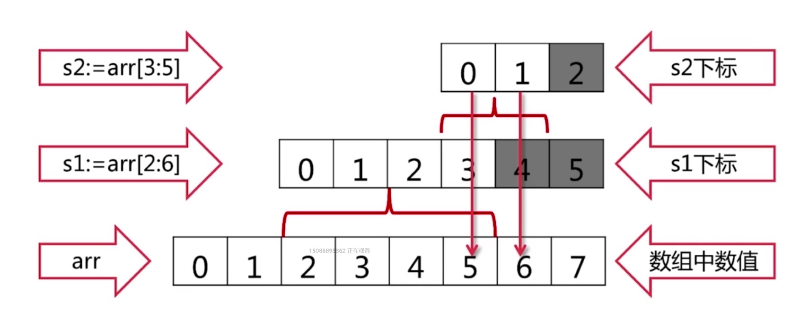
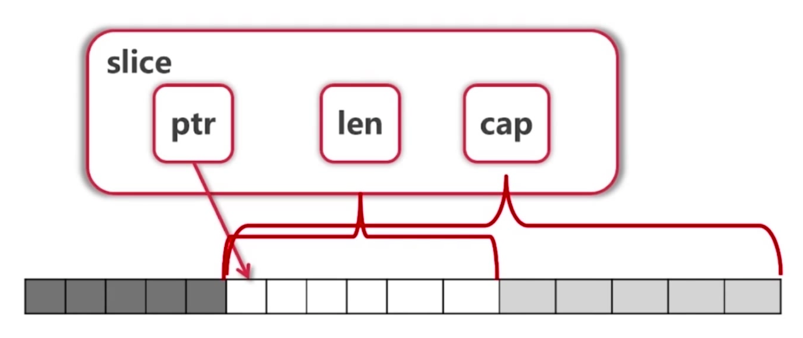

- [运算符和输入输出](#%E8%BF%90%E7%AE%97%E7%AC%A6%E5%92%8C%E8%BE%93%E5%85%A5%E8%BE%93%E5%87%BA)
  - [运算符](#%E8%BF%90%E7%AE%97%E7%AC%A6)
  - [输出](#%E8%BE%93%E5%87%BA)
  - [输入](#%E8%BE%93%E5%85%A5)
- [变量](#%E5%8F%98%E9%87%8F)
  - [定义](#%E5%AE%9A%E4%B9%89)
  - [数据类型](#%E6%95%B0%E6%8D%AE%E7%B1%BB%E5%9E%8B)
  - [类型转换](#%E7%B1%BB%E5%9E%8B%E8%BD%AC%E6%8D%A2)
  - [基本类型和string之间的转换](#%E5%9F%BA%E6%9C%AC%E7%B1%BB%E5%9E%8B%E5%92%8Cstring%E4%B9%8B%E9%97%B4%E7%9A%84%E8%BD%AC%E6%8D%A2)
  - [值类型和引用类型](#%E5%80%BC%E7%B1%BB%E5%9E%8B%E5%92%8C%E5%BC%95%E7%94%A8%E7%B1%BB%E5%9E%8B)
  - [细节](#%E7%BB%86%E8%8A%82)
- [常量](#%E5%B8%B8%E9%87%8F)
  - [定义](#%E5%AE%9A%E4%B9%89-1)
- [程序控制](#%E7%A8%8B%E5%BA%8F%E6%8E%A7%E5%88%B6)
  - [条件语句](#%E6%9D%A1%E4%BB%B6%E8%AF%AD%E5%8F%A5)
    - [if语句](#if%E8%AF%AD%E5%8F%A5)
    - [switch](#switch)
  - [循环语句](#%E5%BE%AA%E7%8E%AF%E8%AF%AD%E5%8F%A5)
    - [细节](#%E7%BB%86%E8%8A%82-1)
  - [标签](#%E6%A0%87%E7%AD%BE)
- [函数](#%E5%87%BD%E6%95%B0)
  - [定义](#%E5%AE%9A%E4%B9%89-2)
  - [参数传递](#%E5%8F%82%E6%95%B0%E4%BC%A0%E9%80%92)
  - [细节](#%E7%BB%86%E8%8A%82-2)
- [指针](#%E6%8C%87%E9%92%88)
- [复杂数据类型](#%E5%A4%8D%E6%9D%82%E6%95%B0%E6%8D%AE%E7%B1%BB%E5%9E%8B)
  - [数组](#%E6%95%B0%E7%BB%84)
  - [Slice切片](#Slice%E5%88%87%E7%89%87)
    - [定义和初始化](#%E5%AE%9A%E4%B9%89%E5%92%8C%E5%88%9D%E5%A7%8B%E5%8C%96)
    - [Array和Slice](#Array%E5%92%8CSlice)
    - [Slice的增删改查等操作](#Slice%E7%9A%84%E5%A2%9E%E5%88%A0%E6%94%B9%E6%9F%A5%E7%AD%89%E6%93%8D%E4%BD%9C)
    - [slice和string](#slice%E5%92%8Cstring)
    - [细节](#%E7%BB%86%E8%8A%82-3)
  - [map](#map)
    - [定义和初始化](#%E5%AE%9A%E4%B9%89%E5%92%8C%E5%88%9D%E5%A7%8B%E5%8C%96-1)
    - [增删改查以及其他](#%E5%A2%9E%E5%88%A0%E6%94%B9%E6%9F%A5%E4%BB%A5%E5%8F%8A%E5%85%B6%E4%BB%96)
  - [细节](#%E7%BB%86%E8%8A%82-4)
- [函数扩展](#%E5%87%BD%E6%95%B0%E6%89%A9%E5%B1%95)
  - [Init函数](#Init%E5%87%BD%E6%95%B0)
  - [匿名函数](#%E5%8C%BF%E5%90%8D%E5%87%BD%E6%95%B0)
  - [闭包](#%E9%97%AD%E5%8C%85)
  - [defer](#defer)
  - [内置函数](#%E5%86%85%E7%BD%AE%E5%87%BD%E6%95%B0)
- [面向对象](#%E9%9D%A2%E5%90%91%E5%AF%B9%E8%B1%A1)
  - [结构体](#%E7%BB%93%E6%9E%84%E4%BD%93)
    - [结构体的定义](#%E7%BB%93%E6%9E%84%E4%BD%93%E7%9A%84%E5%AE%9A%E4%B9%89)
    - [初始化和工厂函数](#%E5%88%9D%E5%A7%8B%E5%8C%96%E5%92%8C%E5%B7%A5%E5%8E%82%E5%87%BD%E6%95%B0)
    - [方法](#%E6%96%B9%E6%B3%95)
  - [封装](#%E5%B0%81%E8%A3%85)
  - [面向接口编程](#%E9%9D%A2%E5%90%91%E6%8E%A5%E5%8F%A3%E7%BC%96%E7%A8%8B)
- [包](#%E5%8C%85)
  - [环境变量](#%E7%8E%AF%E5%A2%83%E5%8F%98%E9%87%8F)
  - [下载包](#%E4%B8%8B%E8%BD%BD%E5%8C%85)
  - [如何扩充系统的类型或者第三方的类型](#%E5%A6%82%E4%BD%95%E6%89%A9%E5%85%85%E7%B3%BB%E7%BB%9F%E7%9A%84%E7%B1%BB%E5%9E%8B%E6%88%96%E8%80%85%E7%AC%AC%E4%B8%89%E6%96%B9%E7%9A%84%E7%B1%BB%E5%9E%8B)
- [错误处理](#%E9%94%99%E8%AF%AF%E5%A4%84%E7%90%86)
# 运算符和输入输出
## 运算符
- `++，--`:只能做单独语句使用
- `>>`:对于无符号数，填充0；对于有符号数，填充符号位
- `&^`:位清空运算符，z=x &^ y真值表如下：  
  |   x   |   y   |   z   |
  | :---: | :---: | :---: |
  |   0   |   0   |   0   |
  |   1   |   0   |   1   |
  |   0   |   1   |   0   |
  |   1   |   1   |   0   |
- `%`:符号由被模数决定
  - 如-5%-3和-5%3的值都是-2
## 输出               
- %T可以用来输出类型
- %c可以用来让byte和int32(rune)类型以字符形式输出
- 浮点：%g，全展开；%e，使用E表示，%f，随缘
- %之后的[1]高数printf函数再次使用第一个操作数
- %之后的#要求%o,%x,%X输出带0,0x,0X

## 输入
1. fmt.Scanln():遇到换行才停止扫描
2. fmt.scanf():按指定的格式将成都读取到的值保存到对应的各个变量
# 变量
## 定义

> [变量定义demo](demo/变量定义.md)
- 不带初始化
- 带初始化
  - golang可以自动推测类型
- 多变量不同类型初始化
- 全局变量初始化

## 数据类型
- 基本数据类型
  - 整型：(u)int,(u)int8,(u)int16,(u)int32,(u)int64,uintptr
  - 布尔类型：bool
  - 字符串行：string
    - 存的是UTF-8编码
    - 获得字节长度：`len()`
    - utf-8字符数：`utf-8.RuneCountInString(s)`
    - 将byte切片转utf-8字符：`utf8.DecodeRune(bytes)`
    - [String的demo](demo/string.md)
  - 字符型：byte,rune
    - byte为1个字节，rune为4个字节，可以将其看成整型
  - 浮点型：float32,float64,complex64,complex128
- 派生/复杂数据类型
  - 指针
  - 数组
  - Slice切片
  - map
  - 结构体struct
  - 管道channel
  - 接口interface

## 类型转换
- go只有强制类型转换，没有隐式类型转换
```go
var a,b int = 3,4
var c int
c = int(math.Sqrt(float64(a*a+b*b)))
```
## 基本类型和string之间的转换
> 基本类型->string
- (推荐)使用`fmt.Sprint("%参数", 表达式)`
- FormatInt，FormatFloat...

> string->基本类型
- (推荐)SScanf
- ParseBool，Parsefloat

## 值类型和引用类型
- 值类型：基本数据类型（int类... 等等），数组和结构体struct
  - 特点：存放在栈中
- 引用类型：指针，slice切片，map，管道chan，interface
  - 特点：变量存储的是一个地址，具体数
## 细节
- rune有符号，与int32一样，可以看做其实就和int32一样。用来表示一个unicode码
- int和uintptr类型由操作系统的位数决定。
- 编译器推断类型的时候，浮点数：float64，整数：int，字符：int32
```go
// res:int,float64,int32
a, b, c := 1, 2.2, 'c'
fmt.Printf("%T,%T,%T", a, b, c)
```
- `go语言的编码统一用utf8，string中存的都是utf8编码`
- bool只允许取true和false
- 单引号，双引号和反引号：
  - 单引号：字符
  - 双引号：会识别转义字符的字符串
  - 反引号：不会发生转义，里面是什么就输出什么
- 字符串不可修改
- 用首字母大小写取本是否对包外可见
- :=简短变量声明，如果左值有多个可以不都是未声明的
- 对于字符串**len返回的是字节数**，可以用`==`和`<`等比较，比较是基于字节的，[i]返回第i个字节，是byte类型的。
- for i >= 0用真对于uint。无符号数往往只有位运算和其他特殊的运算场景才会使用。
- 如果一个变量实现String这个方法，那么fmt.Println默认会调用这个变量的string()进行输出
# 常量
## 定义
- 和变量的定义一样，只是把该写`var`的地方换成了`const`，而且不能用`":"`的方式
- 如果没有给其规定类型，可以作为各种类型使用
- 一般在其他语言中我们用常量会全大写，但是在go中大写首字母有其他的含义。
```go
func test1(a int) {
    fmt.Println(a + 3)
}

func consts() {
    const a = 5
    // 参数需要的是float64
    fmt.Println(math.Sqrt(a))
    // 参数需要的是int
    test1(a)
}

func main() {
    // result:
    // 2.23606797749979
    // 8
    consts()
}
```
- 特殊枚举类型定义，iota的使用
  - 在go里面没有枚举专门的类型，可以用const来替代。
  - 局限：不能产生10的幂，因为go没有幂运算符
  - [常量枚举demo](demo/常量枚举.md)
  - 可以用`"_"`跳过

# 程序控制
## 条件语句
### if语句
- 细节
  - 条件表达式的结果只能是true和false
  - 条件表达式允许像for那样，对变量进行定义或者单纯赋值。如果是定义，那么只在该条件的逻辑块内有效
  - 强制了{}的分布只能一种情况

> 格式
```go
if [定义变量和赋值;]条件表达式1{

}else if [定义变量和赋值;]条件表达式2{

}else{

}
```


> demo
```go
func testif() {
  var a int
    var flag = 1
    // 1. 单纯赋值
  if a = 1; flag == 1 {
    a = 99
    fmt.Println(a)
  } else if b := 3; flag == 2 {
        // 2. 变量定义和赋值
    fmt.Println(b)
  }
  // 3. 错误：
  // fmt.Println(b)
  // 99 print
  fmt.Println(a)
}
func main() {
  testif()
}
```

### switch
- 不用加`break` ，使用 `fallthrough` 后会继续运性行下一个case
- case表达式可以常量,变量，有返回值的函数
- switch后可以不带表达式，这样就类似于if...else的使用，带表达式的一般用于=的关系，而不带的可以用在< 和 >这种关系。
- TypeSwitch：switch语句还可用于type-switch来判断某个interface变量中实际指向的变量类型。
- [switch使用demo](demo/switch的使用.md)

> 格式
```go
switch [赋值语句;表达式]{
    case 表达式1:
        语句块
    case 表达式2:
        语句块
    default:
        语句块
}
```

## 循环语句
- 不需要括号
- 没有while

> 格式

- 写法1
```go
for 初始化;循环条件;循环迭代{
    语句块
}
```

- 写法2（相当于while)
```go
for 循环条件{
    语句块
}
```

- 写法3（配合break）
```go
for{

}
```
- 写法4(用于遍历一些容器)
```go
// 数组
for index,val := range array{

}
```
### 细节
- 中文就不能用`for i:=0;i<len();i++`来遍历字符串，只能使用`for i,vrange str`,v是int32类型的。
  ```go
  // int32
  a:=林
  for _, v := range a {
    fmt.Printf("%T", v)
  }
  ```
  - 如果非要使用那种模式，可以用以下代码
  ```go
  // res:一二三四五六七
  a := "一二三四五六七"
  sSlice := []rune(a)
  for i := 0; i < len(sSlice); i++ {
    fmt.Printf("%c", sSlice[i])
  }
  ```
- - 在for中使用闭包和defer等的时候要注意，循环体变量一直在变，不能简单将循环体变量进行闭包。
## 标签
- break
  - break可以加标签，可以break出多重for
- continue
  - 与常规类似
- goto
  - 不止可以用在for中，常用在if判断错误处理语句块中
> [标签demo](demo/标签.md)

# 函数
## 定义

> 格式
- 写法1
```go
func 函数名(aname1[,aname2...] 类型a, bname1[,bname2...]类型b)(返回值类型列表){

}
```
- 写法2（可变参数）
```go
// 1. 一般情况”类型“用的是interface
func 函数名(变量名 ... 类型){
}
```
## 参数传递
- go语言只有值传递一种

## 细节
- 返回值可以多个，`"_"`可以用来接收return
- 支持可变参数
- 不支持重载
  - 因为golang支持可变参数，还有空接口，以另外的形式实现相同的功能
- 支持函数返回值命名，但是不要乱用，一般只用于函数体比较短的
- 基本数据类型和数组等都是值传递，在func内修改，对元数据不影响。如果希望修改，传入变量的地址&，函数内以指针进行操作。
- golang中返回 局部变量的地址 也是安全的
  - 因为有指针p引用这变量,编译器编译时会检查
```go
var p = f()
func f() *int{
  v:=1
  return &v
}
```
- go没有默认参数值，也没有通过参数名指定形参，故`参数名对于调用者没有意义`
- 如果遇到没有函数体的函数声明，说明该函数不是Go实现的
  - 如`func Sin(x float64)float`
# 指针
- go的指针很简单
- 指针不能运算

# 复杂数据类型
## 数组
- 零值：数组的零值就是所有内部元素的零值
- 值类型
- 比较：只可以用==在相同的数组类型间比较
- [10]int和[20]int是不同的类型
- 数组是值类型：调用`func f(arr [10]int)`会拷贝数组
- golang中一般不用数组，而是用切片
- [数组使用demo](demo/Array.md)
  - 定义
  - 初始化
  - 遍历

## Slice切片
- [Slice使用demo](demo/Slice.md)
### 定义和初始化
  1. 从数组转切片
  2. 使用`make`
  3. `[]T` 一步到位
> 格式
- 写法1
  - `a[:]` 数组转切片
  - slice的底层指向的是数组a，slice中元素修改，a也修改
```go
var a = [...]int{0,1，2,3,4}
var s1 = a[1,3]
var s2 = a[:]
```
- 写法2
  - make([]T,len,cap)

```go
var s []int // nil
s = make([]int, 4)
```
- 写法3
  
```go
var s = []int{1,3,5}
```

### Array和Slice
- array切片
  - array 转为 slice
- slice修改对Array的影响
  - 如果在没有对slice进行append导致底层扩容的话，slice修改，array也会修改

### Slice的增删改查等操作
- reslice
  - 可以对Slice再进行slice
- slice的扩展
  - 切片可以向后扩展，这取决于cap
- slice的动态追加
  - 使用`append`可以追加多个元素，也可以直接追加一个slice
  - 追加可能导致底层扩容，扩容后不再指向原来的地址块，在对Array的基础上进行获取Slice的时候要小心这一点。
  - 使用append之后原来的slice无变化，所以要赋值。
  - cap每次的增长方式就是×2
- slice的容量长度获取
  - 使用cap和len
- slice的遍历
  - 和array一样
- slice copy
  - 不会扩容，容量有多大就拷贝装多大。
- slice的元素删除
  - 利用reslice和append，进行拼凑。支持从头，从中间，从末尾的删除

### slice和string
- 转换可以有两种类型，一种是rune类型一种是byte类型
  - rune：针对有中文的
  - byte：纯英文，`arr = []byte(str)`
- string可以转slice：转换后底层已经重新分配了一块内存
```go
arr = []rune(str)
arr[0] = "北"
str  = string(arr)
```

### 细节
- 零值：nil
- 引用类型
- 比较：slice不能进行比较，但是对于`[]byte`有`bytes.Equal`函数来判断。slice唯一合法的比较是和nil比较，一个nil值的slice，len和cap都为0，但是len和cap都为0的不一定是nil，如`[]int{},make([]int,3)[3:]`
- 可以用`[]int(nil)`类型转换表达式生成一个对应类型slice的nil值
- 判断slice是否为空
  - 正确：`len(slice) == 0`
  - 错误：`slice == nil`
- `x[m:n]`对于字符串生成一个新字符串；而对于[]byte和array生成的slice共享底层。
- slice可以向后扩展，但是不可以向前扩展，向后扩展取决于cap，如果切片超出cap将产生panic.
```go
var a = [...]int{0, 1, 2, 3, 4, 5, 6, 7}
s1 := a[2:6]
s2 := s1[3:5]
// Result：
// s1 =  [2 3 4 5]
// s2 =  [5 6]
```
<div align="center">

</div>

- slice可以看成是对底层array的一个view
- slice还可以继续切片
- slice的零值为nil。当定义了没有初始化和make的时候，这个时候的slice变量的值就是nil。
- slice内部实现，其底层有ptr，len，cap，如下图所示
<div align="center">

</div>

## map
### 定义和初始化
- 写法1
  - make可以指定size，也可以不要
```go
var a map[T1]T2
a = make(map[T1]T2)
```
- 写法2
  - 每一对key-value后都要加`","`
```go
a := map[T1]T2{
  ...
}
```
### 增删改查以及其他
- 增：a[]=...
  - 会自动扩容
- 删：delete(a,"key")
  - 不存在key也不会报错
  - 删除所有元素的方法：
    1. 遍历后delete
    2. make另一个，原来的交给gc
- 改：a[]=...
- 查：val,ok := a["no2]
  - 判断ok，true表示存在,不存在val返回0值
- 遍历：
  - `for key,value := range a`
- 长度：`len()`
- 
```go
func main() {
  a := map[string]string{
    "lin": "linkkk",
  }
  if _, ok := a["lin1"]; !ok {
    fmt.Println("不存在")
    goto END
  }
  fmt.Println(a["lin1"])
END:
  fmt.Println("done")
}
```
## 细节
- 零值：nil
- 引用类型
- 比较：map之间不能比较，只能与nil比较
- 只有对nil进行增加数据会panic，其他都是安全的
- key必须是支持`==`的类型，不能是map，slice，func。可以是结构体，只要不包含以上三种就可以了
- map中的元素不是一个变量，不能取地址，因为map可能随时扩容。
  - 错误：&a["11"]


# 函数扩展
- Init函数
- 匿名函数
- 闭包
- defer
- 内置函数
## Init函数
> 介绍  

每一个源文件可以有多个，完成初始化操作工作，同一个包中的init的调用顺序没有明确规定，不同包是根据依赖关系的顺序的（深度优先）

> 格式
```go
func Init(){
}
```

## 匿名函数
> 介绍

在只想用一次或懒得专门起名时使用
> 使用方式：
1. 直接用
  ```go
  res:=func(n1,n2 int)int{
    return n1-n2
  }(10,20)
  ```
2. 赋值给变量
  ```go
    a:=func(n1,n2,int)int{
      return n1 - n2
    }
    res := a(10,20)
  ```
3. 全局匿名函数
  ```go
  var(
    f1 = func(n1,n2 int)int{
      ...
    }
  )
  ```

## 闭包
> 介绍  

类似一个穿着花哨的c++中带有静态变量的函数

> 用途

有些变量不想每次调用都传输（eg：文件扩展名）

> 例子
```go
func demo1(a int) func(int) int {
  var astatic = a
  return func(b int) int {
    astatic += b
    return astatic
  }
}
func main() {
  f1 := demo1(10)
  fmt.Println(f1(3)) //13
  fmt.Println(f1(2)) //15

}
```
> 细节
- 闭包中的变量和函数定义外的变量有着相同地址，也就是同一个。

## defer
> 介绍

可以在函数执行后，return之前执行
> 细节

- 执行是按先defer的先执行，栈的方式。
- defer也会因为不及时而带来麻烦，如文件描述符耗尽
  - 解决：用函数进行包装。go圣经p154
- 异常处理
> 用途

1. 及时关闭资源
2. 观察函数返回值；defer语句中的函数会在return语句更新返回变量后再执行

## 内置函数
- len
- cap
- new
- make

> 关于new和make
- new：分配值类型的内存
- make：分配引用类型的内存


# 面向对象
- go语言仅支持封装，不支持继承和多态，继承和多态在go中是通过接口实现的
- 没有class，只有struct
- 不论是地址还是结构本身，一律使用`"."`来访问成员
## 结构体
### 结构体的定义
```go
type student struct{
  Name string
  Score float64
}
```
### 初始化和工厂函数
当需要对结构体进行构造的时候，可以直接对其各个元素进行初始化，如果想要有更多的控制，可以自定义工厂函数。
- 注意：工厂函数返回了局部变量的地址，这里在go是允许的，其变量由编译器定夺在哪里分配内存空间，这里是分配在堆上。
```go
func CreateStudent(n string, s float64) *Student {
  return &Student{Name: n, Score: s}
}

func demo1() {
  // 1.初始化1，指定元素赋值
  aStudent := Student{
    Name: "linkkkk",
  }
  // 2.初始化2，直接元素为空
  bStudent := Student{}
  // 3.初始化3，顺序赋值
  cStudent := Student{"lin", 99}
  // 错误
  // cStudent := Student{"lin"}
  // 4.工厂函数
  dStudent := CreateStudent("test", 100)
  fmt.Println("aStudent:", aStudent)
  fmt.Println("bStudent:", bStudent)
  fmt.Println("cStudent:", cStudent)
  fmt.Println("dStudent:", dStudent)
}
```

### 方法 
- 只有使用指针才能够改变结构的内容。
- nil指针也可以调用方法
- 没有this指针，而是引入了接收者的概念
> 实例
```go
func (sp *Student) print() {
  fmt.Println(sp)
}
```
- 这里sp是方法的接收者，这里是指针接收者，其实从某种意义上来说等同于`print(sp *Student)` 这样的函数。

> 值接受者和指针接收者
- 值接收者是go语言特有的
- 值/指针接收者均可以接收值/指针，这里其实是一种语法糖
  - 注：也就是说现在定义的方法的接收者是结构体指针，但是可以用结构体来调用。

有时候我们不知道到底该用的是值接收者还是指针接收者，可以从以下角度思考：
- 要改变内容必须要用指针接收者
- 结构过大也要考虑指针接收者
- 一致性：如果有指針接收者，最好都是指針接收者

## 封装
- 使用结构体进行封装，使用驼峰法命名
- 首字母大写：public
- 首字母小写：private
- public和private是针对包而言的

## 面向接口编程
- 由使用者来定义接口

# 包
- import可以一次引入多个
- package表示这个源文件归属哪个包
- 每个目录只能有一个包
- main包 包含了可执行的入口，里 面有一个main函数
- 为结构体定义的方法必须放在同一个包里，但是可以是不同的文件

## 环境变量
- GOPATH：所有 的第三方库和自己的项目都放在GOPATH下
- GOROOT：Go语言自己的包都放在了这里，这里也是安装go的地方
- 当我们编译的时候，用到了一些包都会从GOPATH和GOROOT中去寻找

## 下载包
- 使用go get去拉取包
- 很多时候我们都拉不到包，因为有墙
  - 可以使用代理，加上以下两句到环境变量中，然后直接get
  ```
  export GO111MODULE=on
  export GOPROXY=https://mirrors.aliyun.com/goproxy/ 
  ```
  - 可以使用gopm

## 如何扩充系统的类型或者第三方的类型
- 定义别名
- 使用组合
> 组合方式

```go
type myStydebt struct {
  sp *Student
}

func (msp *myStydebt) myprint() {
  if(msp == nil){
    println("为空")
  }
  fmt.Println("l1nkkk:",*msp)
}
```
> 使用别名

```go
type queue []int
// 1.必须要是指针，不然该切片在函数return后将不会发生变化
func (q *queue) push(a int) {
  *q = append(*q, a)
}

func (*q queue) String() string {
  var res string
  for _, v := range *q {
    res = res + strconv.FormatInt(int64(v), 10) + " "
  }
  return "l1nkkk:" + res
}

func demo1() {
  var q queue
  q.push(1)
  fmt.Println(&q)
}

func main() {
  demo1()
}
```

# 错误处理 