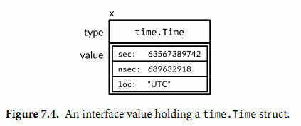
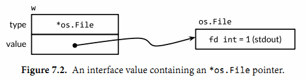

- [运算符和输入输出](#运算符和输入输出)
  - [运算符](#运算符)
  - [输出](#输出)
  - [输入](#输入)
- [变量](#变量)
  - [定义](#定义)
  - [数据类型](#数据类型)
    - [自定义数据类型](#自定义数据类型)
  - [类型转换](#类型转换)
  - [基本类型和string之间的转换](#基本类型和string之间的转换)
  - [值类型和引用类型](#值类型和引用类型)
  - [指针](#指针)
  - [细节](#细节)
- [常量](#常量)
  - [定义](#定义-1)
- [程序控制](#程序控制)
  - [条件语句](#条件语句)
    - [if语句](#if语句)
    - [switch](#switch)
  - [循环语句](#循环语句)
    - [细节](#细节-1)
  - [标签](#标签)
- [函数](#函数)
  - [定义](#定义-2)
  - [参数传递](#参数传递)
  - [细节（在方法中都基本适用）](#细节在方法中都基本适用)
  - [函数扩展](#函数扩展)
    - [Init函数](#init函数)
    - [匿名函数](#匿名函数)
    - [闭包](#闭包)
    - [defer](#defer)
    - [内置函数](#内置函数)
- [复杂数据类型](#复杂数据类型)
  - [数组](#数组)
  - [Slice切片](#slice切片)
    - [定义和初始化](#定义和初始化)
    - [Array和Slice](#array和slice)
    - [Slice的增删改查等操作](#slice的增删改查等操作)
    - [slice和string](#slice和string)
    - [细节](#细节-2)
  - [map](#map)
    - [定义和初始化](#定义和初始化-1)
    - [增删改查以及其他](#增删改查以及其他)
    - [集合set](#集合set)
    - [细节](#细节-3)
- [面向对象](#面向对象)
  - [结构体](#结构体)
    - [结构体的定义](#结构体的定义)
    - [封装](#封装)
    - [初始化和工厂函数](#初始化和工厂函数)
  - [方法](#方法)
    - [值接收者和指针接收者](#值接收者和指针接收者)
    - [方法值和方法表达式](#方法值和方法表达式)
    - [has a：嵌套结构体获取方法](#has-a嵌套结构体获取方法)
  - [接口](#接口)
    - [方法集](#方法集)
    - [接口值](#接口值)
    - [类型断言(显示转换)](#类型断言显示转换)
    - [动态绑定特性（重要）](#动态绑定特性重要)
- [包](#包)
  - [环境变量](#环境变量)
  - [main程序运行过程](#main程序运行过程)
  - [下载包](#下载包)
  - [如何扩充系统的类型或者第三方的类型](#如何扩充系统的类型或者第三方的类型)
- [错误与异常](#错误与异常)
  - [错误](#错误)
    - [错误处理](#错误处理)
  - [异常](#异常)
    - [异常处理](#异常处理)
- [工具](#工具)
- [底层](#底层)
  - [动态栈](#动态栈)
- [其他](#其他)
  - [随机数](#随机数)
  - [命令行参数](#命令行参数)
  - [判断某接口是否有某方法](#判断某接口是否有某方法)
  - [打印堆栈信息](#打印堆栈信息)
# 运算符和输入输出
## 运算符
- `++，--`: 只能做单独语句使用，**没有前置`++`**
- `>>`: 对于无符号数，填充0；对于有符号数，填充符号位
- `&^`: 位清空运算符，z=x &^ y真值表如下：  
  |   x   |   y   |   z   |
  | :---: | :---: | :---: |
  |   0   |   0   |   0   |
  |   1   |   0   |   1   |
  |   0   |   1   |   0   |
  |   1   |   1   |   0   |
- `%`: 符号由被模数决定
  - 如`-5%-3`和`-5%3`的值都是-2
## 输出               
- %T可以用来输出类型
- %c可以用来让byte和int32(rune)类型以字符形式输出
- 浮点：%g，全展开；%e，使用E表示，%f，随缘
- %之后的`[1]`告诉printf函数再次使用第一个操作数
- %之后的#要求%o,%x,%X输出带0,0x,0X
- %v：值的默认格式表示
- %+v：类似%v，但输出结构体时会添加字段名
- %#v：值的Go语法表示

## 输入
1. fmt.Scanln():遇到换行才停止扫描
2. fmt.scanf():按指定的格式将成都读取到的值保存到对应的各个变量
# 变量
## 定义

> [变量定义demo](demo/变量定义.md)
- 不带初始化
- 带初始化
  - golang可以自动推测类型
- 多变量不同类型初始化
- 全局变量初始化

## 数据类型
- 基本数据类型
  - 整型：(u)int,(u)int8,(u)int16,(u)int32,(u)int64,uintptr
  - 布尔类型：bool
    - bool只允许取true和false
  - 字符串行：string
    - 存的是UTF-8编码
    - 获得字节长度：`len()`，对于字符串**len返回的是字节数**，可以用`==`和`<`等比较，比较是基于字节的，[i]返回第i个字节，是byte类型的。
    - utf-8字符数：`utf8.RuneCountInString(s)`
    - 将byte切片(utf-8)转rune(unicode)：`utf8.DecodeRune(bytes)`。如果遇到错误的UTF-8编码
    - 将string(utf-8)转rune(unicode)：`utf8.DecodeRuneInString(bytes)`。如果遇到错误的UTF-8编码
      - 如果解析错误，将生成一个特殊的unicode:`\uFFFD`
    - 字符串不可修改    
    - [String的demo](demo/string.md)
  - 字符型：byte,rune
    - byte为1个字节，rune为4个字节，可以将其看成整型
  - 浮点型：float32,float64,complex64,complex128
- 派生/复杂数据类型
  - 指针
  - 数组
  - Slice切片
  - map
  - 结构体struct
  - 管道channel
  - 接口interface

### 自定义数据类型
- `type myuser int`：自定义后两者不能直接赋值，需要显示转换。相当于另起一种类型了。
- `type myuser = int` : 相当于c++ typedef(go 1.9 type alias)

## 类型转换
- go只有强制类型转换，没有隐式类型转换
```go
var a,b int = 3,4
var c int
c = int(math.Sqrt(float64(a*a+b*b)))
```
## 基本类型和string之间的转换
> 基本类型->string
- (推荐)使用`fmt.Sprint("%参数", 表达式)`
- FormatInt，FormatFloat...

> string->基本类型
- (推荐)SScanf
- ParseBool，Parsefloat

## 值类型和引用类型
- 值类型：基本数据类型（int类... 等等），数组和结构体struct
  - 特点：存放在栈中
- 引用类型：指针，slice切片，map，管道chan，interface
  - 特点：变量存储的是一个地址，具体数

## 指针
- go的指针很简单
- 指针不能运算

## 细节
> uintptr
- 为整型，没指定具体的位数大小，但是足以容纳指针，主要用于底层编程

> rune
- rune有符号，与int32一样，可以看做其实就和int32一样。用来表示一个unicode码
  - `fmt.Printf("%T", r)` 时，显示 int32。
  - `rune` 为 `int32` 的type alias，是通过 `type rune = int32` 方式定义的
- `string => []rune` 的过程中，底层执行 `utf-8 => unicode`
  - `runeStr :=[]rune(str)`

> 两种位数不确定的类型
- int和uintptr类型由**操作系统的位数**决定。

> 编译器类型推断
- 编译器推断类型的时候，浮点数：float64，整数：int，**字符：int32**
```go
// res:int,float64,int32
a, b, c := 1, 2.2, 'c'
fmt.Printf("%T,%T,%T", a, b, c)
```

> golang 字符编码是统一的
- `go语言的编码统一用utf8，string中存的都是utf8编码`
- utf-8 有着错误不扩散的特性

> 字符/字符串字面值表示形式
- 单引号，双引号和反引号：
  - 单引号：字符
  - 双引号：会识别转义字符的字符串
  - 反引号：不会发生转义，里面是什么就输出什么
> 变量名蕴含作用域
- 用首字母大小写区分是否对包外可见

> 关于`:=`
- :=简短变量声明，如果左值有多个可以不都是未声明的
- 在同一个语句块时，如果变量声明过的，相当于赋值。
- **不在同一个语句块时，相当于重新定义一个变量**
  - 需要特别注意
```go
var a int
if a := 3; true{
    fmt.Printf("In if:%#x\n", &a)
}
fmt.Printf("Out if:%#x\n", &a)
```
```
In if:0xc00010c008
Out if:0xc00010c000
```

```go
func main(){
	//test.CopyFile()
	var a int
	fmt.Println("Before := &a:",&a)
	a,b := 3,4
	fmt.Println("&a:",&a)
	fmt.Println("&b:",&b)
}
```
```
Before := &a: 0xc0000b6010
&a: 0xc0000b6010
&b: 0xc0000b6018
```


> 关于无符号数注意点
- for i >= 0永真，对于uint。无符号数往往只有位运算和其他特殊的运算场景才会使用。

> 变量实现String接口
- 如果一个变量实现String这个方法，那么fmt.Println默认会调用这个变量的string()进行输出


> 变量的字节数
- 获取变量的字节数：`unsafe.Sizeof(n1)`

> 栈 or 堆 分配
- 编译器会自动选择在堆上还是栈上分配局部变量的存储空间。但是，这个选择不是取决于用var还是new声明变量的方式决定的。
- 在使用 GO 的时候，要弱化这种概念。C++要强化这种概念

> 元组赋值
- x,y = y,x
# 常量
## 定义
- 一个常量初始化可以被这些函数的返回值初始化：`len,cap,real,imag,complex,unsafe.Sizeof`
- 和变量的定义一样，只是把该写`var`的地方换成了`const`，而且不能用`":"`的方式
- 如果没有给其规定类型，可以作为各种类型使用
- 一般在其他语言中我们用常量会全大写，但是在go中大写首字母有其他的含义。
```go
func test1(a int) {
    fmt.Println(a + 3)
}

func consts() {
    const a = 5
    // 参数需要的是float64
    fmt.Println(math.Sqrt(a))
    // 参数需要的是int
    test1(a)
}

func main() {
    // result:
    // 2.23606797749979
    // 8
    consts()
}
```
- 特殊枚举类型定义，iota的使用
  - 在go里面没有枚举专门的类型，可以用const来替代。
  - 局限：不能产生10的幂，因为go没有幂运算符
  - [常量枚举demo](demo/常量枚举.md)
  - 可以用`"_"`跳过

# 程序控制
## 条件语句
### if语句
- 细节
  - 条件表达式的结果只能是true和false
  - 条件表达式允许像for那样，对变量进行定义或者单纯赋值。如果是定义，那么只在该条件的逻辑块内有效
  - 强制了{}的分布只能一种情况

> 格式
```go
if [定义变量和赋值;]条件表达式1{

}else if [定义变量和赋值;]条件表达式2{

}else{

}
```


> demo
```go
func testif() {
  var a int
  var flag = 1
    // 1. 单纯赋值
  if a = 1; flag == 1 {
    a = 99
    fmt.Println(a)
  } else if b := 3; flag == 2 {
        // 2. 变量定义和赋值
    fmt.Println(b)
  }
  // 3. 错误：
  // fmt.Println(b)
  // 99 print
  fmt.Println(a)
}
func main() {
  testif()
}
```

### switch
- 不用加`break` ，使用 `fallthrough` 后会继续运性行下一个case
- case表达式可以常量,变量，有返回值的函数
- switch后可以不带表达式，这样就类似于if...else的使用，带表达式的一般用于=的关系，而不带的可以用在< 和 >这种关系。
- `TypeSwitch`：switch语句还可用于type-switch来判断某个interface变量中实际指向的变量类型。
- [switch使用demo](demo/switch的使用.md)

> 格式
```go
switch [赋值语句;表达式]{
    case 表达式1:
        语句块
    case 表达式2:
        语句块
    default:
        语句块
}
```

## 循环语句
- 不需要括号
- 没有while

> 格式

- 写法1
```go
for 初始化;循环条件;循环迭代{
    语句块
}
```

- 写法2（相当于while)
```go
for 循环条件{
    语句块
}
```

- 写法3（配合break）
```go
for{

}
```
- 写法4(用于遍历一些容器)
```go
// 数组
for index,val := range array{

}
```
### 细节
- 中文就不能用`for i:=0;i<len();i++`来遍历字符串，只能使用`for i,v range str`,v是int32类型的。
  - 另外`for i,v range []byte(str)` 来实现字节迭代
  ```go
  // int32
  a:=林
  for _, v := range a {
    fmt.Printf("%T", v)
  }
  ```
  - 如果非要使用那种模式，可以用以下代码
  ```go
  // res:一二三四五六七
  a := "一二三四五六七"
  sSlice := []rune(a)
  for i := 0; i < len(sSlice); i++ {
    fmt.Printf("%c", sSlice[i])
  }
  ```
- **在for中使用闭包和defer等的时候要注意，循环体变量一直在变，不能简单将循环体变量进行闭包。**
## 标签
- break
  - break可以加标签，可以break出多重for
- continue
  - 与常规类似
- goto
  - 不止可以用在for中，常用在if判断错误处理语句块中
> [标签demo](demo/标签.md)

# 函数
- 类型：引用类型
- 比较：只可以与nil比较
- 零值：nil
## 定义

> 格式
- 写法1
```go
func 函数名(aname1[,aname2...] 类型a, bname1[,bname2...]类型b)(返回值类型列表){

}
```
- 写法2（可变参数）
```go
// 1. 一般情况”类型“用的是interface
func 函数名(变量名 ... 类型){
}
```
## 参数传递
- **go语言只有值传递一种**
  - 指针、Slice、Map、Channel这些的传递，也**只是通过其本身数据结构特性**，另其传递时，**看似引用**
  - https://segmentfault.com/a/1190000015246182

## 细节（在方法中都基本适用）
- 返回值可以多个，`"_"`可以用来接收return
- 支持可变参数
- 不支持重载
  - 因为golang支持可变参数，还有空接口，以另外的形式实现相同的功能
- 支持函数返回值命名，但是不要乱用，**一般只用于函数体比较短的**
  - **返回值有命名，可以通过 `defer` 语句在 `return` 语句之后修改返回值**
- 基本数据类型和数组等都是值传递，在func内修改，对元数据不影响。如果希望修改，传入变量的地址&，函数内以指针进行操作。
- 多个变量 同一变量类型的时候，可以只用一个变量类型
  - `func f(a,b int)`
- golang中返回 局部变量的地址 也是安全的
  - 因为有指针p引用这变量,编译器编译时会检查
```go
var p = f()
func f() *int{
  v:=1
  return &v
}
```
- go没有默认参数值，也没有通过参数名指定形参，故**参数名对于调用者没有意义**
- 如果遇到没有函数体的函数声明，说明该函数不是Go实现的
  - 如`func Sin(x float64)float`

- **调用者是否解包可变参数会导致不同的结果**
  - 第一个 `print` 等价于 `print([]interface{}{123, "abc"})`
  - 第二个 `print` 等价于 `print(123, "abc")`
```go
// 相当于再封了一层切片
func print(a ...interface{}) {
	fmt.Println(a...)
}

func main() {
	var input = []interface{}{123, "abc"}

  // 重点：未解包。[123 abc]
  print(input)
  // 重点：解包。123 abc
  print(input...)
}
```

## 函数扩展
- Init函数
- 匿名函数
- 闭包
- defer
- 内置函数
### Init函数
> 介绍  

每一个源文件可以有多个，完成初始化操作工作，同一个包中的init的调用顺序没有明确规定，不同包是根据依赖关系的顺序的（深度优先）

> 格式
```go
func Init(){
}
```

### 匿名函数
> 介绍

在只想用一次或懒得专门起名时使用
> 使用方式：
1. 直接用
  ```go
  res:=func(n1,n2 int)int{
    return n1-n2
  }(10,20)
  ```
2. 赋值给变量
  ```go
    a:=func(n1,n2,int)int{
      return n1 - n2
    }
    res := a(10,20)
  ```
3. 全局匿名函数
  ```go
  var(
    f1 = func(n1,n2 int)int{
      ...
    }
  )
  ```

### 闭包
> 介绍  

- 使用函数范围外的变量
- 除了**闭包函数以引⽤的⽅式**对外部变量访问之外，其它赋值和函数传参数都是以**传值的⽅式**处理
> 用途

有些变量不想每次调用都传输（eg：文件扩展名）

> 例子
```go
func demo1(a int) func(int) int {
  var astatic = a
  return func(b int) int {
    astatic += b
    return astatic
  }
}
func main() {
  f1 := demo1(10)
  fmt.Println(f1(3)) //13
  fmt.Println(f1(2)) //15

}
```
> 细节
- **闭包中的变量和函数定义外的变量有着相同地址，也就是同一个**。

### defer
> 介绍

可以在函数执行后，return之前执行
> 细节

- 执行是按先defer的慢执行，栈的方式。
- defer也会因为不及时而带来麻烦，如文件描述符耗尽
  - 解决：用函数进行包装。go圣经p154
- 异常处理
- 将`defer file.close()`放在错误检测之后
> 用途
1. 及时关闭资源
2. 处理异常

> 注意：修改返回值的情况
- [defer修改返回值demo](demo/defer修改返回值.md)
- 如果有对 返回值命名的话，那么修改返回值是有效的
  - 因此在处理panic时，修改err，需要err是 命名的返回值


### 内置函数
- len
- cap
- new
- make

> 关于new和make
- new：分配值类型的内存
- make：分配引用类型的内存


# 复杂数据类型
## 数组
- 零值：数组的零值就是所有内部元素的零值
- 类型：值类型
  - [10]int和[20]int是不同的类型
  - 数组是值类型：调用`func f(arr [10]int)`会拷贝数组
- 比较：只可以用==在相同的数组类型间比较
- golang中一般不用数组，而是用切片
- [数组使用demo](demo/Array.md)
  - 定义
  - 初始化
  - 遍历

## Slice切片
- [Slice使用demo](demo/Slice.md)
### 定义和初始化
  1. 从数组转切片
  2. 使用`make`
  3. `[]T` 一步到位
> 格式
- 写法1
  - `a[:]` 数组转切片
  - **slice的底层指向的是数组a，slice中元素修改，a也修改**
```go
var a = [...]int{0,1，2,3,4}
var s1 = a[1,3]
var s2 = a[:]
```
- 写法2
  - make([]T,len,cap)

```go
var s []int // nil
s = make([]int, 4)
```
- 写法3
  
```go
var s = []int{1,3,5}
```

### Array和Slice
- array切片
  - array 转为 slice
- slice修改对Array的影响
  - **如果在没有对slice进行append导致底层扩容的话，slice修改，array也会修改**


### Slice的增删改查等操作
- reslice
  - 可以对Slice再进行slice
- slice的扩展
  - 切片可以向后扩展，这取决于cap
- slice的动态追加
  - 使用`append`可以追加多个元素，也可以直接追加一个slice
  - 追加可能导致底层扩容，扩容后不再指向原来的地址块，在对Array的基础上进行获取Slice的时候要小心这一点。
  - 使用append之后原来的slice无变化，所以要赋值。
  - cap每次的增长方式就是×2
- slice的容量长度获取
  - 使用cap和len
- slice的遍历
  - 和array一样
- slice copy
  - 不会扩容，容量有多大就拷贝装多大。
- slice的元素删除
  - 利用reslice和append，进行拼凑。支持从头，从中间，从末尾的删除

### slice和string
- 转换可以有两种类型，一种是rune类型一种是byte类型
  - rune：针对有中文的
  - byte：纯英文，`arr = []byte(str)`
- string可以转slice：转换后底层已经重新分配了一块内存，并且进行`utf-8`和`unicode`之间的转换
```go
arr = []rune(str)
arr[0] = "北"
str  = string(arr)
```

### 细节
- 零值：nil
- 类型：引用类型
- 比较：slice不能进行比较，但是对于`[]byte`有`bytes.Equal`函数来判断。
  - **slice唯一合法的比较是和nil比较，一个nil值的slice，len和cap都为0，但是len和cap都为0的不一定是nil**，如`[]int{},make([]int,3)[3:]`
  - 可以用`[]int(nil)`类型转换表达式生成一个对应类型slice的nil值
- 判断slice是否为空
  - 正确：`len(slice) == 0`
  - 错误：`slice == nil`
- `x[m:n]` 对于字符串生成一个新字符串；而对于[]byte和array生成的slice共享底层。
- slice 可以向后扩展，但是不可以向前扩展，向后扩展取决于cap，如果切片超出cap将产生 panic.

> array/slice 与slice
```go
// 换成切片，结果不变
var a = [...]int{0, 1, 2, 3, 4, 5, 6, 7}
s1 := a[2:6]
s2 := s1[3:5]
// Result：
// s1 =  [2 3 4 5]
// s2 =  [5 6]
```
<div align="center" style="zoom: 40%">

</div>

- slice可以看成是对底层array的一个view
- slice还可以继续切片
- slice的零值为nil。当定义了没有初始化和make的时候，这个时候的slice变量的值就是nil。
- slice内部实现，其底层有ptr，len，cap，如下图所示
<div align="center" style="zoom: 60%">

</div>

## map
### 定义和初始化
- 写法1
  - make可以指定size，也可以不要
```go
var a map[T1]T2
a = make(map[T1]T2)
```
- 写法2
  - 每一对key-value后都要加`","`
```go
a := map[T1]T2{
  ...
}
```
### 增删改查以及其他
- 增：a[]=...
  - 会自动扩容
- 删：delete(a,"key")
  - 不存在key也不会报错
  - 删除所有元素的方法：
    1. 遍历后delete
    2. make另一个，原来的交给gc
- 改：a[]=...
- 查：
  - `val,ok := a["no2"]`
    - 判断ok，true表示存在,不存在val返回0值
  - `val := a["no2"]`
    - 不存在val 为 nil
- 遍历：
  - `for key,value := range a`
- 长度：`len()`
```go
func main() {
  a := map[string]string{
    "lin": "linkkk",
  }
  if _, ok := a["lin1"]; !ok {
    fmt.Println("不存在")
    goto END
  }
  fmt.Println(a["lin1"])
END:
  fmt.Println("done")
}
```

### 集合set
- set：`map[type]bool`
### 细节
- 零值：nil
- 类型：引用类型
- 比较：map之间不能比较，只能与nil比较
- 只有对nil进行增加数据会panic，其他都是安全的
- key必须是支持`==`的类型，不能是map，slice，func。可以是结构体，只要不包含以上三种就可以了
- map中的元素不是一个变量，不能取地址，因为map可能随时扩容。
  - 错误：&a["11"]


# 面向对象
- 面向对象三要素
  - 继承：通过嵌套
  - 封装：struct
  - 多态：interface
- 不论是地址还是结构本身，一律使用`"."`来访问成员
## 结构体
- 零值：结构体的所有字段都为零值
- 类型：值类型


### 结构体的定义
```go
type student struct{
  Name string
  Score float64
}
```
### 封装
> 方式
- 使用结构体进行封装，使用驼峰法命名
- 首字母大写：public
- 首字母小写：private
- 结构体字段的 public和private是**针对包而言的**

> demo：为什么对单个对象用struct进行包装
- 为了更细粒度的封装
- 对比下面的两种方式
  - 方式1：包外用户可以对IntSet直接操作
  - 方式2：封装，更好的隔离。包外并不可见细节
- 我的理解：一般都是包外用户使用时，不让其知道细节就够了，因为自己开发的包，自己知道哪些对象不要直接修改
```go
type IntSet []uint64

func (s *IntSet) Get(x int) uint64 {
	return (*s)[x]
}

type IntsetStruct struct {
	intSet []uint64
}

func (s *IntsetStruct) Get(x int) uint64 {
	return s.intSet[x]
}

func main() {
	// test1，方式1
	var set = IntSet{1, 2, 3, 4}
	fmt.Println(set.Get(1))

	//test2，方式2
	var set2 = IntsetStruct{
		intSet: []uint64{1, 2, 3, 4},
	}
	// 注意：访问不到
	// set.intSet
	fmt.Println(set2.Get(1))
}
```
### 初始化和工厂函数
- 当需要对结构体进行构造的时候，可以直接对其各个元素进行初始化，如果想要有更多的控制，可以自定义工厂函数。
- 注意：工厂函数返回了局部变量的地址，这里在go是允许的，其变量由编译器定夺在哪里分配内存空间，这里是分配在堆上。
```go
func CreateStudent(n string, s float64) *Student {
  return &Student{Name: n, Score: s}
}

func demo1() {
  // 1.初始化1，指定元素赋值。方式1
  aStudent := Student{
    Name: "linkkkk",
  }
  // 2.初始化2，零值。方式2
  bStudent := Student{}
  // 3.初始化3，顺序赋值。方式2
  cStudent := Student{"lin", 99}
  // 错误
  // cStudent := Student{"lin"}
  // 4.工厂函数
  dStudent := CreateStudent("test", 100)
  fmt.Println("aStudent:", aStudent)
  fmt.Println("bStudent:", bStudent)
  fmt.Println("cStudent:", cStudent)
  fmt.Println("dStudent:", dStudent)
}
```

## 方法 
- **静态绑定的**，如果需要 虚函数的多态特性，可以使用 `interface`
> 细节
- 接收器可以看成和 参数 等同，也是通过拷贝传参。
- 只有使用**指针作为接收器**才能够改变结构的内容。
- nil指针也可以调用方法
  - 比如空链表，当运行nil为接收者，有必要指明其意义。
- 没有this指针，而是引入了接收者的概念
- 如果一个类型名本身是一个指针的话（如 `type T *int32` ），是不允许出现再接收器中的
- `nil`也是一个合法的接收器

> 实例
```go
func (sp *Student) print() {
  fmt.Println(sp)
}
```
- 这里sp是方法的接收者，这里是指针接收者，其实从某种意义上来说等同于`print(sp *Student)` 这样的函数。

### 值接收者和指针接收者
- 值接收者是go语言特有的
- **值/指针接收者 均可以 接收值/指针**，这里其实是一种语法糖
  - 注：也就是说现在定义的方法的接收者是结构体指针，但是可以用结构体来调用。
  - **最终以接收者为准**

有时候我们不知道到底该用的是值接收者还是指针接收者，可以从以下角度思考：
- 要改变内容必须要用 指针接收者
- 结构过大也要考虑 指针接收者
- 一致性：如果有指針接收者，最好都是指針接收者
- **用临时变量调用方法。必须使用值接收者**
  - 因为不能通过一个无法取到地址的接收器来调用 指针方法。

### 方法值和方法表达式
- 方法值：接收器被bind的 可调用对象
- 方法表达式：获得一个 函数值，**将接收器作为第一个参数**

```go
type Node struct {
	x int64
	y int64
}

func (n *Node) Connect(pn *Node) {
	fmt.Println("connect...")
}

func Connect(pn *Node) {

}

// func(*main.Node)
// func(*main.Node)
// func(*main.Node, *main.Node)
func main() {
	var n1 Node
    // 重点：方法值
	fmt.Printf("%T\n", n1.Connect)
	fmt.Printf("%T\n", Connect)
    // 重点：方法表达式，得到一个 函数值
	fmt.Printf("%T\n", (*Node).Connect)
}

```

### has a：嵌套结构体获取方法
- 方式：通过嵌入结构体的扩展类型
  - 嵌入值
  - 嵌入指针。（可共享，比如font）
- 注意：并不能实现多态，只是使 结构体A 获取 被嵌套结构体B 的方法
  - 用A调用B的方法时，**接收者不是A，而是B**。如 `a.bfunc()` 其实将展开为 `a.B.bfunc()`。这种展开是在编译时完成的，运行时没有代价。
- 如果嵌套多个引起冲突，需要明确指出
- [嵌套demo](demo/方法.md)


## 接口
- 命名规则：GO中标志接口多以`er`结尾
- 具体的类型（struct...），抽象的类型（interface）
  - interface：不知道它是什么，只知道它的方法集
> 接口定义
```go
/* 定义接口 */
type nameer interface {
   method_name1 [return_type]
   ...
   method_namen [return_type]
}
```
> 接口实现
- 只要 该类型 实现了接口声明的函数

> 接口嵌套
```go
type nameer interface {
   name1er
   name2er
}
```
### 方法集
- `T` 类型仅 拥有 `(t T)`的方法集
- `*T` 类型 拥有 `(t T)`、`(t *T)`的方法集
  - 所以`*T`没有实现接口的函数，`T`实现了，也可以。
<div align="center" style="zoom: 60%">

</div>

### 接口值
- 结构：由两部分组成，**动态类型 和 动态值**
- 比较：可以使用 `==` 和 `!＝` 来进行比较。
  - `==` 为true时：动态类型 和 动态值都相等
  - 可以用于map或者slice
  - 注意：确保 动态类型 是可以比较的，如果不可以比较（如slice）则会 panic
    - 使用时要确定可以比较
- 作用：（7.13）
  - **表达不同具体类型之间的相似性**，隐藏细节和具体类型本身的操作。重点在于方法上，而不是具体类型上。（多态）
  - **类型的union**。通过类型断言来区别具体类型，重点在于具体类型满足这个接口，而不是在于接口的方法。
- 建议（7.15）
  - 接口只有当有两个或两个以上的具体类型必须以相同的方式进行处理时才需要。

> 动态类型
- 注：go是静态类型的语言（编译时类型检查），所以类型是编译时的概念，因此**类型不是一个值**。
- 这里的 **动态类型** 指的是，类型描述符
  - 一些提供每个类型信息的值，如类型的名称和方法
- 获得动态类型值：`fmt.Printf("%T\n", w)`
  - 便于调试

```go
var w io.Writer
fmt.Printf("%T\n", w) // "<nil>"
w = os.Stdout
fmt.Printf("%T\n", w) // "*os.File"
w = new(bytes.Buffer)
fmt.Printf("%T\n", w) // "*bytes.Buffer"
```
> 动态值
- 从概念上讲，无论接口值多大，动态值总可以容下他
<div align="center" style="zoom: 90%">

</div>

> 包含nil指针的 接口 不是 nil接口
- **一个不包含任何值的nil接口值和一个刚好包含nil指针的接口值是不同的**
- eg：当 main函数 调用函数 `f` 时，它给 f 函数的out参数赋了一个 `*bytes.Buffer` 的空指针，所以out的动 态值是nil。然而，它的动态类型是 `*bytes.Buffer`，意思就是out变量是一个包含空指针值的非空接口.
  - type: *Aimpl
  - value: nil
```go
type Aer interface {
	echo()
}

type Aimpl struct {
	data string
}

func (a Aimpl) echo() {
	fmt.Println(a.data)
}

func f(a Aer) {
	// nil 保护，但是被 包含nil指针的接口穿透
	if a != nil {
		a.echo()
	}
}
// panic: value method main.Aimpl.echo called using nil *Aimpl pointer
func main() {
	var a *Aimpl
	f(a)
}
```

- 解決：

```go
func main() {
  var a *Aimpl
  if a != nil{
    f(a)  
  }
}
```

> demo
```go
var w io.Writer         // 状态1：nil
w = os.Stdout           // 状态2
w = new(bytes.Buffer)   // 状态3
w = nil                 // 状态4
```
- 状态1 && 状态4：
  - 接口的nil表现形式，可以通过 `w == nil` 来判断
<div align="center" style="zoom: 90%">

</div>

- 状态2：
  - `os.Stdout` 是 `*os.File` 类型的
<div align="center" style="zoom: 90%">

</div>

- 状态3：
<div align="center" style="zoom: 90%">

</div>


### 类型断言(显示转换)
- 语法：`x.(T)`
  - 返回值
    - 情况1：`T, bool`；失败 `nil, false`
    - 情况2：`T`，失败 `panic`
  - x必须是接口，T可以是接口
  - x不能是nil，如果是nil将 panic
- 两种可能：
  - T是一个**具体类型**。
  - T是一个**接口类型**。往往是更大的接口，因为如果是 往小接口 断言，那么直接赋值就可以了。
- 作用
  - 通过断言决定是否采用更优方法（一般是接口断言）。比如 并行版本
    - eg：`Writer`和`stringWriter`。后者避免了copy
  - 通过断言决定是否特殊处理（一般是具体类型断言）。
    - fmt

### 动态绑定特性（重要）
- 方法是静态绑定，即编译的时候就知道该方法对象。
- 接口是动态绑定，可以用来实现多台和虚函数等特性
- struct 内嵌 struct ===> 组合
- struct 内嵌 interface ===> 继承（继承纯虚函数）

> 铺垫：接口之间的转换太过灵活，可以如下限制
- 法1：声明无操作显示方法。eg. 在接口中包含一个一个无操作的 `RuntimeError`方法。
  - 君子协定，包外用户可以通过自己定义该方法，从而满足感接口
<div align="center" style="zoom: 90%">

</div>

- 法2：声明包私有的方法。
  - 破坏：通过内嵌 `testing.TB` 接口，伪造私有的 `private` 方法。**因为接口是动态绑定的，所以编译时 private 存不存在，并不重要**。
  - **这种继承接口的行为类似于继承一个纯虚函数**
<div align="center" style="zoom: 90%">

</div>
<div align="center" style="zoom: 90%">

</div>

> 正题
- 通过 **嵌⼊匿名接⼝或嵌⼊匿名指针对象** 来实现继承的做法其实是⼀种**纯虚继承**，我们继承的只是接⼝指定的规范，真正的实现在运⾏的时候才被注⼊。（《Go高级编程》）
  - 嵌⼊匿名接⼝ 比较好理解
  - 嵌⼊匿名指针 不像，因为首先已经知道要运行的是哪个函数了，就等传入接收器实例。
- 嵌入匿名指针demo
<div align="center" style="zoom: 90%">

</div>
<div align="center" style="zoom: 90%">

</div>

# 包

- 引入包：import可以一次引入多个
- 打包：package表示这个源文件归属哪个包
- 每个目录只能有一个包
- main包 包含了可执行的入口，里面有一个main函数
- 为结构体定义的方法必须放在同一个包里，但是可以是不同的文件
- 如果包名过长，支持使用别名，**原来的包名就不能使用**了
- GO不允许循环依赖包
## 环境变量
- GOPATH：所有 的第三方库和自己的项目都放在GOPATH下
- GOROOT：Go语言自己的包都放在了这里，这里也是安装go的地方
- 当我们编译的时候，用到了一些包都会从GOPATH和GOROOT中去寻找

## main程序运行过程
- 参考：go高级编程
- 过程
  - Go语⾔程序的初始化和执⾏总是从 `main.main` 函数开始的.如果 main 包里有导入其他的包，则将其导入（导入顺序未定义，可能是包名的字节序）
    - 某个包被多次 import 也只能导入一次
  - 先初始化包的常量 和 变量，执行init函数。
    - init函数：不能被 显式调用。一个文件中可以有多个 init函数（按出现顺序调用）；一个包中可能多个 init函数（未定义，可能按文件名顺序）
  - 最后 main 包的所有常量和变量被创建和初始化完成，并执行其 init 后，才进入 `main.main`.
<div align="center" style="zoom: 90%">

</div>

- **注意（重点细节）**：
  - 在 `main.main` 函数执⾏之前所有代码都运⾏在同⼀个goroutine，也就是程序的主系统线程中。
  - 因此，**如果某个 init 函数内部⽤go关键字启动了新的goroutine的话**，新的goroutine只有在进⼊ `main.main` 函数之后才可能被执⾏到。

## 下载包
- 使用go get去拉取包
- 很多时候我们都拉不到包，因为有墙
  - 可以使用代理，加上以下两句到环境变量中，然后直接get
  ```
  export GO111MODULE=on
  export GOPROXY=https://mirrors.aliyun.com/goproxy/ 
  ```
  - 可以使用gopm

## 如何扩充系统的类型或者第三方的类型
- 定义别名
- 使用组合
> 组合方式

```go
type myStydebt struct {
  sp *Student
}

func (msp *myStydebt) myprint() {
  if(msp == nil){
    println("为空")
  }
  fmt.Println("l1nkkk:",*msp)
}
```
> 使用别名

```go
type queue []int
// 1.必须要是指针，不然该切片在函数return后将不会发生变化
func (q *queue) push(a int) {
  *q = append(*q, a)
}

func (*q queue) String() string {
  var res string
  for _, v := range *q {
    res = res + strconv.FormatInt(int64(v), 10) + " "
  }
  return "l1nkkk:" + res
}

func demo1() {
  var q queue
  q.push(1)
  fmt.Println(&q)
}

func main() {
  demo1()
}
```

# 错误与异常
## 错误
- `error`错误信息：错误信息被认为是一种预期的值，而非异常
  - 类型：接口
  - 可以通过调用 error 的 `Error`函数，或者输出函数，获得字符串错误信息
- 创建一个error
  - `errors.New("error info")`
  - `fmt.Errorf(...)`
- `Errno`：go底层点的调用返回的错误类型，error 接口的实际类型为 `Errno`，避免空间的浪费


```go
// 法1
fmt.Println(err.Error())
// 法2
fmt.Printf("%v", err)
```

> 比较
- 与预定义的比较
```go
if err == io.EOF {

}
```
- 字符串比较
```go
if err.Error() == "EOF"{
    
}
```
> errno
```go
package syscall

type Errno uintptr // operating system error code

var errors = [...]string{
    1:   "operation not permitted",   // EPERM
    2:   "no such file or directory", // ENOENT
    3:   "no such process",           // ESRCH
    // ...
}

func (e Errno) Error() string {
    if 0 <= int(e) && int(e) < len(errors) {
        return errors[e]
    }
    return fmt.Sprintf("errno %d", e)
}
```
- 使用
```go
var err error = syscall.Errno(2)
fmt.Println(err.Error()) // "no such file or directory"
fmt.Println(err)         // "no such file or directory"
```
<div align="center" style="zoom: 80%">

</div>


### 错误处理
- 传播错误。直接return
- 重试。
  - 如果错误是偶然的，且不确定的
- 打完日志退出。
  - 如果错误发生后，程序无法继续运行
- 输出错误
  - 错误不严重的情况
- 直接忽略错误

## 异常
- `panic`异常：表示发生了某个已知的bug，一般程序永远不应该出现 `panic` 异常
  - 用于严重的错误
- `panic` 异常触发，发生什么
  - 立即执行该goroutine中被defer的函数
  - 打印日志，并退出该函数（没恢复的情况下）
- 规范：不应该试图恢复其他包引起的panic， 公有的 API 应该将函数的失败作为error的返回而不是panic
### 异常处理    
- 异常恢复：如果deferr函数中，调用了内置函数 `recorver`，则可以将该函数中的 panic 恢复。
  - panic 异常的函数不会继续运行，但能正常返回
- 更安全的做法：选择性恢复 panic（switch）
- [panic demo](demo/panic.md)


# 工具

# 底层
## 动态栈
- 参考：《Go高级编程》 1.4
- 函数调用的时候，栈是很少出现溢出错误的，因为 Golang 适用动态调整的方式管理栈。
- 一开始 4或8KB（根据具体实现），可以调整到GB级别（32bit体系结构为250MB，64bit为1GB）
- 实现
  - GO1.4前，动态栈的实现类似 deque（我的理解），也就是逻辑上连续，物理上可能不连续。
    - 优点：内存位置不会发生改变。
    - 缺点：热点调用的CPU命中率差。链表实现的动态栈对某些 **导致跨越链表不同节点的热点调⽤** 的性能影响较⼤，因为相邻的链表节点它们在内存位置⼀般不是相邻的，这**会增加CPU⾼速缓存命中失败的⼏率**
  - Go1.4之后，改用连续的，类似vector。
    - 优点：**热点调⽤的CPU缓存命中率** 较高。
    - 缺点：
      - 内存位置会变。**Go运行时 会自动更新那些所引用的地址变化的指针**，但是**不能**将指针 存在数值变量中，或者保存到不在GC控制的环境，因此**CGO时不能在C语⾔中⻓期持有Go语⾔对象的地址**
      - 新空间迁移拷贝开销


# 其他
## 随机数
```go
rand.Seed(time.Now().Unix())
	n:=rand.Intn(100)+1
```
## 命令行参数

- 有序
```go
for i,v := range os.Args{
    // ...
}
```
- 乱序

```go
var user string
var psw string
// 变量，-u，默认，说明
flag.string(&user,"u","admin","用户")
flag.Parse();   // 调用才能生效
```

## 判断某接口是否有某方法

```go
func test(w io.Writer, s string){
    type stringWriter interface{
        WriteString(string)(n int, err error)
    }
    if sw, ok:=w.(stringWriter); ok{
        return sw.WriteString(s)
    }
    return w.Write([]byte(s))
}
```

## 打印堆栈信息
```cpp
func printStack(){
    var buf [4096]byte
    n := runtime.Stack(buf[:],false)
    os.Stout.Write(buf[:n])
}
```