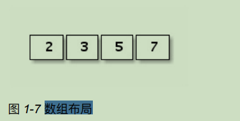
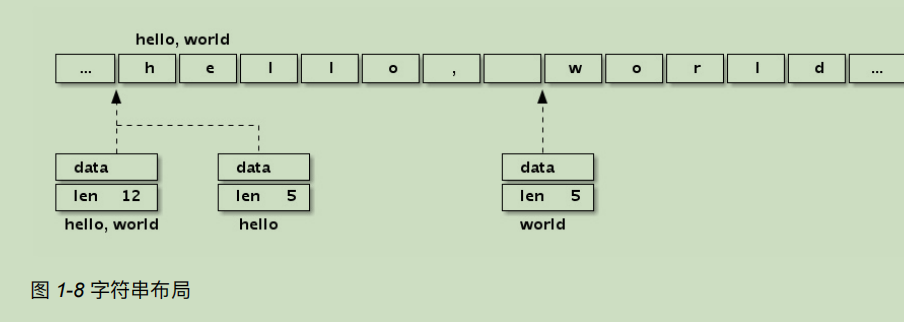
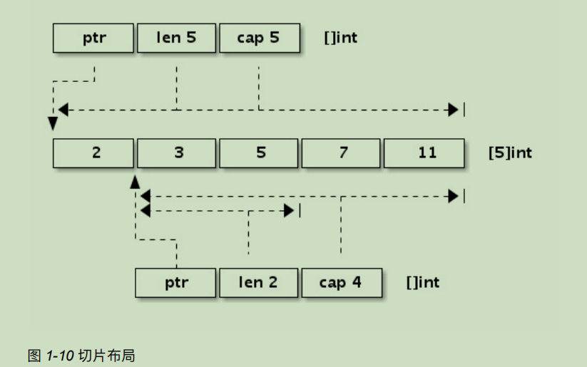
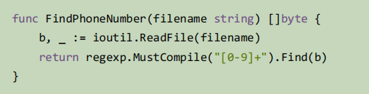
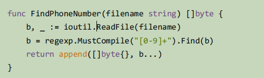
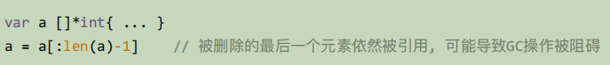
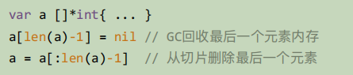

- array，string，slice
  - **共同点**：底层数据（都是一块连续的内存空间），上层因为其语义不同而表现不同
  - 不同：
    - `array` 是值类型，传参或者返回的时候是 **整体复制**；`string` 和 `slice` 传参或者返回的时候 是赋值结构体（字符串头，结构体头）
    - string 切片得 string，slice 和 array 切片得 slice。
- 除了**闭包函数以引⽤的⽅式**对外部变量访问之外，其它赋值和函数传参数都是以**传值的⽅式**处理

# array
- 特征：
  - **长度容量固定**，不能扩展（len 和 cap 结果相同）
  - 传参 **整体复制**
  - 可以定义**空数组**
    - 空数组作用：一般很少直接使用，用途比如管道同步，目的是不想占用内存，又想给对端发送一个同步消息。（注：但是我看到比较多的是用 **空接口或者空结构体** ）

> 内存布局
<div style="zoom:60%" align="center"></div>

## array pointer
- tip：为了**避免复制数组带来的开销**，可以传递⼀个指向数组的指针。
- 语法糖：数组指针和数组很多用法相同
  - 注：但数组指针并不是数组

```go
// 0 1 [3]int
// 0 1 *[3]int
// 012
// 012
func main() {
	var a = [...]int{0, 1, 2}
	var b = &a

    
	fmt.Printf("%d %d %T\n", a[0], a[1], a)
	fmt.Printf("%d %d %T\n", b[0], b[1], b)

	for _, v := range a {
		fmt.Print(v)
	}
	fmt.Println()

	for _, v := range b {
		fmt.Print(v)
	}

}
```

# string
- 特征
  - **只读** 语义
  - 传参是对其底层数据结构（StringHeader）进行值拷贝
  - 切片得string，共享底层字节序列。
  - 使用utf-8编码，错误编码不会向后扩散是UTF8编码的优秀特性之⼀。
  - 与 `[]byte` 和 `[]rune` 的转换，隐藏重新分配内存的代价。
    - **因为string的只读语义**，保证 string 的只读语义不受切片影响
    - `[]rune` 的转换还会转换**内存布局**

> 底层结构
- 字符串其实就是一个**结构体**
- 可以将字符串数组，看成一个结构体数组
```go
type StringHeader struct {
	Data uintptr
	Len  int
}
```
<div style="zoom:60%" align="center"></div>


> 切片

```go
// type: string, value: tes
// type: []uint8, value: [0 1 2]
func main() {
	// 字符串切片
	var str string = "test-test"
	s1 := str[0:3]
	fmt.Printf("type: %T, value: %[1]s\n", s1)

	// 数组切片
	var arr = [...]byte{0, 1, 2, 3, 4, 5}
	s2 := arr[0:3]
	fmt.Printf("type: %T, value: %[1]v", s2)
}
```

> string 转 StringHeader
- Note：只能通过指针

```go
// Len:9
func main() {
	// 字符串切片
	var str string = "test-test"
	var sg *reflect.StringHeader = (*reflect.StringHeader)(unsafe.Pointer(&str))
	fmt.Printf("Len:%d", sg.Len)
}
```

# slice
- 特征：
  - 传参是对其底层数据结构（StringHeader）进行值拷贝
- sliece的几种状态
  - 零值：nil
  - 空切片：
    - len = 0 && cap != 0
    - len = 0 && cap == 0(非nil)
## 底层结构
```go
type SliceHeader struct {
	Data uintptr
	Len  int
	Cap  int
}
```

- `x := []int{2,3,5,7,11}` 和` y := x[1:3]`
<div style="zoom:60%" align="center"></div>

## 切片
- 一些特殊的操作
```cpp
// []int, [1 2], cap:7
// []int, [1 2], cap:3
// []int, [], cap:7
func main() {
	var c = []int{1, 2, 3, 4, 5, 6, 7}
	d := c[0:2:cap(c)]
	e := c[0:2:3]
	f := c[:0]
	fmt.Printf("%T, %v, cap:%d\n", d, d, cap(d))
	fmt.Printf("%T, %v, cap:%d\n", e, e, cap(e))
	fmt.Printf("%T, %v, cap:%d", f, f, cap(f))
}
```

## append
- 向前append会导致内存重新分配

```go
func main() {
    // 向前添加
	var s = []int{3, 4, 5}
	s = append([]int{1, 2}, s...)
    fmt.Println(s)
    
    // 向后添加
	s = append(s, []int{6, 7}...)
    fmt.Println(s)
    
}

```

- 中间 `append`
  - 两种方法，第一种的效率比较低
    - 分析法1：第二个 append 中，临时创建一个 slice(1次)，append 之后，reslice(2次)，第一个append之后，reslice（3次）
    - 第二种方法，避免了过多创建slice

```go
func main() {
	var s = []int{1, 2, 5, 6, 7}

	// 法1：效率较低
	s = append(s[:2], append([]int{3}, s[2:]...)...)
	fmt.Println(s)

	// 法2：效率较高
	var i int = 3
	s = append(s, 0)
	// dst, src
	copy(s[i+1:], s[i:])
	s[i] = 4
	fmt.Println(s)
}

```

## erase
- 同上
- 删除中间同样可以用 copy + append
  - `a = a[:i+copy(a[i:], a[i+N:])]`
  - `copy` 返回拷贝的个数

## 空切片应用(秀)
- 高效删除切片中的空格（不用再拷贝一份，在原切片上做）

```go
// cap(res) =  10
// res:linqing
// src:linqinging
func main() {
	var strB = []byte("lin   qing")
	res := strB[:0]
	fmt.Println("cap(res) = ", cap(res))

	for _, v := range strB {
		if v != ' ' {
			res = append(res, v)
		}
	}
	fmt.Printf("res:%s\n", res)
	fmt.Printf("src:%s\n", strB)
}

```

## 避免切片的内存泄露（重要）
- 本质：切⽚操作会对底层数组进行**复用**。**底层的数组会被保存在内存中，直到它不再被引⽤，将被 GC 回收**。
- 非传统的内存泄露，但是很典型，会影响性能。

> demo1：从大slice中取小slice
- 加载大量数据到内存，最后以切片返回查找到的电话号码。
- **一个小需求引起巨大的代价**
<div style="zoom:100%" align="center"></div>

- 解决：通过传值，来切断原始数据依赖（GO哲学）
<div style="zoom:100%" align="center"></div>

> demo2：指针slice 被删除，指针指向大内存


<div style="zoom:100%" align="center"></div>

- 解决：指针设置为nil，再从切片中删除
<div style="zoom:100%" align="center"></div>


## 切片类型的强制转换
- 需求：在64位系统上，需要对⼀个 `[]float64` 切⽚进⾏⾼速排序，我们可以将它强制转 为 `[]int` 整数切⽚，然后以整数的⽅式进⾏排序
  - （**因为 `float64` 遵循IEEE754浮点数标准特性，当浮 点数有序时对应的整数也必然是有序的**)
- 目标：`[]float64` ==》 `[]int`
- 工具：**`unsafe.Pointer`，来连接两个不同类型的指针传递**
- 第一种思路：面向切片底层的数组数据地址来操作。
  - `[]float64`==》`首元素地址` ==》`*[1 << 20]int` ==》 `[]int`
  - 注意：`1 << 20` 要保证比 `cap(a)` 大，不能使用cap(a)直接作为数组大小，因为不是常量
  - Go 语⾔实现中⾮0⼤⼩数组的⻓度不得超过2GB，因此需要针对数组元素的类型⼤⼩计算数组的最⼤⻓度 范围（ `[]uint8` 最⼤2GB， `[]uint16` 最⼤1GB，以此类推，但是 `[]struct{}` 数组的⻓度可以超过 2GB）
- 第二种思路：底层结构 `SliceHeader` 赋值
  1. `[]float64` ==》 `*SliceHeader`(ah)
  2. `[]int` ==》 `*SliceHeader`(bh)
  3. `*bh = *ah`
```go

func SortFloat64FastV1(a []float64) {
	var b []int = (*[1 << 20]int)(unsafe.Pointer(&a[0]))[:len(a):cap(a)]

	sort.Ints(b)
}

func SortFloat64FastV2(a []float64) {
	var b []int

	var ah *reflect.SliceHeader = (*reflect.SliceHeader)(unsafe.Pointer(&a))
	var bh *reflect.SliceHeader = (*reflect.SliceHeader)(unsafe.Pointer(&b))
	*bh = *ah

	sort.Ints(b)

}

// [1.1 1.2 1.4 2.2 4.6]
// [1.1 1.2 1.4 2.2 4.6]
func main() {
	var input1 = []float64{1.1, 4.6, 2.2, 1.4, 1.2}
	SortFloat64FastV1(input1)
	fmt.Println(input1)

	var input2 = []float64{1.1, 4.6, 2.2, 1.4, 1.2}
	SortFloat64FastV1(input2)
	fmt.Println(input2)
}

```