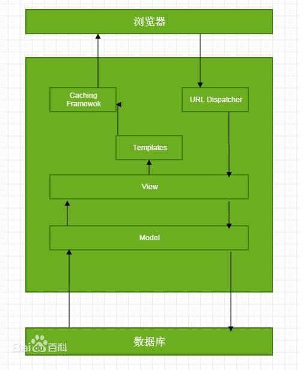
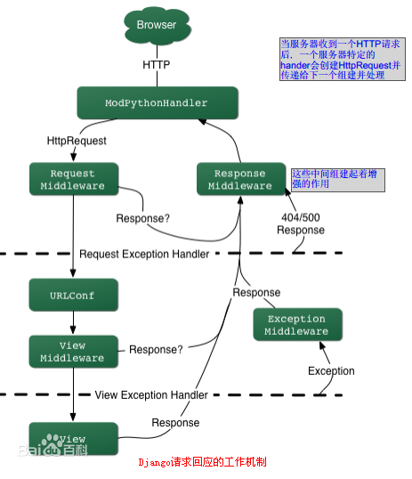
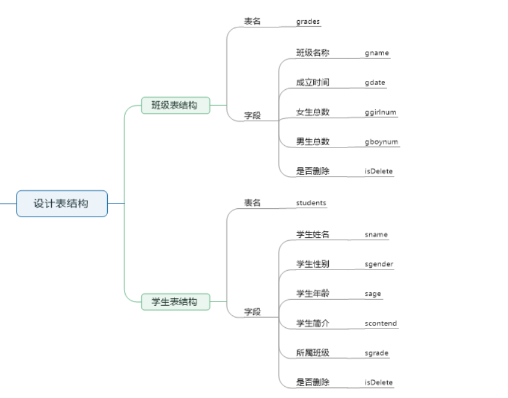
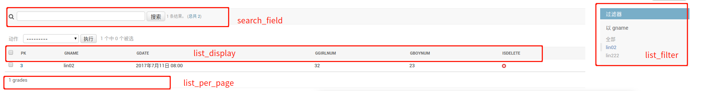
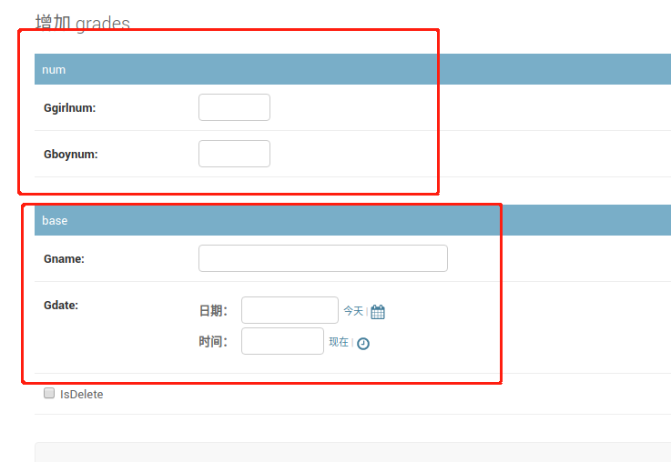
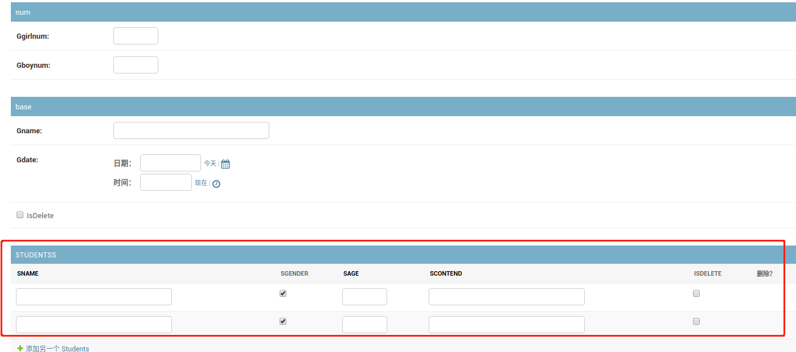
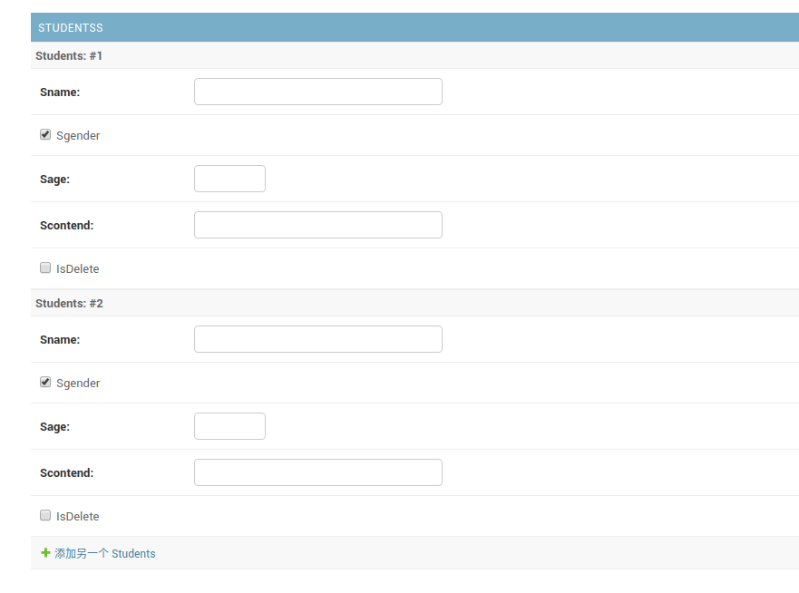
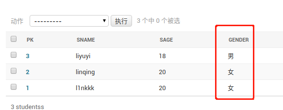

> https://coding.imooc.com/class/chapter/393.html#Anchor

- [准备和介绍](#%E5%87%86%E5%A4%87%E5%92%8C%E4%BB%8B%E7%BB%8D)
  - [Django中的模块](#Django%E4%B8%AD%E7%9A%84%E6%A8%A1%E5%9D%97)
  - [Django中的基础命令](#Django%E4%B8%AD%E7%9A%84%E5%9F%BA%E7%A1%80%E5%91%BD%E4%BB%A4)
  - [查看版本](#%E6%9F%A5%E7%9C%8B%E7%89%88%E6%9C%AC)
  - [框架](#%E6%A1%86%E6%9E%B6)
- [整个流程](#%E6%95%B4%E4%B8%AA%E6%B5%81%E7%A8%8B)
  - [生成项目](#%E7%94%9F%E6%88%90%E9%A1%B9%E7%9B%AE)
  - [设计表结构](#%E8%AE%BE%E8%AE%A1%E8%A1%A8%E7%BB%93%E6%9E%84)
  - [配置数据库](#%E9%85%8D%E7%BD%AE%E6%95%B0%E6%8D%AE%E5%BA%93)
  - [创建应用](#%E5%88%9B%E5%BB%BA%E5%BA%94%E7%94%A8)
  - [定义模型](#%E5%AE%9A%E4%B9%89%E6%A8%A1%E5%9E%8B)
  - [在数据库中生成数据表](#%E5%9C%A8%E6%95%B0%E6%8D%AE%E5%BA%93%E4%B8%AD%E7%94%9F%E6%88%90%E6%95%B0%E6%8D%AE%E8%A1%A8)
  - [测试数据操作](#%E6%B5%8B%E8%AF%95%E6%95%B0%E6%8D%AE%E6%93%8D%E4%BD%9C)
    - [进入到shell](#%E8%BF%9B%E5%85%A5%E5%88%B0shell)
    - [引入包](#%E5%BC%95%E5%85%A5%E5%8C%85)
    - [查询所有数据](#%E6%9F%A5%E8%AF%A2%E6%89%80%E6%9C%89%E6%95%B0%E6%8D%AE)
    - [添加数据](#%E6%B7%BB%E5%8A%A0%E6%95%B0%E6%8D%AE)
    - [查询数据](#%E6%9F%A5%E8%AF%A2%E6%95%B0%E6%8D%AE)
    - [修改数据](#%E4%BF%AE%E6%94%B9%E6%95%B0%E6%8D%AE)
    - [删除数据](#%E5%88%A0%E9%99%A4%E6%95%B0%E6%8D%AE)
  - [关联对象](#%E5%85%B3%E8%81%94%E5%AF%B9%E8%B1%A1)
  - [启动服务器](#%E5%90%AF%E5%8A%A8%E6%9C%8D%E5%8A%A1%E5%99%A8)
  - [Admin站点管理](#Admin%E7%AB%99%E7%82%B9%E7%AE%A1%E7%90%86)
    - [管理数据表](#%E7%AE%A1%E7%90%86%E6%95%B0%E6%8D%AE%E8%A1%A8)
  - [视图的基本使用](#%E8%A7%86%E5%9B%BE%E7%9A%84%E5%9F%BA%E6%9C%AC%E4%BD%BF%E7%94%A8)
    - [定义视图](#%E5%AE%9A%E4%B9%89%E8%A7%86%E5%9B%BE)
    - [配置url](#%E9%85%8D%E7%BD%AEurl)
  - [模板的基本使用](#%E6%A8%A1%E6%9D%BF%E7%9A%84%E5%9F%BA%E6%9C%AC%E4%BD%BF%E7%94%A8)
    - [创建模板文件夹](#%E5%88%9B%E5%BB%BA%E6%A8%A1%E6%9D%BF%E6%96%87%E4%BB%B6%E5%A4%B9)
    - [配置模板路径](#%E9%85%8D%E7%BD%AE%E6%A8%A1%E6%9D%BF%E8%B7%AF%E5%BE%84)
    - [定义模板](#%E5%AE%9A%E4%B9%89%E6%A8%A1%E6%9D%BF)
    - [定义视图](#%E5%AE%9A%E4%B9%89%E8%A7%86%E5%9B%BE-1)
    - [配置url](#%E9%85%8D%E7%BD%AEurl-1)

# 准备和介绍
## Django中的模块
- 模型Model：数据层,处理与数据相关的所有事物
- 视图View：视图层,用来处理用户发出的请求
- 模版Template：模版层,通过视图函数渲染html模版,得到动态的前端页面
- 路由Url：网站的入口,关联到对应的视图函数,访问网址就对应一个函数
- 表单Forms：表单,用在在浏览器输入数据提交,并对这些数据进行验证。
- 后台Admin：Django自带一个管理后台 ,对你提交的数据进行管理
- 配置Settings：Django的设置,配置文件。

## Django中的基础命令

| 命令                                    | 功能                    |
| --------------------------------------- | ----------------------- |
| django-admin startproject项目名         | 创建一个django项目      |
| python manage.py startapp应用名         | 项目中创建一个应用      |
| Python manage.py shell                  | 进入调试代码的调试模式- |
| python manage.py makemigrations         | 数据库创建更改文件-     |
| python manage.py migrate                | 同步到数据库进行更新-   |
| python manage.py flush                  | 清空数据库             |
| python manage.py runserver 0.0.0.0:8000 | 启动开发服务器         |
| python manage.py +回车                  | 可查看更多命令          |


## 查看版本
- django.get_version()
```python
(django_env) l1nkkk@l1nkkk-TM1701:~/pyenv$ ipython
Python 3.6.9 (default, Nov  7 2019, 10:44:02) 
Type 'copyright', 'credits' or 'license' for more information
IPython 7.13.0 -- An enhanced Interactive Python. Type '?' for help.

In [1]:                                                                         

In [1]: import django                                                           

In [2]: django.get_version()                                                    
Out[2]: '1.11'

```
## 框架
<center>

</center>

<center>

</center>
# 整个流程

## 生成项目
-  django-admin startproject project  
目录层级
```
(django_env) l1nkkk@l1nkkk-TM1701:~/pyenv/project$ tree
.
├── manage.py
└── project
    ├── __init__.py
    ├── settings.py
    ├── urls.py
    └── wsgi.py

```

- mange.py：一个命令行工具，可以使我们用多种方式对Django进行交互
- project目录
  - \_\_init__.py：告诉python这个目录应该被看成一个python包
  - settings.py：项目的配置文件
  - urls.py：项目的URL声明
  - wsgi.py：项目与WSGI兼容的Web服务器入口

## 设计表结构
<center>

</center>

## 配置数据库
- 把默认数据库从sqllite配成你想要的数据库，并指定一些信息。
```py
# L1NKKK UPDATE
DATABASES = {
    'default': {
        'ENGINE': 'django.db.backends.mysql',
        'NAME': "sunck",
        'USER': "l1nkkk",
        'PASSWORD': 'sunck',
        'HOST': 'localhost',
        'PORT': '3306',
    }
}
```
- 安装PyMysql库
- 在__init__.py文件中添加两行代码
```py
import pymysql
pymysql.install_as_MySQLdb()
```

## 创建应用
- 在一个项目中可以创建多个应用，每个应用进行一种业务处理
- 在项目目录下执行，`manage.py startapp myApp` 其中 `myApp` 为应用的名称，目录结构变为如下所示
```py
(django_env) l1nkkk@l1nkkk-TM1701:~/work/django/test/project$ tree
.
├── manage.py
├── myApp
│   ├── admin.py
│   ├── apps.py
│   ├── __init__.py
│   ├── migrations
│   │   └── __init__.py
│   ├── models.py
│   ├── tests.py
│   └── views.py
└── project
    ├── __init__.py
    ├── __pycache__
    │   ├── __init__.cpython-36.pyc
    │   └── settings.cpython-36.pyc
    ├── settings.py
    ├── urls.py
    └── wsgi.py

```
- myApp目录说明
  - admin.py：站点配置
  - model：模型
  - views.py：视图

- 激活应用
  - 在settings.py文件中将myApp应用加入到INSTALLED_APPS中
```py
INSTALLED_APPS = [
    'django.contrib.admin',
    'django.contrib.auth',
    'django.contrib.contenttypes',
    'django.contrib.sessions',
    'django.contrib.messages',
    'django.contrib.staticfiles',
    'myApp',
]
```

## 定义模型
概述：一个数据库表对应一个模型
- 在models.py文件中定义模型
  - 模型类要继承models.Model类
  - 不需要定义主键，在生成式自动添加，并且值为自动添加

models.py文件内容如下：
```py
from django.db import models

# Create your models here.

class Grades(models.Model):
    gname = models.CharField(max_length=20)
    gdate = models.DateTimeField()
    ggirlnum = models.IntegerField()
    gboynum = models.IntegerField()
    isDelete = models.BooleanField(default=False)
    
    def __str__(self):
        return "%s---%d----%d" % (self.gname,self.ggirlnum,self.gboynum)

class Students(models.Model):
    sname = models.CharField(max_length=20)
    sgender = models.BooleanField(default=True)
    sage = models.IntegerField()
    scontend = models.CharField(max_length=20)
    isDelete = models.BooleanField(default=False)
    # 关联外键
    # sgrade = models.ForeignKey("Grades", on_delete=models.CASCADE)
    sgrade = models.ForeignKey("Grades")
```


## 在数据库中生成数据表
- 生成迁移文件：执行 ` ./manage.py makemigrations`  
可以发现此时目录结构多了 `migrations`
```sh
 migrations
 │   ├── 0001_initial.py
 │   ├── __init__.py

```
`0001_initial.py`里面是一些生成数据表的脚本，而在mysql相对应的数据库中多了以下内容，发现此时还没有相应数据库
```
mysql> show tables;
+-------------------+
| Tables_in_sunck   |
+-------------------+
| django_migrations |
+-------------------+
1 row in set (0.00 sec)
```

- 执行迁移，此时相当于执行表生成语句，执行 `./manage.py migrate`
```
mysql> show tables;
+----------------------------+
| Tables_in_sunck            |
+----------------------------+
| auth_group                 |
| auth_group_permissions     |
| auth_permission            |
| auth_user                  |
| auth_user_groups           |
| auth_user_user_permissions |
| django_admin_log           |
| django_content_type        |
| django_migrations          |
| django_session             |
| myApp_grades               |
| myApp_students             |
+----------------------------+
12 rows in set (0.01 sec)
```
`myApp_grades` 和 `myApp_students` 就是我们想要的

## 测试数据操作
### 进入到shell
`manage.py shell`

### 引入包


### 查询所有数据
- `类名.objects.all()`
```py
from myApp.models import Grades,Students
from django.utils import timezone
from datetime import *
```

### 添加数据
- 本质：创建一个模型类的对象实例
```py

grade1 = Grades()
grade1.gname="lin01"
grade1.gdate=datetime(year=2017,month=7,day=17)
grade1.ggirlnum=3
grade1.gboynum=20
grade1.save()

grade2 = Grades()
grade2.gname="lin02"
grade2.gdate=datetime(year=2017,month=7,day=11)
grade2.ggirlnum=32
grade2.gboynum=23
grade2.save()
```
此时的数据库
```
mysql> select * from myApp_grades;
+----+----------+----------------------------+----------+---------+----------+
| id | gname    | gdate                      | ggirlnum | gboynum | isDelete |
+----+----------+----------------------------+----------+---------+----------+
|  1 | L1NKTEST | 2017-07-17 00:00:00.000000 |        3 |      20 |        0 |
|  2 | lin01    | 2017-07-17 00:00:00.000000 |        3 |      20 |        0 |
|  3 | lin02    | 2017-07-11 00:00:00.000000 |       32 |      23 |        0 |
+----+----------+----------------------------+----------+---------+----------+
3 rows in set (0.02 sec)

```

### 查询数据
- 类名.objects.get(...)
  - Grades.objects.get(pk=2)

### 修改数据
- 模型对象.属性=新值
- 模型对象.save()
```py
g2.gname = "lin222"
g2.save()
```
此时的数据库：
```
mysql> select * from myApp_grades;
+----+----------+----------------------------+----------+---------+----------+
| id | gname    | gdate                      | ggirlnum | gboynum | isDelete |
+----+----------+----------------------------+----------+---------+----------+
|  1 | L1NKTEST | 2017-07-17 00:00:00.000000 |        3 |      20 |        0 |
|  2 | lin222   | 2017-07-17 00:00:00.000000 |        3 |      20 |        0 |
|  3 | lin02    | 2017-07-11 00:00:00.000000 |       32 |      23 |        0 |
+----+----------+----------------------------+----------+---------+----------+
3 rows in set (0.00 sec)

```

### 删除数据
- 模型对象.delete()
  - 物理删除，数据库表里的数据将丢失

```py
g1=Grades.objects.get(pk=1)
g1.delete()
(1, {'myApp.Students': 0, 'myApp.Grades': 1})
```
此时数据库中
```
mysql> select * from myApp_grades;
+----+--------+----------------------------+----------+---------+----------+
| id | gname  | gdate                      | ggirlnum | gboynum | isDelete |
+----+--------+----------------------------+----------+---------+----------+
|  2 | lin222 | 2017-07-17 00:00:00.000000 |        3 |      20 |        0 |
|  3 | lin02  | 2017-07-11 00:00:00.000000 |       32 |      23 |        0 |
+----+--------+----------------------------+----------+---------+----------+
2 rows in set (0.00 sec)

```

## 关联对象
> 添加一个学生
```py
stu =Students()
stu.sname = "l1nkkk"
stu.sgender = False
stu.sage=20
stu.scontend='l1nkkk is stupid'
# tag
stu.sgrade = grade1
stu.save()

```
此时数据库：
```
mysql> select * from myApp_students;
+----+--------+---------+------+------------------+----------+-----------+
| id | sname  | sgender | sage | scontend         | isDelete | sgrade_id |
+----+--------+---------+------+------------------+----------+-----------+
|  1 | l1nkkk |       0 |   20 | l1nkkk is stupid |        0 |         2 |
+----+--------+---------+------+------------------+----------+-----------+
1 row in set (0.01 sec)

```

> 获得关联对象的集合
- 再添加一个学生
- 查看那个班的所有学生


```py
# 添加学生
stu1 =Students()
stu1.sname = "linqing"
stu1.sgender = False
stu1.sage=20
stu1.scontend='linqing is stupid'
# tag
stu1.sgrade = grade1
stu1.save()

```
此时的数据库
```
mysql> select * from myApp_students;
+----+---------+---------+------+-------------------+----------+-----------+
| id | sname   | sgender | sage | scontend          | isDelete | sgrade_id |
+----+---------+---------+------+-------------------+----------+-----------+
|  1 | l1nkkk  |       0 |   20 | l1nkkk is stupid  |        0 |         2 |
|  2 | linqing |       0 |   20 | linqing is stupid |        0 |         2 |
+----+---------+---------+------+-------------------+----------+-----------+
2 rows in set (0.00 sec)

```
**获取sgrade_id==2的所有学生**
- 这里如果指定了__str__就会不一样
```py
grade1.students_set.all()
Out[28]: <QuerySet [<Students: Students object>, <Students: Students object>]>
```

> 通过外键关联的对象直接生成学生条目

```py
stu3 = grade1.students_set.create(sname=u"liyuyi",sgender=True,scontend=u'liyuyi is beautiful',sage=18)
Out[29]: <Students: Students object>
```

**此时的数据库**
```
mysql> select * from myApp_students;
+----+---------+---------+------+---------------------+----------+-----------+
| id | sname   | sgender | sage | scontend            | isDelete | sgrade_id |
+----+---------+---------+------+---------------------+----------+-----------+
|  1 | l1nkkk  |       0 |   20 | l1nkkk is stupid    |        0 |         2 |
|  2 | linqing |       0 |   20 | linqing is stupid   |        0 |         2 |
|  3 | liyuyi  |       1 |   18 | liyuyi is beautiful |        0 |         2 |
+----+---------+---------+------+---------------------+----------+-----------+
3 rows in set (0.00 sec)

```

## 启动服务器
`manage.py runserver ip:port`

- ip可以不写，不写代表本机ip
- 端口号默认是8000
- 是一个純python的轻量级web服务器，仅仅在开发测试中使用的


## Admin站点管理
- 概述
  - 内容发布：负责添加，修改，删除内容
  - 公共访问
- 配置Admin应用
  - 在settings.py中的 `INSTALLED_APPS` 添加 `django.contrib.admin`，默认已经添加好了
- 创建管理员用户 ` ./manage.py createsuperuser`
- 汉化

### 管理数据表
> 修改admin.py文件
```py
from .models import Grades,Students
admin.site.register(Grades)
admin.site.register(Students)
```
<center>admin.py</center>

> 自定义管理页面

- 属性说明
```py
class GradesAdmin(admin.ModelAdmin):
    # 列表页属性
    # 显示字段
    list_display = ['pk', 'gname', 'gdate', 'ggirlnum', 'gboynum', 'isDelete']
    # 过滤字段
    list_filter = ['gname']
    # 搜索字段
    search_fields = ['gname']
    # 分页
    list_per_page = 5
    # 添加/修改页属性
    # fields = ['ggirlnum', 'gboynum', 'gname', 'gdate', 'isDelete']
    fieldsets = [
        ("num", {"fields": ['ggirlnum', 'gboynum']}),
        ("base", {"fields": ['gname', 'gdate', 'isDelete']}),
    ]

admin.site.register(Grades,GradesAdmin)


```

<center>admin.py</center>

<center>

<br>
<span>列表页属性</span>
</center>


<center>

<br>
<span>添加/修改页属性</span>
</center>

> 关联对象：创建班级的时候同事创建学生
- 法1

```py
class StudentInfo(admin.TabularInline):
    # 用的是哪个模型
    model = Students
    # 想创建几个
    extra = 2
class GradesAdmin(admin.ModelAdmin):
    inlines = [StudentInfo]

    # 列表页属性
    # 显示字段
    list_display = ['pk', 'gname', 'gdate', 'ggirlnum', 'gboynum', 'isDelete']
    # 过滤字段
    list_filter = ['gname']
    # 搜索字段
    search_fields = ['gname']
    # 分页
    list_per_page = 5
    # 添加/修改页属性
    # fields = ['ggirlnum', 'gboynum', 'gname', 'gdate', 'isDelete']
    fieldsets = [
        ("num", {"fields": ['ggirlnum', 'gboynum']}),
        ("base", {"fields": ['gname', 'gdate', 'isDelete']}),
    ]
```

<center>

<br>
<span>法1</span>
</center>

- 法2

和法1的不同就在于
```py
class StudentInfo(admin.StackedInline):
```

<center>

<br>
<span>法2</span>
</center>

> 布尔值显示问题
其实其他的显示也都可以改，和这个相似
```py
class StudentAdmin(admin.ModelAdmin):
    def gender(self):
        if self.sgender:
            return '男'
        else:
            return '女'

    list_display = ['pk', 'sname', 'sage', gender, 'scontend', 'sgrade', 'isDelete']
    list_per_page = 10
```

<center>

<br>
<span>性别变成了男和女的显示。</span>
</center>


- 字段变成性别

加上以下代码
```py
gender.short_description = "性别"
```
- 执行动作位置的变化
从上该到下，在StudentAdmin中修改
```py
actions_on_top = False
actions_on_bottom = True
```

> 使用装饰器完成注册

```py
@admin.register(Students)
class StudentAdmin(admin.ModelAdmin):
    def gender(self):
        if self.sgender:
            return '男'
        else:
            return '女'
    gender.short_description = "性别"
    list_display = ['pk', 'sname', 'sage', gender, 'scontend', 'sgrade', 'isDelete']
    list_per_page = 10
    actions_on_top = False
    actions_on_bottom = True
#admin.site.register(Students, StudentAdmin)
```


## 视图的基本使用
- 概述
  - 在django中，视图对web请求进行回应
  - 视图就是一个python函数，在view.py文件中定义

### 定义视图
```py
# view.py
from django.http import  HttpResponse

def index(request):
    return HttpResponse("linkkkk")
```
<center>myapp/view.py</center>

### 配置url
- 修改project目录下的urls.py文件
```py
from django.conf.urls import url, include
from django.contrib import admin


urlpatterns = [
    url(r'^admin/', admin.site.urls),
    url(r'^', include("myApp.urls"))
]

```
<center>project/url.py</center>

- 在myApp应用目录下创建一个urls.py文件

```py
# myApp/urls.py
from django.conf.urls import  url

from . import views

urlpatterns = [
    url(r'^$', views.index)
]
```

## 模板的基本使用
- 概述
  - 模板是html页面，可以根据**视图**中传递过来的数据进行填充

### 创建模板文件夹
- 模板的创建在应用的同级下创建一个templates目录，在目录下创建对应项目的模板目录，如myApps。
   - （注：项目当中不仅仅只有一个应用）

```
.
├── manage.py
├── myApp
│   └── ...
├── project
│   └── ...
├── __pycache__
│   └── ...
└── templates
    └── myApp
```

### 配置模板路径
- 修改settings.py文件下的TEMPLATES
```
'DIRS': [os.path.join(BASE_DIR, 'templates')],
```
### 定义模板
模板语法用到再自己查

```html
<!DOCTYPE html>
<html lang="en">
<head>
    <meta charset="UTF-8">
    <title>班级信息</title>
</head>
<body>
    <h1>班级信息列表</h1>
    <ul>
        
            <li>
            <a href="#"> {{ grade.gname }}</a>
            </li>
        
    </ul>

</body>
</html>
```

### 定义视图

```py
#myadd/view.py
def grades(request):
    # 去模板里取数据
    gradesList = Grades.objects.all()
    # 将数据传递给模板，模板渲染页面后将渲染好的页面返回给浏览器

    return render(request, 'myApp/grades.html', {"grades":gradesList} )
```

### 配置url
```py
# myApp/urls.py
url(r'^grades', views.grades)
```