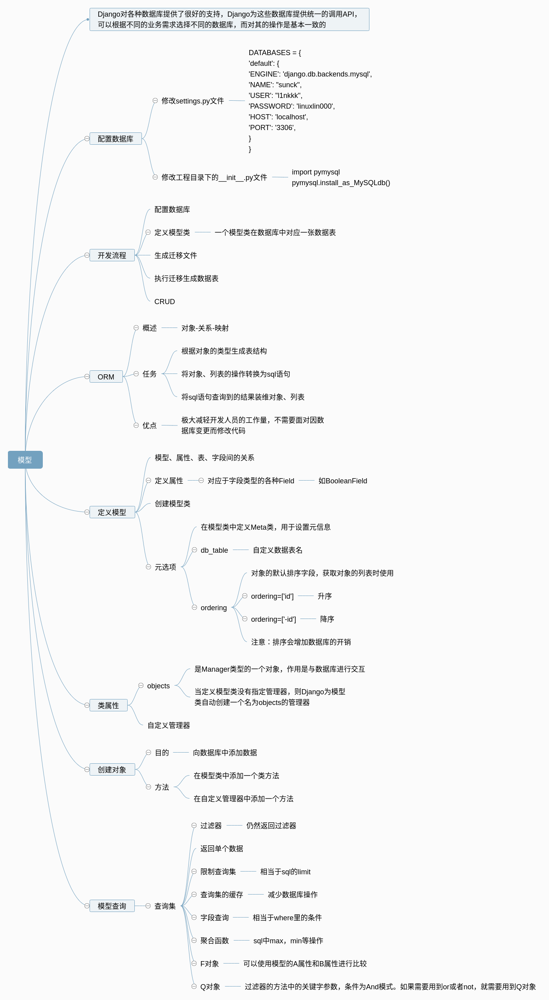

<center>

</center>

- [定义模型](#%E5%AE%9A%E4%B9%89%E6%A8%A1%E5%9E%8B)
  - [模型，属性，表，字段间的关系](#%E6%A8%A1%E5%9E%8B%E5%B1%9E%E6%80%A7%E8%A1%A8%E5%AD%97%E6%AE%B5%E9%97%B4%E7%9A%84%E5%85%B3%E7%B3%BB)
  - [定义属性](#%E5%AE%9A%E4%B9%89%E5%B1%9E%E6%80%A7)
  - [数据表元数据](#%E6%95%B0%E6%8D%AE%E8%A1%A8%E5%85%83%E6%95%B0%E6%8D%AE)
- [类属性](#%E7%B1%BB%E5%B1%9E%E6%80%A7)
  - [自定义管理器](#%E8%87%AA%E5%AE%9A%E4%B9%89%E7%AE%A1%E7%90%86%E5%99%A8)
    - [作用](#%E4%BD%9C%E7%94%A8)
- [创建对象](#%E5%88%9B%E5%BB%BA%E5%AF%B9%E8%B1%A1)
  - [方法](#%E6%96%B9%E6%B3%95)
- [模型查询](#%E6%A8%A1%E5%9E%8B%E6%9F%A5%E8%AF%A2)
  - [查询集](#%E6%9F%A5%E8%AF%A2%E9%9B%86)
    - [过滤器](#%E8%BF%87%E6%BB%A4%E5%99%A8)
    - [返回单个数据](#%E8%BF%94%E5%9B%9E%E5%8D%95%E4%B8%AA%E6%95%B0%E6%8D%AE)
    - [限制查询集](#%E9%99%90%E5%88%B6%E6%9F%A5%E8%AF%A2%E9%9B%86)
    - [查询集的缓存](#%E6%9F%A5%E8%AF%A2%E9%9B%86%E7%9A%84%E7%BC%93%E5%AD%98)
    - [字段查询](#%E5%AD%97%E6%AE%B5%E6%9F%A5%E8%AF%A2)
    - [聚合函数](#%E8%81%9A%E5%90%88%E5%87%BD%E6%95%B0)
    - [F对象](#F%E5%AF%B9%E8%B1%A1)
    - [Q对象](#Q%E5%AF%B9%E8%B1%A1)


# 定义模型
## 模型，属性，表，字段间的关系
- 一个模型类在数据库中对应一张表
- 在模型类中定义的属性对应表中的字段

## 定义属性
概述
> django根据属性的类型确定以下信息
- 当前选择的数据库支持字段的类型
- 渲染管理表单时使用的默认html控件
- 在管理站点最低限度的验证
  - 如max_length=20
> 主键
- django会为表增加自动增长的主键列，每个模型只能有一个主键列
- 如果使用选项设置某属性为主键列后，则django不会再生成默认的主键列
> 属性命名限制
- 不能是python的保留关键字
- 由于django的查询方式，不允许使用连续的下划线
> 属性映射后的字段类型
- 定义属性时，需要字段类型，字段类型被定义在django.db.models。fields目录下，为了方便使用，被导入到django.db.models中
- 使用方式
  - 导入from django. db import models
  - 通过models.Field创建字段类型的对象，赋值给属性
> 逻辑删除
- 对于重要数据都做逻辑删除，不做物理删除，实现方法是定义isDelete属性，类型为BooleanField,默认值为False

> 字段类型
- AutoField
  - 一个根据实际ID自动增长的IntegerField, 通常不指定
  - 如果不指定一个主键字段将自动添加到模型中

- CharField(max_length = 字符长度)
  - 字符串，默认的表单样式是TextInput

- TextField
  - 大文本字段，一般超过4000使用，默认的表单控件是Textarea

- IntegerField
  - 整数

- DecimalField(max_digits=None, decimal_places=None)
  - 使用python的Decimal实例表示的十进制浮点数
  - 参数说明
    - DecimalField.max_digits:位数总数
    - Dec imalField.decimal_places:小数点后的数字位数
    - 3.123 ——位数为4，小数位数为3
- FloatField
  - 用Python的float实例来表示的浮点数
- BooleanField 
  - true/false字段，此字段的默认表单控制是CheckboxInput
- NullBooleanField
  - 支持null、 true、 false三种值
- DateField[auto_now=False, auto_now_add=False])：只有日期
  - 使用Python的datetime.date实例表示的日期
  - 参数说明
    - `DateField.auto_now`: **每次保存对象时**，自动设置该字段为当前时间，用于"最后一次修改"的时间戳，它总是使用当前日期，默认为false
    - `DateField.auto_now_add`: 当对象第一次被创建时自动设置当前时间，用于创建的时间戳，它总是使用当前日期，默认为false
  - 说明
    - 该字段默认对应的表单控件是一个TextInput. 在管理员站点添加了一个JavaScript写的日历控件，和一个“Today"的快捷按钮，包含了一个额外的invalid_date错误消息键
  - 注意
    - `auto_now_add`, `auto_now`, `and default` 这些设置是相互排斥的，他们之间的任何组合将会发生错误的结果
- TimeField:只有时间
  - 使用Python的datetime. time实例表示的时间，参数同DateField
- DateTimeField：全都有
  - 使用Python的datetime.datetime实例表示的日期和时间，参数同DateField
- FileField
  - 一个上传文件的字段
- ImageField
  - 继承了FileField的所有属性和方法，但对上传的对象进行校验，确保它是个有效的image

> 字段选项
- 概述
  - 通过字段选项，可以实现对字段的约束
  - 在字段对象时通过关键字参数指定
- null  
  - 如果为True, Django 将空值以NULL存储到数据库中，默认值是False
- blanke
  - 如果为True,则该字段允许为空白，默认值是False
- 注意
  - null是数据库范畴的概念，blank是表单验证证范畴的
- db_column
  - 字段的名称，如果未指定，则使用属性的名称
- db_index
  - 若值为True,则在表中会为此字段创建索引
- default
   - 默认值
- primary_key
  - 若为True，则该字段会成为模型主键字段
- unique
  - 如果为True，这个字段在表中必须有唯一值

> 关系
- 分类
  - `ForeignKey`: 一对多，将字段定义在多的端中.
  - `ManyToManyField`: 多对多，将字段定义在两端中.
  - `OneToOneField`: 一对一，将字段定义在任意一端中

- 用一访问多
  - 格式
    - 对象.模型类小写_set
    - .示例 : `grade.students_set`

- 用一访问一
  - 格式
    - 对象.模型类小写
    - 示例 : `grade.students`

- 访问id
  - 格式
    - 对象.属性_id
    - 示例 : `student.sgrade_id`

## 数据表元数据
比如在Student模板类中添加这个元数据类
```py
class Meta:
   db_table="students"
   ordering=['id'] 
```

# 类属性
> objects

- 是Manager类型的一个对象，作用是与数据库进行交互
- 当定义模型类没有指定管理器，则Django为模型类自动创建一个名为objects的管理器
  - __.objects.all()

## 自定义管理器

模型管理器是Django的模型进行与数据库进行交互的接口（通常是查询），一个模型可以有多个模型管理器
> 简单示例
```py
# 在一个模型类中插入，如Students类
stuObj = model.Manger()
```
### 作用
- 向管理器中添加额外的方法
- 修改管理器返回的原始查询集合
  - 重写get_queryset()方法

**例子：** 被删除的不要显示
```py
class StudentsManager(models.Manager):
    # 筛选
    def get_queryset(self):
        return super(StudentsManager, self).get_queryset().filter(isDelete=False)

class Students(models.Model):
    # 自定义管理器
    stuObj = StudentsManager()
```

# 创建对象
- 目的：向数据库中添加数据
- 当创建对象时，django不会对数据库进行读写操作，当调用save()方式时才与数据库交互，将对象保存到数据库中
- 注意：__init__方法已经在父类models.Model中使用，在自定义的模型中无法使用
## 方法
- 在模型类中添加一个类方法
- 在自定义管理器中添加一个方法

> 在模型类中添加一个类方法

```py
@classmethod
    def createStudent(cls, name, age, gender, contend, grade, lastT, createT, isD=False):
        stu = cls(sname = name, sage = age, sgender = gender, scontend = contend, \
                  sgrade = grade, lastTime = lastT, createTime = createT, isDelete = isD)
        return stu
```

# 模型查询
- 查询集表示从数据库获取的对象集合
- 查询集可以有多个过滤器
- 过滤器就是一个函数，基于所给的参数限制查询集结果
- 从sql角度来说，查询集合select语句的家，过滤器相当于where条件

## 查询集
- 在管理器上调用过滤器返回查询集
- 调用查询集的过滤器返回新的查询集，所以可以写成链式
- 惰性执行：创建查询集不会带来任何数据的访问，知道调用数据时，才会访问数据
- 直接访问数据的情况
  - 迭代
  - 序列化
  - 与if合用
- 返回查询集的方法成为过滤器
### 过滤器
- all()
- filter()
  - 保留符合条件的数据
  - 用法：filter(key=value)
  - 用法：filter(key1=value1, key2=value2)
  - 用法：filter(key1=value1).filter(key2=value2)
- exclude()
  - 过滤掉符合条件的数据
  - 用法：同filter
- onder_by()
  - 排序
- values()
  - 一条数据就是一个对象(字典)，返回一个列表
  - 可以与all比较，all返回的是一个__str__返回的列表

### 返回单个数据
- get()
  - 返回一个满足条件的对象
  - 注意
    - 如果没找到符合条件的对象，会引发`"模型类.DoesNotExist"`异常
    - 如果找到了多个对象，会引发`"模型类.MultipleObjectReturned"`异常
- count()
  - 返回当前查询集中的对象个数
- first()
  - 返回查询集中第一个对象
- last()
- exists()
  - 如果存在，返回True

### 限制查询集
- 查询返回列表，可以使用下标的方法进行限制，等同于sql中的limit。  
- eg : `Students.objects.all()[0:5]`  
- 下标不能说负

### 查询集的缓存
每个查询集都包含一个缓存，来最少化对数据库的直接操作。  
第一次对查询集操作的时候，会发生数据缓存。

### 字段查询
- 概述
  - 实现了sql中的where语句，作为方法`filter(),exclude(),get()`的参数
  - 语法，属性名称__比较运算符=值
  - 外键：属性名_id
  - 转义：类似SQL中的like语句

1. exact
   - 判断，大小写敏感
   - filter(isDelete=False)
2. contains
   - 是否包含，大小写敏感
   - `studentsList = Students.object.filter(sname__contains='lin')`
3. startswith,endswith
   - 以value开头或结尾，大小写敏感
4. 以上4个在前面加上i表示不区分大小写，iexact....
5. isnull，isnotnull
   - 是否为空
   - `filter(sname__isnull=False)`
6. in
   - 是否包含在范围内
   - `studentsList = Students.object.filter(pk__in=[2,4,5])`
7. gt,gte,it,ite
   - 大于，大于等于，小于，小于等于
8. yead，month，day，week_day，hour，minute，second
   -  `Students.object.filter(lastTime_year=2017)`
9. 跨关联查询
   - 处理join查询，语法：`模型类名_属性名_比较运算符`
   - `grade = Grades.objets.filter(students_sname_contains='l1nkkk')`
10.  查询快捷
   - pk：代表主键

### 聚合函数
使用aggregate()函数返回聚合函数的值

- Avg
- Count
- Max
  - from django.db.models import Max
  - eg：`maxAge = Students.stuObj2.aggregate(Max('sage'))`
- Min
- Sum

### F对象
- 可以使用模型的A属性和B属性进行比较
  - `g = Grades.objects.filter(ggirlnum__gt=F('gboynum'))`
- 支持F对象的算数运算
  - `g = Grades.objects.filter(ggirlnum__gt=F('gboynum')+20)`

### Q对象
- 过滤器的方法中的关键字参数，条件为And模式。如果需要用到or或者not，就需要用到Q对象

eg:
```py
studentsList = Students.object.filter(Q(pk__ite=3)|Q(sage__gt=50))
# 和不加是同样的效果
studentsList = Students.object.filter(Q(pk__ite=3))
studentsList = Students.object.filter(~Q(pk__ite=3))
```