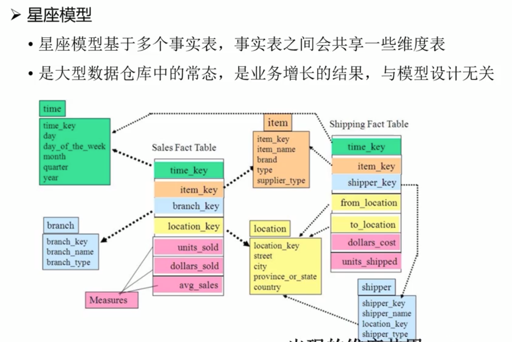

- [基础](#%E5%9F%BA%E7%A1%80)
  - [为什么诞生数仓](#%E4%B8%BA%E4%BB%80%E4%B9%88%E8%AF%9E%E7%94%9F%E6%95%B0%E4%BB%93)
  - [数据仓库的特点](#%E6%95%B0%E6%8D%AE%E4%BB%93%E5%BA%93%E7%9A%84%E7%89%B9%E7%82%B9)
    - [面向主题](#%E9%9D%A2%E5%90%91%E4%B8%BB%E9%A2%98)
    - [集成](#%E9%9B%86%E6%88%90)
    - [非易失](#%E9%9D%9E%E6%98%93%E5%A4%B1)
    - [时变性](#%E6%97%B6%E5%8F%98%E6%80%A7)
  - [数据库和数据仓库](#%E6%95%B0%E6%8D%AE%E5%BA%93%E5%92%8C%E6%95%B0%E6%8D%AE%E4%BB%93%E5%BA%93)
  - [技术实现](#%E6%8A%80%E6%9C%AF%E5%AE%9E%E7%8E%B0)
    - [传统数据仓库](#%E4%BC%A0%E7%BB%9F%E6%95%B0%E6%8D%AE%E4%BB%93%E5%BA%93)
    - [大数据数据仓库](#%E5%A4%A7%E6%95%B0%E6%8D%AE%E6%95%B0%E6%8D%AE%E4%BB%93%E5%BA%93)
  - [MPP架构和分布式架构](#MPP%E6%9E%B6%E6%9E%84%E5%92%8C%E5%88%86%E5%B8%83%E5%BC%8F%E6%9E%B6%E6%9E%84)
    - [MPP架构](#MPP%E6%9E%B6%E6%9E%84)
    - [分布式架构/hadoop架构](#%E5%88%86%E5%B8%83%E5%BC%8F%E6%9E%B6%E6%9E%84hadoop%E6%9E%B6%E6%9E%84)
    - [MPP+分布式架构](#MPP%E5%88%86%E5%B8%83%E5%BC%8F%E6%9E%B6%E6%9E%84)
  - [数据仓库架构设计](#%E6%95%B0%E6%8D%AE%E4%BB%93%E5%BA%93%E6%9E%B6%E6%9E%84%E8%AE%BE%E8%AE%A1)
    - [ETL](#ETL)
    - [ODS](#ODS)
    - [数据分析层](#%E6%95%B0%E6%8D%AE%E5%88%86%E6%9E%90%E5%B1%82)
- [建模方法](#%E5%BB%BA%E6%A8%A1%E6%96%B9%E6%B3%95)
  - [基本概念](#%E5%9F%BA%E6%9C%AC%E6%A6%82%E5%BF%B5)
    - [OLTP系统](#OLTP%E7%B3%BB%E7%BB%9F)
    - [OLAP系统](#OLAP%E7%B3%BB%E7%BB%9F)
  - [ROLAP系统建模方法](#ROLAP%E7%B3%BB%E7%BB%9F%E5%BB%BA%E6%A8%A1%E6%96%B9%E6%B3%95)
    - [星型模型](#%E6%98%9F%E5%9E%8B%E6%A8%A1%E5%9E%8B)
    - [雪花模型](#%E9%9B%AA%E8%8A%B1%E6%A8%A1%E5%9E%8B)
    - [星座模型](#%E6%98%9F%E5%BA%A7%E6%A8%A1%E5%9E%8B)
    - [宽表](#%E5%AE%BD%E8%A1%A8)
  - [MOLAP建模](#MOLAP%E5%BB%BA%E6%A8%A1)
  - [多维分析](#%E5%A4%9A%E7%BB%B4%E5%88%86%E6%9E%90)
    - [钻取](#%E9%92%BB%E5%8F%96)
    - [切片和切块](#%E5%88%87%E7%89%87%E5%92%8C%E5%88%87%E5%9D%97)
    - [旋转](#%E6%97%8B%E8%BD%AC)
# 基础
## 为什么诞生数仓
- 历史数据积存需要
  - 有些历史数据使用频率低，堆积在业务数据库（如Mysql ）中会导致性能下降
- 企业大数据分析需要
  - 原本缺点
    - 数据库的权限管理：有多个部分需要数据分析，那么对这些部门需要对业务数据库做复杂的权限管理
    - 结果不一致：比如一个部分是从今天9.开始抽取数据，一个是今天12.。
  - 数据仓库引入后
    - 可以提供一个统一的视图，数据仓库是在一个**固定的时间**点抽取数据的，这样保证一个时间段拿的数据一样做出来的分析结果是一样的。
    - 数仓和业务数据库的权限控制更加具有针对性。数仓面向分析，业务数据库面向业务系统。
## 数据仓库的特点

### 面向主题
数据分析任务一般要有明确的主题任务，比如要分析用户行为特征，这样就需要把相关的零散的表集合在一块，集合成用户行为表。

### 集成
数据仓库从不同的表中抽取，有些相同含义的用不同的方式进行表示，需要对其进行转换统一

### 非易失
不容易丢失数据

### 时变性
有时候我们会对业务数据库做修改，那这个时候我们也得对数仓做修改。有多种方案：比如可以通过时间戳，新的时间戳表示新的数据，而在索引的时候忽略老的时间戳，而定期对老的时间戳进行修改
## 数据库和数据仓库
- https://www.zhihu.com/question/20623931

- 数据整合（比如count、group by这些）
- 反范式设计（因为如果在分析的时候使用了多张表，效率很低）

## 技术实现
- 数据仓库建设方案
  - 传统数据仓库
  - 大数据数据仓库

### 传统数据仓库
- 原有的单机关系型数据库改造，迁移成本比较小
- 在数据量没有达到某个量级的时候，是非常优秀的解决方案

- 缺点
  - 扩展性有限
    - 毕竟是从单机发展过来的，比如有些MPP通过中间件把数据分布在各个节点，节点运算出来的任务由中间件汇总。
    - 如果需要做的分析跨多个数据库，需要通过高速网络与其他节点连接。
    - 分库分表存在限制，因为如果越细，处理数据性能越差 
  - 热点问题 
    - 因为分库分表，有时候分的不是很匀，比如某一个节点的数据是热点，很容易造成高节点更频繁被访问

### 大数据数据仓库
- 天然的扩展性
- 引入SQL引擎处理对SQL的支持
- 为了避免海量数据的移动，造成IO的开销，使用`移动的计算`，而不是`移动的数据`，就是说将计算任务分给数据节点
- 解决扩展性
  - 使用分布式文件系统，这是一个比较粗粒度的，默认将128M为单位分出去，这样就不用考虑分库分表这种细粒度的考虑。
- 解决热点问题
  - 比如一份数据会备份三份，存在三个节点上，所以在分发计算任务的时候就是可选的

- 缺点
  - SQL支持：不是原生关系型，而是通过SQL转大数据数据仓库语法的。现在的趋势是支持率越来越高
  - 事务支持：分布式架构，事务比较难，但是事务对数仓来说不是很重要
  - 数据量小的时候其实是比较慢的。没有达到规模，数据的转换，分发，计算任务调度，汇总会花费很多时间

## MPP架构和分布式架构

### MPP架构
- 适合中等规模
- SQL支持高

- 单个节点没办法单独运行局部应用
- 一个节点运行缓慢，其他节点要等待

### 分布式架构/hadoop架构
- 可以单独运行局部应用。如下图所示，分布式架构中计算资源和存储资源分开，`存储资源共同组成分布式的公共数据存储系统`，任务分发到单个节点的时候，节点进行运算可以访问公共的存储系统，找到数据的位置，所以可以单独运行局部应用。
- MPP不共享数据，分布式架构共享
- 理念：移动计算而非移动数据

### MPP+分布式架构

## 数据仓库架构设计 
- ETL：将数据从业务数据库进行一些操作，再加载到目的仓库
  - 对于结构话数据还好，对于非结构化、半结构化可能中间的转化就要花费相当长的时间
- ODS（操作数据源层）：与原始数据一样，不做任何修改，起到`数据仓库的备份作用`
- CDM（公共维度模型层）：
  - DWD（数据明细层,仍符合三范式）：接收ODS，因为是从各个业务数据库获得的，所以其格式可能不统一。清洗、标准化、异常数据剔除后，然后将这些数据进行保存
  - DWS（数据汇总层,已经脱离三范式）：因为数据要按照主题进行汇总和聚合,为了让分析更快,让相关数据汇聚成宽表,提高分析性能
  - ADS(数据应用层):对DWS层的数据进行分析后,得到一个结果,结果存储在数据应用层。ADS有可能采用传统数据库，查询效率

### ETL
- 占整个仓库搭建的工作量大
- JBDC:直接连接到数据库进行抽取，这样会给IO带来压力，他使用的是业务数据库的前端IO，影响正常的业务。
  - 一般选择凌晨
  - 像银行这些企业，不太允许对库抽，因为业务很重要。
- 数据库日志方式：这个不用通过前端IO，对数据库的影响极小，需要解析之后才能获取数据
- 对于非|半结构化数据的抽取就比较简单

> 工具

Sqoop：建议使用1.x版本

### ODS
- 可以理解成是原本业务数据的一个扩充集
- 方便管控，会新增一些数据
  - update_type是更新的类型
- 数据仓库的修改数据方式：将原始数据查询出来，然后进行更新之后重新插入，然后定期对历史数据进行删除

- 增量导入
  - 如何判断是新增还是更改的：
    - 对增量导入的数据和ODS层中的表join，没有join成功的就是新增的。join成功的改成update状态。会造成许多冗余数据
    - 全外连接和全覆盖。增量数据和历史数据做外连接，这样可以直接判断哪些新增哪些修改，然后在内存中修改，直接把ODS中的数据副高。好处：可以保存和业务数据相同的数据，不会造成冗余。

### 数据分析层
> DWD
- 维度退化：
  - 维度（如时间、分类、地域）：数据的组织方式
  - 维度退化说白了就是汇总，本来是多个维度的，现在对其进行汇总
- join操作会涉及海量数据的移动，性能会很差
- 将多个地方相同的表合起来（北京 上海...），这要标记一个字段city就知道这数据是从哪里来的

> DWS
- 数据仓库的核心，面向主题和模型设计都在这一层进行

> ADS
- 对DWS的数据进行分析之后产生的结果保存在ADS中
- 数据仓库注重的是分析计算，注重的是分布式批处理任务，与外界的交互效率低。如果让外部直接对接数据仓库，大量的查询进来，全部转成批处理任务，会给数仓带来压力。所以需要ADS层

# 建模方法
## 基本概念
### OLTP系统

### OLAP系统
- group by：数据整合的一类
- ROLAP：是最常见的，因为企业一般采购的关系型数据库比较多。ROLAP是在关系型上研究的针对分析的理论
- MOLAP：M是多维型的意思。更依赖于产品和底层实现。存的是数据结果，一般不存明细数据。不支持许多查询
- HOLAP：混合架构，一种折中
- 只有ROLAP是依赖于模型设计。其他两个更依赖数仓选项，因为更依赖于底层设计

## ROLAP系统建模方法
- 这里的ER模型和传统的不一样，是适合数据仓库的ER模型
- 维度模型是这里最常用的一种。
- 维度：对数据的组织分类。事实：本质的属性。

### 星型模型
- 在企业里面一般不可能出现这种最优的情况

### 雪花模型
- 有多层，比如街道（location）的上层还有城市（city）里，城市的上层还可以继续分

### 星座模型
- 星座模型其实是业务规模逐渐状态后所产生的业务共用的情况。

- 比如多个事实表可以共用同个维度表。

### 宽表
- 大数据的数仓join比业务数据的性能要差，因为没有索引
- 维度的拆分对大数据分析性能来说很不友好，需要join，消耗很大。——采用宽表模型（一种妥协，产生冗余）

## MOLAP建模
- MOLAP实际上是ADS层，面向前端查询人员
- ROLAP：DWS层。传统数据仓库肯定底层元数据还是二维表形式的，而大数据数据仓库，有元数据，元数据可以将其转化为二维表的形式。既然是以二维表进行存储，那么建模方式一定是ROLAP
- 空间换时间
- 维度爆炸问题，维度越多空间爆炸

## 多维分析

### 钻取
- 维度有高有低。比如 年 是高维度的， 月 是其低维度

###  切片和切块
两个及以上的维度进行切片成为切块。

### 旋转
- 就是查询的时的先后顺序变了

