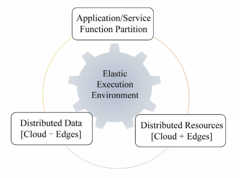

# 背景
## 传统云计算的不足
- 实时性不够
- 带宽不足。如有些设备每秒几G的设备
- 能耗较大。
- 不利于数据安全和隐私。比如数据上传到云端经历的链路过长被敏感数据盗取的风险增大。

## 边缘计算
- 针对上面云计算的缺点，边缘计算应运而生。

边缘计算的操作对象包括：
  - 来自云服务的下行数据
  - 来自万物互联服务的上行数据

边缘计算的边缘是指：从数据源到云计算中心路径之间的任意计算和网络资源，是一个连续统。（注：连续统指连续不断的数集，原意是为了强调实数的连续性而给实数系的另一名称）

## 边缘计算三个明显优点：
- 减少带宽。数据不用全部传到云端。
- 减少时延。不用通过网络请求，请求在边缘端处理
- 减少网络传输中数据泄露危险。

# 发展历程
- 按时间序：
- 最早可追溯：CDN，这个时候注重的是**功能缓存**（function cache）
- 云边缘：Cloudlet,“小朵云”，是一个资源丰富的主机，部署在网络边缘。这个时候开始**强调下行**，即云服务器上的功能下行到边缘服务器，**以减少带宽和时延**。
- 边缘云：万物互联的背景下，数据爆炸性增长，激发了数据传输、计算和存储等方面的问题。**开始着眼于靠近数据生产者的边缘提供功能。** `万物互联服务功能的上行`。
  - 移动边缘计算MEC
    - 在移动用户的无限接入网范围内，提供信息技术服务和云计算能力。**强调在云计算中心和边缘计算设备之间建立边缘服务器**
  - 雾计算
    - 迁移云计算中心的任务到网络边缘设备执行的一种高度虚拟化计算平台。
    - 雾计算关注的是`基础设施之间的分布式资源共享问题`
    - 边缘计算除了关注基础设施以外，还关注设备之间的协同，如边边协同，云边协同，边端协同，还包括这些资源（计算、存储、网络等）的管理。
  - 海云计算
    - 云：云计算中心
    - 海：人类本身、物理射界的设备和子系统组成的终端。
    - 海云计算关注：`"海"和"云"两端`.
    - 边缘计算关注：从"海"和"云"数据路径之间的任意计算、存储和网络资源
- 2013年，Ryan LaMothe首次提出边缘计算（edge computing）一词。

# 支持边缘计算的核心技术
## 网络
- 对网络结构提出3个新的要求
  - 服务发现：服务请求者如何知道周边的边缘计算服务。这是边缘计算网络层面上的一个核心问题
  - 快速配置：用户的动态性，造成(注：`这里应该指的是边缘服务器上的`)服务的动态注册和撤销。**服务通常也需要跟着进行迁移，这样导致大量的突发网络**，如智能网联车。
  - 负载均衡：边缘终端产生大量数据 以及 边缘服务器提供大量服务，**如何动态的对数据进行调度至合适的边缘服务器**。
- 解决方案：
  - NDN命名数据网络
  - SDN软件定义网络
## 隔离技术
- 边缘终端需要有效的隔离技术保证服务的可靠性和服务质量（比如车载娱乐服务影响自动驾驶功能，那这样将后果很严重）。要做到这两方面的隔离
  - 计算资源隔离
  - 数据隔离
- 容器逃逸

------

- 提到了：一种基于Docker迁移的有效服务切换系统。针对边缘服务器

## 体系结构
- 未来的体系结构应该是：通用处理器和异构计算硬件并存的模式。
- 如何高效管理边缘计算异构硬件、如何技术选型、如何对这类的西荣结构进行公平和全面的评测。是亟待解决的问题。

## 边缘操作系统
职能：
- 向下需要管理异构的计算资源
- 向上处理大量异构数据
- 负责将复杂的计算任务在边缘服务节点上，部署、调度和迁移。
- 保证计算任务的可靠性和资源的最大化利用
- 同时要降低能耗

## 算法执行框架
- 执行框架：TensorFlow,Caffe
- 为了更好支持边缘设备执行智能任务，一些专门针对边缘设备的算法执行框架应运而生。如TensorFlow Lite、Caffe2。PyTorch和MXNet等主流框架也开始提供在边缘设备上的部署。

## 数据处理平台
边缘计算场景下，边缘设备时刻产生海量数据，数据的来源和类型具有多样化的特征。（`注：这些都是来自同一个边缘终端的，比如汽车`）这些数据包括环境传感器采集的时间序列数据、摄像头采集的图片视频数据、车载LiDAR的点云数据等,数据大多具有时空属性。**构建一个针对边缘数据进行管理、分析和共享的平台十分重要**。

- 例子：OpenVDAP，这是一个可以搭载在汽车的平台，可以对数据进行管理分析，更好的提供车载应用。

## 安全和隐私
- 边缘计算避免了用户将数据传到云端，降低了隐私数据泄露的可能性。
- 但是，攻击的范围扩展到了各个边缘节点，边缘计算节点的分布式和异构也决定了这个难以统一管理，从而导致一些列新的安全问题。
- 解决方案：可信计算，指在设备上一个独立于 不可信操作系统而存在的可信的、隔离的、独立的执行环境（注：`通常是一些硬件`），`为不可信环境中的隐私数据和敏感数据计算提供一个安全而机密的空间`。

# 面临的紧迫问题
## 编程模型
在**云计算场景中**，用户程序在目标平台上编写和编译，然后运行到云服务器，**基础设施对于用户是透明的**。例如亚马逊基于此编程模型推出的Lambda计算服务，**可使用户无需预配置或者管理服务器即可运行代码**，极大地方便了用户的使用。  
边缘计算模型与云计算模型存在较大的区别，从功能角度讲，**边缘计算是一种分布式的计算系统**（`注：相当于对于边缘计算的编程，是一种分布式编程`），具有弹性管理、协同执行和环境异构的特点。如图所示，边缘计算包含三个关键内容：
1. `应用程序/服务功能可分割。`边缘计算中一个任务可以分成若干个子任务并且任务功能可以迁移到不同的边缘设备去执行。
2. `数据可分布。`边缘数据的可分布性是**针对不同数据源**而言的，也就是说边**缘节点上的任务处理的数据可以来自于多个数据源**。
3. `资源可分布。`只有当边缘计算系统具有数据处理和计算所需要的资源，边缘计算才能对数据进行处理。

## 软硬件选型
边缘计算系统具有`碎片化和异构性`特点。**在硬件上有CPU，GPU，FPGA，ASIC等各类计算单元**，**同一类计算单元也有不同的产品**。例如基于英伟达GPU的边缘硬件产品，既有计算能力较强的DRIVEPX2，又有计算能力较弱的Jetson TX2;在软件系统上，针对深度学习应用，有TensorFlow， Caffe，PyTorch等各类框架，不同的软硬件及其组合有各自擅长的应用场景，这带来了一个问题：`开发者不知道如何选用合适的软硬件产品以满足自身应用的需求`。

## 基准程序和标准
- 那么我们会面临一个紧迫的问题，即如何对这些系统平台进行全面并公平的评测。
- 由于边缘计算场景覆盖面广，**短期来看不会出现一个统一的基准测试集可以适应所有场景下的边缘计算平台**，而是针对每一类计算场景会出现一个经典的基准测试集，**之后各个基准测试集互相融合借鉴**，找出边缘计算场景下的若干类核心负载，最终形成边缘计算场景中的经典基准测试集。

## 动态调度
在云计算下，任务调度一般策略是将计算密集型的任务交给资源充足的任务节点。但是在边缘计算场景下，边缘设备产生的海量数据可能无法通过现有的带宽资源传输到云计算中心进行集中式计算，并且不同边缘设计的计算、存储能力均不同。
因此，边缘计算系统需要更加任务类型和边缘设备的计算能力进行动态调度，调度包括两个层面：
1. 云计算中心和边缘设备之间的调度
2. 边缘设备之间的调度

### 云计算中心和边缘设备之间的调度

云计算中心与边缘设备间的调度分为2种方式：`自下而上和自上而下`。
- `自下而上`是在网络边缘处，将边缘设备采集或者产生的数据进行部分或者全部的预处理，过滤无用数据，以此降低传输带宽；
- `自上而下`是指将云计算中心所执行的复杂计算任务进行分割，然后分配给边缘设备执行，以此充分利用边缘设备的计算资源，减少整个计算系统的延迟和能耗。

- 提到了：Neurosurgeon，一个轻量级的调度器，可以将深度神经网络不同层的计算任务在移动设备和数据中心间自动分配

### 边缘设备之间的调度
- 边缘服务器之间计算、存储的能力不同，而且**随着时间也会变化**，他们承担的任务类型不一样，因此需要动态调度边缘设备上的任务，提高整体系统性能，**防止出现计算任务调度到一个系统任务过载情况下的设备**
- 提到了：针对延迟敏感性的社会感知任务设计了一个边缘任务调度框架CoGTA

----
动态调度的目标`是为应用程序调度边缘设备上的计算资源，以实现数据传输开销最小化和应用程序执行性能的最大化。`  
设计调度程序时应该考虑：
- 任务是否可拆分可调度
- 调度应该采取什么策略
- 哪些任务需要调度等。

动态调度需要在边缘设备能耗、计算延时、传输数据量、带宽等指标之间寻找最优平衡。根据目前的工作，如何设计和实现一种有效降低边缘设备任务执行延迟的动态调度策略是一个急需解决的问题。