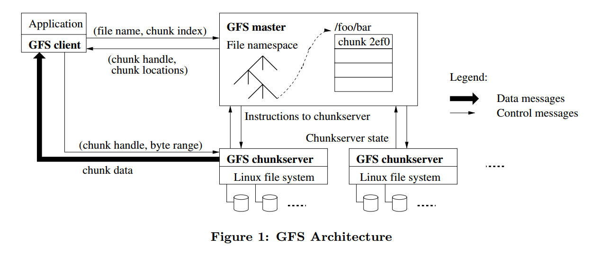

- 翻译：https://mrcroxx.github.io/posts/paper-reading/gfs-sosp2003/#1-%E5%BC%95%E8%A8%80
- 非常好的解析：https://spongecaptain.cool/post/paper/googlefilesystem/

# 1. 简介

- GFS：Google File System
- 功能：可扩展的分布式文件系统，适用于大型**分布式数据密集型应用**（数据是应用的瓶颈的一系列应用）
  - **OLAP**
- 支持
  - 可扩展
  - 容错
  - 多用户同时访问
  - 抽象接口，使用起来就像是本机文件系统

## 1.2 应用场景

### 1.2.1 重新审视 fault

- 关键：**组件故障不是例外，是常态**

- 期望：更好的容错、故障检查和恢复能力

### 1.2.2 重新审视IO操作的块大小

- 关键：**文件通常比较大**，GB级别的文件是很常见的，管理小文件是支持的，但是不做过多优化

- 期望：能够存储几百万个 100MB左右或更大的文件，也能支持GB级文件；**必须支持小文件，但是不对其进行特殊优化**

### 1.2.3 重新审视文件的读写方式

  - 关键：

    - **随机读/写在实际中很罕见**，大多数文件是通过附加新数据而不是覆盖现有数据来改变的，一旦写入，文件就只能被读取，而且通常只能按顺序读取。
    - 鉴于这种对大文件的访问模式，***追加* 成为性能优化和原子性保证的重点**，而在客户端**缓存Data Block就失去了吸引力**
  - 期望：
      - 读工作负载：**大规模的顺序读和小规模的随机读**为系统的主要负载。
        - 顺序读规模：几百KB到1MB或更多。 
        - 随机读规模：几KB
    - 写工作负载：系统负载还来自很多对文件的**大规模追加写入**。必须支持随机写，但是不需要优化。
      - 写入规模：写入的规模与读取的规模相似，写入后几乎不被再次修改
    - 注：（对于性能敏感应用的随机读，**攒批，排序，形成随机读**）性能敏感的应用程序通常会将排序并批量进行小规模的随机读取，这样可以顺序遍历文件而不是来回遍历

### 1.2.4 协同设计应用以及文件系统可以提高系统整体灵活性，最终使整个系统收益

- 关键：提供更符合更合理的应用服务

  - 为了简化文件系统，**放宽一致性强度**。

  - 引入了**原子追加操作**，以便多个客户端可以同时追加到一个文件，而无需在它们之间进行额外的同步

- 期望：

  - （**多用户追加原子性**）系统必须良好地定义并实现并发写，**最小化原子性需要的同步开销是非常重要的**。

    - 文件通常在生产者-消费者队列中或多路归并中使用（即多端写入）
  - **高吞吐比低延迟更重要**

    - 大多数应用程序更重视高速处理大量数据，而很少有应用程序对单个读写操作有严格的响应时间的需求

## 1.3 接口

- 没有实现像POSIX那样的标准API，但还是提供了大家较为熟悉的文件接口
- **文件被路径名唯一标识**，并在目录中被分层组织
- 支持如创建（create）、删除（delete）、打开（open）、关闭（close）、读（read）、写（write）文件等常用操作
- 支持快照（snapshot）和追加记录（record append）操作
  - 快照操作会以最小代价创建一个文件或一个目录树的拷贝
  - 追加记录（record append）指允许多client并发 append data，保证操作原子性

# 2. 架构

- 组成：**master、chunkserver、client**
  - 典型：master worker 架构，mapreduce 也是这种
  - master：存元数据、监听chunkserver...
  - chunkserver：存储chunk
  - client：数据应用，可部署再chunkserver同节点上（如mapreduce的map or reduce tasks）
- file、chunk、chunk handle
  - file name(包含路径) -- 标识--> file
  - chunk handle(8B, derive from master) -- 标识--> chunk
  - file 被划分为若干大小的 chunk
  - 通过 chunk handle, byte range（字节范围）来确定需要被读写的chunk和chunk中的数据
- 分区(partition)与复制(replicate)
  - 分区本质：file 切分为 chunk，**可以将串行转化为并行**
  - 复制本质：每个chunk被冗余存储再多个chunkserver（默认3个，不同的namespace可以有不同指定）
- 元数据：
  - 由master维护
  - 包括
    - 命名空间（namespace）
    - 访问控制（access control）信息
    - file到chunk的映射和chunk当前的位置
    - master还控制系统级活动如chunk租约（chunk lease）管理、孤儿chunk垃圾回收（garbage collection of orphaned chunks）和chunkserver间的chunk迁移（migration，用于扩展）
- HeartBeat ：master周期性地通过心跳（HeartBeat）消息与每个chunkserver通信，向其下达指令并采集其状态信息
- client 与 master 和 chunkserver 的数据交互：
  - 方式：**被链接到应用程序中的GFS client的代码实现了文件系统API并与master和chunkserver通信，代表应用程序来读写数据**
  - master<-->client: 进行元数据操作
  - chunk<-->client: chunk data 相关操作
  - 注：
    - 因为GFS不提供POXIS API，因此不会陷入到Linux vnode层
    - **无缓存**。无论client还是chunkserver都不需要缓存 chunk data，不使用缓存就**消除了缓存一致性问题**，简化了client和整个系统
      - 例外：client需要缓存元数据，减少 Master 的压力

## 2.1 client 读取数据交互过程

- 前提：固定的 chunk size，客户端知道其要访问哪个chunk，但是不知道该chunk在哪个节点
- client 将 （filename, byte offset）转化为文件的chunk index，然后想 master 发送 （filename, chunk index）
  - client send:（filename,  chunk index）
- master 恢复响应的 **chunk handle 和  chunk locations**，客户端使用 （filename, chunk index） 为key，来缓存数据
  - master responce: （filename, chunk index）
  - client cache：Key:{filename, chunk index}, Value:{ chunk handle,  chunk locations}
- client 向其中的一个副本发送请求，请求指定 chunk handle 和 byte range（该chunk 要读取的数据范围）
  - 对同一个 chunk的进一步读取，不需要再与master交互
  - 注：client通常一个请求会请求多个块；master发送的响应可以包含紧跟在请求之后的块的信息，一次避免未来 client-master 的交互

## 2.2 chunk 大小

- **64MB，采用 Lazy space allocation 的方式， 避免内部碎片(internal fragmentation)**
  - 远大于单机文件系统的chunk大小，64bit linux 为8KB，32 bit linux 为4KB
  - Lazy space allocation：在写数据的时候，写攒批一段时间，再写入
  - 大多数块都是满的，只有文件的最后一个块，需要填充
- **chunk_1 ~ chnk_n 在逻辑上是连续的**，但是在磁盘的存储上并不一定是连续的，它们既可能存在**同一个磁盘上的不同地址**上，也可能存储在**同一主机的不同磁盘上**，还有可能存储在**不同主机的磁盘**上；
- chunk size 设置得比较大的好处：
  - 减少 client 和 master 的交互
    - 得益于client会缓存一段时间metadata
  - client更有可能在给定的 chunk 执行更多操作
  - 减少 master 中保存的元数据大小
- 缺点：
  - 管理仅有几个 chunk 的小文件时，这些chunk可能称为热点。
    - 一个可执行文件被以单个chunk文件的形式写入了GFS，然后在数百台机器上启动。存储这个可执行程序的几台chunkserver因几百个并发的请求超载
    - 解决：
      - 通过增加副本数
      - 让应用错开启动
      - client之间互相读取数据（p2p?）

## 2.3 元数据

- Table 1：(HashMap更好)
  - key：file name
  - value：**an array of** chunk handler (nv)
- Table 2：（Searchable Tree 更好）
  - key：chunk handler
  - value：
    - **a list of** chunkserver(v)
    - chunk version number(nv)
      - 对于chunk 的所有写操作，都必须在chunk primary 中顺序化（chunk primary 为其中一个副本）
    - which chunkserver is primary node(which means others are nomal chunkserver in the list)(v)
    - lease expiration time(v)
      - chunk primary 只能在规定的某个租约时间里才能当人primary

- Master 节点内存中的 Table1 与 Table2 中的 nv 数据会定期存储到 Master 的磁盘上（包括 shadow Master 节点）；

---

- master 存储三种主要类型的metadata：

  - the file and chunk namespaces
  - the mapping from files to chunks
  - the locations of each chunk’s replicas.

- 存储

  - **存储在 master 的内存**，前两种(namespaces and file-to-chunk mapping) 还需要**以日志形式持久化到磁盘**，并且备份到远程主机。（**有点类似 levelDB的op log 的思想，可以被replay 恢复**）
  - **master 永远不会存储 chunk 的location，其会在 启动时 或者 有chunkserver 加入集群式，向 chunkserver 询问其上面的 chunk**

- 存储内存的优势和潜在问题：

  - 操作快。可以定期在后台扫描整个状态，从而实现：（**原理和数据库很像，分区复制机制，少节点的时候重新复制，多节点的时候再平衡**）
    -  chunk 垃圾回收
    - chunkserver故障时重新复制
    - 以及添加节点时chunk的迁移（再平衡）

  - 空间不足怎么办（潜在问题），解决/分析：
    - 因为每个 chunk 都压的足够实，所以元数据自然比较少
    - 对文件名进行前缀压缩（回想levelDB中的 sstable ）
    - 向主服务器添加额外内存的成本是一个很小的代价

- **chunk 的位置信息：为什么master不持久化chunk的位置信息**
  - master启动时轮询，可以使得数据是最新状态
  - 不持久化到master，而是通过启动时询问以及启动后周期性请求，其实现会更加简单。
    - 消除了当chunkserver加入或离开集群、更改名称、故障、重启等问题时，保持master和chunkserver同步的问题。在有着数百台服务器的集群中，这些事件都会经常发生。
  - **chunkserver对其磁盘上有或没有哪些chunk有着最终决定权**

### 2.3.1 op log

- GFS的核心

- 职能：
  - metadata 唯一被持久化的记录
  - **作为并发操作的逻辑时间线**
    - 文件和chunk，以及它们的版本（参见第 4.5 节），都由它们创建的逻辑时间唯一且永恒地标识
- **在落盘到op log之前，metadata 不能被用户所见**（类似levelDB 中 wal 和 memtable）

- **强一致性（必须被可靠存储）**：
  - 将op log 复制到多台远程机器上，并且只有在本地和远程将相应的日志记录刷新到磁盘后才能响应客户端操作
- **攒批写入&复制**：master 在 flush 之前将多个 op log  攒批，然后一起写，减少 flush 和 replication 对系统吞吐的影响
- **checkpoint**:
  - 职能：加快 replay
  - 机制：
    - 当日志超过一定大小时，master会对其状态创建一个检查点（checkpoint），这样master就可以从磁盘加载最后一个检查点并重放该检查点后的日志来恢复状态
    - 可以在不推迟新到来的 update 下，创建 checkpoint。创建检查点时，master会切换到一个新的日志文件并在一个独立的线程中创建检查点。**这个新的检查点包含了在切换前的所有变更**
  - 结构：B树，Key为namespace（猜的）
    - 可以在内存直接被映射，查找命名空间时不需要进行额外的解析，进一步提高了恢复速度，并增强了系统的可用性
- recover：需要最后一个完整的检查点和后续的日志文件

## 2.4 Single master

- Single Master
  - 好处：简化系统设计
  - 缺点：宕机系统就瘫痪了
- 注意：必须最小化master节点在读写中的参与

-  GFS Master 节点负责的工作是系统级别的控制，主要有：
  - chunk lease manager；
  - garbage collection of orphaned chunks；
  - chunk migration between chunkservers；
  - append record 原子性的确保；
  - 对于 metadata 的维护以及为索要 metadata 数据的 GFS 客户端做出正确的响应；

- master可以通过全局的信息做复杂的chunk分配（chunk placement）和副本相关的决策
- master更换需要手动切换，这可能需要话几十分钟或者更长的时间

## 2.5 Consistency Model

- 保证：文件 namespace 的变化是原子的。
  - 由 master 专门处理，namespace lock 保证原子性和正确性， master 的 op log 定义操作的全局顺序

- 数据修改后，文件区域状态(file region) 的保证。取决于以下条件：
  - 修改类型（随机写还是顺序写）
  - 修改的成功与否
  - 是否存在并发修改

- **file region status define**：
  - **consistent**：无论 GFS Client 最终是从哪一个 GFS chunkserver replica 上进行数据读取，所有GFS Client 将总是看到完全相同的数据
  - **defined**：consistent基础上，client 能及时看到全部修改
    - 即看到是一致的，同时看到的是最新的
    - define 的要求是在 consistent 的基础之上，要求更高。
  - consistent but undefined：consitent 但是不能及时看到任意修改
    - 看到是一致的，但是可能不是最新

## 2.6 Write 过程

- 不保证最终一致性。

- case：No primary on master
  - client->master: find up-to-date replicas (让每一个副本中的chunk版本等于master服务器知道的最新版本号，这些版本号是master分发的)
    - 问题：master 保存该chunk最新的 version值，但是假如该值为17，但是访问一遍所有 chunkServer，该chunk的version都没有达到17，那么该怎么处理？（开放性问题）
      -  master 可能让 client 等下再问，它无法回答这个问题
      - master 也可以先不回复，先等待一段时间，等recover之后再回复client.
    - 问题：如果master 保存的chunk‘s version比chunkserver发过来的小，怎么办？
      - 这个时候 master 会认为是其在分配 primary 的时候出错了
      - 出错的时机可能是其将primary发送给 chunkserver 之后才持久化
      - 这个时候 master 会将 version 更新为该更大的值 
  - master: 
    - 选择其中一个副本作为primary，将其他副本作为 secondary servers，然后将 version 递增，并持久化 
    - 接下来请求 primary 和 secondary ，通知他们都是什么身份，这些 chunkserver 都将version写入磁盘，其重启的时候，需要拿该 version值和master 汇报
      - **primary 的工作**：接受客户端的请求，将这些写入进行组织成一定顺序，然后应用于各个 chunkserver
        - **注：这个不就是数据库的主从结构吗，每个chunk看成一个数据库，只有一个master节点上允许写，读的话所有节点都可以读**
    - 会给某个primary一个租约，告诉 primary 这段时间你将是primary
    - 之后master 将 primary 和 secondary 节点告诉client
  - client->primary chunkserver:
    - client 将要追加的数据副本发送给 primary 和 所有的 secondary，
    - primary 和 所有的 secondary 将数据写入临时位置（此时这些数据不会追加到文件）
    - 等 primary 和 所有的 secondary  都收到数据并回复后，client 发送消息给 primary（告知所有 secondary已经收到了）
    - primary
      - **primary 可能此时正从很多不同的client接收此类写请求，这时候其会选择某种顺序一次执行所有的client的请求，并把数据追加到文件**、
      - primary **查看文件末尾的偏移量**，确保该chunk还有足够的剩余空间，将 client 记录写入当前chunk的末尾，并告诉所有secondary也将其写到末尾的相同偏移量处。 
      - primary如果收到所有secondary的 yes 回复，则将向client回复 yes。如果没有收到某个secondary 的回复或者收到错误，则向client回复 no。
        - 问题：（类似2PL的问题）如果只有一个 secondary  失败，但是其他节点都已经将数据写到末尾了，怎么办啊？
          - **GFS不保证副本一致**
        - 如果client 收到no。那么表示有 0个或者多个节点已经完成了数据的追加，这个时候的数据是不一致的。
  - client 如果 收到 no，会重新发出写请求知道成功，这个时候只要 primary 的文件末尾 offset 没有更新，就会是幂等的

- Version 仅在 master 分配新的 primary 的时候更改
- 租约的作用（防止 split brain）
  - 比如现在不使用租约，而是在心跳机制下来确定primary，比如如果心跳超时，那么换primary。由于primary是要被告知给 chunkserver（用于身份认同） 以及 client（用于发送写请求），所以这种情况下如果某个 chunkserver 网络出现抖动，这个时候 primary被换了，那么就出现了两个 chunkserver 都觉得自己是 primary，并且可能有两个client在不同时间点被告知不同的primary，这个时候出现脑裂。
  - **租约保证，一个时间段内只有一个primary**
    - 注：个人觉得，这个还涉及了时钟的问题
- 如果client发送到其自以为的primary，但是实时上这个节点已经不是primary了，那么该节点会进行重定向。

> 不可思议的情况

- 并发地进行 record append 操作，依次写入（primary 定的序）B、C 数据块，如下图所示

- 一开始所有副本都是同步的，这个时候并发写入 B和C；
- primary 将 B 先写入，然后广播给所有的 secondary（告诉其写入B和指定写入的offset），这个过程是异步的。紧接着primary就马上处理C，执行同样的操作。
- 后面primary发现 secondary_2 写入失败了，告知 client no；
- client 决定重新写入 B，第二次就写入成功了。最终的各个副本的情况如上图所示。出现了副本不一致，而这在GFS中是允许的。
  - 毕竟在OLAP中出现这一点小差错，是小事，可以忍。
  - OTAP就直接扑街了吧

- 问题：
  - 目的：
  - 基本单位是啥，如何分块
  - 如何复制的
  - 如何原子改名
  - 如何容错
  - 如何保证一致性
  - 如何扩展
  - 如何支持多用户

