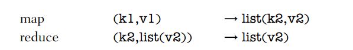
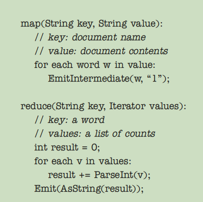
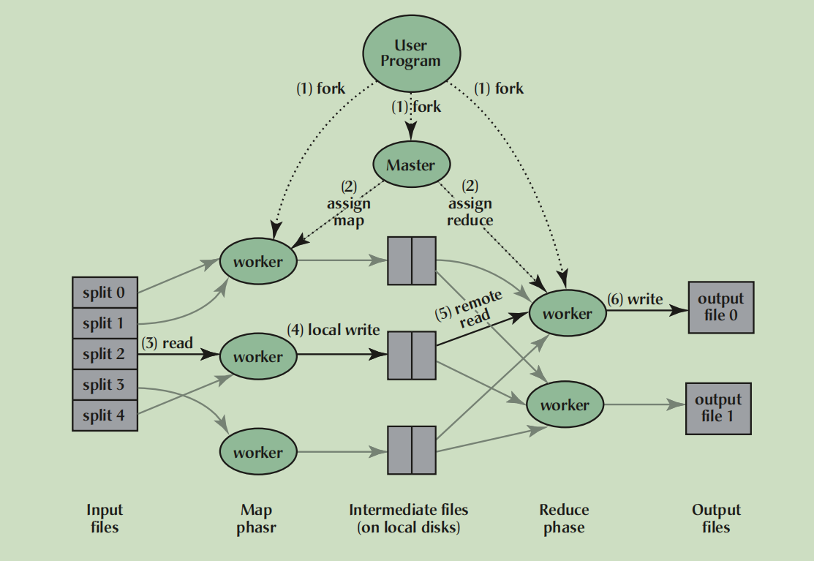
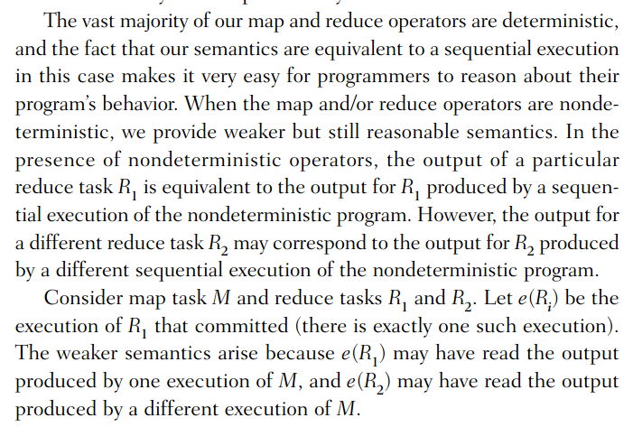

- 译文：https://developer.aliyun.com/article/31829

[TOC]

# 概述

- MapReduce：一种编程模型（programming model）和框架实现思想，屏蔽底层的细节，从而实现大规模集群上的并行计算和任务分配，也**可以用于单机的并行计算**。
  - **抽象（Abstarction）**：处理一个 Job，只要用户指定了 `map` 和 `reduce` 函数。底层将把该 Job 分成多个 task ，在机器集群上进行并行计算。而不需要用户去 处理故障、控制机器间通信、控制机器中的资源利用。
    - 隐藏了并行化、容错、数据分布和负载平衡的
  - **容错（fault tolerance）**：重执行（reexecution）
- 作业（Job）：一个需要大规模计算的Job。用户所提交。
- 任务（Task）：mapreduce将 job 的完成，切分成一系列的 tasks。MapReduce所切割。

## map & reduce

- `map`：
  - 职责：处理输入的数据，输出中间数据（分治）
  - 输入：`<k1,v1>`。（eg：key 为文件名， value 为文件内容）
  - 输出：`set(<k2,v2>)`。intermediate键值**集合**（临时数据，不存在相同的 key）。
- `reduce`：
  - 职责：归并map的输出，输出尽可能小的结果集合。（merge）
  - 输入：`<k2, list(v2)>`。（一个map产生 `<k2,v2>`，将所有map的输出（`<k2, list(v2)>`）进行归并），将 intermediate key 相同的 intermediate values 组合在一起（combine）。
    - intermediate values 通过迭代器提供给用户的reduce 函数，这样可以处理太大而无法放入内存的value list
  - 输出：`list(v2)`
    - 每次 reduce 调用只产生0或1个输出值
- 注：输入的键值与输出的键值属于不同的域，而**intermediate 键值与输出属与相同的域**。
  - 域是什么？看下面的demo就知道了
    - 对于输入：键为文件名，value为文件内容
    - 对于输出：键为单词，value为单词出现次数

> demo

- 计算文档中每个单词出现的次数

# 实现

- `M` ：`M` 个 `map task`
- `R` ：`R` 个 `reduce task`
- partitioning function(eg. hash(key) mod R )：分区函数。相同的key一定落在相同的分区

## 步骤

- **切割输入**：将输入的文件切割成 `M` 块（通常每块16-64MB）
- **fork出Master和Worker**：启动程序的多个副本（fork ===> `Master, Worker`)，分别为 一个Mater和多个Worker
  - `Master`：调度者。仅有一个，给 `idel worker` 分配 `map or reduce task`
  - `Worker`：执行者。有多个，执行被分配的 `task` 并读取被切割的输入。
  - 注：可以看成单机上的系统调用 `fork` 去理解。可以将Worker看成内核线程，task看成协程
- **map task**：被分配 `map task` 的 `worker`，读取相关的数据片段，调用用户定义的 `map`，之后 `map` 生成并输出 `intermediate key/value` ，这些数据将缓存在内存中。
  - 缓存中的 `key/value` 根据 `partitioning function` 被分区到R个区域，并在 **本地磁盘** 持久化，之后将这些 `key/value` 的**位置**告诉给 `Master`，Master 负责把这些位置通知给 `Reduce Worker`
- **reduce task**：
  - reduce被告知其 相关的 `intermediate key/value`的磁盘位置后，通过RPC读取这些数据。为了让相同的key聚合，需要对这些数据进行排序（如果规模比较大需要外排序）。
  - 迭代排序后的 key ，**将 key 和其对应的 value 集合**交给用户定义的 `reduce` 处理， **处理之后将输出追加到与该 reduce 对应分区的 一个最终输出文件中**
    - 当所有的 reduce 执行后，共有R个输出文件（每个reduce任务一个），通常不需要对这些文件进行归并，其也可以作为下一次 mapreduce 的输入
  - 注：相同的 `intermediate key` 只会在同一个 reduce task 中被处理。
  - 注：需要等到所有数据都准备好了，才可以执行 reduce。累积所有 worker上的Map生成的所有 对应分区的key/value。reduce需要该key在map中生成的所有实例
  - 注：有点批处理的方式，比如reduce必须等到所有数据都具有了才能执行。而现在基于MapReduce的思想的一些实现是可以实现面向流的，这样使其更加高效。
- **notify user**：当所有的 map & reduce tasks 完成，则唤醒 User program。

## MasterData Structure

- master 中存储的数据：
  - 每一个 `map task` 和 `reduce task` 的状态（idle, in-progress, or completed）
  - worker machine的标识
  - intermediate data 的位置和大小（每个Map task 要存其R个中间文件的位置和大小）
    - master起到了一个类似管道的作用。促进map和reduce中进行数据的传输
    - 注：这些信息是逐步推给 reduce worker的，而不是等到该分区数据全都好了。

## fault tolerance

* 很重要，因为往往需要管理上千台机器上的并发任务， fault 的发生非常常见

> worker failure

- 保活：master 周期性 ping worker
- 已完成的 task，worker失效处理：
  - map：将分配给该worke的 map task 设置为初始状态，以至于能够被重新调度。重新执行会通知给所有执行 reduce 的 worker，比如A宕机了，会告知现在是B worker在处理这个map，中间数据从该节点拿，并告知其位置。
    - 为什么要重新调度：因为中间数据存储在该worker节点本地磁盘，这样宕机了，reduce worker读取不到
  - reduce：不需要重新执行
    - **因为已经将其存储在了全局文件系统上（如GFS，自带冗余）**
- 正在执行的task，worker失效处理：
  - 对于任何 task 也一样，直接将其设置为初始状态

> master failure

- 直接终止 mapreduce

> 语义上保证

- 属性：如果 map 和 reduce 的操作是**确定性**的，则即使MapReduce的过程中出现一些错误，最终的结果仍与无故障顺序执行产生的输出相同
- 属性依赖于：map 和 reduce 任务的**原子提交**。
  - 每个 task 都将其输出写入私有临时文件（对于map输出R个这样的文件，reduce输出一个）
  - 体现：
    - map：map在所有的数据处理完后，给master发送完成响应（包括这R个中间文件的信息，如文件名），如果master已经有该信息了，则忽略，否则保存到内部的状态中。（注：此时的写入是写入到本地文件系统）
    - reduce：当一个 reducer task 完成之后，对应的 worker 原子的 rename临时文件名（注：写入到分布式文件系统）
      - 依赖底层文件系统提供的原子命名操作，**保证如果有多个 相同的reduce 在多个机子上跑，最终的文件系统只包含了一个reduce过程所产生的数据**

- 非确定性的理解不到，但是不重要。
  - 不理解非确定性所保证的语义

## 存储位置

- GFS会将文件切割成64MB的块，这些快会做一些冗余
- **输入本地化**：为了减少网络资源的消耗，MapReduce中的master在分配 map task的时候，会尽量将 map 分配到 input file 的通过机器或者物理位置相邻的worker上。
  - **保证Map大部分的输入数据都是从本地获取的**

- **shuffle（洗牌）：该操作在MapReduce有很大性能消耗**。（map task output 的是不同 key 的一行（key value 中间数据），而 reduce 需要是相同key下对应的一系列value（如果将多个map的输出堆叠起来，reducce 所需要的数据看起来就是几列数据））
  - 所以需要将列数据放到reduce所在节点，该过程使用网络资源，非常耗时

## 任务粒度

- 讨论的问题：M和R要取多大
- M和R的大小有时间和空间上的限制
  - master需要做O(M+R)时间复杂度的调度
  - master需要再内存保持O(M*R)状态

- 建议：
  - 通常M+R应该远大于worker数
    - 因为这样出现局部故障的时候，可以更加均衡的重新调度，并且加快故障恢复。
  - 选择合适的M值，让input file 的大小尽量在 16MB-64MB
  - R值一般为 worker 数的较小倍数。
  - EG：`M=200,000 and R=5,000, using 2,000 worker machines`

## 备份执行

- （木桶效应）MapReduce job的完成时间，取决于最后一个worker(straggler)的完成时间。如何减少straggler的影响？
- **当 MapReduce 快要完成的时候，** master会让正在执行，但是还没完成的task **备份执行(backup execution)**，只要有一个备份已经完成了，该task 将被标记为 completed 状态。
  - 经过测试，这种机制大幅加快性能。
- 注：这种机制还得益于 GFS 的操作原子性。

# 个人思考/后期注意

## 1. 任务均匀性问题

- map task 的均匀性得益于手动均匀的分配，而 reduce task 的均匀性得益于hash算法的均匀性。

## 2. map reduce 非确定时怎么办

- 文章只是简单提了下，不理解

## 3. 输入局部性

- map task 的输入可以很大程度上保证从本地获取
- reduce task 的输入只能从多个worker中去获取，因为map task 输出是直接输出到本地，而不是分布式块
- 为什么不将 map task 的输出，输出到即将执行reduce task 的节点上呢？
  - 这样会给系统带来复杂性
  - fault tolerance 变复杂不说（比如节点宕机，还得判断其输出文件到哪个阶段了，是已经传到目标worker还是还没有，而输出文件又有R个），效率也变低（如果map所在机子宕掉了，那么中间的网络资源也就白白浪费）
    - 更重要的一点，做语义上的保证较为困难，原本是保证确定性的map/reduce，出错时只要再执行一次就可以，现在map如果出错，那么其错误状态分析要分析 R个文件的去向，而如果仅在本地上存储就不需要。直接redo map task 就ok

## 4. 瓶颈

- 最大的瓶颈在于网络，见文章的性能测试
- shuffle 的性能消耗
