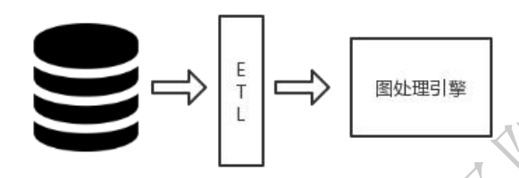
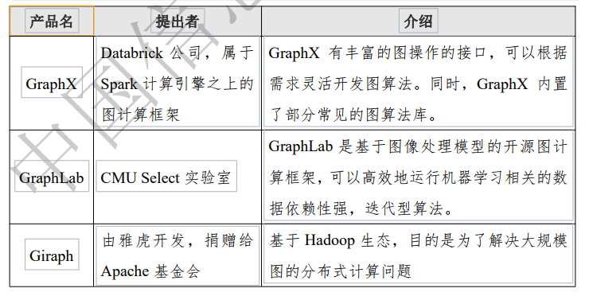

- [概述](#概述)
  - [图模型](#图模型)
  - [图数据库](#图数据库)
    - [技术架构](#技术架构)
  - [图数据计算](#图数据计算)
    - [OLAP & OLTP](#olap--oltp)
    - [分析算法](#分析算法)
  - [图处理引擎](#图处理引擎)
- [图数据库选型](#图数据库选型)
  - [基本能力](#基本能力)
  - [分布式能力](#分布式能力)
  - [性能](#性能)

# 概述
## 图模型
- RDF图
- 属性图

> 属性图

> RDF图
- RDF 主要针对文本语义的场景，用三元组（subject-predicate-object）来表达。因此基于 RDF 图模型的图数据库又称**三元组数据库**。
- 通常意义的 RDF 模型在**顶点和边上没有属性**，只有一个唯一的**资源描述符**，这是**与属性图模型最根本的区别**。
- 顶点属性可以通过顶点与属性值（literal）之间的边来表示，**边的属性则比较复杂，需要将每条边表示为顶点，然后再将属性与之相连**

> 区别
- RDF 图可以更好地支持多值 属性；
- RDF 图不支持两顶点间多个相同类型的边；
- RDF 图不支持边属性

## 图数据库
- 根据底层存储实现的不同，分为
  - 原生(Native): Neo4j
  - 非原生(Non-native): Titan、JanusGraph

- 国内数据库产品以属性图为主，并且有向分布式发展的需求与趋势。多使用自研的查询语言，部分产品支持 Cypher 或 Gremlin 等查询语言

- 语言：Cypher，Gremlin 和 SPARQL

### 技术架构

- 接口层（为了交互)：接口层对外提供服务，有如下几种方式
  - 查询语言接口：提供除该图数据库原有查询语言之外例如 Cypher、Gremlin 等主流图查询语言接口
  - API：提供  ODBC、JDBC、RPC、RESTful  等接口与应用端交互
  - SDK：在 Python、Java、C++等编程语言中通过库函数的方式调用图数据库的接口
  - 可视化组件：通过图形化界面的形式展示和实现用户的交互
- 计算层：提供对操作的处理和计算，包括语法解析、查询引擎、优化器、**事务管理、任务调度和图算法实现**等。其中，图算法可能是由图数据库本身提供，也可能是提供接口与图处理引擎对接
- 存储层：图数据库有原生和非原生存储两种存储方式，**图存储引擎提供了图数据结构、索引逻辑上的管理**
  - 注：目前阶段的密态知识图谱，实际是图存储引擎

## 图数据计算
1. **图遍历（Graph Traversal）**：也被称为图搜索（Graph Search），是指**访问图中每个顶点的过程**。对图的访问和更新都以图遍历为基础。**图遍历常见算法包括**：广度优先搜索（Breadth First Search,BFS）和深度优先搜索（Depth First Search,DFS）

2. 路径发现（Path Finding）：用以识别最符合大型网络中**两点之间**某些条件下的最短路径。**路径发现常见算法包括**：最短路径（Shortest Path）、最小权重生成树（Minimum  Weight  Spanning Tree, MST）和两两最短路径（All Pairs Shortest Path，APSP）

### OLAP & OLTP

- 用户常常会提出比实时查询更为复杂的分析需求以挖掘图数据中的潜在价值。
- 在图算法的实现上，最理想化的选择是在图数据库上直接实现图算法，但由于**图数据库更侧重于高并发和海量存储，全图算法更侧重于迭代计算**
- 目前更为常见的选择是提供另外**图处理引擎与图数据库集成**(注：复杂计算与图数据库分离，图数据库只需要提供结构)：从图数据库对接或导入数据到图处理引擎中进行离线分析，结合其更为强大的计算能力对全图进行迭代计算，寻找某种特定模式（社区发现或欺诈模式）或者路径，满足数据挖掘的应用需求。

### 分析算法
1. 中心性（Centrality）：是社交网络分析（Social network analysis,SNA）中常用的一个概念，用以表达社交网络中一个点或者一个人在整个网络中所在中心的程度。通过知道一个顶点的中心性，可以**用来了解和判断该顶点在网络中所占据的重要性**。
   - **中心性常见算法包括**：佩奇排名（PageRank）、中介中心性（Betweenness Centrality）、紧密度中心性（Closeness Centrality）和调和中心性（Harmonic Centrality）。

2. 社群发现（Community detection）：用以划分复杂网络的社群结构。在复杂网络的研究中，如果网络的顶点可以容易地分组成顶点集，使得每组顶点在内部密集连接，则称网络具有社群结构。这意味着社群内的点的连接更为紧密，社群间的连接较为稀疏。
   - 社群发现常见算法包括：Louvain 算法和标签传播算法（Label Propagation）。

3. 图挖掘（Graph Mining）：是基于图的数据挖掘，用来发现数据的模式。通过分析图数据，发现有趣、意外、有用的模式是非常必要的，可以用来帮助理解数据或做出决策。在社交网络、医药化学、交通运输网络等诸多领域中有着重要意义。
  - 常用的图挖掘算法包括**频繁子图（Frequent Subgraph）和数三角形（Triangle Counting）**。

## 图处理引擎
- **图处理引擎**又称**图计算框架**，主要用来做复杂图分析，是一种能够针对大型数据集运行图计算算法的技术
  - OLAP
  - 强调全局查询
- 图处理引擎可以**独立于图数据库**，可以使用任何系统作为数据来源。

# 图数据库选型
## 基本能力
- 提供对点和边的数据操作能力，如果是属性图还需提供点和边的属性的数据操作能力。
- **图数据库还应当提供事务、索引、查询语言、应用开发接口、存储过程、访问接口等多个方面的功能**，具体指标包括几类：
  - 常用数据类型，字符集，数据模型，数据库基本操作，算术能力，查询语言等的支持能力；
  - 索引，单机事务，可视化，服务端编程等的支持能力；
  - 数据批量导入导出，数据批量更新的支持能力；
  - 图遍历，基础图算法（图遍历、路径发现算法），图分析接口的支持能力

## 分布式能力
- 分布式计算与存储能力，提供容量和性能的扩展以满足更大的图数据规模和更高的复杂操作的处理效率需求；
- **图分区能力**，应对大规模图数据在分布式系统的**切分问题**；
- **分布式事务能力**，保证系统支持一定隔离级别下的  ACID  特性；
- 在线扩容能力，能够尽量在不影响已有任务正常运行的前提下进行扩展；
- 负载均衡能力，通过将数据进行恰当的划分/重分布来尽可能地避免由于负载不均衡导致的资源瓶颈。

## 性能
- 在具体的性能测试报告中，需要披露以下信息：
  - 测试的硬件环境，包括服务器节点规模、网络链路、内存总量、CPU 总量、磁盘总量等；
  - 测试的数据情况，包括图的数据规模（通常以点和边的数量 为单位）、图的疏密程度；
  - 数据导入耗时；
  - 测试的性能数据，包括可支持的关联查询深度、对应延迟与吞吐。