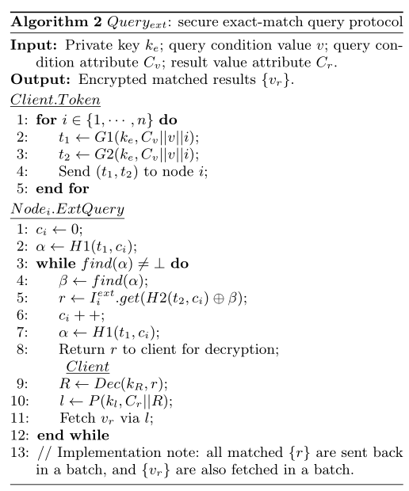

- [INTRODUCTION](#introduction)
- [OVERVIEW](#overview)
  - [系统架构](#系统架构)
  - [威胁假设](#威胁假设)
- [方案](#方案)
  - [Exact-match Index and Query Protocol](#exact-match-index-and-query-protocol)
    - [索引构建](#索引构建)
    - [检索](#检索)
  - [Range-match Index and Query Protocol](#range-match-index-and-query-protocol)
    - [构建](#构建)
    - [Enhanced ORE scheme](#enhanced-ore-scheme)
    - [查询](#查询)
# INTRODUCTION
- 挑战
  - 合适加密原型的选择
  - 系统数据泄露的最小化
    - 在实际系统中实现丰富查询可能会揭示泛型原语中没有考虑的辅助信息。例如，不同属性上的数据值之间的关联有时会不必要地暴露出来，而且已经被证明是可以利用的，从而导致数据机密性受到损害。

- 支持的查询，两类：
  - exact-match queries (keyword search, equality test and counting)
  - range-match queries (range search and prefix match)

- 加密原语
  - searchable symmetric encryption (SSE) ：
    - D. Cash, J. Jaeger, S. Jarecki, C. Jutla, H. Krawczyk, M.-C. Rosu, and M. Steiner. Dynamic Searchable Encryption in Very Large Databases: Data Structures and Implementation. In Proc. NDSS, 2014
  - order-revealing encryption (ORE)
    - K. Lewi and D. J. Wu. Order-Revealing Encryption: New Constructions, Applications, and Lower Bounds. In Proc. ACM CCS, 2016
      - EncKV 对该方案进行改进，在密文比较中采用随机排序，只允许服务器知道查询条件是否匹配

- 不理解，但挺重要： EncKV follows the guideline of the encrypted local index framework given in \[33\]; that is, the client needs to track the location of each data record when it builds the local encrypted indexes2 that index the data records on each node respectively.
  - EncKV 遵循 [33] 中给出的加密本地索引框架的指南； 即客户端在构建本地加密索引时需要跟踪每条数据记录的位置(注：这个位置是指在哪个节点的意思？)，分别索引每个节点上的数据记录。
  - 在分布式数据存储中，“本地索引”意味着每个节点存储一个仅对其本地记录进行索引的索引

- 文章贡献：
  - 多节点分区存储，每条键值对中有多个属性
  - 支持丰富检索（ keyword search, equality, count, join, range, like, sum, average, group by, max, and min.）
  - 安全保证
  - 性能线性可伸缩。（节点越多，查询延迟越小）

# OVERVIEW
## 系统架构
- 系统架构，包含两部分：
  - 客户端：
    - 发起查询
    - 数据加解密
    - 加密索引构造以及查询令牌的生成
  - 服务器节点：
    - 密态数据存储
    - 提供查询功能

- 对于EncKV中的每一条数据，将其加密为 **label-value (LV)** ，简称LV pairs。
  - 这种处理允许EncKV使用标准的数据分区算法(即一致的哈希)在节点间均匀地分发加密的数据记录
- EncKV要求客户端维护一个小型的**一致的哈希环（hashing ring）**，该哈希环表示与每个节点相关联的标签范围
  - 构建：客户端直接将 LV pairs 插入到目标节点，并在每个节点**构建加密索引**。
  - 查询：根据查询条件生成令牌集，将令牌集广播到每个节点。每个节点处理令牌，匹配`encrypted record IDs`。客户端通过解密记录ID，生成 **label** 来获取加密结果值。
- remark
  - 没有添加 dummy record
  - 每次查询需要两次交互。一次获取 `encrypted record IDs`，另一次通过 label 获取 value。
  - EncKV的索引框架需要客户端为所有节点生成查询令牌，每个节点产生局部结果。这样的优势是可以并行处理

## 威胁假设
- 客户端可信
  - 不会向服务器节点公开密钥，密钥安全地存储在客户机上
  - EncKV假设攻击者永远无法访问客户端的私钥
- 攻击者可以从服务器节点转储所有加密的索引和KV对
- 攻击者可以监视查询协议，了解查询令牌、访问的索引条目和加密的结果
- EncKV不考虑攻击者可以访问查询和数据集的背景信息的情况

# 方案
- 注：
  - 我觉得**EncKV，其实并不算是一个密态键值数据库，个人觉得最后的方案是要支持一种关系型数据模型的非原生关系型数据库**，同时保证数据的机密性。底层使用的是键值数据库来对 关系型数据库 进行列存储。（像TiDB）
    - 即底层的操作不再是基于B树的索引结构了，而是基于键值列式存储，如下图所示。
  - 在Cash方案中，要对keyword建立密态索引，索引到 {document_id}。通过 document_id，检索到 document。
  - 在EncKV方案中，对Col_Value建立密态索引，索引到 {row_id}。通过row_id，可以检索到 `other_col_value`
- 基于作者之前提出的一个加密键值数据方案\[33\]。该方案两个特点。EncKV 在此基础之上，时效内富查询。
  - 提出一种安全的数据分区算法
  - 提出加密的本地索引框架。我的理解就是可以在节点上进行密态检索。
- 前面工作：
  - X. Yuan, X. Wang, C. Wang, C. Qian, and J. Lin. Building an encrypted, distributed, and searchable key-value store. In Proc. ACM AsiaCCS, 2016.

> 加密数据
- 每个记录（row）上的每个字段值（col），被构造为一个加密键值进行存储。
  - **通过 row_id||col_name，获得 value。 下面介绍的密态索引则是通过 `<Col_value, {R}>` 获得 row_id set `{R}`**。
- $$<P(k_{l}, C||R), Enc(k_{v}, v)>$$
  - kl, kv：私钥
  - C：列名
  - R：Record id（row prime key）
  - v：value

- 其他：
  - 同一记录（row）的加密数据都在同一个node上
  - 打乱存储顺序保护辅助信息，如隶属和底层值之间的关系
  - 由 client 维护 hashing ring，并记录值存储在哪个node。

##  Exact-match Index and Query Protocol
### 索引构建

- 该过程由client 执行。受到Cash的方案所启发。
  - 这种场景下键值对含义为：`<Col_value, {R}>`，也就是要支持通过值，找到对应的 row_id(record_id, prime key)
- i: 节点 id
- j：当前行数
- {v1,...,vm}：某一列的所有值
- t1, t2：陷门
- cij ：counter。m列值集合（大）映射到 n节点集合（小），所以存在重复，因此需要一个计数。**（i || j）**

1. 计算值 `vj` 存储在哪个节点 i
2. 生成陷门 `t1,t2`
3. 检索counter `cij`，并更新counter
4. 生成密态索引 `a, β`， append to `I`

### 检索

- 场景：要查询 `Cv = v` 的行所对应的`Cr`的值.
  - 即： `select Cr from table where Cv = v`

1. Client端：根据 `Cv、v、i` 生成多对陷门（对数为node总数），将陷门发送给对应的node。
2. node端：
   1. init counter c
   2. 计算密态索引中的 a，并检查 a 是否存在
   3. get β by a
   4. 根据 β 计算出加密的 row_id，记为 r
   5. goto 1
   6. 分批发送 `{r}` 给client
3. client端：
   1. 解密 `{r}`
   2. 通过 `row_id`，`Cr`，`kl`，可以计算出 `P`，发送到node端检索，即可获得加密数据
      - $$<P(k_{l}, C||R), Enc(k_{v}, v)>$$

## Range-match Index and Query Protocol
- 问题：
  - 现有的大多数ORE算法，会比SSE泄露更多信息，如 order。最近的攻击也表明，可以通过泄露的order来回复密文的底层值。
    - ORE需要具有更强安全性，也就是说密文应该是其底层值的**语义安全加密**。即攻击者如果获得了加密的数据库，他们永远不会知道任何有用的信息。
  - 实现语义安全也不一定安全，因为在查询期间也可能泄露。
    - SecKV没有解决该问题

- SecKV解决以上问题的核心思想：隐藏查询令牌（陷门）和密文比较的顺序

### 构建

- 该过程由client 执行
1. 通过值 `vj` 的row_id计算存储在哪个节点 i
2. 生成陷门 `t1,t2`
3. 检索counter `ci`，并更新counter
   - 注意不再是 `cij`
4. 生成密态索引 `a, β`， append to `I`
   - 注意 β 的计算用到了 ORE

### Enhanced ORE scheme

- B：总块数。即 v 被分割成B块
- b：每块的位数
- j：如果b = 2。则j为{00, 01, 10, 11}的遍历
- j*：j的置换
- v|i : v 的第 i 个分块
- Q: 暂时不知道是什么，可能是ORE算法里的东西。SecKV在此上面进行封装

- 注：这构建效率，一看就不怎么样

### 查询
- 时间复杂度：n(节点数) * c(本地索引条目) * B(块数) = 总索引数 * B(块数)
  - 很离谱的效率，相当于遍历所有索引了
- IO次数：n次

