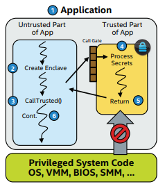
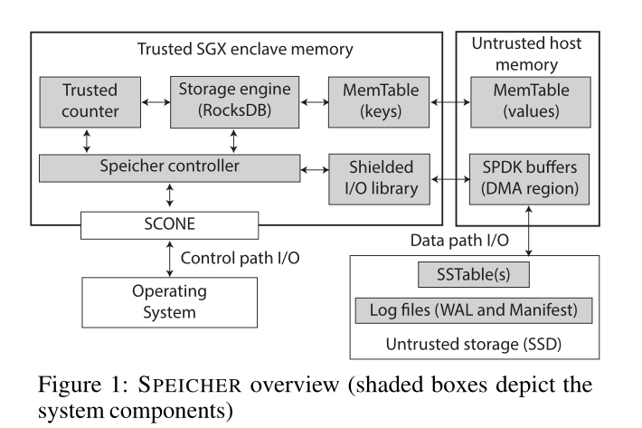

- [Introduction](#introduction)
- [Background and Threat Model](#background-and-threat-model)
  - [Intel SGX and Shielded Execution](#intel-sgx-and-shielded-execution)
  - [Persistent Key-Value (KV) Stores](#persistent-key-value-kv-stores)
  - [Threat model](#threat-model)
- [Design](#design)
  - [Design Challenges](#design-challenges)
  - [System Components（系统组件）](#system-components系统组件)
    - [SPEICHER controller](#speicher-controller)
    - [Shielded direct I/O library](#shielded-direct-io-library)
- [补充](#补充)
  - [rollback attack](#rollback-attack)
    - [攻击实现](#攻击实现)

- `SPEICHER` : 
  - （安全属性）提供了强大的**机密性**和**完整性**。而且还保证了数据的**新鲜度(freshness)**，以防止**回滚/分叉(rollback/forking)攻击**。
  - 提供基于LSM的键值数据库所支持的接口
  - 支持安全的数据存储和查询
  - 通过基于硬件辅助的可信执行环境（TEE）的屏蔽执行（shielded execution ）来保证**安全属性**，比如Intel 的 SGX。然而SGX只保证 SGX enclave内存区域的安全。
    - SPEICHER 的设计将 shielded execution 中的**信任扩展到安全的SGX enclave内存区域之外**，以确保安全属性也保存在不可信存储介质的有状态(或非易失性，如SSD)设置中，包括系统崩溃、重新启动或迁移
- `SPEICHER` 工作
  - 保证机密性和完整性：设计了一个经过身份验证和保密性保护的LSM数据结构
  - 保证新鲜度：设计异步可信计数器
  - 保证效率，克服IO瓶颈： a direct I/O library for shielded execution based on Intel SPDK
  - 通过扩展RocksDB，将SPEICHER实现为一个全功能存储系统，并进行benchmark

# Introduction
- 确保存储系统的安全的挑战：
  - 一个数据到持久化的过程中涉及到许多层次（内存，持久化存储）。安全策略的实施需要由系统堆栈的各个层来执行，这可能会将数据暴露给安全漏洞。
  - 第三方存储平台会提供一个额外的攻击载体


- shielded execution
  - 目标：使用受硬件保护的 secure memory region or enclave 提供强大的安全属性（针对强大对手的强大安全性保证）
  - 趋势：考虑到云中的安全性威胁，现在越来越多使用 TEE 中的 shielded execution 在不受信任的基础设施中执行应用程序
  - 特点：主要是为保护 **“无状态”(或易失性)内存** 中的计算和数据而设计的。所以 `SPEICHER` 面临着如何将安全保证扩展到 **有状态(非易失)** 场景。


- 安全属性（security properties），即系统方案的**实现目标**：
  - **confidentiality**（机密性）：未经授权的实体无法读取数据
  - **integrity**（完整性）：以检测到未经授权的数据更改
  - **freshness**（新鲜度）：可以检测到数据的陈旧状态


- 三个 shielded execution 的限制：
  - （**保护区域有限**）secure enclave memory rigion 的**大小有限**，并且该区域也使得内存访问开销大。只保护 enclave memory 的安全。
    - 意味着存储引擎不能将数据存在 enclave memory 中。
    - 意味着需要设计扩展信任的机制，以保护不受信任的主机内存和持久存储介质上的数据
  - （**系统调用慢**）在屏蔽执行的上下文中，基于系统调用的I/O操作的开销相当大，因为执行**系统调用的线程必须退出enclave**，并执行**安全上下文切换**，包括TLBflushing、安全检查等。虽然有**异步执行框架**，但是在IO调用频繁的存储引擎中，并不适用。
    - need to design **a direct I/O library** for shielded execution to completely eliminate the expensive context switch from the data path（大概就是跳过繁琐的调用栈，更直接的操作IO）
  - （**SGX计数器效率低**）SGX受信任的计数器非常慢，并且在运行几天内就会耗尽
    - 意味着需要重新设计可信的单调计数器，以适应现代存储系统的要求


- 文章贡献
  - I/O library for shielded execution（效率）
    - 基于 Intel SPDK
  - Asynchronous trusted monotonic counter（freshness）
    - 利用现代KV存储中同步操作的延迟来异步更新计数器
  - Secure LSM data structure（confidentiality & integrity）
    - 设计了一个安全的LSM数据结构，克服了Intel SGX的内存和I/O限制
  - Algorithms（多功能性）
    - get, put, range queries, iterators, compaction, and restore


# Background and Threat Model
## Intel SGX and Shielded Execution
- Intel SGX 用于 Trusted Execution Environment (TEE)
- SGX 提供一个secure enclave 的抽象（一个由硬件保护的内存区域，保证其完整性和机密性）
  - **enclave memory** 位于 **Enclave Page Cache** (EPC)——a dedicated memory region protected by an on-chip **Memory Encryption Engine** (MEE)

- enclave程序退出时，SGX提供密封机制，允许enclave将数据加密保存在外存和执行完整性检查。用于加密和签名的密钥为enclave特有，这样，enclave程序下次启动时直接在本地解密恢复数据，而攻击者仅能在磁盘中获得enclave数据密文。
<div align="center" style="zoom:100%"></div>


- SCONE：一个可信计算框架
  - SPEICHER 基于 **SCONE** shielded execution framework
  - 在SCONE中，应用程序被静态编译并链接到一个修改过的标准C库(**SCNOE lib**)
  - 应用程序的地址空间被限制在enclave内存中，**与不受信任内存的交互是通过系统调用接口执行的**
  - SCONE运行时提供了一种**异步系统调用机制**，**enclave外的线程异步执行系统调用**
  - 屏蔽保护正在执行的应用程序免受**Iago攻击**
  - 确保SGX enclave 内应用程序内存安全
  - SCONE提供了与Docker的集成，以便无缝部署容器

## Persistent Key-Value (KV) Stores
- RocksDB 三个结构：MemTable, static sorted table (SSTable), and logfiles
- `put` 的时候，会将数据临时驻留在内存中的 MemTable 中， MemTable 为一个skiptable。为了支持崩溃恢复， `put` 的时候这些操作还会顺序记录在 WAL 中。当 MemTable 满了的时候，将其形成一个 SSTable ，持久化到SSD or HDD中。
- SSTable files 被分成多个 levels，数据移动的过程称为 compaction。由于 SSTable 是immutable的，所以其在 compaction 过程中总是生成一个新的SSTable。整个存储系统中的任何状态更改，比如SSTable和walfile的创建和删除，都被记录到**Manifest**中，这是一个事务性和持久性日志。
- `get` 的时候，先在MemTable中搜索key，然后依次从最低级别的sstable中搜索。RocksDB维护了一个索引表，并在每个SSTable上附加了一个**Bloom过滤器**，以避免搜索不必要的SSTable
- 在**重启过程**中，RocksDB在恢复操作中需要建立最新的状态。为此目的，Manifest和WAL被read和replay

## Threat model
- 标准的SGX威胁模型+不安全的存储介质
  - A. Baumann, M. Peinado, and G. Hunt. Shielding Applications from an Untrusted Cloud with Haven. In Proceedings of the 11th USENIX Symposium on Operating Systems Design and Implementation (OSDI), 2014
  - 对手可以控制整个系统软件堆栈，包括操作系统或管理程序，并能够发起物理攻击，例如执行内存探测。


# Design
## Design Challenges
- Intel SGX的四个架构限制
  - **有限的EPC大小**。一般为128MB，可用的大概只有94MB。为了支持更大的enclave，SGX提供了一种安全分页机制。OS 可以使用 SGX 指令，将EPC page evict 到不受保护的内存中，在 evict 的期间，page会被加密。在重新收回的时候，page 会被解密并检查完整性。这种做法会给性能带来很大的开销(2x-2000x)
    - 重新设计 shielded storage engine 。将MemTable分配到不受信任的主机内存，原本的MemTable 并不是为安全而设计，所以需要 **重新设计一个新的MemTable数据结构，保证机密性和完整性以及新鲜度**
  - **不可信的存储介质**。存储引擎需要持久化的文件有三种：SSTable，WAL，Manifest。而SGX只保证enclave安全。
    - 重新设计 LSM数据结构，包括SSTable和日志文件中的持久存储状态，以将信任扩展到不受信任的存储介质
  - **昂贵的IO系统调用**。SGX环境中的系统调用执行会带来很大开销，因为执行系统调用的线程必须退出enclave，并且需要在enclave内存中复制系统调用参数。由于安全检查和tlflush，这些enclave switch的开销很大。为了减轻这些上下文切换的开销，**shielded execution frameworks**（如SCONE）提供异步系统调用接口，enclave外部的线程异步执行系统调用，而不强制enclave线程退出该enclave。但是这种做法对于IO密集的应用，还是开销太大。
    - 基于direct io library 利用 storage performance development kit (SPDK) 为 shielded execution 实现一种新的IO机制
  - **可信的计数器**。已有的 SGX 提供的 counter 太慢了，（效率限制）经过测试大概250ms一次。（硬件限制）计数器内存只允许对 NVRAM(非易失性随机存储器)进行有限数量的写操作。（可用性限制）很容易在几天的操作中耗尽变得不可用。**主要用来保证数据的完整性，避免数据被篡改成旧数据**。
    - `MemTable`：对于SGX中的Memory Encryption Engine(MEE) 可以用来保护EPC免受回滚攻击，因此 `SPEICHER` 使用EPC来存储MemTable的 `freshness signature` 。`freshness signature` 可以被用来验证数据的新鲜度。
    - `SSTable & log files`：EPC只能用来保护无状态的数据的 rollback attack，或者说其不能验证重启或崩溃后，其不能用于验证新鲜度属性。因此需要一个**可信单调计数器**。`SPEICHER` **设计了一个异步可信单调计数器，通过利用现代存储系统的崩溃一致性特性，极大地提高了吞吐量并减轻了损耗**

## System Components（系统组件）
<div align="center" style="zoom:80%"></div>

- The system is composed of 
  - the controller
  - a direct-I/O library for shielded execution
  - a trusted monotonic counter
  - the storage engine (RocksDB engine)
  - a secure LSM data structure (MemTable, SSTable, and logfiles)


### SPEICHER controller
- 功能：基于SGX提供可信执行环境。
- client 通过 TLS 与控制器通信。
- 基于SCONE shielded execution构建 controller ，充分利用 SCONE 对容器的支持，旨在不受信任的主机安全部署 SPEICHER 的可执行文件（我的理解是作者将可执行文件都封装为容器，利用SCONE对容器的支持）。
  - 注：相当于 SCONE 就是一个框架，底层封装了 controller
- 控制器向客户端提供远程认证服务。SGX enclave 生成被安全第三方所签名的身份证明，client可以对其进行认证，认证成功后可以将 加密密钥提供给 controller。
- controller 使用client的证书进行访问控制，为enclave内的用户级多线程和内存管理提供运行时支持
- 使用 direct I/O library 来执行IO操作

### Shielded direct I/O library
- 功能：提供IO支持，无需执行昂贵的enclave退出操作（因系统调用），令enclave中的存储引擎直接与SSD交互。
- 基于SPDK
  - SPDK是一个基于**DPDK** (Data Plane Development Kit)的高性能用户模式存储库。通过在用户空间中使用NVMe驱动程序，它消除了向内核发出系统调用以进行读写操作的需要。**SPDK通过将DMA缓冲区映射到用户地址空间来实现零拷贝I/O。**它依赖于主动**轮询**设备，而不是中断
  - 需要调整SPDK的设计来克服enclave内存区域的限制。
    - shielded I/O library  需要**为DMA分配巨大的页面和SPDK环缓冲区**（**分配在不可信的内存**）。
    - 主机系统在分配的DMA区域中映射设备，之后，SPDK可以初始化设备。
    - **为了减少 enclave exit 的次数，SPDK的设备驱动程序在enclave内部运行**。这样就可以有效地将请求从存储引擎（RocksDB）传递到驱动程序，驱动程序显式地在主机和enclave内存之间复制数据（**enclave ==> 不可信内存 ==> 持久化存储介质**）。


- hash tree
- skip table
- prefix array


-----

- 提出了Asynchronous Monotonic Counter (AMC) ，可以达到70k每秒的更新。基于观察到许多现代KV存储不会立即持久地存储插入的数据。这**允许AMC延迟counter++**，直到数据被持久化，而不会失去任何可用性保证。
- rollback attack：Memoir Practical state continuity for protected modules

# 补充
## rollback attack
- 参考：https://blog.csdn.net/weixin_43255133/article/details/83759455

> 什么是 rollback attack
- 在计算机系统或网络认证中，数据或消息一般与版本，时间等因素有关，**回滚可能会破坏数据的完整性，造成攻击**。举个例子：比如软件或系统被爆出漏洞时，软件开发商通常通过签发一个补丁包给客户端运行升级来解决。假如对这个补丁包只能鉴别其来源而不能检查是否是最新的补丁包，那么攻击者就可以对客户端运行历史的补丁包使其回滚到新爆出的漏洞还没解决的状态对漏洞进行利用
- 回滚攻击和大家较为熟知的**重放攻击**有点像，不同在于重放攻击攻击者重放一模一样的消息达到目的，而**回滚攻击重放数据源相同的历史状态的消息达到目的**
- 一种更为相似的攻击是降级攻击，其典型案例Man-in-the-Middle TLS Protocol Downgrade Attack就叫做密码组回滚攻击。在此，贴出维基百科的描述：
```
A downgrade attack is a form of cryptographic attack on a computer system or communications protocol that makes it abandon a high-quality mode of operation (e.g. an encrypted connection) in favor of an older, lower-quality mode of operation (e.g. cleartext) that is typically provided for backward compatibility with older systems.
```

### 攻击实现
- 