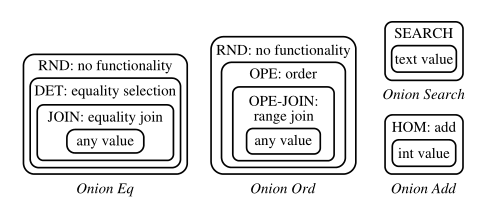
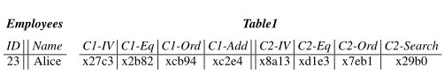
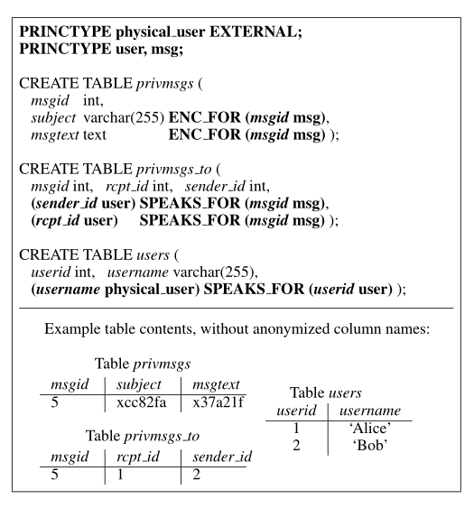

- [query](#query)
  - [加密相关](#加密相关)
    - [Random（RND）](#randomrnd)
    - [Derterministic（DET）](#derterministicdet)
    - [Order-preserving encryption (OPE)](#order-preserving-encryption-ope)
    - [Homomorphic encryption（HOM）](#homomorphic-encryptionhom)
    - [Join (JOIN and OPE-JOIN)](#join-join-and-ope-join)
    - [Word search (SEARCH)](#word-search-search)
  - [Adjustable Query-based Encryption(可调节的基于查询的加密)](#adjustable-query-based-encryption可调节的基于查询的加密)
  - [加密数据上的计算](#加密数据上的计算)
    - [读](#读)
    - [写](#写)
    - [其他DBMS性质](#其他dbms性质)
  - [连接处理](#连接处理)
    - [equi-joins](#equi-joins)
- [安全性和性能的改善](#安全性和性能的改善)
  - [安全性改善](#安全性改善)
  - [性能改善](#性能改善)
- [MULTIPLE PRINCIPALS（多用户，多主题）](#multiple-principals多用户多主题)
  - [Policy Annotations（注释策略）](#policy-annotations注释策略)
  - [Key Chaining（密钥链）](#key-chaining密钥链)
    - [密钥链使用](#密钥链使用)

- 疑问：AES与AES-CBC与AES-CTR

# query
- 针对的 威胁模型1：DBMS服务器是不可信的，应用程序和代理是可信的。
- 密态操作对应用程序透明
- 加密查和原始查相同，除了组成查询的操作符是在密文上进行的。

- 代理端：存储主密钥 MK、数据库schema（the database schema）、所有列的当前加密层
- DBMS服务端：匿名的schema（表名和列名被替换）、cryptDB特定的用户定义函数（UDF，可以为某些操作使用密文进行计算）

- 查询4个步骤
  - 应用程序发出请求后，proxy 拦截，匿名化表名和列名、使用 MK 选择最适合所需操作的加密方案 加密每个常量。
  - proxy 检查DBMS 是否需要被赋予keys 来调整加密层，如果需要，则在 DBMS 上发出一个 UPDATE 查询，调用UDF来调整适当列的加密层。
  - proxy 将加密查询转发到DBMS服务器，DBMS使用标准SQL执行查询。（可能需要调用到 UDF的聚合和关键字检索）。
  - DBMS 返回结果，代理将其解密返回给应用程序。

## 加密相关
### Random（RND） 
- 介绍：RND在CryptDB中提供了最大的安全性：在自适应选择明文攻击(IND-CPA)下的不可区分性。
  - 两个相等的值以压倒性的概率映射到不同的密文
  - RND不允许在密文上有效地执行任何计算
- 使用的算法：**AES-CBC**,64bit。
  - 64bit原因：AES的128位块大小会导致密文明显变长
  - 在这个威胁模型中，CryptDB假设服务器不会改变结果，所以CryptDB不需要更强的 IND-CCA2 构造(在选择密文攻击下是安全的)。但是如果需要，RND可以使用UFE模式的块密码。
- 疑问：有点奇怪，下面为啥不能CBC，而上面的RND下，却可以CBC。

### Derterministic（DET）
- 介绍：仍然提供强大安全性，只泄漏相同数据值对应的密文。
- 功能：这个加密层允许服务器执行：相等谓词、相等连接、GROUP BY、COUNT、DISTINCT等操作
- 在密码学中，DET 对应的是 PRP，比如AES，Blowfish。
- 使用的算法：不能使用 AES-CBC 模式，因为其会泄露 前缀相等性，为了避免这个问题，使用**CMC模式**（IV=0，可以近似想象成先进行一次CBC，再块反向进行一次CBC）

### Order-preserving encryption (OPE)
- 介绍：OPE允许根据数据项的加密值建立数据项之间的顺序关系，而不会显示数据本身。一种比DET更弱的加密方案。OPE具有可证明的安全保证：加密相当于保持顺序的随机映射
  - 对于任意密钥k，如果x < y，则OPEK(x) < OPEK(y)。因此，如果一个列是用OPEK加密的，那么服务器可以对范围[c1, c2]对应的加密常量OPEK(c1)和OPEK(c2)进行范围查询。
- 功能：可以执行ORDER BY、MIN、MAX、SORT等操作。

- 使用的算法：
  - A. Boldyreva, N. Chenette, Y. Lee, and A. O’Neill. Orderpreserving symmetric encryption. In Proceedings of the 28th Annual International Conference on the Theory and Applications of Cryptographic Techniques (EUROCRYPT), Cologne, Germany, April 2009
  - 利用**AVL二叉搜索树**对算法进行了改进，实现了批量加密

### Homomorphic encryption（HOM）
- 介绍：HOM是一种安全的概率加密方案(IND-CPA secure)，允许服务器对加密的数据进行计算，最终结果在代理上解密
  - 全同态加密很慢，但是特定操作的同态加密是高效的。
- 使用的算法：**Paillier**
  - 将两个值的加密值相乘会得到值和的加密，即HOMK(x)·HOMK(y) = HOMK(x + y)，其中乘法是对某个公钥值取模执行的
- 功能：（通过UDF进行HOM计算）
  - sum聚合
  - 平均数（通过返回 总和以及计数）
  - 递增的值
- 注：
  - 对于所使用的HOM方案，密文是 2048 bit的，这回导致很大的膨胀
  - 可以通过一种优化（ scheme of Ge and Zdonik），让膨胀优化到2x，但是cryptDB没有优化，因为会导致复杂性

### Join (JOIN and OPE-JOIN)
- 介绍：用来支持允许两列之间的等值连接。
  - 因为cryptdb 使用不同DET密钥，来防止跨列相关性
- JOIN 支持 DET的所有操作，允许确定两列之间的重复值
- 功能：
  - OPE-JOIN支持按顺序关系进行连接

### Word search (SEARCH)
- 介绍：SEARCH用于对加密文本执行搜索
- 使用的算法：Song等人提出的
  - 将每个关键词填充到相同的大小，然后用Song方案加密
  - SEARCH几乎和RND一样安全: 加密不会向DBMS服务器透露某个词是否在多行中重复，但它会泄露用SEARCH加密的**关键字的数量**；对手可能能够**估计**不同或重复单词的数量(例如，通过比较相同数据的SEARCH和RND密文的大小)。
- 功能：支持诸如MySQL的LIKE操作符之类的操作。
  - `SELECT * FROM messages WHERE msg LIKE "% alice %"`，proxy 会给 DBMS 一个令牌，这是对 alice 的加密，DBMS无法解密，只能用该令牌（陷门）来寻找信息。
  - 不能支持正则
  - 整个检索过程将泄露 返回结果所需的最小附加信息量（ 估计就是 结果条目数，the minimum amount of additional information needed to return the result）

## Adjustable Query-based Encryption(可调节的基于查询的加密)
- CryptDB关键设计：可调的基于查询的加密，可以**动态**地调整DBMS服务器上的加密层（洋葱加密模型）
  - eg：不需要比较且进行排序的列，使用RND。需要相等检查的，使用DET。
  - ques：查询集不能预先知道，所以需要一个动态的策略

> Onion encryption schema
- 结构特点
  - 每层的洋葱名 代表了它们在某些层允许的操作(相等、顺序、搜索和添加)
  - 有四种洋葱类型
- 一些洋葱层或洋葱层可能会被省略，这取决于应用程序开发者提供的**列类型或schema注释**
  - 比如非整型类型，不需要HOM层
  - 可以通过schema告诉代理端，我需要哪些洋葱结构？
- DET和JOIN通常合并成一个洋葱层，因为JOIN是DET和JOIN-ADJ的连接
- RND 的 IV 将被持久化，为了每个 RND 加密的数据项
- **最外层的层(如RND和HOM)提供了最大的安全性，而内层(如OPE)提供了更多的功能**

> generate key
- 使用相同key：同一列中的值
- 使用不同的key：跨表的列、洋葱、洋葱层
- 所有的密钥都来自于主密钥： 
  - $$K_{t,c,o,l}=PRP_{MK}(table\ t, column\ c, onion\ o, layer\ l)$$

> 洋葱加解密过程
1. 用户发送SQL请求，proxy 接收
2. proxy 决定是否需要删除加密层，以及需要删除哪层（通过抽象出的谓词P和列c，来做决定）
3. 将相应层的密钥交给DBMS，由他来解密（剥层）、操作、并返回
- 注：
  - proxy 永远不会让 DBMS 解密超过最不安全的加密层的数据
  - CryptDB使用运行在DBMS服务器上的udf实现洋葱层解密。eg：将 table 1， column 2的onion Ord，解密到OPE层。
    - UPDATE Table1 SET C2-Ord = DECRYPT_RND(K, C2-Ord, C2-IV)
    - **每个列解密都应该包含在事务中，以避免客户端访问正在调整的列时出现一致性问题**
  - 洋葱解密都是云服务端来做
- **Adjustable体现（牛逼）**：**解密后不用再加密回去，比如一个相等计算，将数据带到了DET层，未来不需要解密，这也是为什么在稳定的状态，CryptDB的开销很小**

## 加密数据上的计算
- 数据布局
  - 当应用程序创建左边所示的表时，在DBMS服务器上创建的表就是右边所示的表。（密文省略）。**每个onion为一个字段，再加一个IV字段存储该列使用的IV**
  - **C2-IV、C1-IV都是明文**
  - 最初表中的各列的最外层为：`RND, HOM, SEARCH`
  - DBMS只能从中获得行数、列数、数据大小
- **`C1-IV` 和 `C2-IV`是对IV的RND加密，同一列上的`Onion-Eq` 和 `Onion-Ord` 共享该 IV**

> 过程
1. proxy将常量加密替换：替换为该常量对应的洋葱加密
   - eg: 如果查询包含WHERE Name = 'Alice'，代理通过依次应用与C2-Eq中尚未删除的`onion Eq`对应的所有加密层来加密 'Alice'
2. 一旦 DBMS 中的对应操作的 onion 处于 query 所需的 layer，则proxy将 query 进行转换为针对该layer的操作（特别是，替换列名）。
     - eg：`WHERE Name = 'Alice'`，需要将列名换为 `C2-Eq`
     - 如果没有处于对应的层，则需要由proxy产生密钥，从而解开更安全的上层，暴露出提供此功能的 onion layer。

3. DBMS server 将基于操作符对应的UDF进行替换，最后将加密计算后的结果返回给proxy
   - SUM聚合操作符和列+操作符 必须替换为对密文执行 HOM +操作的UDF调用

4. proxy 接收后，使用对应洋葱层进行解密，将明文数据返回给应用程序

### 读
1. 应用程序issue query：`SELECT ID FROM Employees WHERE Name =‘Alice’`
2. 此时该SQL 到达了proxy，proxy分析发现需要到达 `onion-Eq 的 DET layer`，并且目前该列仍然处于RND层，则要执行该用户 query，需要 issue 另一个 query，来进行剥层： `UPDATE Table1 SET C2-Eq = DECRYPT RND(KT1,C2,Eq,RND, C2-Eq, C2-IV)`
3. 在DBMS中的数据已经到达所需layer时，proxy issue query：`SELECT C1-Eq, C1-IV FROM Table1 WHERE C2-Eq = x7..d`
   - 注：必须检索 `C1-IV`，才能解密C1-Eq的RND层。
4. proxy 使用以下密钥，将 C1-Eq 解密出 23。
   - $$K_{T1,C1,Eq,RND}, K_{T1,C1,Eq,DET}, K_{T1,C1,Eq,JOIN}$$

- **Adjustable**
  - 下一次应用程序的query：`SELECT COUNT(*) FROM Employees WHERE Name =‘Bob’`，不再需要 剥层

### 写
- INSERT、DELETE和UPDATE
  - 代理对谓词(即WHERE子句)应用与读取查询相同的处理。
> DELETE
- 除了对谓词的处理就不需要其他操作了。

> 对于需要设置某列值为一个常量的 INSERT 和 UPDATE
- 需要针对 **该列的各个onion以及当前所在的layer（未被剥离的部分）**，进行加密

> UPDATE: 根据现有的列支迭代更新的处理（eg：salary=salary+1）
- 问题：这样的更新必须使用HOM onion，但是会造成其他 onion 变得陈旧
- 事实：任何同时允许对密文进行加法和直接比较的假设加密方案都是**不安全的**
  - 比如通过不断的+1和比较，就可以计算两个值之间的差值。这几乎相当于知道他们的值
- 方案
  - （如果该列不需要进行比较，即不需要 eq和opt）直接只更新HOM onion，当 query 的时候需要该列，使用HOM onion的数据
  - 如果该列在递增后需要比较，将该query分解为两个query。先Select，解密后更新，再进行加密，之后执行常量UPDATE。

### 其他DBMS性质
> 事务：
- 对于事务，代理将任何BEGIN、COMMIT和ABORT查询传递给DBMS。
- 由于许多SQL操作符在NULL值上的行为与在非NULL值上的行为不同，所以CryptDB将NULL值公开给DBMS而不进行加密。
  - 不太理解

> stored procedures 存储过程
- 不支持

> 索引
- 如果对某列增加索引，代理会请求DBMS服务器在该列的`DET、JOIN、OPE或OPE-JOIN洋葱层`(如果它们已经公开)上建立索引，但不会`为RND、HOM或SEARCH`建立索引

## 连接处理
- 支持两种类型连接
  - equi-joins 等值连接
  - range-joins 范围连接

- 功能与安全性两难的妥协
  - 要连接两个列，应该使用相同key对这两列进行加密。
  - 为了机密性，不应该让没有连接过的两个列使用相同的密钥进行加密。

### equi-joins
- 问题：proxy adjustable。如果事先可以知道两个列未来需要连接，直接使用 相同key的 DET 加密方案，就可以了。但是一般并不知道未来需要连接的列级，所以需要 proxy 去学习。
- 为了解决以上问题，cryptDB 引入一个加密原语 `JOIN-ADJ (adjustable join)`
- JOIN-ADJ : 一个带密钥的加密hash，它具有一个额外的属性，即hash**可以在不访问明文的情况下调整它们的密钥**
  - 确定性函数
  - 抗碰撞的，输出长度足够长（192bit），可以认为collision永远不会发生
  - 不可逆

> JOIN 加密方案
- $$JOIN(v) = JOIN\_ADJ(v)\ ||\ DET(v)$$ 
  - 疑问：为什么需要 DET 呢？
    - 因为 JOIN_ADJ 是单向的
  - $$JOIN\_ADJ_{K}(v) = P^{K*PRF_{K0}(v)}$$
    - K 是根据 MK 和 {table, col, onion, layer} 而得来的
    - $$PRF_{K0}(v) 伪随机函数$$ 
    - 取幂其实是椭圆曲线上的加法，所以比RSA要快很多

- **adjustable**：假设要连接 c 和 c'，他们的初始密钥分别为 k 和 k'
  - $$∆K = K/K' $$
  - $$JOIN\_ADJ_{K'}(v)^{∆K} = P^{K'*PRF_{K0}(v)*∆K}=P^{K*PRF_{K0}(v)}=JOIN\_ADJ_{K}(v)$$ 
  - 现在 c和 c'共享JOIN-ADJ密钥。则可以进行等值连接。

- 方案：当有连接请求时，proxy 给 DBMS 一个 onion key来调整 JOIN-ADJ 的值。调整之后，列共享相同的 JOIN-ADJ key，但是 DET 的KEY还是不一样的。

- 性质：
  - 可传递的：A-B，B-C，则A-C。但是这样的连接性其实存在一个问题，就是 join-base 的震荡
    - 如果A-B连接，这是B使用A的join-base。让B与C连接，这是B使用C的join-base，这样的情况导致了震荡，B的join-base来回震荡，没有一个最终一致。
    - CryptDB做法：以 tableName_colName 的字典序来决定用谁的 join-base。
    - 我的思路：并查集。

- 安全性
  - 不会显示明文
  - 没有连接过的不会显示连接关系。
  - We proved the security of this scheme based on the standard Elliptic-Curve Decisional Diffie-Hellman hardness as-sumption
- 椭圆曲线算法实现：NIST-approved elliptic curve

> 对于 OPE-JOIN
- 由于缺乏OPE的 adjustable 方案，所以只能事先由应用程序来提前声明，让声明的列使用相同的密钥。不过 range join 在实际使用中其实很少。

# 安全性和性能的改善
## 安全性改善
- 最低洋葱层限制。可以为某列指定最低的洋葱层。比如开发人员可以指定信用卡号码应该始终保持在RND或DET。
- 让proxy处理某些谓词。避免在 DBMS端 暴露安全性低的洋葱层
  - eg：一个 SELECT 操作，没有 LIMIT，但是需要将结果 BY ORDER。这个时候可以通过在 proxy 收集数据，解密之后再由proxy 排序处理，这样做可以避免将该列的OPE加密透露给服务器。
- Training mode。可以来获取每个字段的当前层次情况，以及不支持某些查询的警告。可以用来检查加密级别以及加密方案泄露的内容。
  - 如果某些洋葱级别对于敏感字段来说太低，应该安排在代理中处理查询。
  - 可以根据此模式生成的报告，用在生产环境中的注释。
- Onion re-encryption。当应用程序执行不频繁、但需要低洋葱层来支持的查询时，可以让其执行后重新加密到更高的层次。

## 性能改善
- Developer annotations。默认情况下，CryptDB加密所有字段，并根据数据项的类型为每个数据项创建所有适用的洋葱。如果很多列是不敏感的，开发者可以提供显式的注释来指示敏感字段(如§4所述)，并将其余字段保留为明文
- Known query set。如果开发人员提前知道一些查询情况，则可以通过注释等手段，丢弃一些不需要的onion，或者不需要的 onion layer，或者 IV 字段
- Ciphertext pre-computing and caching。在代理执行一些预计算和使用缓存，来降低 OPE 和 HOM 的查询中其需要的实时时间。

# MULTIPLE PRINCIPALS（多用户，多主题）
- **扩展威胁模型：威胁模型2**
- 主要内容
  - 访问控制的schema注释
  - 密钥链
> 场景
- 在phpBB中，每个用户都有一个帐户和密码，属于特定的组，并可以向其他用户发送私人消息。根据群组的权限，用户的功能分为可以读取整个论坛、只能读取论坛名称、根本无法读取论坛。
- 希望确保从一个用户发送给另一个用户的私人消息对其他人是不可见的;
- 论坛上的帖子只对访问该论坛的群组中的用户开放;
- 论坛的名称只会显示给那些属于某个群组的用户。

> 挑战
- 挑战1：**需要访问控制的schema注释**。CryptDB必须在SQL查询级别捕获应用程序对共享数据的访问控制策略。因此CryptDB要求开发人员对他们的数据库schema进行注释，以指定主体和每个主体都有权访问的数据。
- 挑战2：**减少对手可以通过破坏系统获得的信息量**。
  - CryptDB的限制：破坏应用程序或proxy导致的泄漏限制为仅允许在破坏过程中登录的用户所访问的数据
  - CryptDB通过密钥链保证。
    - 每个用户都有一个密钥（eg：应用程序级别password）
    - 使用从用户password开始到SQL data iterm加密密钥结束的密钥链来执行访问控制策略

- 当用户登录时，她将自己的密码提供给代理(通过应用程序)。代理使用这个密码派生洋葱密钥来处理对加密数据的查询(如前一节所述)，并解密结果。根据访问控制策略，代理只能解密用户有权访问的数据。代理将解密后的数据提供给应用程序，应用程序现在可以利用这些数据进行计算。当用户退出时，代理将删除用户的密钥。

## Policy Annotations（注释策略）
- cryptDB 定义了自己的 principle 概念，而不是使用DBMS的 principle，原因如下：
  - 用户程序的权限粒度太细，没法map到DBMS的principle
  - cryptDB 需要 principle 之间显式的权限委托（delegation of privileges ），这很难从访问控制列表规范中自动提取
    - 暂时不懂
- 如下图所示，其中斜体表示表和列名，粗体表示为CryptDB添加的注释。

- Step 1. 使用 **`PRINCTYPE`** 定义 principle type，例如 users, groups, messages。
  - principle 分为 内部principle 和 外部principle。
    - **外部principle** 对应于使用password显式地向app验证自己的最终用户。
    - **内部principle** 只能通过委托获得。
  - 当用户退出时，app必须通知proxy，以便proxy忘记用户的password以及从用户密码派生的任何密钥。
- Step 2. 使用 **`ENC_FOR`** 注释 schema 中哪些列包含敏感数据，以及应该有权访问该数据的主体。**将有权访问该数据的 principle name 存储在同一行的不同列，比如这里的privmsgs.msgid，规定 principle name 为 5的principle 可以解密访问该数据。**
- Step 3. 使用 **`SPEAKS_FOR`** 来指定如何**将一个主体的特权委托给其他主体**的规则。比如指定某个user属于某个group，许多 app 会将这些信息存在DB中，所以只需要给该表添上注释就可以了。
  -  **`(a x) SPEAKS FOR (b y)`**：类型为 x 的 a 拥有 类型为 y 的 b 的所有权限。意味着 a 可以访问 b 所有的 keys。
     -  x 和 y 必须为固定的 principle type。
     -  b 必须为 当前表中的某一列列名。
     -  a 可以是 同一个表中另一列的名字、一个常数、或者 T2.col，表示 表T2 中 列col 的所有principle。
  - 更多例子可以见第5章

## Key Chaining（密钥链）
- 注：这一套挺牛逼，细品。
- 每一个 principle 都有与之相关的 key

> 内部 principle
- 每个principle对应的密钥为 **{对称密钥，公私密钥对}**。通常情况下都是用对称密钥来进行信息加密。但是**对称密钥只有在用户登陆时才能获取**。
  - eg: Bob给Alice发送msg5，这个时候Alice是离线的，这意味着proxy不能获得Alice的对称加密密钥，所以不能用其来加密 msg 5(principle) 的密钥。所以**这种类型的加密都是用的公钥，Alice 的公钥是可以公开的**。当Alice登陆时，用其私钥解密 msg 5 的key。
- 如果 principle B speak for principle A。 那么 A's Key 会被用 B's Key 加密，存储在 **`access_keys` table**。这就允许了 B 可以使用 A 的key。
  - eg: 上图中 `msg 1` 的key 用`user 1,2`的key分别加密后存储到了 access_keys
- 每个敏感字段 都用 **`END_FOR`** 注释的 principle's key 加密，这里的加密是 onion 加密，使用的密钥不再是从全局主密钥派生而来，而是从 principle's key 派生而来。

> 外部 principle
- cryptDB 为每一个用户都分配了一个 random key。然后用 password 对该 random key 进行加密存储到某个表中。

> access_keys 表格的更新
- 当一个具有`SPEAKS FOR`关系的表被更新时，CryptDB 必须访问相应的 access_keys 表的内容。
  - 要将新 item 插入到 access_keys 中，proxy 必须具有被委托特权的principle的key。这意味着入侵app或proxy的adverary不能为未登录的principle创建新的 `SPEAK_FOR` 关系，因为代理和对手都无法访问它们的密钥。

- 突然想到的一种攻击方式：hack注册一个号，然后pwn proxy，用自己号的公钥加密现在在线用户的密钥，放入 access_key（相当于留后门），以后hack就总是可以获取到那些用户的一些信息。

### 密钥链使用
- 当对查询中的数据进行加密或对结果中的数据进行解密时，**CryptDB遵循从登录用户的密码开始的密钥链，直到获得所需的密钥**
- 优化：密钥预获取。当用户登录时，CryptDB的proxy加载用户可以访问的一些principle的key。
  - 特别是一些没有过多 principle instance 的 principle type

> cryptdb_active 表
- 其实是一个存放在proxy内存中的表，不会透露给 DBMS。有两列，分别是 username 和 password。
- 应用程序通过向 `cryptdb_active` 发出INSERT和DELETE SQL查询来通知CryptDB用户登录或退出，proxy 对给 query 进行拦截，后在其内存表中做修改。

