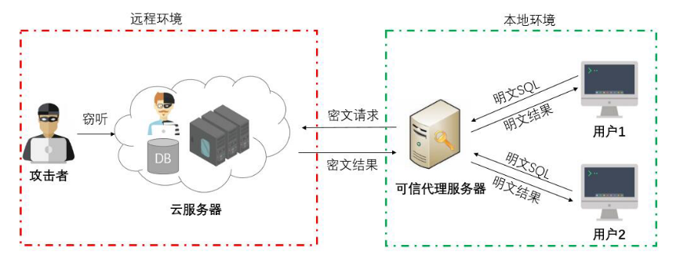
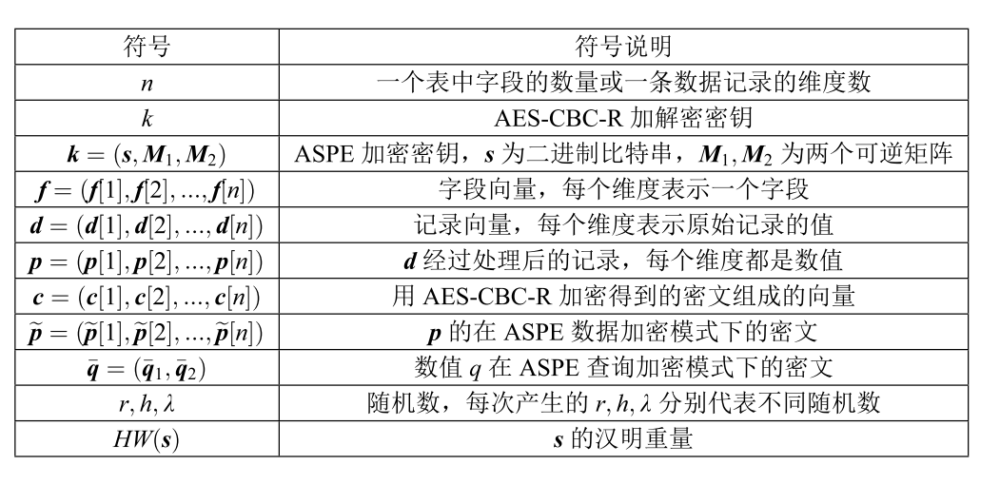
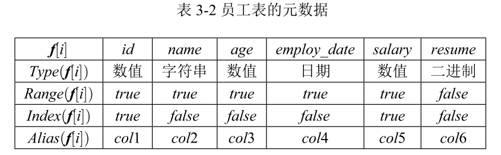
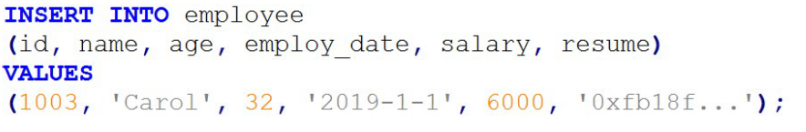
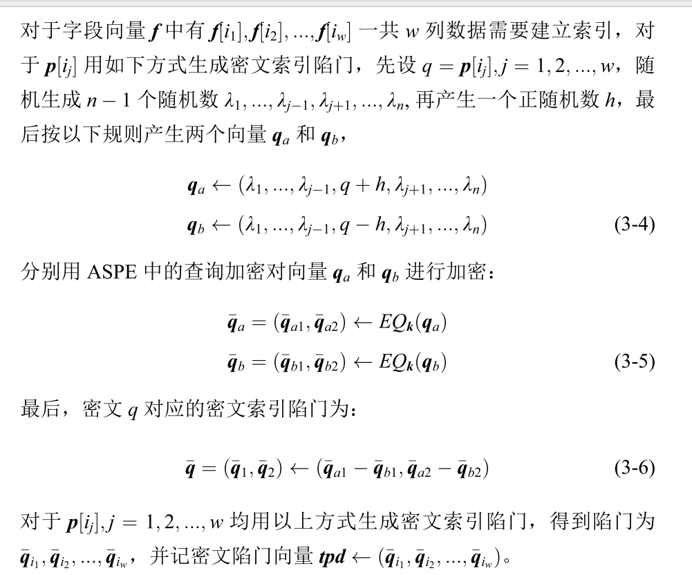
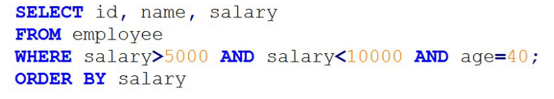
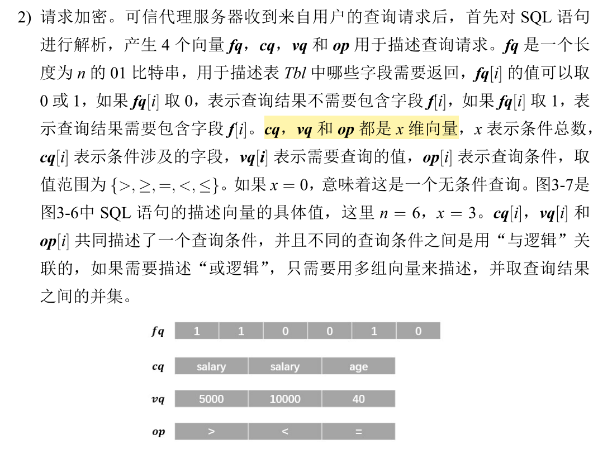
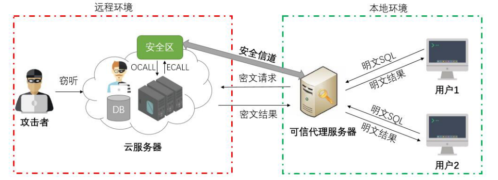

# 科普
- 保序加密
- 揭序加密
- 概率性对称加密：每次对同样明文的加密后的密文都**不一样**
- 确定性加密：每次对同样明文的加密后的密文都**一样**

- 语义安全性：语义安全性意味着除了明文长度外，计算能力为多项式有界的敌手不能从密文中提取出任何有关明文的信息

## 数据库安全
- **数据库内部安全**：数据库内部安全着重于数据库本身的安全机制，如授权认证、角色管理、日志审计和容灾恢复等等，这些安全问题在设计数据库管理 系统时应该重点考虑
- **数据库外部安全**：指的是数据库运行在一个恶意的环境下，攻击者拥有数据库系统乃至操作系统的最高权限，或者数据库的输入存在恶意代码，如典型的 SQL 注入，这个时候的安全性。

## 暴力破解
- 在线攻击：攻击者必 须使用和用户应用程序相同的登录入口
- 离线攻击：攻击者需要首先窃取密码文件，但能够进行不受约束的破解尝试，并且没有应用程序和网络 的破解速度限制

## 安全体制
- 对称密码体制：利用扩散和混淆
  - 分组密码
    - ECB（电码本模式）
    - CBC（密码分组链接模式)
  - 流密码
- 非对称密码体制

# 文章贡献
- 引入ASPE加密算法，替代现有的保序加密和揭序加密，实现范围查询，同时实现等值查询
- 解决了密文会泄露明文顺序，导致遭到离线攻击的问题。——注：ASPE需要引入陷门计算后才知道大小顺序
- 分层思想：不同层提供不同的功能。分为安全加密层、范围加密层和密文索引层。
- 利用 SGX 构造了一系列密文计算部件。使应用有更小的可信计算基础，显著地降低了攻击面。
- 使用布隆过滤器的保证数据新鲜性。防止云服务器重放过去的请求，以减少数据泄露的风险。
- 结合决策树，在保证数据机密性和新鲜性的同时在数据库中提供了分类服务

# 重点
- 基于 ASPE（Asymmetric Scalar-product-Preserving Encryption）和 SGX（Software Guard Extensions）对数据库加密进行了研究
  -  ASPE一种加密算法
- 数据加密有三层：：安全加密层、范围加密层和密文索引层
  - 安全加密层：对称加密，强安全——采用AES
  - 范围加密层：功能性加密，可以范围查询和等值查询——利用ASPE
  - 密文索引层：ASPE密文基础上，建立树索引——建立索引，使密文查询时间减低到log(n)
- 使用SGX降低攻击面，用SGX构造一系列密文计算部件
- 使用决策树，对密文进行分类，增强功能性
- 为了限制云服务器访问这些部件（SGX中的加密部件）的能力，我们又提出了一种基于**布隆过滤器**的保障数据新鲜性的方法。

## 云数据库的安全
- 云服务器内部存在恶意员工或者云服务提供商本身就是半诚实的， 他们所带来的内部威胁让数据库安全处于一个更加严峻的环境中
- 数据库安全同时面临着黑客入侵的外部威胁和云计算模式下的内
部威胁
- 传统的安全技术和策略仅能用于增加外部攻击者的入侵云服务器的难度，难以从根本上 杜绝用户数据的泄露。
- 一些具有功能性的加密方案，如**同态加密、保序加密和可搜索加密**等，能够保证数据的部分机密性 的同时允许密文之间进行特定的计算，因此功能性加密方案奠定了数据库加密的基础。
- 在云端引入**可信计算模块** 也颠覆性地改变了传统的计算模型，这也为数据库加密提供了新的思路。

## ASPE
- ASPE 以向量为单位对数据进行加密，并且能够保持密文之间的**点积运算**
- ASPE 涉及两种加密模式，包括数据加密和查询加密，需要说明的是**只有数据加密 的密文和查询加密的密文之间才能进行点积运算**，数据加密的密文之间或者查询加密的密文之间的点积运算是无效的。
- ASPE 算法直接应用于数据加密会引 起一系列问题，如精度丢失、无法加密字符串、难以更新索引等，
- 只能对数值型操作
- 不会泄露明文任何一比特

## SGX
- 两大功能
  - 隔离执行：让加解密在安全可信环境下
  - 远程认证机制：远程认证机制可以让运行在安全区中的程序向远程用户证明程序的完整性。

## 整体系统模型

### 初始化
- 地点：在可信代理服务器中

> 元数据确定

> 秘钥生成
- 生成AES密钥和ASPE密钥

### 添加数据
1. 先从用户发给可信代理服务器，内容如下

2. 请求加密（代理服务器对其进行加密）
  - 分为四个部分：字段映射、安全加密、 范围加密和密文索引陷门生成

- 字段映射
  - 就是更换字段名，减少敌手优势
- 安全加密
  - 使用aes对内容加密
- 范围加密
  - 判断`Range(f[i])`，true的话就用ASPE进行加密，false就随便产生随机数填充
  - 注：对于非数值型的需要做转换
  - 为什么要填充：因为待会运算的时候需要是一个n维的向量，n是字段的数量
  - 采用数据加密模式进行加密
- 密文索引陷门生成

- 可信代理服务器将加密后的添加数据请求发送给云服务器，包括四个向量： 字段别名 f′、安全加密密文 c、范围加密密文 ～p 和密文索引陷门 tpd

3. 请求处理(云上的处理)
- 存储密文c和范围加密密文～p，并且建立两者的一一映射
- 通过 范围加密密文 与 密文索引陷门 建立索引
- 建立后删除陷门

### 查询数据

1. 针对上面语句建立一组向量
  

2. 对cq做别名映射，对vq用ASPE的查询加密模式加密（注：与生成陷门的方法一致）

3. （云）请求处理
     1. 分两种情况，有索引和无索引
        - 无索引：o(n)时间复杂度，一个个遍历
        - 有索引（logn)
     2. 之后密文返回给可信代理服务器
4. （代理服务器）解密结果

### 删除数据
- 本质和查询差不多

# 基于SGX的数据库加密方案
- 数据库加密一种新思路
- 目前已有不少工作探索了利用 SGX 构建数据库加密系统，将整个数据库服务置于安全区中
  - 注：将代理服务器的一些功能移到SGX安全区
- **形象比喻**：可以 将安全区看作一个**黑盒**，云服务器可以访问这个黑盒获取必要的计算结果，但不 能破解数据的机密性
## 动机
- 安全性低：一些功能型加密，如保序，揭序的安全性第
- 聚合能力有限：
  - 全同态太慢了
  - 半同态又功能性不足
- 模糊查询假阴性

## SGX缺点
- 安全区数据量太小，容易缺页异常，带来极大性能开销
- 运行在安全区中的程序只能访问 C 标准库中的功能，很多系统调 用由于要使用到宿主机器上非安全区的代码，因此无法安全实现，比如调用系统时间只能通过 OCALL 完成，OCALL 运行在非安全区中，可能会被不可信的宿主 篡改。

## 系统模型

## 计算部件
- 将一些操作封装为几个计算部件
- (r,m,op)
  - 代表一个操作
  - 用aes进行加解密
### 布隆过滤器BLF(r)->b
- b为0代表该操作是新鲜的。
  

### 密文比较器CMP(c1, cq)->b
- 比较两个密文的大小关系

### 密文聚合器
- 将多个密文聚合起来，进行一些运算，如求平均，求总值

### 密文更新器
- **如果没有引入SGX，则实现自运算更新需要消耗通信资源**。
- 支持两种类型：純值更新和自运算更新
  - 純值更新：删了重新插入。如“SET age = 25”
  - 自运算更新：解密，之后运算，再执行更新。，如“SET age = age + 1”

### 密文模糊匹配器VMT(c1, cq)-> b
- **如果没有这个的话，按可搜索加密的方式容易导致假阴性**
- 先解密，之后再进行匹配

### 密文排序器 SRT(c1, c2, ..., cw, cq, x) -> (c′1, c′2, ..., c′w)
- 先恢复成明文，然后按要求进行排序，之后再加密回去
- 如果没有SGX的话，此操作只能在代理中完成。
### 密文索引器
- 注：不太清楚如果没有SGX，将是怎么处理
- 按照 B+ 树的添加、删除和查询的算法对 B+ 树节点 进行处理

倒排索引
levelDB